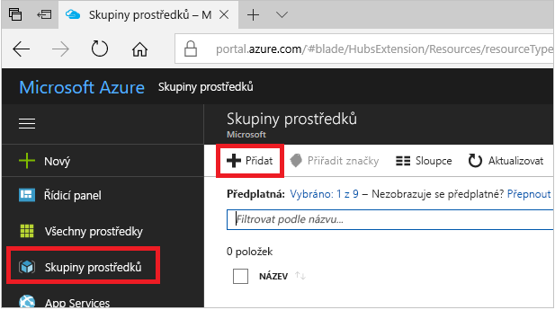
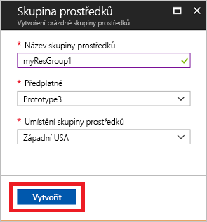
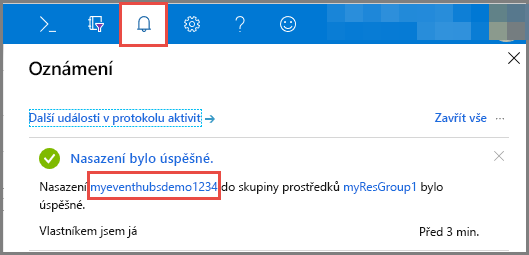
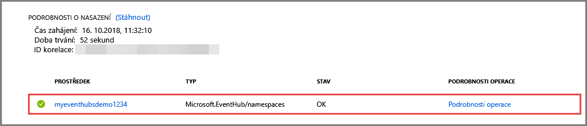

# Rychlý start: Vytvoření centra událostí pomocí webu Azure Portal
Azure Event Hubs je platforma pro streamování velkých objemů dat a služba pro ingestování událostí, která je schopná přijmout a zpracovat miliony událostí za sekundu. Služba Event Hubs dokáže zpracovávat a ukládat události, data nebo telemetrické údaje produkované distribuovaným softwarem a zařízeními. Data odeslaná do centra událostí je možné transformovat a uložit pomocí libovolného poskytovatele analýz v reálném čase nebo adaptérů pro dávkové zpracování a ukládání. Podrobnější přehled služby Event Hubs najdete v tématech [Přehled služby Event Hubs](event-hubs-about.md) a [Funkce služby Event Hubs](event-hubs-features.md).

V tomto rychlém startu vytvoříte centrum událostí pomocí webu [Azure Portal](https://portal.azure.com).

## Požadavky

Abyste mohli absolvovat tento rychlý start, ujistěte se, že máte následující:

- Předplatné Azure. Pokud ho nemáte, [vytvořte si bezplatný účet](https://azure.microsoft.com/free/) před tím, než začnete.
- [Visual Studio 2017 s aktualizací Update 3 (verze 15.3, 26730.01)](http://www.visualstudio.com/vs) nebo novější.
- [NET Standard SDK](https://www.microsoft.com/net/download/windows) verze 2.0 nebo novější.

## Vytvoření skupiny prostředků

Skupina prostředků je logická kolekce prostředků Azure. Všechny prostředky se nasazují a spravují ve skupině prostředků. Skupinu prostředků vytvoříte následujícím postupem:

1. Přihlaste se k webu [Azure Portal](https://portal.azure.com).
2. Na levém navigačním panelu klikněte na **Skupiny prostředků**. Pak klikněte na **Přidat**.

   

2. Zadejte jedinečný název skupiny prostředků. Systém okamžitě zkontroluje, jestli je název dostupný v aktuálně vybraném předplatném Azure.

3. V části **Předplatné** klikněte na název předplatného Azure, ve kterém chcete skupinu prostředků vytvořit.

4. Vyberte geografické umístění skupiny prostředků.

5. Klikněte na možnost **Vytvořit**.

   

## Vytvoření oboru názvů služby Event Hubs

Obor názvů služby Event Hubs poskytuje jedinečný kontejner oboru, na který se odkazuje jeho plně kvalifikovaným názvem domény a ve kterém můžete vytvořit jedno nebo více center událostí. Pokud chcete vytvořit obor názvů ve své skupině prostředků pomocí portálu, postupujte následovně:

1. Na webu Azure Portal v levém horním rohu obrazovky klikněte na **Vytvořit prostředek**.

2. Klikněte na **Internet věcí** a pak na **Event Hubs**.

3. V části **Vytvořit obor názvů** zadejte název oboru názvů. Systém okamžitě kontroluje, jestli je název dostupný.

   

4. Po kontrole, že je název oboru názvů k dispozici, zvolte cenovou úroveň (Basic nebo Standard). Zvolte také předplatné Azure, skupinu prostředků a umístění, ve kterém se má prostředek vytvořit.
 
5. Kliknutím na **Vytvořit** vytvoříte obor názvů. Možná budete muset několik minut počkat, než systém úplně zřídí prostředky.
6. Vyberte **Upozornění** a pak vyberte **nasazení** se stejným názvem jako obor názvů centra událostí. 

   
6. V seznamu prostředků vytvořených v tomto nasazení vyberte svůj obor názvů centra událostí. 

   
7. Na stránce **Obor názvů služby Event Hubs** vyberte **Zásady sdíleného přístupu** a pak klikněte na **RootManageSharedAccessKey**.
    
8. Kliknutím na tlačítko kopírovat zkopírujte připojovací řetězec **RootManageSharedAccessKey** do schránky. Pro pozdější použití si tento připojovací řetězec uložte do dočasného umístění, například do Poznámkového bloku.
    
## Vytvoření centra událostí

Pokud chcete v rámci oboru názvů vytvořit centrum událostí, postupujte následovně:

1. Na stránce Obory názvů služby Event Hubs klikněte na **Event Hubs**.
   
    

1. V horní části okna klikněte na **+ Centrum událostí**.
   
    
1. Zadejte název centra událostí a pak klikněte na **Vytvořit**.
   
    

Blahopřejeme! Pomocí portálu jste vytvořili obor názvů služby Event Hubs a v něm centrum událostí. 

## Další kroky

V tomto článku jste vytvořili skupinu prostředků, obor názvů služby Event Hubs a centrum událostí. Podrobné pokyny k odesílání událostí do centra událostí nebo příjmu událostí z centra událostí najdete v následujících kurzech:  

- **Odesílání událostí do centra událostí:** [.NET Standard](event-hubs-dotnet-standard-getstarted-send.md), [.NET Framework](event-hubs-dotnet-framework-getstarted-send.md), [Java](event-hubs-java-get-started-send.md), [Python](event-hubs-python-get-started-send.md), [Node.js](event-hubs-node-get-started-send.md), [Go](event-hubs-go-get-started-send.md), [C](event-hubs-c-getstarted-send.md)
- **Příjem událostí z centra událostí:** [.NET Standard](event-hubs-dotnet-standard-getstarted-receive-eph.md), [.NET Framework](event-hubs-dotnet-framework-getstarted-receive-eph.md), [Java](event-hubs-java-get-started-receive-eph.md), [Python](event-hubs-python-get-started-receive.md), [Node.js](event-hubs-node-get-started-receive.md), [Go](event-hubs-go-get-started-receive-eph.md), [Apache Storm](event-hubs-storm-getstarted-receive.md)

[Azure portal]: https://portal.azure.com/
[3]: ./media/event-hubs-quickstart-portal/sender1.png
[4]: ./media/event-hubs-quickstart-portal/receiver1.png
