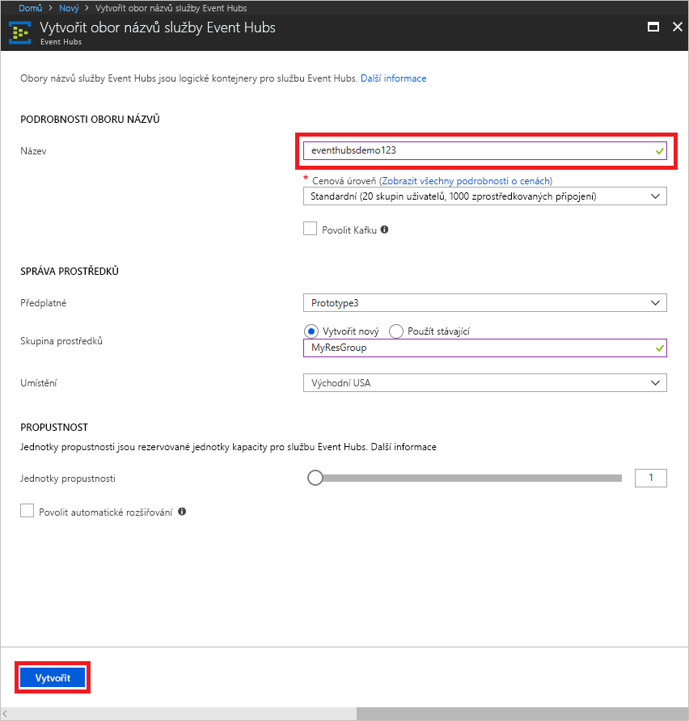

# Vytvořit obor názvů služby Event Hubs a centra událostí pomocí webu Azure portal

## Vytvoření oboru názvů služby Event Hubs

1. Přihlaste se k [webu Azure portal][Azure portal]a klikněte na tlačítko **vytvořit prostředek** v levém horním rohu obrazovky.
2. Klikněte na **Internet věcí** a pak na **Event Hubs**.
   
    

3. V části **Vytvořit obor názvů** zadejte název oboru názvů. Systém okamžitě kontroluje, jestli je název dostupný.  

4. Po kontrole, že je název oboru názvů k dispozici, zvolte cenovou úroveň (Basic nebo Standard). Zvolte také předplatné Azure, skupinu prostředků a umístění, ve kterém se má prostředek vytvořit.
 
5. Kliknutím na **Vytvořit** vytvoříte obor názvů. Možná budete muset několik minut počkat, než systém úplně zřídí prostředky.

    

6. V seznamu oborů názvů na portálu klikněte na nově vytvořený obor názvů.

7. Klikněte na **Zásady sdíleného přístupu** a pak na **RootManageSharedAccessKey**.
    
    

8. Kliknutím na tlačítko kopírovat zkopírujte připojovací řetězec **RootManageSharedAccessKey** do schránky. Pro pozdější použití si tento připojovací řetězec uložte do dočasného umístění, například do Poznámkového bloku.
    
    

## Vytvoření centra událostí

1. V seznamu oborů názvů služby Event Hubs klikněte na nově vytvořený obor názvů.      
   
     

2. V okně oboru názvů klikněte na **Event Hubs**.
   
    

3. V horní části okna klikněte na tlačítko **+ Centrum událostí**.
   
    
4. Zadejte název centra událostí a pak klikněte na **Vytvořit**. 

Vaše Centrum událostí je nyní vytvořen a máte připojovací řetězce, které potřebujete k odesílání a příjmu událostí.

## Další postup

Další informace o službě Event Hubs naleznete pod těmito odkazy:

* [Přehled služby Event Hubs](event-hubs-what-is-event-hubs.md)
* [Přehled rozhraní API služby Event Hubs](event-hubs-api-overview.md)

[Azure portal]: https://portal.azure.com/