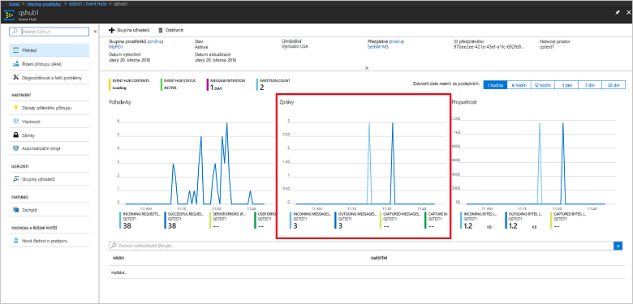

# <a name="quickstart-create-an-event-hub-using-azure-cli"></a>Rychlý start: Vytvoření centra událostí pomocí Azure CLI

Azure Event Hubs je vysoce škálovatelná platforma pro streamování dat a služba pro ingestování, která je schopná přijmout a zpracovat miliony událostí za sekundu. V tomto rychlém startu se dozvíte, jak pomocí Azure CLI vytvořit prostředky služby Event Hubs a pak odesílat streamy událostí do centra událostí a přijímat je z něj pomocí kódu Java.

K dokončení tohoto rychlého startu potřebujete předplatné Azure. Pokud ho nemáte, [vytvořte si bezplatný účet][] před tím, než začnete.

## <a name="prerequisites"></a>Požadavky

[!INCLUDE [cloud-shell-try-it.md](../../includes/cloud-shell-try-it.md)]

Pokud se rozhodnete nainstalovat a používat Azure CLI místně, musíte mít Azure CLI verze 2.0.4 nebo novější. Spuštěním příkazu `az --version` zkontrolujte svou verzi. Pokud potřebujete instalaci nebo upgrade, přečtěte si téma [Instalace Azure CLI 2.0]( /cli/azure/install-azure-cli).

## <a name="log-on-to-azure"></a>Přihlášení k Azure

Pokud spouštíte příkazy ve službě Cloud Shell, následující kroky nemusíte provádět. Pokud používáte rozhraní příkazového řádku místně, provedením následujících kroků se přihlaste k Azure a nastavte své aktuální předplatné:

Spuštěním následujícího příkazu se přihlaste k Azure:

```azurecli-interactive
az login
```

Nastavte kontext na aktuální předplatné. Nahraďte `MyAzureSub` názvem předplatného Azure, které chcete použít:

```azurecli-interactive
az account set --subscription MyAzureSub
``` 

## <a name="provision-resources"></a>Zřízení prostředků

Pomocí následujících příkazů zřiďte prostředky služby Event Hubs. Nezapomeňte nahradit zástupné hodnoty `myResourceGroup`, `namespaceName`, `eventHubName` a `storageAccountName` příslušnými hodnotami:

```azurecli-interactive
# Create a resource group
az group create --name myResourceGroup --location eastus

# Create an Event Hubs namespace
az eventhubs namespace create --name namespaceName --resource-group myResourceGroup -l eastus2

# Create an event hub
az eventhubs eventhub create --name eventHubName --resource-group myResourceGroup --namespace-name namespaceName

# Create a general purpose standard storage account
az storage account create --name storageAccountName --resource-group myResourceGroup --location eastus2 --sku Standard_RAGRS --encryption blob

# List the storage account access keys
az storage account keys list --resource-group myResourceGroup --account-name storageAccountName

# Get namespace connection string
az eventhubs namespace authorization-rule keys list --resource-group myResourceGroup --namespace-name namespaceName --name RootManageSharedAccessKey
```

Pro pozdější použití si zkopírujte připojovací řetězec a vložte ho do dočasného umístění, například do Poznámkového bloku.

## <a name="stream-into-event-hubs"></a>Streamování do služby Event Hubs

Dalším krokem je stažení vzorového kódu, který streamuje události do centra událostí a přijímá tyto události pomocí agenta Event Processor Host. Nejprve odešlete zprávy:

Pomocí následujícího příkazu naklonujte [úložiště Event Hubs na GitHubu](https://github.com/Azure/azure-event-hubs):

```bash
git clone https://github.com/Azure/azure-event-hubs.git
```

Přejděte do složky **SimpleSend**: `\azure-event-hubs\samples\Java\Basic\SimpleSend\src\main\java\com\microsoft\azure\eventhubs\samples\SimpleSend`. Otevřete soubor SimpleSend.java a nahraďte řetězec `"Your Event Hubs namaspace name"` oborem názvů služby Event Hubs, který jste získali v části Vytvoření oboru názvů služby Event Hubs v tomto článku.

Nahraďte `"Your event hub"` názvem centra událostí, které jste v tomto oboru názvů vytvořili, a `"Your policy name"` názvem zásady sdíleného přístupu pro daný obor názvů. Pokud jste nevytvořili novou zásadu, je výchozí zásada **RootManageSharedAccessKey**. 

Nakonec nahraďte `"Your primary SAS key"` hodnotou klíče SAS pro zásadu z předchozího kroku.

### <a name="build-the-application"></a>Sestavení aplikace 

Vraťte se do složky `\azure-event-hubs\samples\Java\Basic\SimpleSend` a spusťte následující příkaz pro sestavení:

```shell
mvn clean package -DskipTests
```

### <a name="receive"></a>Přijmout

Teď si stáhněte ukázku agenta Event Processor Host, který bude přijímat právě odeslané zprávy. Přejděte do složky **EventProcessorSample**: `\azure-event-hubs\samples\Java\Basic\EventProcessorSample\src\main\java\com\microsoft\azure\eventhubs\samples\eventprocessorsample`.

V souboru EventProcessorSample.java nahraďte hodnotu `----EventHubsNamespaceName-----` oborem názvů služby Event Hubs, který jste získali v části Vytvoření oboru názvů služby Event Hubs v tomto článku. 

Nahraďte i ostatní řetězcové hodnoty v tomto souboru: Nahraďte `----EventHubName-----` názvem centra událostí, které jste v tomto oboru názvů vytvořili, a `-----SharedAccessSignatureKeyName-----` názvem zásady sdíleného přístupu pro daný obor názvů. Pokud jste nevytvořili novou zásadu, je výchozí zásada **RootManageSharedAccessKey**.

Nahraďte `---SharedAccessSignatureKey----` hodnotou klíče SAS pro zásadu z předchozího kroku, `----AzureStorageConnectionString----` připojovacím řetězcem pro účet úložiště, který jste vytvořili, a `----StorageContainerName----` názvem kontejneru v účtu úložiště, který jste vytvořili. 

Nakonec nahraďte `----HostNamePrefix----` názvem vašeho účtu úložiště.

### <a name="build-the-receiver"></a>Sestavení příjemce 

Pokud chcete sestavit přijímající aplikaci, přejděte do složky `\azure-event-hubs\samples\Java\Basic\EventProcessorSample` a spusťte následující příkaz:

```shell
mvn clean package -DskipTests
```

### <a name="run-the-apps"></a>Spouštění aplikací

Pokud se sestavení úspěšně dokončila, jste připraveni odesílat a přijímat události. Nejprve spusťte aplikaci **SimpleSend** a sledujte odesílání událostí. Program spustíte tak, že přejdete do složky `\azure-event-hubs\samples\Java\Basic\SimpleSend` a spustíte následující příkaz:

```shell
java -jar ./target/simplesend-1.0.0-jar-with-dependencies.jar
```

Dále spusťte aplikaci **EventProcessorSample** a sledujte přijímání událostí. Program spustíte tak, že přejdete do složky `\azure-event-hubs\samples\Java\Basic\EventProcessorSample` a spustíte následující příkaz:
   
```shell
java -jar ./target/eventprocessorsample-1.0.0-jar-with-dependencies.jar
```

Po spuštění obou programů můžete na stránce přehledu centra událostí na webu Azure Portal zobrazit počet příchozích a odchozích zpráv:



## <a name="clean-up-resources"></a>Vyčištění prostředků

Spuštěním následujícího příkazu odeberte skupinu prostředků, obor názvů, účet úložiště a všechny související prostředky. Nahraďte `myResourceGroup` názvem skupiny prostředků, kterou jste vytvořili:

```azurecli
az group delete --resource-group myResourceGroup
```

## <a name="understand-the-sample-code"></a>Vysvětlení vzorového kódu

Tato část obsahuje další podrobnosti o chování ukázkového kódu.

### <a name="send"></a>Odeslat

V souboru SimpleSend.java se většina práce provádí v metodě main(). Kód nejprve pomocí instance `ConnectionStringBuilder` sestaví připojovací řetězec, přičemž jako název oboru názvů, název centra událostí, název klíče SAS a samotný klíč SAS použije hodnoty definovaní uživatelem:

```java
final ConnectionStringBuilder connStr = new ConnectionStringBuilder()
        .setNamespaceName("Your Event Hubs namespace name")
        .setEventHubName("Your event hub")
        .setSasKeyName("Your policy name")
        .setSasKey("Your primary SAS key");
```

Objekt Java obsahující datovou část události se pak převede do formátu JSON:

```java
final Gson gson = new GsonBuilder().create();

final PayloadEvent payload = new PayloadEvent(1);
byte[] payloadBytes = gson.toJson(payload).getBytes(Charset.defaultCharset());
EventData sendEvent = EventData.create(payloadBytes);  
```

Na tomto řádku kódu se vytvoří klient služby Event Hubs:

```java
final EventHubClient ehClient = EventHubClient.createSync(connStr.toString(), executorService);
```

Blok try/finally odešle jedno kruhové dotazování událostí do neurčeného oddílu:

```java
try {
    for (int i = 0; i < 100; i++) {

        String payload = "Message " + Integer.toString(i);
        //PayloadEvent payload = new PayloadEvent(i);
        byte[] payloadBytes = gson.toJson(payload).getBytes(Charset.defaultCharset());
        EventData sendEvent = EventData.create(payloadBytes);

        // Send - not tied to any partition
        // Event Hubs service will round-robin the events across all EventHubs partitions.
        // This is the recommended & most reliable way to send to EventHubs.
        ehClient.sendSync(sendEvent);
    }

    System.out.println(Instant.now() + ": Send Complete...");
    System.in.read();
} finally {
    ehClient.closeSync();
    executorService.shutdown();
}
```

### <a name="receive"></a>Přijmout 

Operace přijetí se nachází v souboru EventProcessorSample.java. Nejprve deklaruje konstanty obsahující název oboru názvů služby Event Hubs a další přihlašovací údaje:

```java
String consumerGroupName = "$Default";
String namespaceName = "----NamespaceName----";
String eventHubName = "----EventHubName----";
String sasKeyName = "----SharedAccessSignatureKeyName----";
String sasKey = "----SharedAccessSignatureKey----";
String storageConnectionString = "----AzureStorageConnectionString----";
String storageContainerName = "----StorageContainerName----";
String hostNamePrefix = "----HostNamePrefix----";
```

Kód pak podobně jako v programu SimpleSend vytvoří instanci ConnectionStringBuilder, která sestaví připojovací řetězec:

```java
ConnectionStringBuilder eventHubConnectionString = new ConnectionStringBuilder()
    .setNamespaceName(namespaceName)
    .setEventHubName(eventHubName)
    .setSasKeyName(sasKeyName)
    .setSasKey(sasKey);
```

*Event Processor Host* je třída, která zjednodušuje přijímání událostí z center událostí tím, že spravuje trvalé kontrolní body a paralelní příjmy z těchto center událostí. Kód teď vytvoří instanci `EventProcessorHost`:

```java
EventProcessorHost host = new EventProcessorHost(
    EventProcessorHost.createHostName(hostNamePrefix),
    eventHubName,
    consumerGroupName,
    eventHubConnectionString.toString(),
    storageConnectionString,
    storageContainerName);
```

Po deklarování kódu pro zpracování chyb pak aplikace definuje třídu `EventProcessor`, která je implementací rozhraní `IEventProcessor`. Tato třída zpracovává přijaté události:

```java
public static class EventProcessor implements IEventProcessor
{
    private int checkpointBatchingCount = 0;
    ...
```

Když se v tomto oddílu centra událostí přijmou události, zavolá se metoda `onEvents()`:

```java
@Override
public void onEvents(PartitionContext context, Iterable<EventData> events) throws Exception
{
    System.out.println("SAMPLE: Partition " + context.getPartitionId() + " got event batch");
    int eventCount = 0;
    for (EventData data : events)
    {
        try
        {
         System.out.println("SAMPLE (" + context.getPartitionId() + "," + data.getSystemProperties().getOffset() + "," +
                data.getSystemProperties().getSequenceNumber() + "): " + new String(data.getBytes(), "UTF8"));
             eventCount++;
                
         // Checkpointing persists the current position in the event stream for this partition and means that the next
         // time any host opens an event processor on this event hub+consumer group+partition combination, it will start
         // receiving at the event after this one. Checkpointing is usually not a fast operation, so there is a tradeoff
         // between checkpointing frequently (to minimize the number of events that will be reprocessed after a crash, or
         // if the partition lease is stolen) and checkpointing infrequently (to reduce the impact on event processing
         // performance). Checkpointing every five events is an arbitrary choice for this sample.
         this.checkpointBatchingCount++;
         if ((checkpointBatchingCount % 5) == 0)
         {
            System.out.println("SAMPLE: Partition " + context.getPartitionId() + " checkpointing at " +
                    data.getSystemProperties().getOffset() + "," + data.getSystemProperties().getSequenceNumber());
            // Checkpoints are created asynchronously. It is important to wait for the result of checkpointing
            // before exiting onEvents or before creating the next checkpoint, to detect errors and to ensure proper ordering.
            context.checkpoint(data).get();
         }
    }
        catch (Exception e)
        {
            System.out.println("Processing failed for an event: " + e.toString());
        }
    }
    System.out.println("SAMPLE: Partition " + context.getPartitionId() + " batch size was " + eventCount + " for host " + context.getOwner());
}
```

## <a name="next-steps"></a>Další kroky

V tomto článku jste vytvořil obor názvů služby Event Hubs a další prostředky potřebné k odesílání a přijímání událostí z centra událostí. Další informace najdete v následujícím kurzu:

> [!div class="nextstepaction"]
> [Vizualizace datových anomálií v datových streamech Event Hubs](event-hubs-tutorial-visualize-anomalies.md)

[vytvořte si bezplatný účet]: https://azure.microsoft.com/free/?ref=microsoft.com&utm_source=microsoft.com&utm_medium=docs&utm_campaign=visualstudio
[Install Azure CLI 2.0]: /cli/azure/install-azure-cli
[az group create]: /cli/azure/group#az-group-create
[fully qualified domain name]: https://wikipedia.org/wiki/Fully_qualified_domain_name
