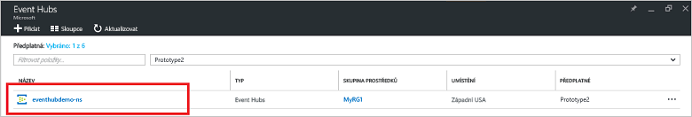
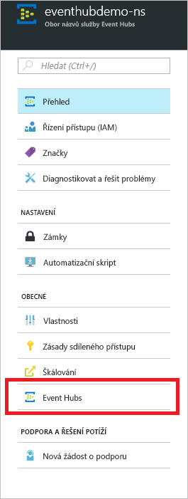
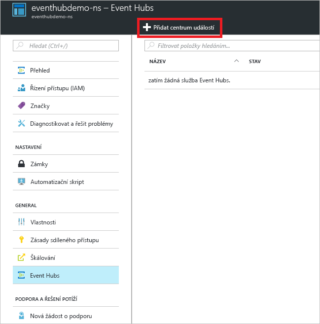
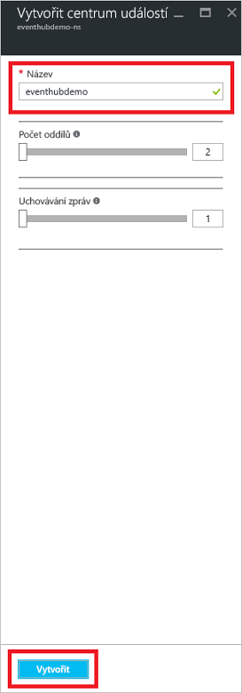
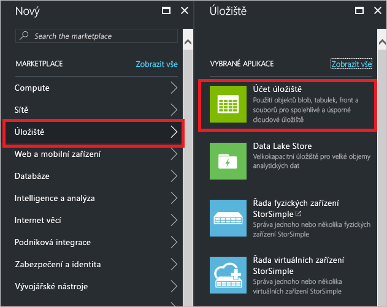
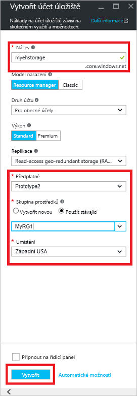
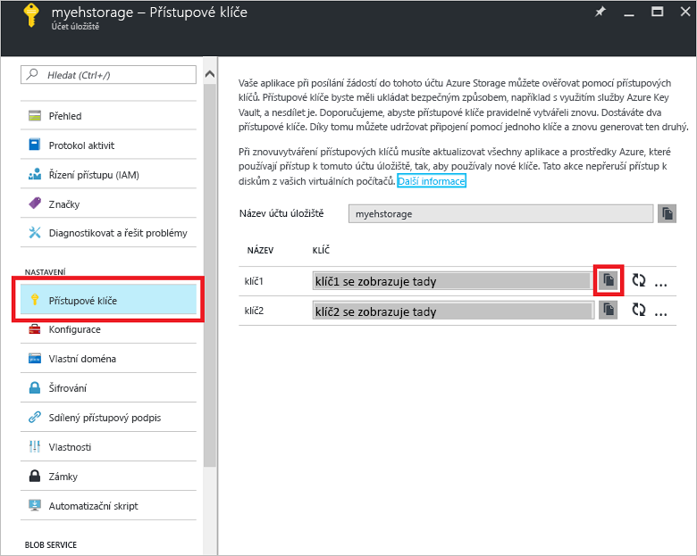

# Rychlý start: Vytvoření centra událostí pomocí webu Azure Portal

Azure Event Hubs je vysoce škálovatelná platforma pro streamování dat a služba pro ingestování, která je schopná přijmout a zpracovat miliony událostí za sekundu. V tomto rychlém startu se dozvíte, jak pomocí webu [Azure Portal](https://portal.azure.com) vytvořit centrum událostí a pak do centra událostí odesílat a přijímat z něj události pomocí sady .NET Standard SDK.

K dokončení tohoto rychlého startu potřebujete předplatné Azure. Pokud ho nemáte, [vytvořte si bezplatný účet][] před tím, než začnete.

## Požadavky

Abyste mohli absolvovat tento rychlý start, ujistěte se, že máte následující:

- [Visual Studio 2017 s aktualizací Update 3 (verze 15.3, 26730.01)](http://www.visualstudio.com/vs) nebo novější.
- [NET Standard SDK](https://www.microsoft.com/net/download/windows) verze 2.0 nebo novější.

## Vytvoření skupiny prostředků

Skupina prostředků je logická kolekce prostředků Azure. Všechny prostředky se nasazují a spravují ve skupině prostředků. Skupinu prostředků vytvoříte následujícím postupem:

1. Na levém navigačním panelu klikněte na **Skupiny prostředků**. Pak klikněte na **Přidat**.

   ![][1]

2. Zadejte jedinečný název skupiny prostředků. Systém okamžitě zkontroluje, jestli je název dostupný v aktuálně vybraném předplatném Azure.

3. V části **Předplatné** klikněte na název předplatného Azure, ve kterém chcete skupinu prostředků vytvořit.

4. Vyberte geografické umístění skupiny prostředků.

5. Klikněte na možnost **Vytvořit**.

   ![][2]

## Vytvoření oboru názvů služby Event Hubs

Obor názvů služby Event Hubs poskytuje jedinečný kontejner oboru, na který se odkazuje jeho plně kvalifikovaným názvem domény a ve kterém můžete vytvořit jedno nebo více center událostí. Pokud chcete vytvořit obor názvů ve své skupině prostředků pomocí portálu, postupujte následovně:

1. Přihlaste se k webu [Azure Portal][] a v levém horním rohu obrazovky klikněte na **Vytvořit prostředek**.

2. Klikněte na **Internet věcí** a pak na **Event Hubs**.

3. V části **Vytvořit obor názvů** zadejte název oboru názvů. Systém okamžitě kontroluje, jestli je název dostupný.

   

4. Po kontrole, že je název oboru názvů k dispozici, zvolte cenovou úroveň (Basic nebo Standard). Zvolte také předplatné Azure, skupinu prostředků a umístění, ve kterém se má prostředek vytvořit.
 
5. Kliknutím na **Vytvořit** vytvoříte obor názvů. Možná budete muset několik minut počkat, než systém úplně zřídí prostředky.

6. V seznamu oborů názvů na portálu klikněte na nově vytvořený obor názvů.

7. Klikněte na **Zásady sdíleného přístupu** a pak na **RootManageSharedAccessKey**.
    
8. Kliknutím na tlačítko kopírovat zkopírujte připojovací řetězec **RootManageSharedAccessKey** do schránky. Pro pozdější použití si tento připojovací řetězec uložte do dočasného umístění, například do Poznámkového bloku.
    
## Vytvoření centra událostí

Pokud chcete v rámci oboru názvů vytvořit centrum událostí, postupujte následovně:

1. V seznamu oborů názvů služby Event Hubs klikněte na nově vytvořený obor názvů.      
   
     

2. V okně oboru názvů klikněte na **Event Hubs**.
   
    

1. V horní části okna klikněte na **+ Přidat centrum událostí**.
   
    
1. Zadejte název centra událostí a pak klikněte na **Vytvořit**.
   
    

Blahopřejeme! Pomocí portálu jste vytvořili obor názvů služby Event Hubs a v něm centrum událostí.

## Vytvoření účtu úložiště pro agenta Event Processor Host

Event Processor Host je inteligentní agent, který zjednodušuje přijímání událostí ze služby Event Hubs tím, že spravuje trvalé kontrolní body a paralelní příjmy. K vytváření kontrolních bodů vyžaduje Event Processor Host účet úložiště. Následující příklad ukazuje, jak vytvořit účet úložiště a získat jeho klíče pro přístup:

1. Přihlaste se na web [Azure Portal][Azure Portal] a v levém horním rohu obrazovky klikněte na **Nový**.

2. Klikněte na **Storage** a poté klikněte na **Účet úložiště**.
   
    

3. V části **Vytvořit účet úložiště** zadejte název účtu úložiště. Zvolte předplatné Azure, skupinu prostředků a umístění, ve kterém se má prostředek vytvořit. Poté klikněte na **Vytvořit**.
   
    

4. V seznamu účtů úložiště klikněte na nově vytvořený účet úložiště.

5. V okně účtu úložiště klikněte na **Přístupové klíče**. Pro pozdější použití si zkopírujte hodnotu **key1**.
   
    

## Stažení a spuštění ukázek

Dalším krokem je spuštění vzorového kódu, který odešle události do centra událostí a přijme tyto události pomocí agenta Event Processor Host. 

Nejprve si z GitHubu stáhněte ukázky [SampleSender](https://github.com/Azure/azure-event-hubs/tree/master/samples/DotNet/Microsoft.Azure.EventHubs/SampleSender) a [SampleEphReceiver](https://github.com/Azure/azure-event-hubs/tree/master/samples/DotNet/Microsoft.Azure.EventHubs/SampleEphReceiver) nebo naklonujte [úložiště azure-event-hubs](https://github.com/Azure/azure-event-hubs).

### Odesílatel

1. Otevřete sadu Visual Studio, pak v nabídce **Soubor** klikněte na **Otevřít** a pak na **Projekt nebo řešení**.

2. Vyhledejte složku s ukázkou **SampleSender**, kterou jste si stáhli dříve, a pak dvojím kliknutím na soubor SampleSender.sln načtěte projekt v sadě Visual Studio.

3. V Průzkumníku řešení dvakrát klikněte na soubor Program.cs a otevřete ho v editoru sady Visual Studio.

4. Nahraďte hodnotu `EventHubConnectionString` připojovacím řetězcem, který jste získali při vytváření oboru názvů.

5. Nahraďte `EventHubName` názvem centra událostí, které jste v tomto oboru názvů vytvořili.

6. V nabídce **Sestavení** klikněte na **Sestavit řešení** a ujistěte se, že nedojde k žádné chybě.

### Příjemce

1. Otevřete sadu Visual Studio, pak v nabídce **Soubor** klikněte na **Otevřít** a pak na **Projekt nebo řešení**.

2. Vyhledejte složku s ukázkou **SampleEphReceiver**, kterou jste si stáhli v kroku 1, a pak dvojím kliknutím na soubor SampleEphReceiver.sln načtěte projekt v sadě Visual Studio.

3. V Průzkumníku řešení dvakrát klikněte na soubor Program.cs a otevřete ho v editoru sady Visual Studio.

4. Nahraďte hodnoty následujících proměnných:
    1. `EventHubConnectionString`: Použijte připojovací řetězec, který jste získali při vytváření oboru názvů.
    2. `EventHubName`: Název centra událostí, které jste v tomto oboru názvů vytvořili.
    3. `StorageContainerName`: Název kontejneru úložiště. Zadejte pro něj jedinečný název a kontejner se pro vás vytvoří při spuštění aplikace.
    4. `StorageAccountName`: Název účtu úložiště, který jste vytvořili.
    5. `StorageAccountKey`: Klíč účtu úložiště, který jste získali na webu Azure Portal.

5. V nabídce **Sestavení** klikněte na **Sestavit řešení** a ujistěte se, že nedojde k žádné chybě.

### Spouštění aplikací

Nejprve spusťte aplikaci **SampleSender** a sledujte odesílání 100 zpráv. Stisknutím klávesy **Enter** program ukončete.

![][3]

Pak spusťte aplikaci **SampleEphReceiver** a sledujte přijímání událostí v agentovi Event Processor Host.

![][4]
 
## Vyčištění prostředků

K odebrání účtu úložiště, oboru názvů a centra událostí můžete použít portál. 

1. Na webu Azure Portal klikněte v levém podokně na **Všechny prostředky**. 
2. Klikněte na účet úložiště nebo obor názvů, který chcete odstranit. Odstraněním oboru názvů se odstraní také všechna centra událostí, která obsahuje.
3. Na řádku nabídek v horní části obrazovky klikněte na **Odstranit**. Potvrďte odstranění. 

## Další kroky

V tomto článku jste vytvořil obor názvů služby Event Hubs a další prostředky potřebné k odesílání a přijímání událostí z centra událostí. Další informace najdete v následujícím kurzu:

> [!div class="nextstepaction"]
> [Vizualizace datových anomálií v datových streamech Event Hubs](event-hubs-tutorial-visualize-anomalies.md)

[vytvořte si bezplatný účet]: https://azure.microsoft.com/free/?ref=microsoft.com&utm_source=microsoft.com&utm_medium=docs&utm_campaign=visualstudio
[Azure Portal]: https://portal.azure.com/
[1]: ./media/event-hubs-quickstart-portal/resource-groups1.png
[2]: ./media/event-hubs-quickstart-portal/resource-groups2.png
[3]: ./media/event-hubs-quickstart-portal/sender1.png
[4]: ./media/event-hubs-quickstart-portal/receiver1.png
