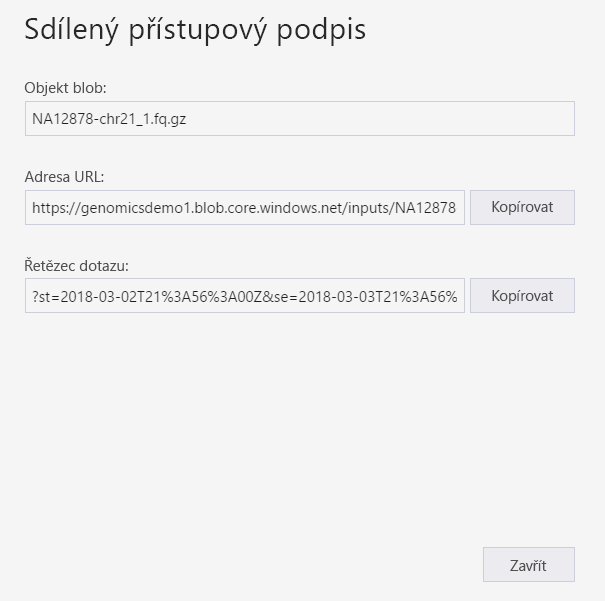
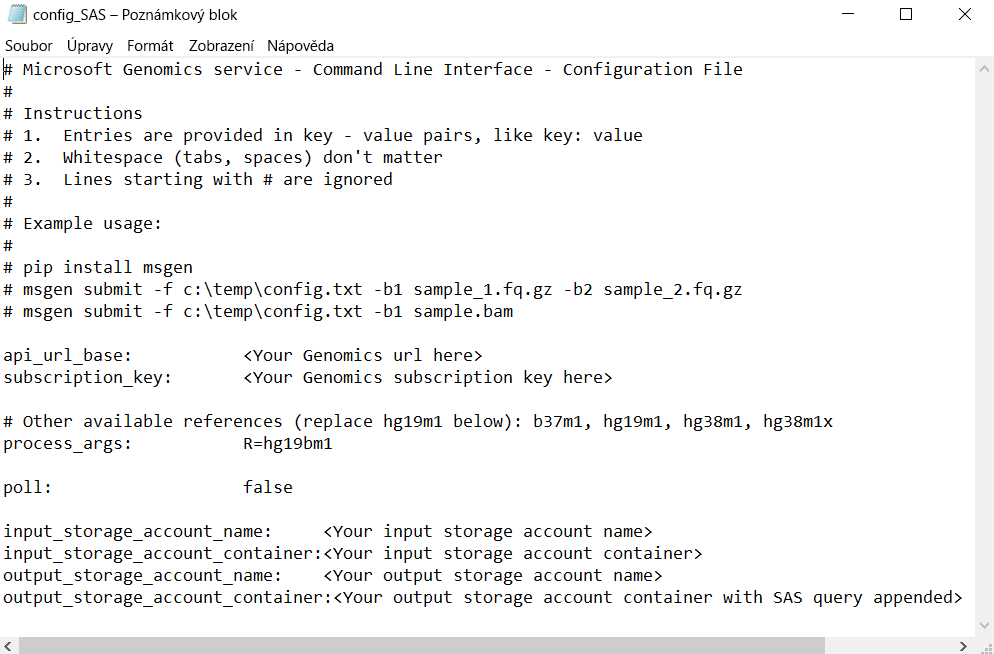

# <a name="submit-a-workflow-using-a-sas-instead-of-a-storage-account-key"></a>Odeslání pracovního postupu pomocí SAS místo klíče účtu úložiště

Tento rychlý start ukazuje, jak odeslat pracovní postup do služby Microsoft Genomics pomocí souboru config.txt, který obsahuje [sdílené přístupové podpisy (SAS)](https://docs.microsoft.com/azure/storage/common/storage-dotnet-shared-access-signature-part-1) místo klíčů účtu úložiště. Tato funkce může být užitečná v případě, že existují obavy ohledně zabezpečení kvůli viditelnému klíči účtu úložiště v souboru config.txt. Tento článek předpokládá, že jste už nainstalovali a spustili klienta `msgen` a že víte, jak používat službu Azure Storage. Pokud jste úspěšně odeslali pracovní postup obsahující připravená ukázková data, jste připraveni pokračovat v tomto postupu. 

## <a name="what-is-a-sas"></a>Co je SAS?
[Sdílený přístupový podpis (SAS)](https://docs.microsoft.com/azure/storage/common/storage-dotnet-shared-access-signature-part-1) poskytuje delegovaný přístup k prostředkům ve vašem účtu úložiště. Pomocí SAS můžete udělit přístup k prostředkům ve vašem účtu úložiště, aniž byste sdíleli své klíče účtu. Toto je zásadní aspekt používání sdílených přístupových podpisů v aplikacích – SAS představuje bezpečný způsob sdílení prostředků úložiště, aniž byste ohrozili své klíče účtu.

SAS odeslaný do služby Microsoft Genomics musí být [SAS služby](https://docs.microsoft.com/rest/api/storageservices/Constructing-a-Service-SAS), který deleguje přístup pouze k objektu blob nebo kontejneru, ve kterém jsou uložené vstupní a výstupní soubory. 

Identifikátor URI tokenu sdíleného přístupového podpisu (SAS) na úrovni služby se skládá z identifikátoru URI prostředku, ke kterému bude SAS delegovat přístup, následovaného tokenem SAS. Token SAS je řetězec dotazu, který zahrnuje všechny informace potřebné k ověření SAS a také určuje prostředek, dostupná oprávnění pro přístup, časový interval platnosti podpisu, podporovanou IP adresu nebo rozsah adres, ze kterých můžou přicházet požadavky, podporovaný protokol, přes který je možné požadavky provádět, volitelný identifikátor zásad přístupu přidružený k požadavku a samotný podpis. 

## <a name="sas-needed-for-submitting-a-workflow-to-the-microsoft-genomics-service"></a>SAS potřebný pro odeslání pracovního postupu do služby Microsoft Genomics
Každý pracovní postup odeslaný do služby Microsoft Genomics vyžaduje dva nebo více tokenů SAS – jeden pro každý vstupní soubor a jeden pro výstupní kontejner.

SAS pro vstupní soubory musí mít následující vlastnosti:
1.  Rozsah (účet, kontejner, objekt blob): objekt blob
2.  Vypršení platnosti: odteď za 48 hodin
3.  Oprávnění: čtení

SAS pro výstupní kontejner musí mít následující vlastnosti:
1.  Rozsah (účet, kontejner, objekt blob): kontejner
2.  Vypršení platnosti: odteď za 48 hodin
3.  Oprávnění: čtení, zápis, odstranění


## <a name="create-a-sas-for-the-input-files-and-the-output-container"></a>Vytvoření SAS pro vstupní soubory a výstupní kontejner
Existují dva způsoby, jak vytvořit token SAS – pomocí Průzkumníka služby Azure Storage nebo prostřednictvím kódu programu.  Pokud píšete kód, můžete SAS vytvořit sami nebo použít sadu SDK služby Azure Storage ve vašem upřednostňovaném jazyce.


### <a name="set-up-create-a-sas-using-azure-storage-explorer"></a>Nastavení: Vytvoření SAS pomocí Průzkumníka služby Azure Storage

[Průzkumník služby Azure Storage](https://azure.microsoft.com/features/storage-explorer/) je nástroj pro správu prostředků uložených ve službě Azure Storage.  Další informace o používání Průzkumníka služby Azure Storage najdete [tady](https://docs.microsoft.com/azure/vs-azure-tools-storage-manage-with-storage-explorer).

Rozsah SAS pro vstupní soubory musí být omezený na konkrétní vstupní soubor (objekt blob). Pokud chcete vytvořit token SAS, postupujte podle [těchto pokynů](https://docs.microsoft.com/en-us/azure/storage/blobs/storage-quickstart-blobs-storage-explorer#work-with-shared-access-signatures). Po vytvoření SAS se na obrazovce zobrazí úplná adresa URL s řetězcem dotazu i samotný řetězec dotazu, které je možné zkopírovat.

 


### <a name="set-up-create-a-sas-programattically"></a>Nastavení: Vytvoření SAS prostřednictvím kódu programu

Informace o vytvoření SAS pomocí sady SDK služby Azure Storage najdete ve stávající dokumentaci v různých jazycích, včetně [.NET](https://docs.microsoft.com/azure/storage/blobs/storage-dotnet-shared-access-signature-part-2#generate-a-shared-access-signature-uri-for-a-blob), [Pythonu](https://docs.microsoft.com/azure/storage/blobs/storage-python-how-to-use-blob-storage) a [Node.js](https://docs.microsoft.com/azure/storage/blobs/storage-nodejs-how-to-use-blob-storage#work-with-shared-access-signatures). 

Pokud chcete vytvořit SAS bez sady SDK, můžete řetězec dotazu SAS včetně všech informací potřebných k ověření SAS vytvořit přímo. Podrobný popis součástí řetězce dotazu SAS a způsobu jeho vytvoření najdete v těchto [pokynech](https://docs.microsoft.com/rest/api/storageservices/constructing-a-service-sas). Požadovaný podpis SAS se vytvoří vygenerováním kódu HMAC s použitím ověřovacích informací o objektu blob nebo kontejneru, jak je popsáno v těchto[ pokynech](https://docs.microsoft.com/rest/api/storageservices/service-sas-examples).


## <a name="add-the-sas-to-the-configtxt-file"></a>Přidání SAS do souboru config.txt
Pokud chcete spustit pracovní postup prostřednictvím služby Microsoft Genomics pomocí řetězce dotazu SAS, upravte soubor config.txt a odeberte z něj klíče. Pak připojte řetězec dotazu SAS (který začíná na `?`) k názvu výstupního kontejneru, jak je vidět níže. 



Pomocí pythonového klienta Microsoft Genomics odešlete svůj pracovní postup následujícím příkazem, ve kterém k názvům všech vstupních objektů blob připojíte odpovídající řetězec dotazu SAS:

```python
msgen submit -f [full path to your config file] -b1 [name of your first paired end read file, SAS query string appended] -b2 [name of your second paired end read file, SAS query string appended]
```

### <a name="if-adding-the-input-file-names-to-the-configtxt-file"></a>Přidávání názvů vstupních souborů do souboru config.txt
Alternativně je možné názvy souborů sekvencí paired-end s připojenými tokeny dotazů SAS přidat přímo do souboru config.txt, jak je vidět níže:


V tomto případě pomocí pythonového klienta Microsoft Genomics odešlete svůj pracovní postup následujícím příkazem, ve kterém vynecháte příkazy `-b1` a `-b2`:

```python
msgen submit -f [full path to your config file] 
```

## <a name="next-steps"></a>Další kroky
V tomto článku jste odeslali pracovní postup do služby Microsoft Genomics pomocí pythonového klienta `msgen` s použitím tokenů SAS místo klíčů účtu. Další informace týkající se odesílání pracovních postupů a dalších příkazů, které můžete použít se službou Microsoft Genomics, najdete v [nejčastějších dotazech](frequently-asked-questions-genomics.md). 
