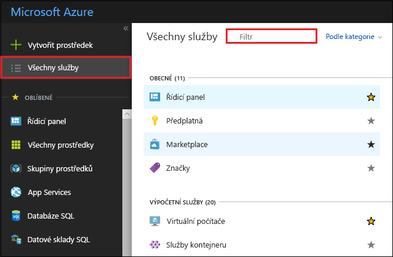

# <a name="quickstart-run-a-workflow-through-the-microsoft-genomics-service"></a>Rychlý start: Spuštění pracovního postupu ve službě Microsoft Genomics

V tomto rychlém startu nahrajete vstupní data do účtu služby Azure Blob Storage a spustíte pracovní postup prostřednictvím služby Microsoft Genomics pomocí klienta Pythonu s využitím genomiky. Microsoft Genomics je škálovatelná a bezpečná služba pro sekundární analýzu, která dokáže rychle analyzovat genom počínaje od nezpracovaných čtení a vytváří zarovnaná čtení a volání variant. 

## <a name="prerequisites"></a>Požadavky

- Účet Azure s aktivním předplatným. [Vytvořte si účet zdarma](https://azure.microsoft.com/free/?ref=microsoft.com&utm_source=microsoft.com&utm_medium=docs&utm_campaign=visualstudio). 
- [Python 2.7.12 +](https://www.python.org/downloads/release/python-2714/), s nainstalovanou `pip` a `python` ve vaší systémové cestě. Klient Microsoft Genomics není kompatibilní s Pythonem 3. 

## <a name="set-up-create-a-microsoft-genomics-account-in-the-azure-portal"></a>Příprava: vytvoření účtu Microsoft Genomics na webu Azure Portal

Pokud chcete vytvořit účet Microsoft Genomics, přejděte k části [Vytvoření účtu genomiky](https://portal.azure.com/#create/Microsoft.Genomics) v Azure Portal. Pokud ještě nemáte předplatné Azure, založte si ho před vytvořením účtu Microsoft Genomics. 


Nastavte v účtu Genomics následující údaje, viz předchozí obrázek. 

 |**Nastavení**          |  **Navrhovaná hodnota**  | **Popis pole** |
 |:-------------       |:-------------         |:----------            |
 |Předplatné         | Název vašeho předplatného|Toto je fakturační jednotka pro vaše služby Azure – podrobnosti o vašem předplatném najdete v části [Předplatná](https://account.azure.com/Subscriptions) |      
 |Skupina prostředků       | MyResourceGroup       |  Skupiny prostředků umožňují sdružení několika prostředků Azure (účet úložiště, účet Genomics atd.) do jedné skupiny pro zjednodušení správy. Další informace najdete v tématu [Skupiny prostředků](https://docs.microsoft.com/azure/azure-resource-manager/resource-group-overview#resource-groups). Platné názvy skupin prostředků najdete v tématu [Pravidla pojmenování](/azure/architecture/best-practices/resource-naming). |
 |Název účtu         | MyGenomicsAccount     |Zvolte jedinečný identifikátor účtu. Informace o platných názvech najdete v části [Pravidla pojmenování](/azure/architecture/best-practices/resource-naming) |
 |Umístění                   | Západní USA 2                    |    Služba je dostupná v oblastech Západní USA 2, Západní Evropa a Jihovýchodní Asie |

V horním řádku nabídek můžete vybrat **oznámení** a monitorovat proces nasazení.


Další informace o Microsoft Genomics najdete v tématu [co je Microsoft Genomics?](overview-what-is-genomics.md)

## <a name="set-up-install-the-microsoft-genomics-python-client"></a>Příprava: instalace pythonového klienta Microsoft Genomics

V místním prostředí je potřeba nainstalovat Python i Microsoft Genomics klienta Pythonu. 

### <a name="install-python"></a>Instalace Pythonu

Klient Pythonu Microsoft Genomics je kompatibilní s Pythonem 2.7.12 nebo novější verzí 2.7. xx. 2.7.14 je navržená verze. Můžete si ji stáhnout [tady](https://www.python.org/downloads/release/python-2714/). 

> [!IMPORTANT]
> Python 3. x není kompatibilní s Pythonem 2.7. xx.  MSGen je aplikace Pythonu 2.7. Pokud používáte MSGen, ujistěte se, že vaše aktivní prostředí Pythonu používá Python verze 2.7.xx. Pokud se pokusíte použít MSGen s Pythonem verze 3.x, může docházet k chybám.

### <a name="install-the-microsoft-genomics-client"></a>Instalace pythonového klienta Microsoft Genomics

K instalaci `msgen`klientů Microsoft Genomics použijte `pip` Pythonu. Následující pokyny předpokládají, že je Python zahrnutý v proměnné path. Pokud máte problémy s `pip` instalace nebyla rozpoznána, je nutné přidat do systémové cesty složku Python a skripty.

```
pip install --upgrade --no-deps msgen
pip install msgen
```

Pokud nechcete instalovat `msgen` jako binární soubor v rámci systému a upravovat balíčky Pythonu v rámci systému, použijte příznak `–-user` s `pip`.
Pokud použijete instalaci využívající balíčky nebo skript setup.py, nainstalují se všechny potřebné balíčky. V opačném případě jsou základní požadované balíčky pro `msgen` 

 * [Azure-storage](https://pypi.python.org/pypi/azure-storage). 
 * [Requests](https://pypi.python.org/pypi/requests). 

Tyto balíčky můžete nainstalovat pomocí `pip`, `easy_install` nebo standardní procedury `setup.py`. 

### <a name="test-the-microsoft-genomics-client"></a>Test pythonového klienta Microsoft Genomics
Pokud chcete otestovat klienta Microsoft Genomics, Stáhněte si konfigurační soubor z vašeho účtu genomiky. V Azure Portal přejděte na svůj účet genomika tak, že vyberete **všechny služby** v levém horním rohu a pak vyhledáte a vyberete účty genomiky.



Vyberte účet genomiky, který jste právě vytvořili, přejděte na **přístupové klíče**a Stáhněte si konfigurační soubor.


Vyzkoušejte správnou funkci pythonového klienta Microsoft Genomics pomocí následujícího příkazu

```Python
msgen list -f "<full path where you saved the config file>"
```

## <a name="create-a-microsoft-azure-storage-account"></a>Vytvoření účtu Microsoft Azure Storage 
Služba Microsoft Genomics očekává vstupy uložené jako objekty blob bloku v účtu úložiště Azure. Také výstupní soubory zapisuje jako objekty blob bloku do uživatelem zadaného kontejneru v účtu úložiště Azure. Vstupy a výstupy můžou patřit do různých účtů úložiště.
Pokud již máte data v účtu úložiště Azure, stačí se ujistit, že je ve stejném umístění jako účet Genomics. V opačném případě se za provozu Microsoft Genomics služby účtují poplatky za odchozí data. Pokud ještě nemáte účet úložiště Azure, budete ho muset vytvořit a nahrát data. Další informace o účtech Azure Storage najdete [tady](https://docs.microsoft.com/azure/storage/common/storage-create-storage-account), včetně toho, co je účet úložiště a jaké služby nabízí. Pokud chcete vytvořit účet úložiště Azure, přejděte k části [Vytvoření účtu úložiště](https://portal.azure.com/#create/Microsoft.StorageAccount-ARM) v Azure Portal.  


Nakonfigurujte účet úložiště pomocí následujících informací, jak je znázorněno na předchozím obrázku. Použijte většinu standardních možností pro účet úložiště a určete jenom to, že je účet BlobStorage, ne pro obecné účely. Úložiště objektů blob nabízí 2–5× rychlejší stahování a nahrávání.  Doporučuje se výchozí model nasazení Azure Resource Manager.  

 |**Nastavení**          |  **Navrhovaná hodnota**  | **Popis pole** |
 |:-------------------------       |:-------------         |:----------            |
 |Předplatné         | Vaše předplatné Azure |Podrobnosti o vašich předplatných najdete v tématu [Předplatná](https://account.azure.com/Subscriptions). |      
 |Skupina prostředků       | MyResourceGroup       |  Můžete vybrat stejnou skupinu prostředků jako váš účet genomiky. Platné názvy skupin prostředků najdete v tématu [pravidla pojmenování](/azure/architecture/best-practices/resource-naming) . |
 |Název účtu úložiště         | MyStorageAccount     |Zvolte jedinečný identifikátor účtu. Platné názvy najdete v tématu [pravidla pojmenování](/azure/architecture/best-practices/resource-naming) . |
 |Umístění                  | Západní USA 2                  | Použijte stejné umístění jako umístění vašeho účtu genomika, abyste snížili náklady na výstup a snížili latenci.  | 
 |Výkon                  | Úroveň Standard                   | Výchozí nastavení je Standard. Další podrobnosti o účtech úložiště úrovně Standard a Premium najdete v tématu [Úvod do služby Microsoft Azure Storage](https://docs.microsoft.com/azure/storage/common/storage-introduction) .    |
 |Account kind (Druh účtu)       | BlobStorage       |  Úložiště objektů blob nabízí 2–5× rychlejší stahování a nahrávání než úložiště pro obecné účely. |
 |Replikace                  | (Locally redundant storage) Místně redundantní úložiště                  | Místně redundantní úložiště replikuje data třikrát v rámci oblasti, ve které jste vytvořili účet úložiště. Další informace najdete v tématu [Replikace Azure Storage](https://docs.microsoft.com/azure/storage/common/storage-redundancy).    |
 |Vrstva přístupu                  | Hot                   | Horká úroveň přístupu znamená, že k objektům v účtu úložiště budete přistupovat častěji.    |

Pak vyberte **zkontrolovat + vytvořit** a vytvořte účet úložiště. Stejně jako při vytváření účtu genomiky můžete vybrat **oznámení** v horním řádku nabídek a monitorovat proces nasazení. 

## <a name="upload-input-data-to-your-storage-account"></a>Nahrání vstupních dat do účtu úložiště

Služba Microsoft Genomics očekává spárované čtení (soubory souborů fastq nebo BAM) jako vstupní soubory. Můžete nahrát svoje vlastní data, nebo použít veřejně dostupná ukázková data, která jsme pro vás připravili. Pokud chcete použít veřejně dostupné ukázková data, najdete je tady:

[https://msgensampledata.blob.core.windows.net/small/chr21_1.fq.gz](https://msgensampledata.blob.core.windows.net/small/chr21_1.fq.gz)
[https://msgensampledata.blob.core.windows.net/small/chr21_2.fq.gz](https://msgensampledata.blob.core.windows.net/small/chr21_2.fq.gz)

V rámci účtu úložiště budete potřebovat jeden kontejner objektů blob pro vstupní data a druhý kontejner objektů blob pro výstupní data.  Nahrajte vstupní data do vstupního kontejneru objektů blob. K tomu můžete použít různé nástroje, včetně [Průzkumník služby Microsoft Azure Storage](https://azure.microsoft.com/features/storage-explorer/), [BlobPorter](https://github.com/Azure/blobporter)nebo [AzCopy](https://docs.microsoft.com/azure/storage/common/storage-use-azcopy?toc=%2fazure%2fstorage%2fblobs%2ftoc.json). 

## <a name="run-a-workflow-through-the-microsoft-genomics-service-using-the-python-client"></a>Spuštění pracovního postupu ve službě Microsoft Genomics pomocí pythonového klienta 

Pokud chcete spustit pracovní postup prostřednictvím služby Microsoft Genomics, upravte soubor *config. txt* a určete vstupní a výstupní kontejner úložiště pro vaše data.
Otevřete soubor *config. txt* , který jste stáhli z vašeho účtu genomiky. V sekcích, které potřebujete zadat, jsou klíč předplatného a šest položek dole, název účtu úložiště, klíč a název kontejneru pro vstup i výstup. Tyto informace můžete najít tak, že přejdete na Azure Portal a **získáte přístup k klíčům** pro svůj účet úložiště nebo přímo z Průzkumník služby Azure Storage.  


Pokud byste chtěli spustit GATK4, nastavte parametr `process_name` na `gatk4`.

Ve výchozím nastavení služba genomiky produkuje soubory VCF. Pokud byste chtěli výstup gVCF místo výstupu VCF (ekvivalentem `-emitRefConfidence` v GENOME 3. x a `emit-ref-confidence` v GENOME 4. x), přidejte do *souboru config. txt* parametr `emit_ref_confidence` a nastavte ho na `gvcf`, jak je znázorněno na předchozím obrázku.  Pokud chcete změnit zpátky na výstup VCF, odeberte ho ze souboru *config. txt* nebo nastavte parametr `emit_ref_confidence` na `none`. 

### <a name="submit-your-workflow-to-the-microsoft-genomics-service-the-microsoft-genomics-client"></a>Odešlete svůj pracovní postup službě Microsoft Genomics pomocí klienta Microsoft Genomics

Pomocí pythonového klienta Microsoft Genomics odešlete svůj pracovní postup pomocí následujícího příkazu:

```python
msgen submit -f [full path to your config file] -b1 [name of your first paired end read] -b2 [name of your second paired end read]
```

Stav pracovního postupu můžete zkontrolovat následujícím příkazem: 
```python
msgen list -f c:\temp\config.txt 
```

Po dokončení pracovního postupu můžete zobrazit výstupní soubory v účtu služby Azure Storage ve výstupním kontejneru, který jste nakonfigurovali. 

## <a name="next-steps"></a>Další kroky
V tomto článku jste nahráli ukázková vstupní data do úložiště Azure Storage a odeslali jste pracovní postup do služby Microsoft Genomics pomocí klienta `msgen` Python. Další informace o ostatních typech vstupních souborů, které můžete se službou Microsoft Genomics použít, najdete na následujících stránkách: [Párované soubory FASTQ](quickstart-input-pair-FASTQ.md) | [BAM](quickstart-input-BAM.md) | [Více souborů FASTQ nebo BAM](quickstart-input-multiple.md). Tento kurz můžete prozkoumat také prostřednictvím našeho [kurzu ke službě Azure Notebooks](https://aka.ms/genomicsnotebook).
