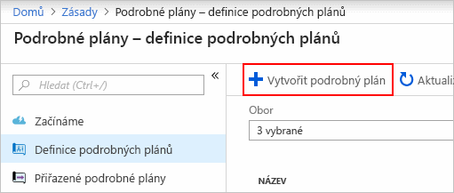
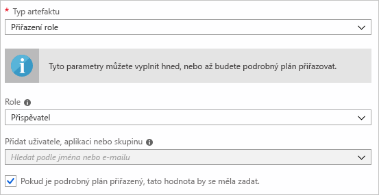
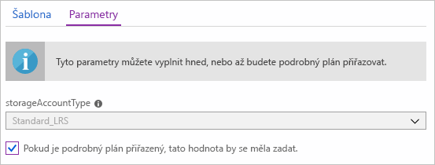
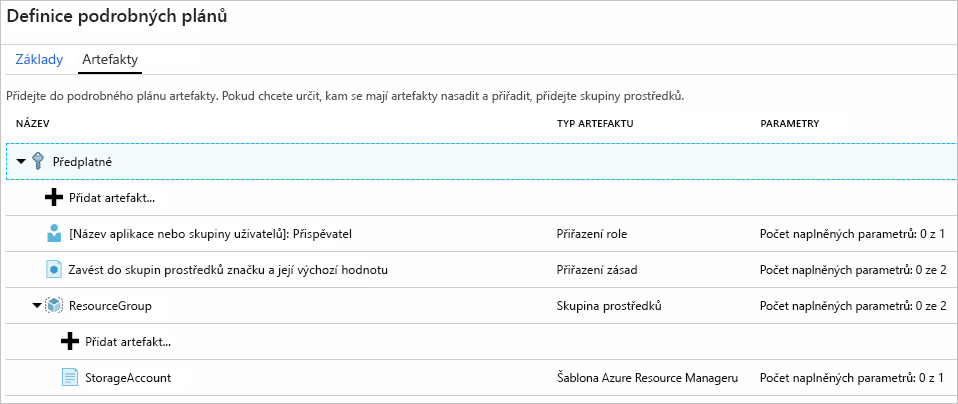
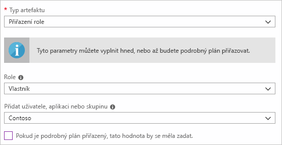
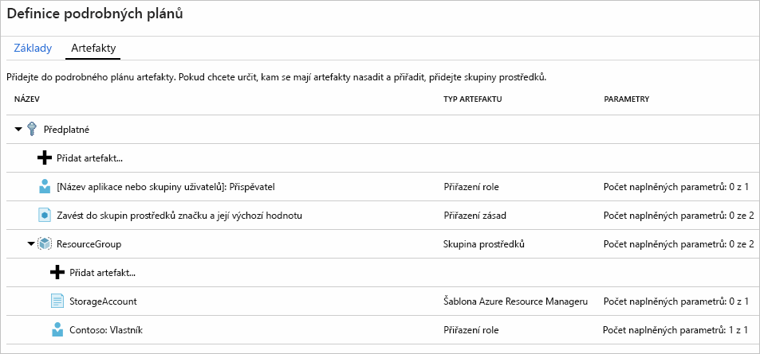
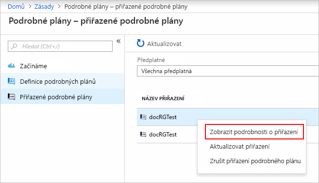

# <a name="define-and-assign-an-azure-blueprint-in-the-portal"></a>Definování a přiřazení Azure Blueprint v portálu

Seznamte se s principy vytváření a přiřazování podrobných plánů v Azure, abyste mohli pro organizaci definovat nejčastější konzistentní vzory a vyvíjet opakovaně použitelné a rychle nasaditelné konfigurace založené na šablonách, zásadách, zabezpečení a dalších prvcích správce prostředků. V tomto kurzu se naučíte používat podrobné plány Azure Blueprint k provádění nejčastějších úloh spojených s vytvářením, publikováním a přiřazením podrobného plánu v organizaci, jako je například:

> [!div class="checklist"]
> - Vytvoření nového podrobného plánu a přidání různých podporovaných artefaktů
> - Provádění změn stávajícího podrobného plánu ve stavu **Koncept**
> - Označení podrobného plánu připraveného k přiřazení stavem **Publikováno**
> - Přiřazení podrobného plánu ke stávajícímu předplatnému
> - Kontrola stavu a průběhu přiřazeného podrobného plánu
> - Odebrání podrobného plánu přiřazeného k předplatnému

Pokud ještě nemáte předplatné Azure, vytvořte si [bezplatný účet](https://azure.microsoft.com/free) před tím, než začnete.

## <a name="create-a-blueprint"></a>Vytvoření podrobného plánu

Jako první krok při definování standardního vzoru pro dodržování předpisů je sestavení podrobného plánu z dostupných prostředků. V tomto příkladu vytvoříte podrobný plán, který se nazývá MyBlueprint a který pro předplatné konfiguruje přiřazení rolí a zásad, přidá skupinu prostředků a vytvoří šablonu Resource Manager a přiřadí skupině prostředků zdroje.

1. Spusťte službu Azure Blueprint na webu Azure Portal tak, že kliknete na **Všechny služby** a pak vyhledáte a vyberete **Zásady** na levém panelu. Na stránce **Zásady** klikněte na **plány**.

1. Vyberte **definice podrobného plánu** ze stránky na levé straně a klikněte na tlačítko **+ vytvořit podrobný plán** tlačítko v horní části stránky.

   - Alternativně klepněte na **vytvořit** ze stránky **Začínáme** a přejděte přímo k vytváření podrobného plánu.

   

1. Zadejte **název podrobného plánu** jako je například "MyBlueprint" (písmena a čísla – až 48 znaků, ale žádné mezery ani speciální znaky) pro podrobný plán, ale nechejte pole **popis podrobného plánu** zatím prázdné.  V poli **definovat umístění** klikněte na tlačítko se třemi tečkami na pravé straně, vyberte [skupiny pro správu](../management-groups/overview.md) kam chcete uložit podrobný plán a klikněte na tlačítko **vyberte**.

   > [!NOTE]
   > Definice podrobného plánu lze uložit pouze do skupin pro správu. Pokud chcete vytvořit vaši první skupinu pro správu, postupujte podle [těchto kroků](../management-groups/create.md).

1. Ověřte správnost informací ( **název podrobného plánu** a **umístění definice** pole není možné později změnit) a klikněte na tlačítko **Další: artefakty** v dolní části stránky nebo **artefakty** kartě v horní části stránky.

1. Přidání přiřazení role v předplatném: levým tlačítkem myši na **+ přidání artefaktu...**  řádek pod **předplatné** a otevře se okno "Přidání artefaktu" na pravé straně prohlížeče. Vyberte "Přiřazení Role" pro _Typ artefaktu_. V části _Role_, vyberte "Přispěvatel" a nechte zaškrtnuté pole _přidat uživatele, aplikace nebo skupinu_ označující **dynamický parametr**. Klikněte na tlačítko **přidat** k přidání tohoto artefaktu do podrobného plánu.

   

   > [!NOTE]
   > Většina _artefaktů_ podporuje parametry. Parametr přiřazený hodnotě během vytváření plánu je **statický parametr**. Pokud je tento parametr přiřazený během přiřazení podrobného plánu, je to **dynamický parametr**. Další informace najdete v [parametry podrobného plánu](./concepts/parameters.md).

1. Přidání přiřazení zásad do předplatného: Klepněte levým tlačítkem na řádek **+ Přidat artefakt...** přímo pod **Předplatné**. Vyberte "Přiřazení zásad" pro _Typ artefaktu_. Změňte _typ_ na "Integrované" a v _hledání_ zadejte 'tag'. Vyklikněte z _hledání_ pro zobrazení filtrování. Zvolte možnost 'Použít značku a její výchozí hodnotu ke skupinám zdrojů' kliknutím na ni. Klikněte na tlačítko **přidat** k přidání tohoto artefaktu do podrobného plánu.

1. Klikněte na řádek přiřazení zásady 'Použít značku a její výchozí hodnotu na skupiny zdrojů'. Okno k zadání parametrů s artefaktem jako součást definice podrobného plánu se otevře a povolí nastavení parametrů pro všechna přiřazení (**statické parametry**)založených na podrobném plánu místo během přiřazení (**dynamické parametry**). V tomto příkladu je žádoucí použít **dynamických parametrů** během přiřazení podrobného plánu, takže ponechte výchozí nastavení a klikněte na tlačítko **zrušit**.

1. Přidat skupinu prostředků v předplatném: levým tlačítkem myši na řádek **+ přidání artefaktu...**  pod **předplatným**. Vyberte 'Skupinu zdrojů' pro _Typ artefaktu_. Nechte pole _název skupiny zdrojů_ a _umístění_ prázdná, ale ujistěte se, že na zaškrtávací políčko je zaškrtnuté u každé vlastnosti tak, aby vznikly **dynamické parametry**. Klikněte na tlačítko **přidat** k přidání tohoto artefaktu do podrobného plánu.

1. Přidat šablonu v rámci skupiny zdrojů: levým tlačítkem myši na **+ přidání artefaktu...** řádek přímo pod položkou **ResourceGroup**. Vyberte 'šablonu Azure Resource Manager' pro _Artefakt typu_, nastavte  _zobrazovaný název Artefaktu_ na 'StorageAccount' a nechte pole _Popis_ prázdné. Na kartu **šablona** v poli editoru, vložte následující šablonu správce prostředků. Po vložení šablony, klikněte na kartu **parametry** a všimněte si, že parametr šablony **storageAccountType** a výchozí hodnota **Standard_LRS** byly automaticky zjištěny a vyplněny ale nakonfigurovány jako **dynamický parametr**. Odstraňte zaškrtnutí zaškrtávacího políčka a všimněte si, že rozevírací seznam obsahuje pouze hodnoty zahrnuté v šabloně Resource Manager pod **allowedValues**. Zaškrtněte políčko ke zpětnému nastavení na **dynamický parametr**. Klikněte na tlačítko **přidat** k přidání tohoto artefaktu do podrobného plánu.

   > [!IMPORTANT]
   > Pokud importujete šablonu, ujistěte se, že soubor je pouze JSON a neobsahuje HTML. Když přejdete na adresu URL na Github, ujistěte se, že jste klikli **RAW** k získání čistého souboru JSON a ne na zabalený s HTML pro zobrazení na Github. Není-li importovaná šablona čistě JSON, objeví se chyba.

   ```json
   {
       "$schema": "https://schema.management.azure.com/schemas/2015-01-01/deploymentTemplate.json#",
       "contentVersion": "1.0.0.0",
       "parameters": {
           "storageAccountType": {
               "type": "string",
               "defaultValue": "Standard_LRS",
               "allowedValues": [
                   "Standard_LRS",
                   "Standard_GRS",
                   "Standard_ZRS",
                   "Premium_LRS"
               ],
               "metadata": {
                   "description": "Storage Account type"
               }
           }
       },
       "variables": {
           "storageAccountName": "[concat(uniquestring(resourceGroup().id), 'standardsa')]"
       },
       "resources": [{
           "type": "Microsoft.Storage/storageAccounts",
           "name": "[variables('storageAccountName')]",
           "apiVersion": "2016-01-01",
           "location": "[resourceGroup().location]",
           "sku": {
               "name": "[parameters('storageAccountType')]"
           },
           "kind": "Storage",
           "properties": {}
       }],
       "outputs": {
           "storageAccountName": {
               "type": "string",
               "value": "[variables('storageAccountName')]"
           }
       }
   }
   ```

   

1. Váš konečný plán by měl vypadat podobně jako v následujícím příkladu. Všimněte si, že každý artefakt má '_x_ z _y_ obsazených parametrů' ve sloupci _Parametry_. **Dynamické parametry** se nastaví během jednotlivých přiřazení podrobného plánu a jednotlivý **statický parametr** byl při přiřazení už nakonfigurován.

   

1. Teď, když byly přidány všechny plánované artefakty, klikněte na tlačítko **uložit koncept** v dolní části stránky.

## <a name="edit-a-blueprint"></a>Upravit podrobný plán

V sekci [vytvořit podrobný plán](#create-a-blueprint) nebyl zadán popis ani nebylo přidáno přiřazení rolí do nové skupiny zdrojů. Obojí můžete napravit pomocí následujících kroků:

1. Vyberte **definice podrobného plánu** ze stránky na levé straně.

1. V seznamu plánů klikněte pravým tlačítkem na ten, který jste dříve vytvořili a vyberte **upravit podrobný plán**.

1. V **popisu podrobného plánu**, poskytněte několik informací o podrobném plánu a artefaktech, které ho tvoří.  V tomto případě zadejte něco jako: "Tento plán nastavuje značku zásad a přiřazení rolí k předplatnému, vytvoří ResourceGroup a nasadí šablonu zdroje a přiřazení rolí této ResourceGroup."

1. Klikněte na tlačítko **Další: artefakty** v dolní části stránky nebo na kartu **artefakty** v horní části stránky.

1. Přidání přiřazení role v rámci skupiny zdrojů: levým tlačítkem myši na **+ přidání artefaktu...**  řádek přímo pod **ResourceGroup** položka. Vyberte "Přiřazení Role" pro _Typ artefaktu_. V části _Role_, vyberte 'Vlastník ' a zrušte zaškrtnutí u pole _přidat uživatele, aplikace nebo skupiny_ a vyhledejte a vyberte uživatele, aplikaci nebo skupinu k přidání. Bude to **statický parametr** a bude použitý v každém přiřazení podrobného plánu. Klikněte na tlačítko **přidat** k přidání tohoto artefaktu do podrobného plánu.

   

1. Váš konečný plán by měl vypadat podobně jako v následujícím příkladu. Všimněte si, že se zobrazí nově přidaná role přiřazení **naplněných parametrů 1: 1** to znamená, že se jedná **statický parametr**.

   

1. Klikněte na tlačítko **uložit koncept** teď, když se aktualizoval.

## <a name="publish-a-blueprint"></a>Publikování podrobného plánu

Po přidání plánovaných artefaktů do podrobného plánu můžete publikovat.
Publikováním ho zpřístupní, aby se dalo přiřadit k předplatnému.

1. Vyberte **definice podrobného plánu** ze stránky na levé straně.

1. V seznamu plánů klikněte pravým tlačítkem na ten, který jste dříve vytvořili a vyberte **publikovat podrobný plán**.

1. V dialogovém okně, které se otevře, zadejte **verzi** (písmena, číslice a spojovníky s maximální délkou 20 znaků) jako je například "v1" a **změňte poznámky** (volitelné), jako je například 'nejprve publikovat '.

1. Klikněte na **Publikovat** ve spodní části stránky.

## <a name="assign-a-blueprint"></a>Přiřazení podrobného plánu

Jakmile podrobný plán publikujete, můžete ho přiřadit předplatnému. Přiřaďte vytvořený podrobný plán některému z předplatných v hierarchii skupiny pro správu.

1. Vyberte **definice podrobného plánu** ze stránky na levé straně.

1. V seznamu plánů klikněte pravým tlačítkem na ten, který jste dříve vytvořili (nebo levým tlačítkem na tři tečky) a vyberte **Přiřadit podrobný plán**.

1. Na stránce **přiřazení podrobného plánu** vyberte předplatná, na která chcete aplikovat tento podrobný plán z rozevíracího seznamu **předplatné**.

   > [!NOTE]
   > Přiřazení se vytvoří pro každé předplatné, které je vybráné, což umožní změny pozdějšího přiřazení předplatného bez nutnosti vynucení změn ve zbývajících vybraných předplatných.

1. Pro **přidělený název**, zadejte jedinečný název pro toto přiřazení.

1. V **umístění**, vyberte oblast pro spravovanou identitu, ve které má být vytvořená. Podrobný plán Azure Blueprint používá tuto spravovanou identitu k aplikaci všech artefaktů v přiřazené podrobného plánu. Další informace najdete v tématu [Spravované identity pro zdroje Azure](../../active-directory/managed-identities-azure-resources/overview.md).

1. Nechte **verzi definice podrobného plánu** z rozevírací nabídky **publikováno** verzi v položce "v1" (výchozí jako naposledy **publikovaná** verze).

1. Pro **zámek přiřazení**, ponechte výchozí hodnotu na **bez zámku**. Další informace naleznete v tématu [uzamčení zdrojů plánu](./concepts/resource-locking.md).

1. Pro přiřazení role na úrovni předplatného **[skupiny uživatelů nebo název aplikace]: Přispěvatel**, vyhledejte a vyberte uživatele, aplikace nebo skupinu.

1. Pro přiřazení zásady úrovně předplatného, nastavte **název tagu** na 'CostCenter ' a **hodnotu tagu** na 'ContosoIT '.

1. Pro 'ResourceGroup ' zadejte **název** ze 'StorageAccount' a **umístění** z 'USA – východ 2 ' z rozevíracího seznamu.

   > [!NOTE]
   > Pro každý artefakt, který byl přidaný v rámci skupiny zdrojů během definice podrobného plánu, by měl být v souladu se skupinou zdrojů nebo objektem, se kterým bude aplikovaný. Artefakty, které buď nepřijímají parametry, nebo nemají žádné parametry k definování při přiřazení, budou uvedené pouze pro kontextové informace.

1. V šabloně Azure Resource Manager 'StorageAccount' vyberte parametr **storageAccountTyp** 'Standard_GRS'.

1. Přečtěte si informace v poli v dolní části stránky a pak klikněte na **přiřadit**.

## <a name="track-deployment-of-a-blueprint"></a>Sledování aplikace plánu

Pokud byl plán přiřazený k jednomu nebo několika předplatným, stanou dvě věci:

- Podrobný plán se přidá na stránku **přiřazené podrobné plány** přiřazenému předplatnému
- Proces aplikace všech artefaktů definovaných podrobným plánem začíná

Teď, když se podrobný plán přiřadil k předplatnému, ověřte průběh aplikace.

1. Vyberte **Přiřazené podrobné plány** ze stránky vlevo.

1. V seznamu plánů klikněte pravým tlačítkem na ten, který jste dříve přiřadili a vyberte **Zobrazit detaily podrobného plánu**.

   

1. Na stránce **podrobnosti o nasazení** ověřte, že se všechny artefakty úspěšně a bez chyb aplikovaly. Pokud došlo k chybám, přečtěte si téma [řešení potíží s podrobným plánem](./troubleshoot/general.md) k postupum, jak zjistit, co je špatně.

## <a name="unassign-a-blueprint"></a>Zrušení přiřazení plánu

Podrobné plány můžete z předplatného odebrat, pokud už nejsou potřeba nebo byly nahrazeny novějšími podrobnými plány s aktualizovanými vzory, zásadami a návrhy. Po odebrání podrobného plánu zůstanou přiřazené artefakty, které byly jeho součástí. Chcete-li odebrat přiřazení plánu, postupujte takto:

1. Vyberte **Přiřazené podrobné plány** ze stránky vlevo.

1. V seznamu plánů vyberte plán, který je k přiřazení a pak klikněte na tlačítko **zrušit přiřazení podrobného plánu** v horní části stránky.

1. Přečtěte si potvrzovací zprávu a pak klikněte na tlačítko **OK**.

## <a name="delete-a-blueprint"></a>Smazání podrobného plánu

1. Vyberte **definice podrobného plánu** ze stránky na levé straně.

1. Klepněte pravým tlačítkem myši na plán, který chcete odstranit, a vyberte položku **Smazat podrobný plán** a v dialogovém okně pro potvrzení klepněte na tlačítko **Ano**.

> [!NOTE]
> Odstraněním plánu v této metodě se také odstraní všechny **publikované verze** vybraného podrobného plánu. Pokud chcete odstranit jen jednu verzi, otevřete podrobný plán, klikněte na kartu **publikované verze** vyberte a klikněte na verzi, kterou chcete odstranit a potom klikněte na tlačítko **odstranit tuto verzi**. Také plán s přiřazením nelze odstranit, dokud nebyly odstraněny všechny přiřazené podrobné plány.

## <a name="next-steps"></a>Další kroky

- Další informace o [životním cyklu podrobného plánu](./concepts/lifecycle.md)
- Principy použití [statických a dynamických parametrů](./concepts/parameters.md)
- Další informace o přizpůsobení [pořadí podrobných plánů](./concepts/sequencing-order.md)
- Zjistěte, jak používat [zamykání prostředků podrobného plánu](./concepts/resource-locking.md)
- Další informace o [aktualizaci existujících přiřazení](./how-to/update-existing-assignments.md)
- Řešení potíží při přiřazení podrobného plánu – [obecné řešení potíží](./troubleshoot/general.md)