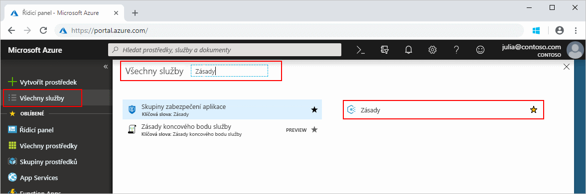
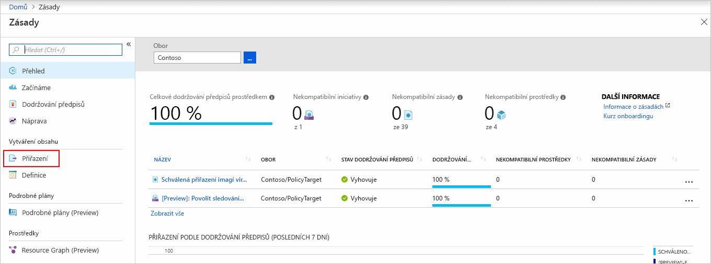
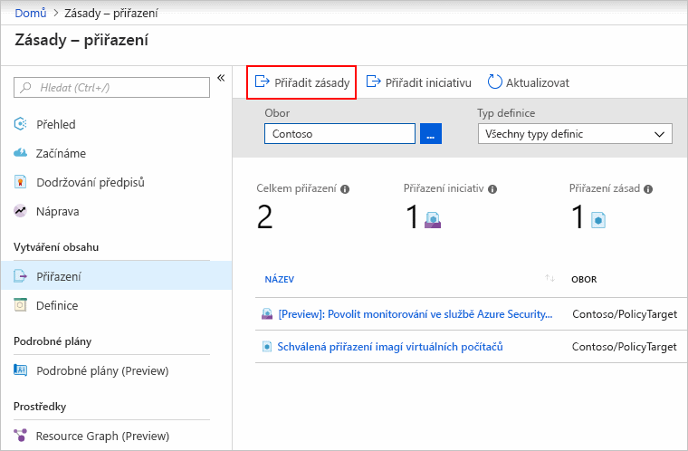
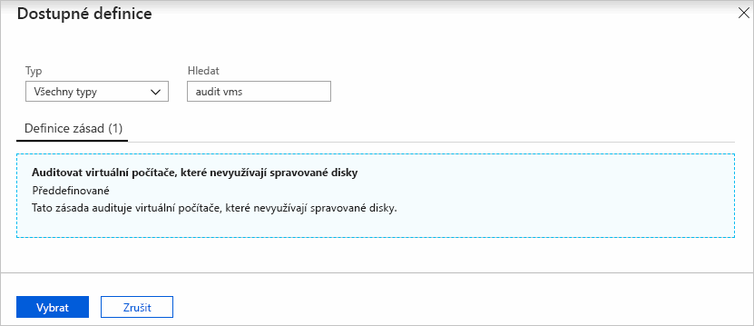
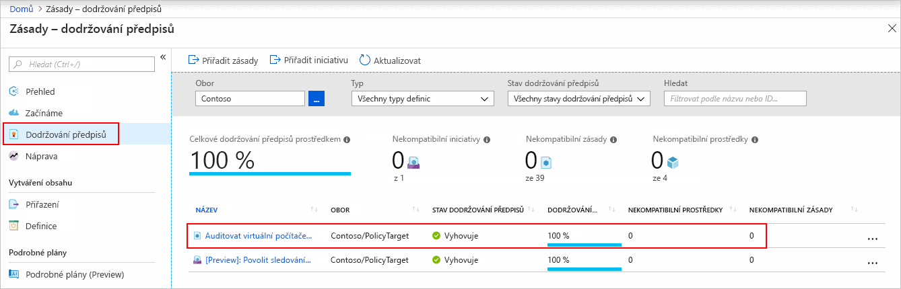
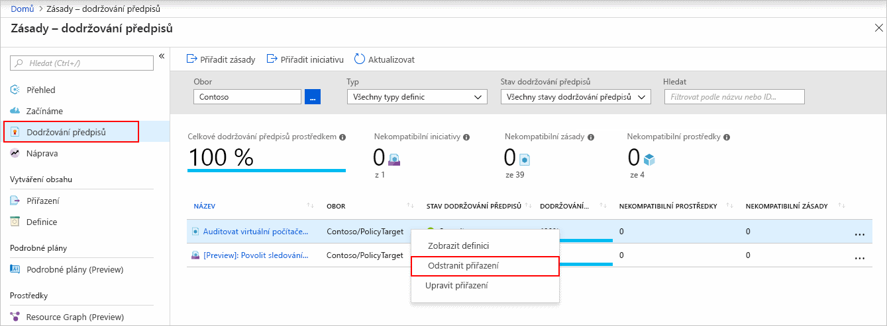

# Vytvoření přiřazení zásady pro identifikaci prostředků, které nedodržují předpisy

Prvním krokem k porozumění dodržování předpisů v Azure je zjištění stavu vašich prostředků.
Tento rychlý start vás provede procesem vytvoření přiřazení zásady pro identifikaci virtuálních počítačů, které nepoužívají spravované disky.

Na konci tohoto procesu úspěšně identifikujete virtuální počítače, které nepoužívají spravované disky. *Neodpovídají* přiřazení zásad.

Pokud ještě nemáte předplatné Azure, vytvořte si [bezplatný účet](https://azure.microsoft.com/free/) před tím, než začnete.

## Vytvoření přiřazení zásady

V tomto rychlém startu vytvoříte přiřazení zásady a přiřadíte *Audit virtuálních počítačů, které nepoužívají spravované disky* definice zásady.

1. Spusťte službu Azure Policy na webu Azure Portal tak, že kliknete na **Všechny služby** a pak vyhledáte a vyberete **Zásady**.

   

1. Na levé straně stránky služby Azure Policy vyberte **Přiřazení**. Přiřazení je zásada, která byla přiřazena, aby proběhla v rámci zadaného oboru.

   

1. V horní části stránky **Zásady – Přiřazení** vyberte **Přiřadit zásadu**.

   

1. Na stránce **Přiřadit zásadu** vyberte **Obor** tak, že kliknete na tři tečky a vyberete skupinu pro správu nebo předplatné. Volitelně můžete vybrat skupinu prostředků. Obor určuje, pro které prostředky nebo skupiny prostředků se toto přiřazení zásady bude vynucovat.  Pak v dolní části stránky **Obor** klikněte na **Vybrat**.

   V tomto příkladu se používá předplatné **Contoso**. Vaše předplatné se bude lišit.

1. Prostředky je možné vyloučit na základě **oboru**.  **Vyloučení** začínají na úrovni o jednu nižší, než je úroveň **oboru**. **Vyloučení** jsou volitelná, takže toto pole prozatím ponechte prázdné.

1. Výběrem tří teček **Definice zásady** otevřete seznam dostupných definic. Služba Azure Policy obsahuje integrované definice zásad, které můžete použít. K dispozici je jich celá řada, například:

   - Vynucovat použití značky a její hodnoty
   - Použít značku a její hodnotu
   - Vyžadovat SQL Server verze 12.0

   Částečný seznam dostupných předdefinovaných zásad najdete v tématu [ukázky zásad](./samples/index.md).

1. Prohledejte seznam definic zásad a najděte definici *Audit virtuálních počítačů, které nepoužívají spravované disky*. Klikněte na tuto zásadu a potom na **Vybrat**.

   

1. Do pole **Název přiřazení** se automaticky vyplní název vybrané zásady, který však můžete změnit. Pro účely tohoto příkladu ponechte *Audit virtuálních počítačů, které nepoužívají spravované disky*. Volitelně můžete přidat také **Popis**. Popis obsahuje podrobnosti o tomto přiřazení zásady. Pole **Přiřadil** se automaticky vyplní podle toho, kdo je přihlášený. Toto pole je volitelné, takže do něj můžete zadávat vlastní hodnoty.

1. Políčko **Vytvořit spravovanou identitu** ponechte nezaškrtnuté. Toto políčko _musí_ být vráceny, pokud obsahuje zásady nebo iniciativa zásad s [deployIfNotExists](./concepts/effects.md#deployifnotexists) vliv. Jak nepodporuje zásady používané pro tento rychlý start ponechte prázdné. Další informace najdete v tématech věnovaných [spravovaným identitám](../../active-directory/managed-identities-azure-resources/overview.md) a [principu fungování zabezpečení náprav](./how-to/remediate-resources.md#how-remediation-security-works).

1. Klikněte na **Přiřadit**.

Nyní jste připraveni identifikovat prostředky, které nedodržují předpisy, abyste porozuměli stavu dodržování předpisů ve vašem prostředí.

## Identifikace prostředků, které nedodržují předpisy

Vyberte **dodržování předpisů** v levé části stránky. Vyhledejte **Audit virtuálních počítačů, které nepoužívají spravované disky** přiřazení zásady, které jste vytvořili.

Pokud existují nějaké stávající prostředky, které nedodržují předpisy tohoto nového přiřazení, zobrazí se pod **nekompatibilní prostředky**.

Pokud se napříč stávajícími prostředky vyhodnotí nějaká podmínka a zjistí hodnotu True, takové prostředky se označí jako nekompatibilní s příslušnou zásadou. Následující tabulka ukazuje, jak různé účinky zásad pracují s vyhodnocením podmínek pro zjištění výsledného stavu dodržování předpisů. Přestože se logika vyhodnocení na webu Azure Portal nezobrazuje, výsledné stavy dodržování předpisů se zobrazují. Výsledný stav je buď kompatibilní, nebo nekompatibilní.

| **Stav prostředku** | **Účinek** | **Vyhodnocení zásad** | **Stav dodržování předpisů** |
| --- | --- | --- | --- |
| Existuje | Deny, Audit, Append\*, DeployIfNotExist\*, AuditIfNotExist\* | True | Nevyhovující předpisům |
| Existuje | Deny, Audit, Append\*, DeployIfNotExist\*, AuditIfNotExist\* | False | Odpovídající |
| Nová | Audit, AuditIfNotExist\* | True | Nevyhovující předpisům |
| Nová | Audit, AuditIfNotExist\* | False | Odpovídající |

\* Účinky Append, DeployIfNotExist a AuditIfNotExist vyžadují, aby byl příkaz IF nastaven na TRUE. Tyto účinky také vyžadují, aby existovala podmínka, která musí nabývat hodnoty FALSE, aby byla zásada vyhodnocena jako Nevyhovující předpisům. Pokud má hodnotu TRUE, aktivuje podmínka IF vyhodnocení podmínky existence pro související prostředky.

## Vyčištění prostředků

Odebrat přiřazení vytvořené, postupujte podle těchto kroků:

1. Na levé straně stránky služby Azure Policy vyberte **Dodržování předpisů** (nebo **Přiřazení**) a vyhledejte přiřazení zásady **Audit virtuálních počítačů, které nepoužívají spravované disky**, které jste vytvořili.

1. Klikněte pravým tlačítkem na přiřazení zásady **Audit virtuálních počítačů, které nepoužívají spravované disky** a vyberte **Odstranit přiřazení**.

   

## Další postup

V tomto rychlém startu jste přiřadili definici zásady k oboru prostředků a vyhodnotili jste její sestavu dodržování předpisů. Definice zásad ověří, že všechny prostředky v příslušném oboru jsou kompatibilní a určuje ty, které nejsou.

Další informace o přiřazování zásad pro ověření, že nové prostředky jsou kompatibilní, i nadále najdete v tomto kurzu:

> [!div class="nextstepaction"]
> [Vytváření a správa zásad](./tutorials/create-and-manage.md)