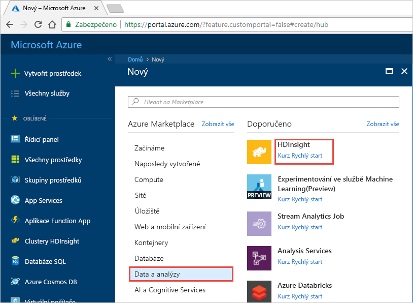
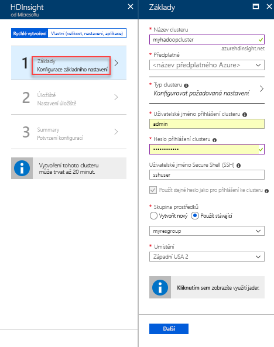
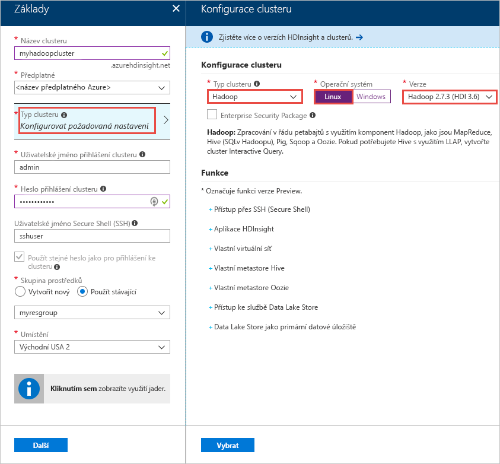
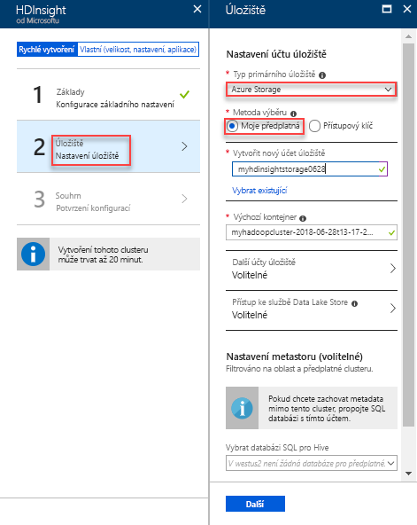
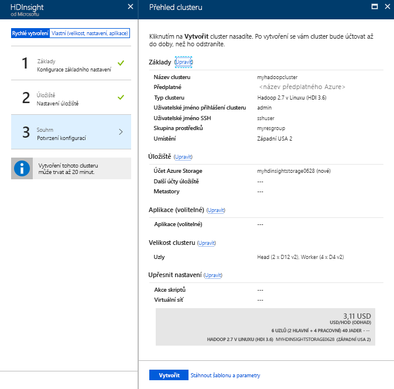
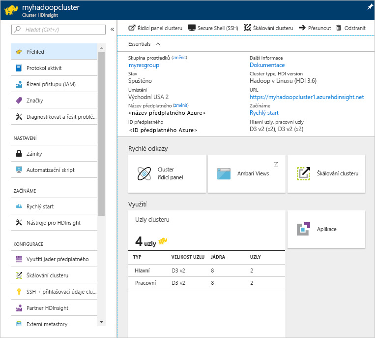
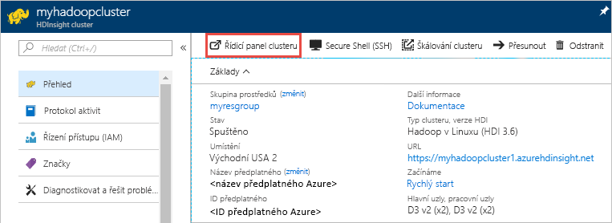
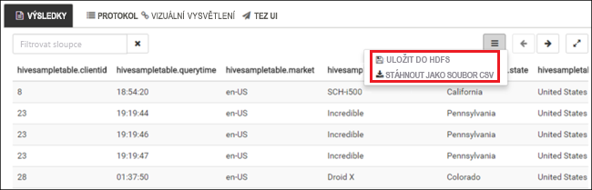
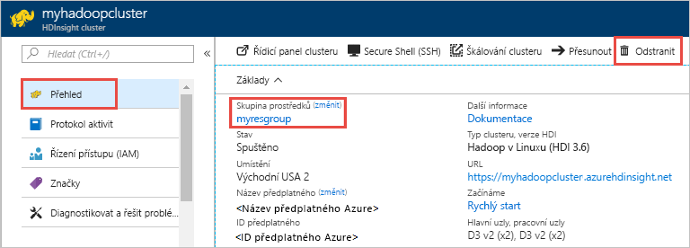

# Rychlý start: Začínáme s Hadoopem a Hivem v Azure HDInsight pomocí portálu Azure Portal

V tomto článku se dozvíte, jak pomocí portálu Azure Portal vytvořit clustery [Hadoop](http://hadoop.apache.org/) v HDInsight a pak v HDInsight spustit úlohy Hive. Většina úloh Hadoop jsou dávkové úlohy. Vytvoříte cluster, spustíte některé úlohy a pak cluster odstraníte. V tomto článku provedete všechny tři úlohy.

V tomto rychlém startu pomocí portálu Azure Portal vytvoříte cluster HDInsight Hadoop. K vytvoření clusteru můžete použít také [šablonu Azure Resource Manageru](apache-hadoop-linux-tutorial-get-started.md).

Aktuálně se HDInsight dodává se [sedmi různými typy clusteru](./apache-hadoop-introduction.md#cluster-types-in-hdinsight). Každý typ clusteru podporuje odlišnou sadu komponent. Všechny typy clusteru podporují Hive. Seznam podporovaných součásti v HDInsight naleznete v tématu [Co je nového ve verzích clusterů Hadoop poskytovaných v HDInsight?](../hdinsight-component-versioning.md)  

Pokud ještě nemáte předplatné Azure, [vytvořte si bezplatný účet](https://azure.microsoft.com/free/) před tím, než začnete.

## Vytvoření clusteru Hadoop

V této části vytvoříte cluster Hadoop v HDInsight pomocí portálu Azure Portal. 

1. Přihlaste se k [portálu Azure](https://portal.azure.com).

1. Na portálu Azure Portal vyberte **Vytvořit prostředek** > **Data a analýzy** > **HDInsight**. 

    

2. V části **HDInsight** > **Rychle vytvořit** > **Základy** zadejte hodnoty podle tohoto snímku obrazovky:

    

    Zadejte nebo vyberte tyto hodnoty:
    
    |Vlastnost  |Popis  |
    |---------|---------|
    |**Název clusteru**     | Zadejte název clusteru Hadoop. Vzhledem k tomu, že všechny clustery ve službě HDInsight sdílejí stejný obor názvů DNS, musí být tento název jedinečný. Název může mít až 59 znaků a může obsahovat písmena, číslice a pomlčky. První a poslední znak názvu nemůže být pomlčka. |
    |**Předplatné**     |  Vyberte své předplatné Azure. |
    |**Typ clusteru**     | Tohle zatím přeskočte. Tuto hodnotu zadáte v dalším kroku postupu.|
    |**Přihlašovací uživatelské jméno a heslo clusteru**     | Výchozí přihlašovací jméno je **admin** (správce). Heslo musí mít minimálně 10 znaků a musí obsahovat alespoň jedno číslo, jedno velké písmeno, jedno malé písmeno a jeden jiný než alfanumerický znak (kromě znaků ' " ` \). **Nezadávejte** běžné heslo, jako je „Pass@word1“.|
    |**Uživatelské jméno SSH** | Výchozí uživatelské jméno je **sshuser** (uživatelssh).  Pro uživatelské jméno SSH můžete zadat jiný název. |
    | **Použít stejné heslo jako pro přihlášení ke clusteru** | Pokud toto políčko zaškrtnete, použije se stejné heslo pro uživatele SSH, jaké jste zadali pro přihlášení uživatele clusteru.|
    |**Skupina prostředků**     | Vytvořte skupinu prostředků nebo vyberte existující.  Skupina prostředků je kontejner komponent Azure.  V tomto případě skupina prostředků obsahuje cluster HDInsight a závislý účet služby Azure Storage. |
    |**Umístění**     | Vyberte umístění Azure, ve kterém chcete cluster vytvořit.  Pro dosažení lepšího výkonu zvolte co nejbližší umístění. |
        
3. Vyberte **Typ clusteru** a pak zadejte hodnoty, jak ukazuje tento snímek obrazovky:

    

    Vyberte tyto hodnoty:
    
    |Vlastnost  |Popis  |
    |---------|---------|
    |**Typ clusteru**     | Zadejte název clusteru Hadoop. Vzhledem k tomu, že všechny clustery ve službě HDInsight sdílejí stejný obor názvů DNS, musí být tento název jedinečný. Název může mít až 59 znaků a může obsahovat písmena, číslice a pomlčky. První a poslední znak názvu nemůže být pomlčka. |
    |**Operační systém**     |  Vyberte své předplatné Azure. |
    |**Verze**     | Vyberte **Hadoop 2.7.3 (HDI 3.6)**|

    Klikněte na **Vybrat** a pak na **Další**.

4. Na kartě **Úložiště** zadejte hodnoty, jak ukazuje tento snímek obrazovky:

    

    Vyberte tyto hodnoty:
    
    |Vlastnost  |Popis  |
    |---------|---------|
    |**Typ primárního úložiště**     | Pro účely tohoto článku vyberte **úložiště Azure**, aby se jako výchozí účet úložiště použil Azure Storage Blob. Jako výchozí úložiště můžete vybrat také Azure Data Lake Store. |
    |**Metoda výběru**     |  Pro účely tohoto článku vyberte **Moje předplatné**, aby se použil účet úložiště z vašeho předplatného Azure. Pokud chcete používat účet úložiště z jiných předplatných, vyberte **Přístupový klíč** a pak zadejte přístupový klíč k účtu. |
    |**Vytvoření nového účtu úložiště**     | Zadejte název účtu úložiště.|

    Přijměte všechny ostatní výchozí hodnoty a pak vyberte **Další**.

5. Na kartě **Souhrn** zkontrolujte hodnoty, které jste vybrali v dřívějších krocích.

    
      
4. Vyberte **Vytvořit**. Na řídicím panelu portálu by se měla zobrazit nová dlaždice s názvem **Odesílá se nasazení pro HDInsight**. Vytvoření clusteru trvá přibližně 20 minut.

    

4. Po vytvoření clusteru se zobrazí stránka přehledu clusteru na portálu Azure Portal.
   
        
    
    Každý cluster obsahuje závislost [účtu Azure Storage](../hdinsight-hadoop-use-blob-storage.md) nebo [účtu Azure Data Lake](../hdinsight-hadoop-use-data-lake-store.md). Označuje se jako výchozí účet úložiště. Cluster HDInsight a jeho výchozí účet úložiště musí být umístěny společně a nacházet se ve stejné oblasti Azure. Odstraněním clusterů nedojde k odstranění účtu úložiště.

    > [!NOTE]
    > Další metody vytváření clusterů a principy vlastnosti používaných v tomto kurzu, naleznete v části [Vytváření clusterů HDInsight](../hdinsight-hadoop-provision-linux-clusters.md).       
    > 
    >

## Spuštění dotazů Hive

[Apache Hive](hdinsight-use-hive.md) je nejoblíbenější součástí používanou v HDInsight. Existuje mnoho způsobů spouštění úloh Hive v HDInsight. V tomto kurzu použijete zobrazení Ambari Hive z portálu. Další metody pro odesílání úloh Hive naleznete v části [Použití Hive v HDInsight](hdinsight-use-hive.md).

1. Pokud chcete otevřít Ambari, vyberte **Řídicí panel clusteru**, jak je znázorněno na předchozím snímku obrazovky.  Můžete také přejít na adresu **https://&lt;název_clusteru>.azurehdinsight.net**, kde &lt;název_clusteru> je název clusteru vytvořeného v předchozí části.

    

2. Zadejte uživatelské jméno a heslo Hadoop, které jste zadali při vytváření clusteru. Výchozí uživatelské jméno **admin**.

3. Otevřete **Zobrazení Hive**, jak je znázorněno na následujícím snímku obrazovky:
   
    

4. Na kartě **DOTAZ** vložte následující příkazy HiveQL do pracovního listu:
   
        SHOW TABLES;

    
   
   > [!NOTE]
   > Hive vyžaduje středník.       
   > 
   > 

5. Vyberte **Provést**. Karta **VÝSLEDKY** se zobrazí pod kartou **DOTAZ** a zobrazí informace o úloze. 
   
    Po dokončení dotazu se na kartě **DOTAZ** zobrazí výsledky operace. Zobrazí jedna tabulka s názvem **hivesampletable**. Tato vzorová tabulka Hive obsahuje všechny clustery HDInsight.
   
    

6. Opakujte kroky 4 a 5 a spusťte následující dotaz:
   
        SELECT * FROM hivesampletable;
   
7. Výsledky dotazu můžete také uložit. Vyberte tlačítko s nabídkou na pravé straně a určete, jestli chcete stáhnout výsledky jako soubor CSV nebo je uložit do účtu úložiště přidruženého ke clusteru.

    

Po dokončení úlohy Hive můžete [Exportovat výsledky do databáze Azure SQL nebo databáze systému SQL Server](apache-hadoop-use-sqoop-mac-linux.md), můžete také [zobrazit výsledky pomocí aplikace Excel](apache-hadoop-connect-excel-power-query.md). Další informace o používání Hive v HDInsight naleznete v části [Použití Hive a HiveQL s Hadoop v HDInsight k analýze ukázkového souboru Apache log4j](hdinsight-use-hive.md).

## Řešení potíží

Pokud narazíte na problémy s vytvářením clusterů HDInsight, podívejte se na [požadavky na řízení přístupu](../hdinsight-administer-use-portal-linux.md#create-clusters).

## Vyčištění prostředků
Po dokončení kurzu můžete cluster odstranit. Pomocí HDInsight jsou vaše data uložena v Azure Storage, takže můžete clusteru bezpečně odstranit, pokud není používán. Za cluster služby HDInsight se účtují poplatky, i když se nepoužívá. Vzhledem k tomu, že poplatky za cluster představují několikanásobek poplatků za úložiště, dává ekonomický smysl odstraňovat clustery, které nejsou používány. 

> [!NOTE]
> Pokud *rovnou* pokračujete k dalšímu kurzu, ve kterém se dozvíte, jak spouštět operace ETL s využitím Hadoopu ve službě HDInsight, můžete cluster nechat spuštěný. To proto, že v kurzu musíte cluster Hadoop vytvořit znovu. Pokud ale nebudete hned pokračovat dalším kurzem, musíte teď cluster odstranit.
> 
>  

**Postup odstranění clusteru a/nebo výchozího účtu úložiště**

1. Vraťte se na kartu prohlížeče s webem Azure Portal. Měli byste být na stránce s přehledem clusteru. Pokud chcete odstranit jenom cluster, ale zachovat výchozí účet úložiště, vyberte **Odstranit**.

    

2. Pokud chcete odstranit cluster i výchozí účet úložiště, vyberte název skupiny prostředků (zvýrazněný na předchozím snímku obrazovky) a otevřete stránku skupiny prostředků.

3. Vyberte **Odstranit skupinu prostředků** a odstraňte skupinu prostředků obsahující cluster a výchozí účet úložiště. Upozorňujeme, že odstraněním skupiny prostředků odstraníte účet úložiště. Pokud chcete zachovat účet úložiště, zvolte odstranění samotného clusteru.

## Další kroky
V tomto kurzu jste se naučili, jak vytvořit cluster HDInsight se systémem Linux pomocí šablony Resource Manageru a jak provádět základní dotazy Hive. V dalším článku se dozvíte, jak pomocí Hadoopu ve službě HDInsight provést operaci ETL (extrakce, transformace a načítání).

> [!div class="nextstepaction"]
>[Extrakce, transformace a načítání dat pomocí Apache Hivu ve službě HDInsight](../hdinsight-analyze-flight-delay-data-linux.md)

Pokud chcete začít pracovat s vlastními daty a potřebujete další informace o ukládání dat službou HDInsight nebo o tom, jak data do této služby nahrát, přečtěte si následující články:

* Informace o tom, jak HDInsight používá Azure Storage, najdete v tématu [Používání Azure Storage s HDInsight](../hdinsight-hadoop-use-blob-storage.md).
* Informace o tom, jak nahrát data do služby HDInsight, najdete v tématu [Nahrání dat do služby HDInsight](../hdinsight-upload-data.md).

Další informace o analýze dat pomocí HDInsight naleznete v následujících článcích:

* Další informace o používání Hivu se službou HDInsight, včetně postupu provádění dotazů Hivu ze sady Visual Studio, najdete v tématu [Použití Hivu se službou HDInsight](hdinsight-use-hive.md).
* Další informace o jazyce Pig používaném k transformaci dat najdete v tématu [Použití Pigu se službou HDInsight](hdinsight-use-pig.md).
* Další informace o MapReduce, způsobu psaní programů, které zpracovávají data v Hadoopu, najdete v tématu [Použití MapReduce se službou HDInsight](hdinsight-use-mapreduce.md).
* Další informace o použití nástrojů HDInsight pro Visual Studio k analýze dat na HDInsight naleznete v části [Začněte používat nástroje Visual Studio Hadoop pro HDInsight](apache-hadoop-visual-studio-tools-get-started.md).

Pokud potřebujete další informace o vytváření a správě clusteru HDInsight, přečtěte si následující články:

* Další informace o správě clusteru HDInsight se systémem Linux naleznete v části [Správa clusterů HDInsight pomocí Ambari](../hdinsight-hadoop-manage-ambari.md).
* Další informace o možnostech, které můžete vybrat při vytváření clusteru služby HDInsight, naleznete v tématu [Vytváření HDInsight na Linuxu pomocí vlastních možností](../hdinsight-hadoop-provision-linux-clusters.md).

[1]: ../HDInsight/apache-hadoop-visual-studio-tools-get-started.md

[hdinsight-provision]: hdinsight-provision-linux-clusters.md
[hdinsight-upload-data]: hdinsight-upload-data.md
[hdinsight-use-hive]: hdinsight-use-hive.md
[hdinsight-use-pig]: hdinsight-use-pig.md

