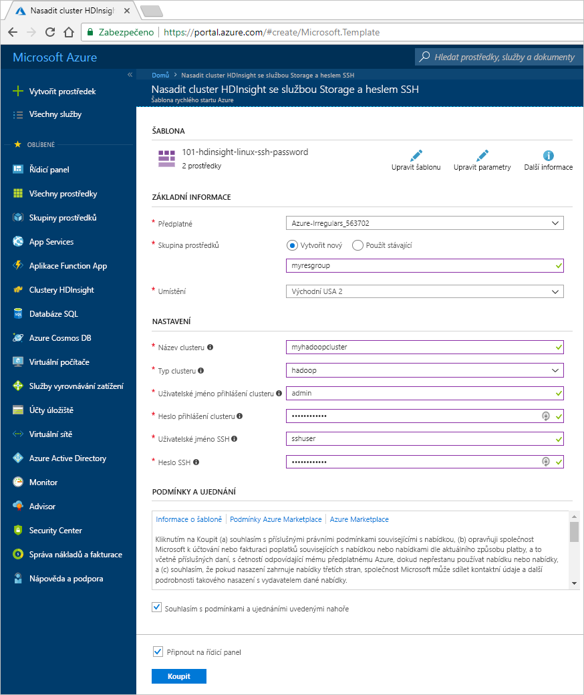
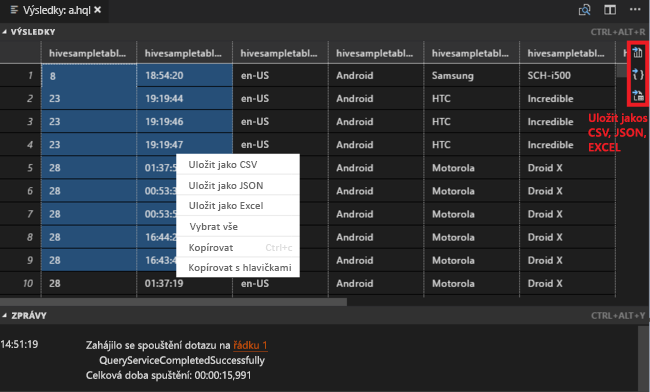
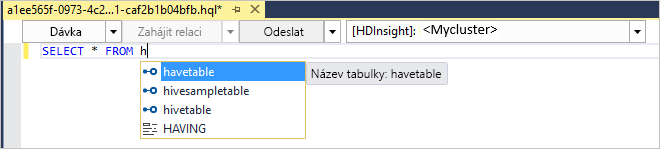
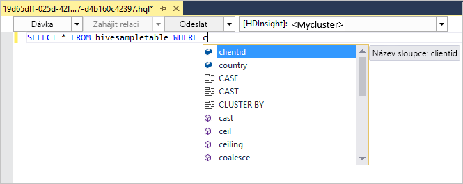
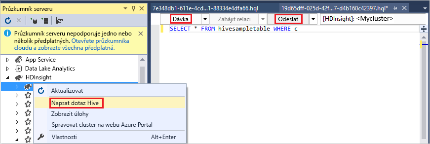
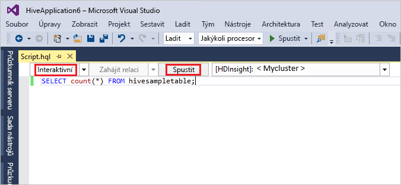

# <a name="quickstart-get-started-with-apache-hadoop-and-apache-hive-in-azure-hdinsight-using-resource-manager-template"></a>Rychlý start: Začínáme s Apache Hadoop a Apache Hive v Azure HDInsight pomocí šablony Resource Manageru

V tomto článku se dozvíte, jak vytvořit [Apache Hadoop](https://hadoop.apache.org/) clusterů v HDInsight pomocí šablony Resource Manageru a potom spouštět úlohy Hive v HDInsight. Většina úloh Hadoop jsou dávkové úlohy. Vytvoříte cluster, spustíte některé úlohy a pak cluster odstraníte. V tomto článku provedete všechny tři úlohy.

V tomto rychlém startu pomocí šablony Resource Manageru vytvoříte cluster HDInsight Hadoop. K vytvoření clusteru můžete použít také [Azure Portal](apache-hadoop-linux-create-cluster-get-started-portal.md).  Můžete zobrazit podobné šablony [šablony pro rychlý start Azure](https://azure.microsoft.com/resources/templates/?resourceType=Microsoft.Hdinsight&pageNumber=1&sort=Popular). Odkaz na šablonu najdete [tady](https://docs.microsoft.com/azure/templates/microsoft.hdinsight/allversions).

Aktuálně se HDInsight dodává se [sedmi různými typy clusteru](./apache-hadoop-introduction.md#cluster-types-in-hdinsight). Každý typ clusteru podporuje odlišnou sadu komponent. Všechny typy clusteru podporují Hive. Seznam podporovaných součásti v HDInsight najdete v tématu [Co je nového ve verzích clusterů Hadoop poskytovaných v HDInsight?](../hdinsight-component-versioning.md)  

Pokud ještě nemáte předplatné Azure, [vytvořte si bezplatný účet](https://azure.microsoft.com/free/) před tím, než začnete.

<a name="create-cluster"></a>
## <a name="create-a-hadoop-cluster"></a>Vytvoření clusteru Hadoop

V této části vytvoříte cluster Hadoop ve službě HDInsight pomocí šablony Azure Resource Manageru. Zkušenosti se šablonami Resource Manageru se k postupu podle tohoto článku nevyžadují. 

1. Klikněte na následující tlačítko **Nasadit do Azure**, přihlaste se k Azure a otevřete šablonu Resource Manageru na webu Azure Portal. 
   
    <a href="https://portal.azure.com/#create/Microsoft.Template/uri/https%3A%2F%2Fraw.githubusercontent.com%2FAzure%2Fazure-quickstart-templates%2Fmaster%2F101-hdinsight-linux-ssh-password%2Fazuredeploy.json" target="_blank"></a>

2. Zadejte nebo vyberte hodnoty navržené na následujícím snímku obrazovky:

    > [!NOTE]  
    > Zadané hodnoty musí být jedinečné a měly by splňovat pokyny pro pojmenování. Šablona neprovádí ověřovací kontroly. Pokud se zadané hodnoty již používají nebo pokud nesplňují příslušné pokyny, po odeslání šablony se zobrazí chyba.    
    
    

    Zadejte nebo vyberte tyto hodnoty:
    
    |Vlastnost  |Popis  |
    |---------|---------|
    |**Předplatné**     |  Vyberte své předplatné Azure. |
    |**Skupina prostředků**     | Vytvořte skupinu prostředků nebo vyberte existující.  Skupina prostředků je kontejner komponent Azure.  V tomto případě skupina prostředků obsahuje cluster HDInsight a závislý účet služby Azure Storage. |
    |**Umístění**     | Vyberte umístění Azure, ve kterém chcete cluster vytvořit.  Pro dosažení lepšího výkonu zvolte co nejbližší umístění. |
    |**Název clusteru**     | Zadejte název clusteru Hadoop. Vzhledem k tomu, že všechny clustery ve službě HDInsight sdílejí stejný obor názvů DNS, musí být tento název jedinečný. Název může obsahovat jenom malá písmena, číslice a spojovníky a musí začínat písmenem.  Před i za každým spojovníkem musí být jiný znak než spojovník.  Název musí také být dlouhý 3 až 59 znaků. |
    |**Typ clusteru**     | Vyberte **hadoop**. |
    |**Přihlašovací jméno a heslo clusteru**     | Výchozí přihlašovací jméno je **admin** (správce). Heslo musí mít minimálně 10 znaků a musí obsahovat alespoň jedno číslo, jedno velké písmeno, jedno malé písmeno a jeden jiný než alfanumerický znak (kromě znaků ' " ` \). **Nezadávejte** běžné heslo, jako je „Pass@word1“.|
    |**Uživatelské jméno a heslo SSH**     | Výchozí uživatelské jméno je **sshuser** (uživatelssh).  Uživatelské jméno SSH můžete změnit.  Pro heslo uživatele SSH platí stejné požadavky jako pro přihlašovací heslo clusteru.|
       
    Některé vlastnosti jsou v šabloně pevně kódované.  Takové hodnoty můžete konfigurovat v šabloně. Další vysvětlení těchto vlastností najdete v tématu [vytvořit Apache Hadoop clusterů v HDInsight](../hdinsight-hadoop-provision-linux-clusters.md).

3. Vyberte **vyjadřuji souhlas s podmínkami a ujednáními uvedenými nahoře**a pak vyberte **nákupní**. Zobrazí se oznámení, že probíhá nasazení.  Vytvoření clusteru trvá přibližně 20 minut.

4. Jakmile je cluster vytvořen, zobrazí se **nasazení bylo úspěšné.** oznámení **přejít ke skupině prostředků** odkaz.  Vaše **skupiny prostředků** stránce začlení nového clusteru HDInsight a výchozí úložiště přidružené ke clusteru. Každý cluster obsahuje [účtu služby Azure Storage](../hdinsight-hadoop-use-blob-storage.md) nebo [účet Azure Data Lake Storage](../hdinsight-hadoop-use-data-lake-store.md) závislostí. Označuje se jako výchozí účet úložiště. HDInsight cluster a jeho výchozí účet úložiště musí být umístěné ve stejné oblasti Azure. Odstraněním clusterů nedojde k odstranění účtu úložiště.

> [!NOTE]  
> Další metody vytváření clusterů a principy vlastnosti používaných v tomto kurzu najdete v části [Vytváření clusterů HDInsight](../hdinsight-hadoop-provision-linux-clusters.md).       


## <a name="use-vscode-to-run-hive-queries"></a>Použití VSCode ke spouštění dotazů Hive

Informace o tom, jak získáte nástroje HDInsight ve VSCode, najdete v tématu [Použití nástrojů HDInsight Tools pro Visual Studio Code](../hdinsight-for-vscode.md).

### <a name="submit-interactive-hive-queries"></a>Odesílání interaktivních dotazů Hive

Pomocí nástrojů HDInsight Tools pro VSCode můžete odesílat interaktivní dotazy Hive do clusterů interaktivních dotazů HDInsight.

1. Pokud ještě nemáte pracovní složku a soubor skriptu Hive, vytvořte nové.

2. Pokud jste to ještě neudělali, připojte se k účtu Azure a pak nakonfigurujte výchozí cluster.

3. Pak zkopírujte a vložte do souboru Hive následující kód a uložte ho.

    ```hiveql
    SELECT * FROM hivesampletable;
    ```
4. Pravým tlačítkem myši na editor skriptů a pak vyberte **HDInsight: Interaktivní Hive** odeslat dotaz. Nástroje také umožňují odeslat pomocí místní nabídky místo celého souboru skriptu blok kódu. Brzy potom se na nové kartě zobrazí výsledky dotazu.

   

    - **VÝSLEDKY** panelu: Můžete uložit celý výsledek jako soubor CSV, JSON nebo Excel na místní cestu nebo stačí vybrat více řádků.

    - **ZPRÁVY** panelu: Když vyberete **řádku** číslo, přeskočí první řádek spuštěného skriptu.

Spustit interaktivní dotaz trvá mnohem kratší dobu než [spuštění dávkové úlohy Apache Hive](#submit-hive-batch-scripts).

### <a name="submit-hive-batch-scripts"></a>Odeslání skriptů dávky Hive

1. Pokud ještě nemáte pracovní složku a soubor skriptu Hive, vytvořte nové.

2. Pokud jste to ještě neudělali, připojte se k účtu Azure a pak nakonfigurujte výchozí cluster.

3. Pak zkopírujte a vložte do souboru Hive následující kód a uložte ho.

    ```hiveql
    SELECT * FROM hivesampletable;
    ```
4. Pravým tlačítkem myši na editor skriptů a pak vyberte **HDInsight: Hive Batch** se odeslat úlohu Hive. 

5. Vyberte cluster, do kterého ji chcete odeslat.  

    Po odeslání úlohy Hive se na panelu **OUTPUT** (VÝSTUP) zobrazí informace o úspěšném odeslání a ID úlohy. Úloha Hive otevře také **WEBOVÝ PROHLÍŽEČ**, ve kterém se zobrazí protokoly a stav úlohy v reálném čase.

   

[Odesílá se interaktivní dotazy Apache Hive](#submit-interactive-hive-queries) trvá mnohem kratší dobu než odeslání úlohy služby batch.

## <a name="use-visualstudio-to-run-hive-queries"></a>Použití sady Visual Studio ke spuštění dotazů Hive

Informace o tom, jak získáte nástroje HDInsight v sadě Visual Studiu, najdete v tématu [Použití nástrojů Data Lake Tools pro Visual Studio](./apache-hadoop-visual-studio-tools-get-started.md).

### <a name="run-hive-queries"></a>Spuštění dotazů Hive

Vytvářet a spouštět dotazy Hive můžete dvěma způsoby:

* Vytváření dotazů ad-hoc
* Vytvoření aplikace Hive

Vytváření a spouštění dotazů ad hoc:

1. V **Průzkumníku serveru** vyberte **Azure** > **Clustery HDInsight**.

2. Klikněte pravým tlačítkem na cluster, ve kterém chcete spustit dotaz, a pak vyberte **Napsat dotaz Hive**.  

3. Zadejte dotazy Hive. 

    Editor Hive podporuje technologii IntelliSense. Nástroje Data Lake pro Visual Studio podporují načítání vzdálených metadat při úpravách skriptu Hive. Pokud například zadáte **SELECT * FROM**, IntelliSense vypíše všechny navrhované názvy tabulek. Pokud zadáte název tabulky, IntelliSense vypíše názvy sloupců. Nástroje podporují většinu příkazů DML Hive, poddotazů a integrovaných UDF.
   
    
   
    
   
   > [!NOTE]  
   > IntelliSense navrhuje pouze metadata clusteru vybraného na panelu nástrojů služby HDInsight.
   > 
   
4. Vyberte **Odeslat** nebo **Odeslat (rozšířené)**. 
   
    

   Pokud jste použili možnost rozšířeného odeslání, nakonfigurujte pro skript **Název úlohy**, **Argumenty**, **Další konfigurace** a **Stavový adresář**:

    

   Spouštění interaktivních dotazů Hive

   * Kliknutím na šipku dolů vyberte **interactive** (interaktivní). 
   
   * Klikněte na tlačítko **Spustit**.

   

Vytvoření a spuštění řešení Hive:

1. V nabídce **Soubor** vyberte **Nový** a pak vyberte **Projekt**.
2. V levém podokně vyberte **HDInsight**. V prostředním podokně vyberte **Aplikace Hive**. Zadejte vlastnosti a pak vyberte **OK**.
   
    
3. V **Průzkumníku řešení** dvojím kliknutím otevřete skript **Script.hql**.
4. Zadejte dotazy Hive a odešlete je. (Podívejte se na pokyny v krocích 3 a 4 výše.)  


## <a name="run-hive-queries"></a>Spuštění dotazů Hive

[Apache Hive](hdinsight-use-hive.md) je nejoblíbenější součástí používanou v HDInsight. Existuje mnoho způsobů spouštění úloh Hive v HDInsight. V tomto kurzu použijete zobrazení Ambari Hive z portálu. Další metody pro odesílání úloh Hive najdete v části [použití Apache Hive v HDInsight](hdinsight-use-hive.md).

1. Pro otevření Ambari, z **řídicí panely clusteru** dlaždice, vyberte **zobrazení Ambari**.  Můžete také přejít na **https://&lt;ClusterName&gt;. azurehdinsight.net**, kde &lt;ClusterName&gt; je cluster, který jste vytvořili v předchozí části.

    

2. Zadejte uživatelské jméno a heslo Hadoop, které jste zadali při vytváření clusteru. Výchozí uživatelské jméno **admin**.

3. Vyberte **2.0 zobrazení Hive** jak je znázorněno na následujícím snímku obrazovky:
   
    

4. Na kartě **DOTAZ** vložte následující příkazy HiveQL do pracovního listu:
   
        SHOW TABLES;

    
   
   > [!NOTE]  
   > Hive vyžaduje středník.       


5. Vyberte **Provést**. Karta **VÝSLEDKY** se zobrazí pod kartou **DOTAZ** a zobrazí informace o úloze. 
   
    Po dokončení dotazu **dotazu** karta zobrazuje výsledky operace. Zobrazí jedna tabulka s názvem **hivesampletable**. Tato vzorová tabulka Hive obsahuje všechny clustery HDInsight.
   
    

6. Opakujte kroky 4 a 5 a spusťte následující dotaz:
   
        SELECT * FROM hivesampletable;
   
7. Výsledky dotazu můžete také uložit. Vyberte tlačítko s nabídkou na pravé straně a určete, jestli chcete stáhnout výsledky jako soubor CSV nebo je uložit do účtu úložiště přidruženého ke clusteru.

    

Po dokončení úlohy Hive můžete [Exportovat výsledky do databáze Azure SQL nebo databáze systému SQL Server](apache-hadoop-use-sqoop-mac-linux.md), můžete také [zobrazit výsledky pomocí aplikace Excel](apache-hadoop-connect-excel-power-query.md). Další informace o používání Hive v HDInsight najdete v tématu [použití Apache Hive a HiveQL s Apache Hadoop v HDInsight k analýze ukázkového souboru Apache log4j](hdinsight-use-hive.md).

## <a name="troubleshoot"></a>Řešení potíží

Pokud narazíte na problémy s vytvářením clusterů HDInsight, podívejte se na [požadavky na řízení přístupu](../hdinsight-hadoop-create-linux-clusters-portal.md).

## <a name="clean-up-resources"></a>Vyčištění prostředků
Jakmile budete s článkem hotovi, můžete cluster odstranit. Pomocí HDInsight jsou vaše data uložena v Azure Storage, takže můžete clusteru bezpečně odstranit, pokud není používán. Za cluster služby HDInsight se účtují poplatky, i když se nepoužívá. Vzhledem k tomu, že poplatky za cluster představují několikanásobek poplatků za úložiště, dává ekonomický smysl odstraňovat clustery, které nejsou používány. 

> [!NOTE]  
> Pokud *rovnou* pokračujete k dalšímu kurzu, ve kterém se dozvíte, jak spouštět operace ETL s využitím Hadoopu ve službě HDInsight, můžete cluster nechat spuštěný. To proto, že v kurzu musíte cluster Hadoop vytvořit znovu. Pokud ale nebudete hned pokračovat dalším kurzem, musíte teď cluster odstranit.

**Postup odstranění clusteru a/nebo výchozího účtu úložiště**

1. Vraťte se na kartu prohlížeče s webem Azure Portal. Měli byste být na stránce s přehledem clusteru. Pokud chcete odstranit jenom cluster, ale zachovat výchozí účet úložiště, vyberte **Odstranit**.

    

2. Pokud chcete odstranit cluster i výchozí účet úložiště, vyberte název skupiny prostředků (zvýrazněný na předchozím snímku obrazovky) a otevřete stránku skupiny prostředků.

3. Vyberte **Odstranit skupinu prostředků** a odstraňte skupinu prostředků obsahující cluster a výchozí účet úložiště. Upozorňujeme, že odstraněním skupiny prostředků odstraníte účet úložiště. Pokud chcete zachovat účet úložiště, zvolte odstranění samotného clusteru.

## <a name="next-steps"></a>Další kroky
V tomto článku jste zjistili, jak vytvořit cluster HDInsight se systémem Linux pomocí šablony Resource Manageru, a jak provádět základní dotazy Hive. V dalším článku se dozvíte, jak pomocí Hadoopu ve službě HDInsight provést operaci ETL (extrakce, transformace a načítání).

> [!div class="nextstepaction"]
>[Extrakce, transformace a načítání dat pomocí Apache Hivu ve službě HDInsight](../hdinsight-analyze-flight-delay-data-linux.md)

Pokud chcete začít pracovat s vlastními daty a potřebujete další informace o ukládání dat službou HDInsight nebo o tom, jak data do této služby nahrát, přečtěte si následující články:

* Informace o tom, jak HDInsight používá Azure Storage, najdete v tématu [Používání Azure Storage s HDInsight](../hdinsight-hadoop-use-blob-storage.md).
* Informace o tom, jak vytvořit HDInsight cluster s Data Lake Storage najdete v tématu [rychlý start: Nastavení clusterů v HDInsight](../../storage/data-lake-storage/quickstart-create-connect-hdi-cluster.md)
* Informace o tom, jak nahrát data do služby HDInsight, najdete v tématu [Nahrání dat do služby HDInsight](../hdinsight-upload-data.md).
* [Použití Azure Data Lake Storage Gen2 s clustery Azure HDInsight](../hdinsight-hadoop-use-data-lake-storage-gen2.md)

Další informace o analýze dat pomocí HDInsight najdete v následujících článcích:

* Další informace o používání Hivu se službou HDInsight, včetně postupu provádění dotazů Hivu ze sady Visual Studio, naleznete v tématu [použití Apache Hivu se službou HDInsight](hdinsight-use-hive.md).
* Další informace o jazyce používaném k transformaci dat, Pig najdete [použití Apache Pig s HDInsight](hdinsight-use-pig.md).
* Další informace o MapReduce, způsobu psaní programů, které zpracovávají data v Hadoopu, najdete v tématu [Použití MapReduce se službou HDInsight](hdinsight-use-mapreduce.md).
* Další informace o použití nástrojů HDInsight pro Visual Studio k analýze dat na HDInsight najdete v části [Začněte používat nástroje Visual Studio Hadoop pro HDInsight](apache-hadoop-visual-studio-tools-get-started.md).
* Informace o použití nástrojů HDInsight pro VSCode k analýze dat na HDInsight najdete v části [Použití nástrojů HDInsight Tools pro Visual Studio Code](../hdinsight-for-vscode.md).


Pokud potřebujete další informace o vytváření a správě clusteru HDInsight, přečtěte si následující články:

* Další informace o správě clusteru HDInsight se systémem Linux najdete v tématu [HDInsight Správa clusterů pomocí nástroje Apache Ambari](../hdinsight-hadoop-manage-ambari.md).
* Další informace o možnostech, které můžete vybrat při vytváření clusteru služby HDInsight, najdete v tématu [Vytváření HDInsight na Linuxu pomocí vlastních možností](../hdinsight-hadoop-provision-linux-clusters.md).

Další informace o vytváření clusteru HDInsight pomocí šablon Azure Resource Manageru najdete v tématu:

* [Šablony rychlý start Azure](https://azure.microsoft.com/resources/templates/?resourceType=Microsoft.Hdinsight&pageNumber=1&sort=Popular).
* [Referenční informace k šablonám Azure](https://docs.microsoft.com/azure/templates/microsoft.hdinsight/allversions).

[1]: ../HDInsight/apache-hadoop-visual-studio-tools-get-started.md

[hdinsight-provision]: hdinsight-provision-linux-clusters.md
[hdinsight-upload-data]: hdinsight-upload-data.md
[hdinsight-use-hive]: hdinsight-use-hive.md
[hdinsight-use-pig]: hdinsight-use-pig.md
