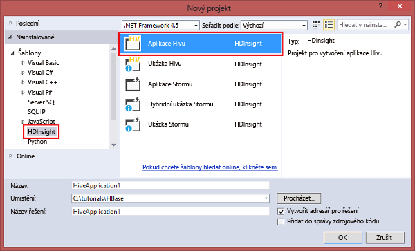

# Použití nástrojů Data Lake pro Visual Studio pro připojení ke službě Azure HDInsight a spouštění dotazů Hive

Naučte se používat nástroje Data Lake pro Visual Studio (označují se také jako nástroje Azure Data Lake nebo Stream Analytics pro Visual Studio) pro připojení ke clusterům Hadoop ve službě [Azure HDInsight](../hdinsight-hadoop-introduction.md) a odesílání dotazů Hive. 

Další informace o používání služby HDInsight najdete v tématech [Úvod do služby HDInsight](../hdinsight-hadoop-introduction.md) a [Začínáme se službou HDInsight](apache-hadoop-linux-tutorial-get-started.md). 

Další informace o připojení ke clusteru Storm najdete v tématu [Vývoj topologií C# pro Apache Storm ve službě HDInsight pomocí sady Visual Studio](../storm/apache-storm-develop-csharp-visual-studio-topology.md).

Pomocí nástrojů Data Lake pro Visual Studio můžete přistupovat ke službě Azure Data Lake Analytics i HDInsight. Informace o nástrojích Data Lake najdete v tématu [Vývoj skriptů U-SQL pomocí nástrojů Data Lake pro Visual Studio](../../data-lake-analytics/data-lake-analytics-data-lake-tools-get-started.md).

## Požadavky

Pro dokončení tohoto kurzu a používání nástrojů Data Lake pro Visual Studio potřebujete následující položky:

* Cluster Azure HDInsight. Informace vytvoření clusteru HDInsight najdete v tématu [Začínáme používat Hadoop ve službě Azure HDInsight](apache-hadoop-linux-tutorial-get-started.md). Pokud chcete spouštět interaktivní dotazy Hive, potřebujete cluster [HDInsight Interactive Query](../interactive-query/apache-interactive-query-get-started.md).
* Počítač s nainstalovanou sadou Visual Studio 2017, 2015 nebo 2013.
    
    > [!NOTE]
    > V současné době je dostupná pouze anglická verze nástrojů Data Lake pro Visual Studio.
    > 
    > 

## Instalace nebo aktualizace nástrojů Data Lake pro Visual Studio

### Instalace nástrojů Data Lake

Data Lake Tools se pro sadu Visual Studio 2017 instalují ve výchozím nastavení. V případě starších verzí sady Visual Studio můžete nástroje Data Lake nainstalovat pomocí [Instalace webové platformy](https://www.microsoft.com/web/downloads/platform.aspx). Zvolte verzi nástrojů Data Lake, která se shoduje s vaší verzí sady Visual Studio. 

### Instalace sady Visual Studio

Pokud nemáte nainstalovanou sadu Visual Studio, pomocí [Instalace webové platformy](https://www.microsoft.com/web/downloads/platform.aspx) nainstalujte nejnovější verze sad Visual Studio Community a Azure SDK:

### Aktualizace nástrojů

1. Otevřete sadu Visual Studio.
2. V nabídce **Nástroje** vyberte **Rozšíření a aktualizace**.
3. Rozbalte **Aktualizace** a pak vyberte **Nástroje Azure Data Lake a Stream Analytics** (pokud jsou nainstalované).

> [!NOTE]
>
> Pro připojení ke clusterům Interactive Query a spouštění interaktivních dotazů Hive můžete použít pouze nástroje Data Lake verze 2.3.0.0 nebo novější.

## Připojení k předplatným služby Azure
Pomocí nástrojů Data Lake pro Visual Studio se můžete připojit ke clusterům HDInsight, provádět některé základní operace správy a spouštět dotazy Hive.

> [!NOTE]
> Informace o připojení k obecnému clusteru Hadoop najdete v tématu [Zapisování a odesílání dotazů Hive pomocí sady Visual Studio](https://blogs.msdn.com/b/xiaoyong/archive/2015/05/04/how-to-write-and-submit-hive-queries-using-visual-studio.aspx).
> 
> 

Připojení k předplatnému Azure:

1. Otevřete sadu Visual Studio.
2. V nabídce **Zobrazení** vyberte **Průzkumník serveru**.
3. V Průzkumníku serveru rozbalte **Azure** a pak rozbalte **HDInsight**.
   
   > [!NOTE]
   > Mělo by se otevřít okno **Seznam úkolů HDInsight**. Pokud se toto okno nezobrazí, v nabídce **Zobrazení** vyberte **Další okna** a pak vyberte **Okno Seznam úkolů HDInsight**.  
   > 
   > 
4. Zadejte přihlašovací údaje svého předplatného Azure a pak vyberte **Přihlásit**. Ověření je nezbytné pouze v případě, že jste se ještě nikdy nepřipojili k předplatnému Azure ze sady Visual Studio na tomto počítači.
5. V Průzkumníku serveru se zobrazí seznam stávajících clusterů HDInsight. Pokud nemáte žádné clustery, můžete nějaký vytvořit pomocí webu Azure Portal, Azure PowerShellu nebo sady SDK HDInsight. Další informace najdete v tématu [Vytvoření clusterů HDInsight](../hdinsight-hadoop-provision-linux-clusters.md).
   
   
6. Rozbalte cluster služby HDInsight. Zobrazí se **Databáze Hive**, výchozí účet úložiště, propojené účty úložiště a **protokol služby Hadoop**. Entity můžete dále rozšířit.

Po připojení k předplatnému Azure můžete provádět následující úlohy.

Připojení k webu Azure Portal ze sady Visual Studio:

1. V Průzkumníku serveru vyberte **Azure** > **HDInsight**.
2. Klikněte pravým tlačítkem na cluster HDInsight a pak vyberte **Spravovat cluster na webu Azure Portal**.

Kladení otázek a poskytování zpětné vazby ze sady Visual Studio:

1. V nabídce **Nástroje** vyberte **HDInsight**.
2. Pokud chcete klást otázky, vyberte **Fórum MSDN**. Pokud chcete poskytnou zpětnou vazbu, vyberte **Váš názor**.

## Zkoumání propojených prostředků
V Průzkumníku serveru uvidíte výchozí účet úložiště a všechny propojené účty úložiště. Pokud rozbalíte výchozí účet úložiště, uvidíte kontejnery na účtu úložiště. Jsou označeny jako výchozí účet úložiště a výchozí kontejner. Kliknutím pravým tlačítkem na jakýkoli kontejner zobrazíte jeho obsah.

Po otevření kontejneru můžete k nahrání, odstranění a stažení objektů blob použít následující tlačítka:

## Spouštění interaktivních dotazů Hive
[Apache Hive](http://hive.apache.org) je infrastruktura datového skladu postavená na Hadoop. Hive se používá k souhrnům dat, dotazům a analýzám. Pomocí nástrojů Data Lake pro Visual Studio můžete spouštět dotazy Hive ze sady Visual Studio. Další informace o Hivu najdete v tématu [Použití Hivu se službou HDInsight](hdinsight-use-hive.md).

[Interactive Query](../interactive-query/apache-interactive-query-get-started.md) využívá [Hive s funkcí LLAP](https://cwiki.apache.org/confluence/display/Hive/LLAP) v Apache Hive 2.1. Interactive Query přináší interaktivitu do složitých dotazů ve stylu datového skladu nad rozsáhlými uloženými datovými sadami. Spouštění dotazů Hive v Interactive Query je v porovnání s tradičními dávkovými úlohami Hive mnohem rychlejší. Další informace najdete v části [Spouštění dávkových úloh Hive](#run-hive-batch-jobs).

> [!NOTE]
>
> Interaktivní dotazy Hive můžete spouštět pouze po připojení ke clusteru [HDInsight Interactive Query](../interactive-query/apache-interactive-query-get-started.md).

Pomocí nástrojů Data Lake pro Visual Studio můžete také zobrazit obsah úlohy Hive. Nástroje Data Lake pro Visual Studio shromažďují a zpřístupňují protokoly Yarn určitých úloh Hive.

### Zobrazení tabulky **hivesampletable**
Všechny clustery HDInsight obsahují výchozí vzorovou tabulkou Hive s názvem hivesampletable. Tato tabulka Hive definuje způsob výpisu tabulek Hive, zobrazení schémat tabulek a výpisu řádků v tabulce Hive.

Výpis tabulek Hive a zobrazení schématu tabulek Hive:

1. Pokud chcete zobrazit schéma tabulky, v **Průzkumníku serveru** vyberte **Azure** > **HDInsight**. Vyberte svůj cluster a pak vyberte **Databáze Hive** > **Výchozí** > **hivesampletable**.
2. Klikněte pravým tlačítkem na položku **hivesampletable** a pak kliknutím na tlačítko **Zobrazit prvních 100 řádků** zobrazíte seznam řádků. Jedná se o ekvivalent procesu spuštění následujícího dotazu Hive pomocí ovladače ODBC Hive:
   
     `SELECT * FROM hivesampletable LIMIT 100`
   
   Počet řádků můžete přizpůsobit.
   
   

### Vytváření tabulek Hive
K vytvoření tabulky Hive můžete použít grafické rozhraní (GUI) nebo dotazy Hive. Informace o použití dotazů Hive naleznete v tématu [Spouštění dotazů Hive](#run.queries).

Vytvoření tabulky Hive:

1. V **Průzkumníku serveru** vyberte **Azure** > **Clustery HDInsight**. Vyberte svůj cluster HDInsight a pak vyberte **Databáze Hive**.
2. Klikněte pravým tlačítkem na **výchozí** a pak vyberte **Vytvořit tabulku**.
3. Konfigurace tabulky.  
4. Vyberte **Vytvořit tabulku** a odešlete úlohu pro vytvoření nové tabulky Hive.
   
    

### Ověřování a spouštění dotazů Hive
Vytvářet a spouštět dotazy Hive můžete dvěma způsoby:

* Vytváření dotazů ad-hoc
* Vytvoření aplikace Hive

Vytváření, ověřování a spouštění dotazů ad hoc:

1. V **Průzkumníku serveru** vyberte **Azure** > **Clustery HDInsight**.
2. Klikněte pravým tlačítkem na cluster, ve kterém chcete spustit dotaz, a pak vyberte **Napsat dotaz Hive**.  
3. Zadejte dotazy Hive. 

    Editor Hive podporuje technologii IntelliSense. Nástroje Data Lake pro Visual Studio podporují načítání vzdálených metadat při úpravách skriptu Hive. Pokud například zadáte **SELECT * FROM**, IntelliSense vypíše všechny navrhované názvy tabulek. Pokud zadáte název tabulky, IntelliSense vypíše názvy sloupců. Nástroje podporují většinu příkazů DML Hive, poddotazů a integrovaných UDF.
   
    
   
    
   
   > [!NOTE]
   > IntelliSense navrhuje pouze metadata clusteru vybraného na panelu nástrojů služby HDInsight.
   > 
   
4. (Volitelné) Pokud chcete zkontrolovat chyby syntaxe skriptu, vyberte **Ověření skriptu**.
   
    
5. Vyberte **Odeslat** nebo **Odeslat (rozšířené)**. Pokud jste použili možnost rozšířeného odeslání, nakonfigurujte pro skript **Název úlohy**, **Argumenty**, **Další konfigurace** a **Stavový adresář**:
   
    
   
    Po odeslání úlohy se zobrazí okno **Souhrn úlohy Hive**.
   
    
6. Pomocí tlačítka **Aktualizovat** aktualizujte stav, dokud se stav úlohy nezmění na **Dokončeno**.
7. Výběrem odkazů v dolní části můžete zobrazit **Dotaz úlohy**, **Výstup úlohy**, **Protokol úlohy** nebo **Protokol Yarn**.

Vytvoření a spuštění řešení Hive:

1. V nabídce **Soubor** vyberte **Nový** a pak vyberte **Projekt**.
2. V levém podokně vyberte **HDInsight**. V prostředním podokně vyberte **Aplikace Hive**. Zadejte vlastnosti a pak vyberte **OK**.
   
    
3. V **Průzkumníku řešení** dvojím kliknutím otevřete skript **Script.hql**.
4. Pokud chcete skript Hive ověřit, vyberte tlačítko **Ověření skriptu**. Případně můžete kliknout pravým tlačítkem na skript v editoru Hive a pak vybrat **Ověření skriptu** v místní nabídce.

### Zobrazení úloh Hive
Můžete zobrazit dotazy úlohy, výstup úlohy, protokoly úlohy a protokoly Yarn pro úlohy Hive. Další informace najdete na předchozím snímku obrazovky.

V nejnovější verzi nástrojů můžete zobrazit obsah úloh Hive prostřednictvím shromažďování a zpřístupnění protokolů Yarn. Protokol Yarn vám může pomoci prozkoumat problémy s výkonem. Další informace o tom, jak služba HDInsight shromažďuje protokoly Yarn, najdete v tématu [Programový přístup k protokolům aplikace HDInsight](../hdinsight-hadoop-access-yarn-app-logs.md).

Zobrazení úloh Hive:

1. V **Průzkumníku serveru** rozbalte **Azure** a pak rozbalte **HDInsight**.
2. Klikněte pravým tlačítkem na cluster HDInsight a pak vyberte **Zobrazit úlohy**. Zobrazí se seznam úloh Hive, které se v clusteru spustily.  
3. Vyberte úlohu. V okně **Souhrn úlohy Hive** vyberte jednu z následujících možností:
    - **Dotaz úlohy**
    - **Výstup úlohy**
    - **Protokol úlohy**  
    - **Protokol Yarn**
   
    

### Rychlejší cesta ke spouštění Hive prostřednictvím HiveServer2
> [!NOTE]
> Tato funkce funguje pouze v clusteru v HDInsight verze 3.2 nebo novější.
 
Nástroje Data Lake pro Visual Studio dříve odesílaly úlohy Hive prostřednictvím [WebHCat](https://cwiki.apache.org/confluence/display/Hive/WebHCat) (také známé jako Templeton). Této metodě odesílání úloh Hive trvalo dlouhou dobu vrátit podrobnosti o úloze a informace o chybě.

Za účelem vyřešení tohoto problému s výkonem nástroje Data Lake pro Visual Studio dokážou obejít RDP/SSH a spouštět úlohy Hive přímo v clusteru prostřednictvím HiveServer2.

Kromě lepšího výkonu můžete díky této metodě také zobrazit Hive na grafech Apache Tez a v podrobnostech o úloze.

V clusteru v HDInsight verze 3.2 nebo novější se zobrazí tlačítko **Spustit prostřednictvím HiveServer2**:

Zobrazí se také protokoly streamované zpět v reálném čase. Pokud se dotaz Hive spustí v Tez, zobrazí se také grafy úloh.

### Spouštění dotazů prostřednictvím HiveServer2 vs. odesílání dotazů prostřednictvím WebHCat

I když při spouštění dotazů prostřednictvím HiveServer2 získáte řadu výhod v oblasti výkonu, tato metoda má několik omezení. Kvůli některým omezením není tato metoda vhodná pro produkční použití. 

Následující tabulka ukazuje rozdíly mezi spouštěním dotazů prostřednictvím HiveServer2 a odesíláním dotazů prostřednictvím WebHCat:

|  | Spuštění prostřednictvím HiveServer2 | Odeslání prostřednictvím WebHCat |
| --- | --- | --- |
| Provádění dotazů |Eliminuje režijní náklady v WebHCat (které spustí úlohu MapReduce s názvem TempletonControllerJob). |Pokud se dotaz provádí prostřednictvím WebHCat, spustí WebHCat úlohu MapReduce, která zavádí další latenci. |
| Zpětné protokolování datovými proudy |Téměř v reálném čase. |Protokoly spouštění úlohy jsou k dispozici pouze v případě, že je úloha dokončena. |
| Zobrazení historie úlohy |Pokud se dotaz provádí prostřednictvím HiveServer2, nezachová se jeho historie úloh (protokol úloh, výstup úloh). Aplikaci můžete zobrazit v uživatelském rozhraní Yarn s omezenými informacemi. |Pokud se dotaz provádí prostřednictvím WebHCat, zachová se jeho historie úloh (protokol úloh, výstup úloh). Historii úloh můžete zobrazit pomocí sady Visual Studio, sady HDInsight SDK nebo PowerShellu. |
| Zavření okna |Spouštění prostřednictvím HiveServer2 je *synchronní*. Pokud se okna zavřou, provádění dotazu se zruší. |Odesílání prostřednictvím WebHCat je *asynchronní*. Dotaz můžete odeslat prostřednictvím WebHCat a pak zavřít sadu Visual Studio. Kdykoliv se můžete vrátit a zobrazit výsledky. |

### Graf výkonu úlohy Tez Hive
V nástrojích Data Lake pro Visual Studio můžete zobrazit grafy výkonu úloh Hive spuštěných v prováděcím modulu Tez. Informace o povolení Tez najdete v tématu [Používání Hive ve službě HDInsight](hdinsight-use-hive.md). 

Po odeslání úlohy Hive v sadě Visual Studio zobrazí sada Visual Studio po dokončení úlohy graf. Možná budete muset vybrat tlačítko **Aktualizovat**, aby se zobrazil nejnovější stav úlohy.

> [!NOTE]
> Tato funkce je dostupná pouze pro cluster v HDInsight verze 3.2.4.593 nebo novější. Tato funkce funguje pouze u dokončených úloh. Abyste mohli tuto funkci využít, musíte také úlohu odeslat prostřednictvím WebHCat. Po provedení dotazu prostřednictvím HiveServer2 se zobrazí následující obrázek: 
> 
> 

Abychom vám pomohli lépe porozumět dotazu Hive, přidali jsme v této verzi zobrazení Operátora Hive. Pokud chcete zobrazit všechny operátory uvnitř vrcholu, dvakrát klikněte na vrcholy grafu úlohy. Můžete také ukázat na konkrétní operátor a zobrazit tak další podrobnosti o tomto operátoru.

### Zobrazení spouštění úlohy pro Hive na úlohách Tez
Pomocí zobrazení spouštění úlohy pro Hive na úlohách Tez můžete získat strukturované a vizualizované informace pro úlohy Hive. Můžete také získat další podrobnosti o úloze. Pokud dojde k problémům s výkonem, můžete pomocí tohoto zobrazení získat další podrobnosti o problému. Například můžete získat informace o tom, jak jednotlivé úlohy fungují, a podrobné informace o jednotlivých úlohách (zápis/čtení dat, naplánovaný/počáteční/konečný čas atd.). Na základě vizualizovaných informací můžete tyto informace využít k ladění konfigurací úloh nebo architektury systémy.

## Spouštění dávkových úloh Hive
Testování skriptu Hive na clusteru HDInsight může být časově náročné (s výjimkou clusteru Interactive Query). Tento proces může trvat několik minut nebo i déle. Nástroje Data Lake pro Visual Studio dokáží ověřovat skript Hive místně bez připojení k živému clusteru. Další informace o spouštění interaktivních dotazů najdete v části [Spouštění interaktivních dotazů Hive](#run-interactive-hive-queries).

Pomocí nástrojů Data Lake pro Visual Studio můžete díky shromažďování a zpřístupňování protokolů Yarn konkrétních úloh Hive zobrazit, co se nachází uvnitř úlohy Hive.

Další informace o spouštění dávkových úloh Hive najdete v části [Spouštění interaktivních dotazů Hive](#run-interactive-hive-queries). Informace v této části se týkají spouštění déletrvajících dávkových úloh Hive.

## Spouštění skriptů Pig
Pomocí nástrojů Data Lake pro Visual Studio můžete vytvářet a odesílat skripty Pig do clusterů HDInsight. Nejprve vytvořte projekt Pig ze šablony. Pak odešlete skript do clusterů HDInsight.

## Zpětná vazba a známé problémy
* Aktuálně se výsledky HiveServer2 zobrazují ve formátu prostého textu, což není ideální. Microsoft pracuje na opravě.
* Opravili jsme problém, kdy se nezobrazovaly výsledky začínající hodnotami null. Pokud vás tento problém blokuje, kontaktujte tým podpory.
* Skript HQL, který sada Visual Studio vytváří, je zakódovaný v závislosti na nastavení pro místní oblast uživatele. Skript se nespustí správně, pokud ho nahrajete do clusteru jako binární soubor.

## Další postup
V tomto článku jste zjistili, jak se pomocí balíčku nástrojů Data Lake pro Visual Studio připojit ke clusterům HDInsight ze sady Visual Studio. Také jste se naučili spustit dotaz Hive. Další informace najdete v těchto článcích:

* [Použití Hadoop Hive ve službě HDInsight](hdinsight-use-hive.md)
* [Začínáme používat Hadoop ve službě HDInsight](apache-hadoop-linux-tutorial-get-started.md)
* [Odesílání úloh Hadoop do služby HDInsight](submit-apache-hadoop-jobs-programmatically.md)
* [Analýza dat Twitteru pomocí softwaru Hadoop ve službě HDInsight](../hdinsight-analyze-twitter-data.md)

