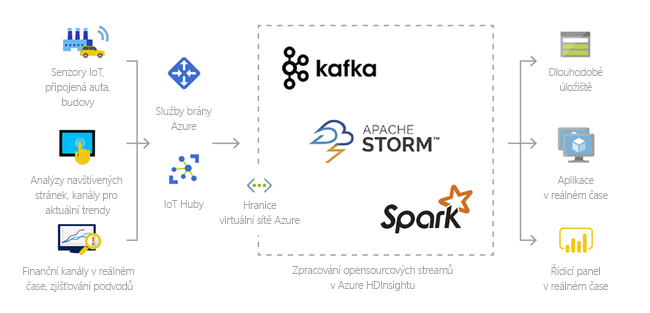
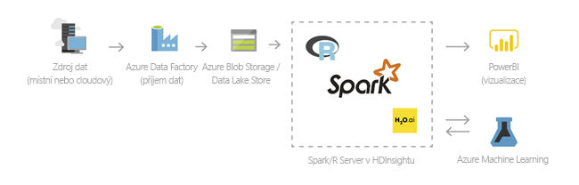
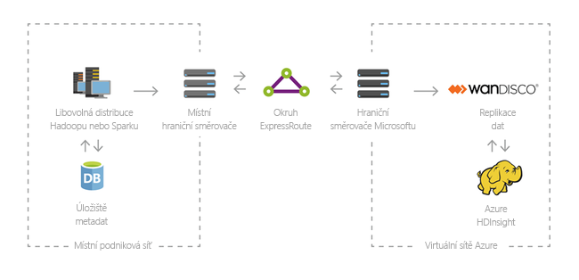

# Co je Azure HDInsight?

Azure HDInsight je spravovaná, plně spektrum Open Source služby pro analýzu v cloudu pro podniky. Můžete použít Open Source architektury, jako jsou Hadoop, Apache Spark, Apache Hive, LLAP, Apache Kafka, Apache Storm, R a další.

## Co je HDInsight a technologie Hadoop?

Azure HDInsight je cloudová distribuce komponent systému Hadoop. Azure HDInsight umožňuje snadné, rychlé a nákladově efektivní zpracování obrovského množství dat. Můžete využít nejoblíbenější opensourcové architektury, jako jsou Hadoop, Spark, Hive, LLAP, Kafka, Storm, R a další. Tyto architektury podporují širokou škálu scénářů, jako jsou ETL (extrakce, transformace a načítání), datové sklady, strojové učení a IoT.

Komponenty technologie Hadoop dostupné ve službě HDInsight najdete v tématu [Dostupné komponenty a verze ve službě HDInsight](./hdinsight-component-versioning.md). Další informace o platformě Hadoop v prostředí HDInsight najdete v tématu [Funkce Azure pro HDInsight](https://azure.microsoft.com/services/hdinsight/).

## Co jsou velké objemy dat?

Velké objemy dat se shromažďují v narůstajícím množství, s vyšší rychlostí a stále větší pestrostí formátů. Může jít o historické (tzn. uložené) objemy dat nebo o objemy dat v reálném čase (streamované ze zdroje). Informace o nejběžnějších případech použití velkých objemů dat najdete v části [Scénáře použití služby HDInsight](#scenarios-for-using-hdinsight).

## Proč mám použít Azure HDInsight?

Tato část uvádí schopnosti služby Azure HDInsight.

|Schopnost  |Description  |
|---------|---------|
|Nativní pro cloud     |     Azure HDInsight umožňuje vytvářet optimalizované clustery pro [Hadoop](./hadoop/apache-hadoop-linux-tutorial-get-started.md),  [Spark](./spark/apache-spark-jupyter-spark-sql.md),  [Interaktivní dotazy (LLAP)](./interactive-query/apache-interactive-query-get-started.md),  [Kafka](./kafka/apache-kafka-get-started.md),  [Storm](./storm/apache-storm-tutorial-get-started-linux.md),  [HBase](./hbase/apache-hbase-tutorial-get-started-linux.md) a  [ML Services](./r-server/r-server-overview.md) v Azure. HDInsight poskytuje také komplexní smlouvu SLA pro všechny vaše produkční úlohy.  |
|Škálovatelnost a nízké náklady     | HDInsight vám umožní [škálovat](./hdinsight-administer-use-portal-linux.md#scale-clusters)   úlohy nahoru nebo dolů.Můžete snížit náklady tím, že [vytvoříte clustery na vyžádání](./hdinsight-hadoop-create-linux-clusters-adf.md)   a platíte jenom za to, co využijete. Můžete také sestavovat datové kanály pro zprovoznění úloh. Oddělený výpočetní výkon a úložiště poskytují lepší výkon a flexibilitu. |
|Bezpečnost a dodržování předpisů    | HDInsight umožňuje chránit datové prostředky vašeho podniku pomocí služby [Azure Virtual Network](./hdinsight-plan-virtual-network-deployment.md), [šifrování](./hdinsight-hadoop-create-linux-clusters-with-secure-transfer-storage.md) a integrace se službou [Azure Active Directory](./domain-joined/hdinsight-security-overview.md). HDInsight také splňuje nejoblíbenější oborové a vládní [standardy dodržování předpisů](https://azure.microsoft.com/overview/trusted-cloud).        |
|Monitorování    | Azure HDInsight se integruje s [protokoly Azure monitor](./hdinsight-hadoop-oms-log-analytics-tutorial.md) a poskytuje jedno rozhraní, se kterým můžete monitorovat všechny clustery.        |
|Globální dostupnost | HDInsight je k dispozici ve více [oblastech](https://azure.microsoft.com/regions/services/)   než jakákoli jiná nabídka analýzy velkých objemů dat. Služba Azure HDInsight je dostupná také pro Azure Government, Čínu a Německo a umožňuje tak splnit požadavky vašeho podniku v klíčových suverénních oblastech. |  
|Produktivita     |  Azure HDInsight umožňuje používat bohaté nástroje zvyšující produktivitu pro Hadoop a Spark s oblíbeným vývojovým prostředím. Mezi tato vývojová prostředí patří [Visual Studio](./hadoop/apache-hadoop-visual-studio-tools-get-started.md), [VSCode](./hdinsight-for-vscode.md), [Eclipse](./spark/apache-spark-eclipse-tool-plugin.md) a [IntelliJ](./spark/apache-spark-intellij-tool-plugin.md) pro zajištění podpory jazyků Scala, Python, R, Java a .NET. Odborníci přes data můžou také spolupracovat s využitím oblíbených poznámkových bloků, jako jsou [Jupyter](./spark/apache-spark-jupyter-notebook-kernels.md) a [Zeppelin](./spark/apache-spark-zeppelin-notebook.md).    |
|Rozšiřitelnost     |  Clustery HDInsight můžete rozšířit instalací komponent (Hue, Presto atd.) pomocí [akcí skriptů](./hdinsight-hadoop-customize-cluster-linux.md), [přidáním hraničních uzlů](./hdinsight-apps-use-edge-node.md) nebo [integrací s dalšími aplikacemi certifikovanými pro práci s velkými objemy dat](./hdinsight-apps-install-applications.md). HDInsight umožňuje bezproblémovou integraci s nejoblíbenějšími řešeními pro velké objemy dat prostřednictvím nasazení [jedním kliknutím](https://azure.microsoft.com/services/hdinsight/partner-ecosystem/).|

## Scénáře použití služby HDInsight

Azure HDInsight je možné použít v nejrůznějších scénářích velkých objemů dat. Může se jednat o historická data (data, která jsou už shromážděná a uložená) nebo o data v reálném čase (data proudící přímo ze zdroje). Scénáře zpracování těchto dat můžeme shrnout do následujících kategorií:

### Dávkové zpracování (ETL)

Extrakce, transformace a načítání (ETL) je proces, při kterém se nestrukturovaná nebo strukturovaná data extrahují z heterogenních zdrojů dat. Potom se transformují do strukturovaného formátu a načítají do úložiště dat. Transformovaná data je možné použít pro datové vědy nebo datové sklady.

### Datové sklady

Pomocí služby HDInsight můžete provádět interaktivní dotazy v petabajtovém měřítku nad strukturovanými i nestrukturovanými daty v jakémkoli měřítku. Můžete také sestavovat modely, které je propojí s nástroji BI. Další informace najdete v [tomto příběhu zákazníka](https://customers.microsoft.com/story/milliman).

### Internet věcí (IoT)

Pomocí služby HDInsight můžete zpracovávat streamovaná data přijímaná v reálném čase z různých druhů zařízení. Pokud chcete získat další informace, [přečtěte si tento blogový příspěvek z Azure, který oznamuje verzi Public Preview pro Apache Kafka v HDInsightu se Spravovanými disky Azure](https://azure.microsoft.com/blog/announcing-public-preview-of-apache-kafka-on-hdinsight-with-azure-managed-disks/).

### Datové vědy

Pomocí služby HDInsight můžete sestavovat aplikace, které z dat extrahují důležité informace. Navíc můžete pomocí služby Azure Machine Learning předvídat budoucí trendy pro vaši firmu. Další informace najdete v [tomto příběhu zákazníka](https://customers.microsoft.com/story/pros).

### Hybridní

Pomocí služby HDInsight můžete rozšířit svou stávající místní infrastrukturu velkých dat do Azure a využívat možnosti pokročilých analýz v cloudu.

## Typy clusterů ve službě HDInsight

HDInsight zahrnuje specifické typy clusterů a možnosti přizpůsobení clusterů, jako je například možnost přidávání komponent, nástrojů a jazyků. HDInsight nabízí následující typy clusteru:

|Typ clusteru | Description |
|---|---|
|[Apache Hadoop](./hadoop/apache-hadoop-introduction.md)|Rozhraní, které používá HDFS, správu prostředků PŘÍZe a jednoduchý programovací model MapReduce pro souběžné zpracování a analýzu dat Batch.|
|[Apache Spark](./spark/apache-spark-overview.md)|Open source architektura paralelního zpracování, která podporuje zpracování v paměti pro zvýšení výkonu aplikací pro analýzu velkých objemů dat. Podívejte [se, co je Apache Spark v HDInsight?](./spark/apache-spark-overview.md).|
|[Apache HBase](./hbase/apache-hbase-overview.md)|Databáze NoSQL postavená na systému Hadoop, která poskytuje náhodný přístup a silnou konzistenci pro velké objemy nestrukturovaných a částečně strukturovaných dat – potenciálně miliardy řádků krát miliony sloupců. Přečtěte si téma [Co je HBase v HDInsight?](./hbase/apache-hbase-overview.md)|
|[Služby ML](./r-server/r-server-overview.md)|Server pro hostování a správu paralelních, distribuovaných procesů R. Poskytuje datovým vědcům, statistikům a programátorům v R přístup ke škálovatelným, distribuovaným analytickým metodám služby HDInsight na vyžádání. Viz [Přehled ML Services ve službě HDInsight](./r-server/r-server-overview.md).|
|[Apache Storm](./storm/apache-storm-overview.md)|Distribuovaný výpočetní systém v reálném čase pro rychlé zpracování velkých proudů dat. Storm je poskytován jako spravovaný cluster v prostředí HDInsight. Viz [Analýza dat snímačů v reálném čase pomocí nástrojů Storm a Hadoop](./storm/apache-storm-overview.md).|
|[Interaktivní dotaz Apache](./interactive-query/apache-interactive-query-get-started.md)|Ukládání do mezipaměti v paměti pro interaktivní a rychlejší dotazy na podregistr. Viz [Použití Interactive Query ve službě HDInsight](./interactive-query/apache-interactive-query-get-started.md).|
|[Apache Kafka](./kafka/apache-kafka-introduction.md)|Open Source platforma, která se používá k sestavování kanálů a aplikací streamování dat. Kafka také poskytuje funkce propojující fronty zpráv, pomocí kterých můžete publikovat datové streamy a přihlašovat se k jejich odběru. Viz [Úvod k Apache Kafka ve službě HDInsight](./kafka/apache-kafka-introduction.md).|

## Opensourcové komponenty ve službě HDInsight

Azure HDInsight umožňuje vytvářet clustery s open source rozhraními, jako jsou Hadoop, Spark, podregistr, LLAP, Kafka, vyplavení, HBA a R. Tyto clustery ve výchozím nastavení přicházejí k ostatním otevřeným zdrojovým komponentám, které jsou součástí clusteru, jako je [Apache Ambari](https://github.com/apache/ambari/blob/trunk/ambari-server/docs/api/v1/index.md), [Avro](https://avro.apache.org/docs/current/spec.html), [Apache Hive](https://hive.apache.org), [HCatalog](https://cwiki.apache.org/confluence/display/Hive/HCatalog/), [apache Mahout](https://mahout.apache.org/), [Apache Hadoop MapReduce](https://hadoop.apache.org/docs/current/hadoop-mapreduce-client/hadoop-mapreduce-client-core/MapReduceTutorial.html), [Apache Hadoop nitě](https://hadoop.apache.org/docs/current/hadoop-yarn/hadoop-yarn-site/YARN.html), [Apache Phoenix](https://phoenix.apache.org/), [Apache prasete](https://pig.apache.org/), [Apache Sqoop](https://sqoop.apache.org/), [Apache tez](https://tez.apache.org/), [Apache Oozie](https://oozie.apache.org/), [Apache Zookeeper](https://zookeeper.apache.org/).  

## Programovací jazyky v prostředí HDInsight

Clustery HDInsight, včetně clusterů Spark, HBase, Kafka, Hadoop a dalších, podporují celou řadu programovacích jazyků. Některé z nich ale nejsou ve výchozím nastavení nainstalované. Pro knihovny, moduly nebo balíčky, které nejsou nainstalované ve výchozím nastavení, [použijte k instalaci komponenty akci skriptu](./hdinsight-hadoop-script-actions-linux.md).

|Programovací jazyk  |Informace  |
|---------|---------|
|Výchozí podpora programovacích jazyků     | Ve výchozím nastavení podporují clustery prostředí HDInsight tyto jazyky:<ul><li>Java</li><li>Python</li><li>.NET</li><li>Přejít</li></ul>  |
|Jazyky Java virtual machine (JVM)     | V prostředí Java Virtual Machine (JVM) je možné spouštět celou řadu jiných jazyků, než je Java. Pokud ale některé z těchto jazyků spustíte, může být v clusteru potřeba nainstalovat další součásti. Clustery prostředí HDInsight podporují následující jazyky založené na JVM: <ul><li>Clojure</li><li>Jython (Python pro jazyk Java)</li><li>Scala</li></ul>     |
|Jazyky pro Hadoop     | Clustery HDInsight podporují následující jazyky, které jsou určené konkrétně pro technologii Hadoop: <ul><li>Pig Latin pro úlohy Pig</li><li>HiveQL pro úlohy Hive a SparkSQL</li></ul>        |

## Vývojářské nástroje pro HDInsight

Vývojářské nástroje pro HDInsight, včetně nástrojů IntelliJ, Eclipse, Visual Studio Code a Visual Studio, můžete díky bezproblémové integraci s Azure použít k vytváření a odesílání úloh a dotazů na data HDInsight.

* [Sada Azure Toolkit pro IntelliJ](./spark/apache-spark-intellij-tool-plugin.md)

* [Azure toolkit for Eclipse](./spark/apache-spark-eclipse-tool-plugin.md)

* [Azure HDInsight Tools pro VS Code](./hdinsight-for-vscode.md)

* [Nástroje Azure Data Lake pro Visual Studio](./hadoop/apache-hadoop-visual-studio-tools-get-started.md)

## Business intelligence ve službě HDInsight

Známé nástroje business intelligence (BI) načítají, analyzují a vykazují data integrovaná v prostředí HDInsight buď pomocí doplňku Power Query, nebo ovladače Microsoft Hive ODBC Driver:

* [Apache Spark BI s využitím nástrojů pro vizualizaci dat ve službě Azure HDInsight](./spark/apache-spark-use-bi-tools.md)

* [Vizualizace Apache Hive dat pomocí Microsoft Power BI ve službě Azure HDInsight](./hadoop/apache-hadoop-connect-hive-power-bi.md)

* [Vizualizace dat Interactive Query Hive pomocí Power BI ve službě Azure HDInsight](./interactive-query/apache-hadoop-connect-hive-power-bi-directquery.md)

* [Připojení Excelu k Apache Hadoop s](./hadoop/apache-hadoop-connect-excel-power-query.md) využitím Power Query (vyžaduje Windows)

* [Připojení Excelu k Apache Hadoop pomocí Microsoft Hive ODBC Driver](./hadoop/apache-hadoop-connect-excel-hive-odbc-driver.md) (vyžaduje Windows)

## Zasídlí dat v oblasti 

Spark, Hadoop, LLAP, Hadoop a MLService neukládají zákaznická data, aby tyto služby automaticky splňovaly požadavky na umístění dat v regionu, včetně těch, které jsou uvedené v [Centru zabezpečení](https://azuredatacentermap.azurewebsites.net/). 

Kafka a HBA ukládají zákaznická data. Tato data se automaticky ukládají pomocí Kafka a HBA v jedné oblasti, takže tato služba splňuje požadavky na umístění dat v rámci oblasti, včetně těch, které jsou uvedené v [Centru zabezpečení](https://azuredatacentermap.azurewebsites.net/). 

Známé nástroje business intelligence (BI) načítají, analyzují a vykazují data, která jsou integrovaná do HDInsight, pomocí Power Queryho doplňku nebo Microsoft Hive ODBC Driver.

## Další kroky

* [Vytvoření clusteru Apache Hadoop v HDInsight](./hadoop/apache-hadoop-linux-create-cluster-get-started-portal.md)
* [Vytvoření clusteru Apache Spark – portál](./spark/apache-spark-jupyter-spark-sql-use-portal.md)
* [Plánování virtuální sítě pro Azure HDInsight](hdinsight-plan-virtual-network-deployment.md)
* [Podnikové zabezpečení ve službě Azure HDInsight](./domain-joined/hdinsight-security-overview.md)
