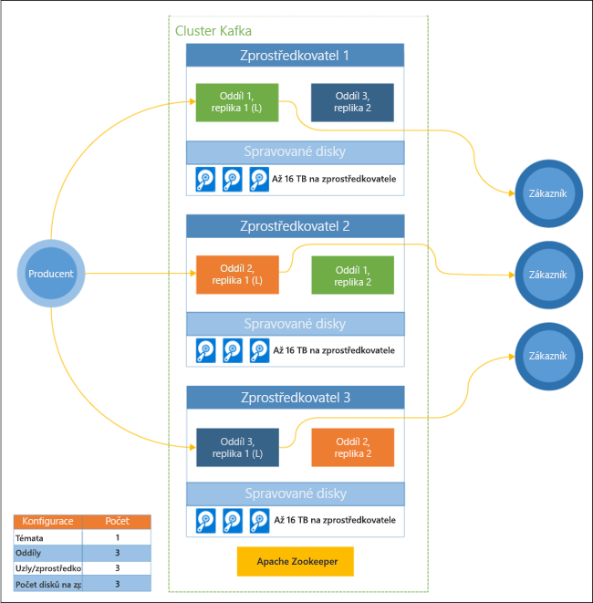

# Co je Apache Kafka ve službě HDInsight?

[Apache Kafka](https://kafka.apache.org) je open source distribuovaná streamovací platforma, kterou lze použít k vytváření aplikací a kanálů pro streamování dat v reálném čase. Kafka také poskytuje funkci pro zprostředkování zpráv podobnou frontě zpráv, ve které můžete publikovat pojmenované datové proudy a přihlásit se k jejich odběru. 

Tady jsou konkrétní charakteristiky systému Kafka ve službě HDInsight:

* Jedná se o spravovanou službu, která poskytuje zjednodušený proces konfigurace. Výsledkem je konfigurace otestovaná a podporovaná Microsoftem.

* Microsoft poskytuje smlouvu o úrovni služeb (SLA) zajišťující 99,9% dostupnost platformy Kafka. Další informace najdete v dokumentu [Informace o smlouvě SLA pro službu HDInsight](https://azure.microsoft.com/support/legal/sla/hdinsight/v1_0/).

* Jako záložní úložiště pro platformu Kafka se používá služba Azure Managed Disks. Managed Disks může pro každého zprostředkovatele Kafka poskytovat až 16 TB úložiště. Informace o konfiguraci spravovaných disků s platformou Kafka na HDInsight naleznete v tématu [zvýšení škálovatelnosti systému Apache Kafka v HDInsight](apache-kafka-scalability.md).

    Další informace o spravovaných discích najdete v tématu [Azure Managed Disks](../../virtual-machines/windows/managed-disks-overview.md).

* Systém Kafka byl navržený s jednorozměrným pohledem na stojan. Azure rozděluje stojan do dvou dimenzí – aktualizační domény a domény selhání. Microsoft poskytuje nástroje, které obnovují rovnováhu oddílů a replik platformy Kafka mezi aktualizačními doménami a doménami selhání. 

    Další informace najdete v tématu [vysoké dostupnosti s využitím Apache Kafka v HDInsight](apache-kafka-high-availability.md).

* HDInsight umožňuje změnit počet pracovních uzlů (které jsou hostiteli zprostředkovatele Kafka) po vytvoření clusteru. Škálování lze provádět z webu Azure Portal, prostředí Azure PowerShell a dalších rozhraní správy Azure. V případě platformy Kafka byste po operacích škálování měli obnovit rovnováhu replik oddílů. Díky vyrovnání rovnováhy oddílů může platforma Kafka využívat nový počet pracovních uzlů.

    Další informace najdete v tématu [vysoké dostupnosti s využitím Apache Kafka v HDInsight](apache-kafka-high-availability.md).

* Protokoly Azure monitoru lze použít k monitorování systému Kafka v HDInsight. Azure Monitor protokoly zařízení Surface úrovni informace o virtuálním počítači, jako je například disk a metrik síťového rozhraní a metriky JMX z Kafka.

    Další informace najdete v tématu [Analýza protokolů pro Apache Kafka v HDInsight](apache-kafka-log-analytics-operations-management.md).

### Apache Kafka v HDInsight architektury

Následující diagram ukazuje obvyklou konfiguraci platformy Kafka s využitím skupin příjemců, dělení a replikace. Díky tomu nabízí paralelní čtení událostí s odolností proti chybám:

Apache ZooKeeper spravuje stav clusteru Kafka. Služba ZooKeeper je navržená pro souběžné a odolné transakce s nízkou latencí. 

Kafka ukládá záznamy (data) v **tématech**. Záznamy jsou vytvářeny **producenty** a spotřebovávány **konzumenty**. Producenti odesílají záznamy do **zprostředkovatelů** Kafka. Každý pracovní uzel v clusteru HDInsight je zprostředkovatelem Kafka. 

Témata rozdělují záznamy do oddílů napříč zprostředkovateli. Při využívání záznamů můžete dosáhnout paralelního zpracování dat díky použití až jednoho konzumenta pro každý oddíl.

K duplikaci oddílů mezi uzly se využívá replikace, která zajišťuje ochranu před výpadky uzlů (zprostředkovatelů). V diagramu je oddíl s označením *(L)* vedoucím daného oddílu. Provoz producenta se směruje do vedoucích jednotlivých uzlů pomocí stavu, který spravuje ZooKeeper.

## Proč používat Apache Kafka v HDInsight?

Tady jsou běžné úlohy a postupy, které je možné provádět s využitím systému Kafka ve službě HDInsight:

* **Replikace dat platformy Apache Kafka**: Kafka poskytuje nástroj MirrorMaker, který replikuje data mezi clustery Kafka.

    Informace o používání nástroje MirrorMaker najdete v tématu [témata replikovat Apache Kafka s Apache Kafka v HDInsight](apache-kafka-mirroring.md).

* **Vzorec zasílání zpráv publikování a odběru**: Kafka poskytuje rozhraní API autory k publikování záznamů v tématech Kafka. Rozhraní API pro příjemce se používá při přihlášení k odběru tématu.

    Další informace najdete v tématu [Začínáme s Apache Kafka v HDInsight](apache-kafka-get-started.md).

* **Zpracování Stream**: Kafka se často používá společně s Apache Storm nebo Spark ke zpracování datových proudů v reálném čase. Kafka 0.10.0.0 (HDInsight verze 3.5 a 3.6) zavedla rozhraní API pro streamování, které umožňuje vytvářet řešení streamování bez potřeby Stormu nebo Sparku.

    Další informace najdete v tématu [Začínáme s Apache Kafka v HDInsight](apache-kafka-get-started.md).

* **Horizontální škálování**: Kafka rozděluje datové proudy mezi uzly v clusteru HDInsight. Procesy příjemců můžou být přidružené k jednotlivým oddílům pro zajištění vyrovnávání zatížení při využívání záznamů.

    Další informace najdete v tématu [Začínáme s Apache Kafka v HDInsight](apache-kafka-get-started.md).

* **Doručení v daném pořadí**: V rámci každého oddílu se záznamy ukládají v datovém proudu v pořadí, v jakém byly přijaty. Přidružením jednoho procesu příjemce na oddíl můžete zajistit zpracování záznamů v daném pořadí.

    Další informace najdete v tématu [Začínáme s Apache Kafka v HDInsight](apache-kafka-get-started.md).

## Případy použití

* **Zasílání zpráv**: Protože podporuje publikování – vzorec zpráva odběru, Kafka se často používá jako zprostředkovatel zpráv.

* **Sledování aktivit**: Protože Kafka poskytuje protokolování záznamů v daném pořadí, můžete použít ke sledování a opětovnému vytvoření aktivit. Například akcí uživatelů na webu nebo v aplikaci.

* **Agregace**: Zpracování datových proudů můžete agregovat informace z různých datových proudů zkombinovat a centralizovat je v podobě provozních dat.

* **Transformace**: Pomocí zpracování datových proudů můžete kombinovat a vylepšit data z více vstupních témat do jedné nebo několika výstupních témat.

## Další postup

Následující odkazy popisují používání Apache Kafka ve službě HDInsight:

* [Rychlé zprovoznění: Vytvoření Apache Kafka v HDInsight](apache-kafka-get-started.md)

* [Kurz: Použití Apache Sparku s využitím Apache Kafka v HDInsight](../hdinsight-apache-spark-with-kafka.md)

* [Kurz: Použití Apache Stormu s Apache Kafka v HDInsight](../hdinsight-apache-storm-with-kafka.md)
