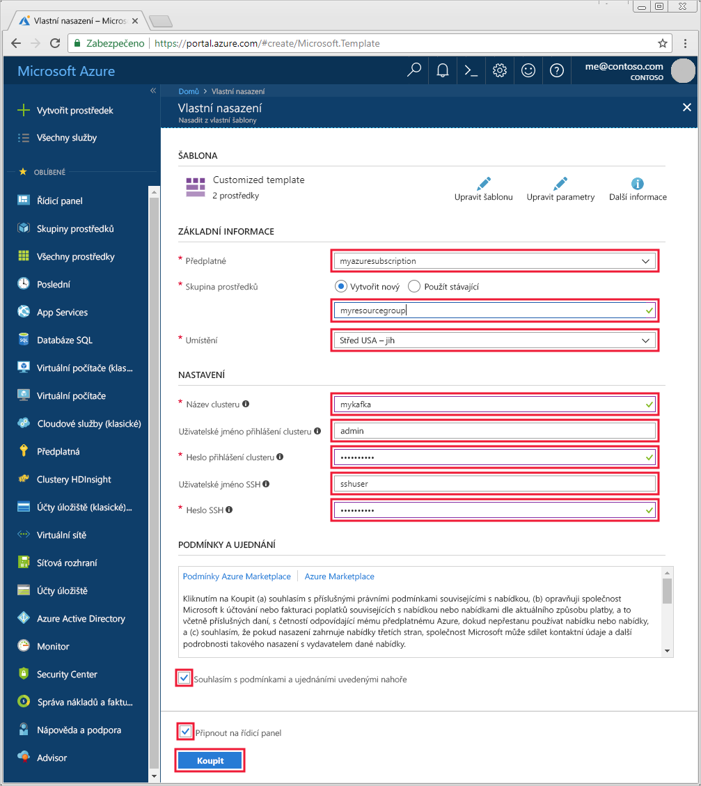

# <a name="quickstart-create-a-kafka-on-hdinsight-cluster"></a>Rychlý start: Vytvoření systému Kafka v clusteru HDInsight

Kafka je open source distribuovaná streamovací platforma. Často se používá jako zprostředkovatel zpráv, protože nabízí funkce podobné frontě pro publikování a odběr zpráv. 

V tomto rychlém startu se dozvíte, jak vytvořit cluster [Apache Kafka](https://kafka.apache.org) pomocí šablony Azure Resource Manager. Dozvíte se také, jak používat obsažené nástroje k odesílání a příjmu zpráv pomocí platformy Kafka.

[!INCLUDE [delete-cluster-warning](../../../includes/hdinsight-delete-cluster-warning.md)]

> [!IMPORTANT]
> Rozhraní API Kafka je přístupné jenom pro prostředky ve stejné virtuální síti. V tomto rychlém startu budete ke clusteru přistupovat přímo pomocí SSH. Pokud chcete k platformě Kafka připojit jiné služby, sítě nebo virtuální počítače, musíte nejprve vytvořit virtuální síť a pak v síti vytvořit prostředky.
>
> Další informace najdete v dokumentu [Připojení k platformě Kafka pomocí virtuální sítě](apache-kafka-connect-vpn-gateway.md).

## <a name="prerequisites"></a>Požadavky

* Předplatné Azure. Pokud ještě nemáte předplatné Azure, vytvořte si [bezplatný účet](https://azure.microsoft.com/free/?WT.mc_id=A261C142F) před tím, než začnete.

* Klient SSH. V krocích v tomto dokumentu se pro připojení ke clusteru používá SSH.

    Příkaz `ssh` je ve výchozím nastavení k dispozici v systémech Linux, Unix a macOS. Ve Windows 10 nainstalujte příkaz `ssh` některým z těchto způsobů:

    * Použijte [Azure Cloud Shell](https://docs.microsoft.com/azure/cloud-shell/quickstart). Cloud Shell poskytuje příkaz `ssh` a dá se nakonfigurovat tak, aby jako prostředí používal Bash nebo PowerShell.

    * [Nainstalujte podsystém Windows pro Linux](https://docs.microsoft.com/windows/wsl/install-win10). Distribuce Linuxu dostupné v Microsoft Storu poskytují příkaz `ssh`.

    > [!IMPORTANT]
    > Kroky v tomto dokumentu předpokládají, že používáte některého z klientů SSH uvedených výše. Pokud používáte jiného klienta SSH a narazíte na potíže, zkuste najít řešení v dokumentaci pro vašeho klienta SSH.
    >
    > Další informace najdete v dokumentu [Použití SSH se službou HDInsight](../hdinsight-hadoop-linux-use-ssh-unix.md).

## <a name="create-a-kafka-cluster"></a>Vytvoření clusteru Kafka

1. Kliknutím na následující obrázek otevřete šablonu na portálu Azure Portal.

    <a href="https://portal.azure.com/#create/Microsoft.Template/uri/https%3A%2F%2Fraw.githubusercontent.com%2FAzure-Samples%2Fhdinsight-kafka-java-get-started%2Fmaster%2Fazuredeploy.json" target="_blank"></a>

2. K vytvoření clusteru Kafka použijte tyto hodnoty:

    | Vlastnost | Hodnota |
    | --- | --- |
    | Předplatné | Vaše předplatné Azure. |
    | Skupina prostředků | Skupina prostředků, ve které se cluster vytvoří. |
    | Umístění | Oblast Azure, ve které se cluster vytvoří. |
    | Název clusteru | Název clusteru Kafka. |
    | Uživatelské jméno přihlášení clusteru | Název účtu používaného pro přihlášení ke službám založeným na protokolu HTTPs hostovaným v clusteru. |
    | Heslo přihlášení clusteru | Heslo pro přihlašovací uživatelské jméno. |
    | Uživatelské jméno SSH | Uživatelské jméno SSH. Tento účet má přístup ke clusteru pomocí SSH. |
    | Heslo SSH | Heslo uživatele SSH. |

    

3. Vyberte **Souhlasím s podmínkami a ujednáními uvedenými nahoře**, vyberte **Připnout na řídicí panel** a potom klikněte na **Koupit**.

> [!NOTE]
> Vytvoření clusteru trvá přibližně 20 minut.

## <a name="connect-to-the-cluster"></a>Připojení ke clusteru

1. Pro připojení k primárnímu hlavnímu uzlu clusteru Kafka použijte následující příkaz. Nahraďte `sshuser` uživatelským jménem SSH. Nahraďte `mykafka` názvem clusteru Kafka.

    ```bash
    ssh sshuser@mykafka-ssh.azurehdinsight.net
    ```

2. Když se ke clusteru poprvé připojíte, ve vašem klientovi SSH se může zobrazit upozornění na nemožnost potvrzení pravosti hostitele. Po zobrazení výzvy zadejte __yes__ (ano) a pak stisknutím klávesy __Enter__ přidejte hostitele na seznam důvěryhodných serverů vašeho klienta SSH.

3. Po zobrazení výzvy zadejte heslo uživatele SSH.

Po připojení se zobrazí informace podobné tomuto textu:

```text
Authorized uses only. All activity may be monitored and reported.
Welcome to Ubuntu 16.04.4 LTS (GNU/Linux 4.13.0-1011-azure x86_64)

 * Documentation:  https://help.ubuntu.com
 * Management:     https://landscape.canonical.com
 * Support:        https://ubuntu.com/advantage

  Get cloud support with Ubuntu Advantage Cloud Guest:
    http://www.ubuntu.com/business/services/cloud

83 packages can be updated.
37 updates are security updates.


Welcome to Kafka on HDInsight.

Last login: Thu Mar 29 13:25:27 2018 from 108.252.109.241
ssuhuser@hn0-mykafk:~$
```

## <a id="getkafkainfo"></a>Získání informací o hostiteli Zookeeper a Broker

Při práci s platformou Kafka musíte znát hostitele *Zookeeper* a *Broker*. Tito hostitelé se používají s rozhraním Kafka API s mnohými z nástrojů, které se s tímto systémem dodávají.

V této části získáte informace o hostiteli z rozhraní REST API Ambari v clusteru.

1. Připojte se ke clusteru přes SSH a následujícím příkazem nainstalujte nástroj `jq`. Tento nástroj slouží k parsování dokumentů JSON a je užitečný při načítání informací o hostiteli:
   
    ```bash
    sudo apt -y install jq
    ```

2. K nastavení proměnné prostředí na název clusteru použijte následující příkaz:

    ```bash
    read -p "Enter the Kafka on HDInsight cluster name: " CLUSTERNAME
    ```

    Po zobrazení výzvy zadejte název clusteru Kafka.

3. K nastavení proměnné prostředí s použitím informací o hostiteli Zookeeper použijte následující příkaz:

    ```bash
    export KAFKAZKHOSTS=`curl -sS -u admin -G https://$CLUSTERNAME.azurehdinsight.net/api/v1/clusters/$CLUSTERNAME/services/ZOOKEEPER/components/ZOOKEEPER_SERVER | jq -r '["\(.host_components[].HostRoles.host_name):2181"] | join(",")' | cut -d',' -f1,2`
    ```

    Po zobrazení výzvy zadejte heslo účtu pro přihlášení ke clusteru (ne účtu SSH).

    > [!NOTE]
    > Tento příkaz načte všechny hostitele Zookeeper a pak vrátí jenom první dva záznamy. Je to proto, že chcete určitou redundanci pro případ, že jeden hostitel bude nedosažitelný.

4. Pokud chcete ověřit správné nastavení proměnné prostředí, použijte následující příkaz:

    ```bash
     echo '$KAFKAZKHOSTS='$KAFKAZKHOSTS
    ```

    Tento příkaz by měl vrátit informace podobné následujícímu textu:

    `zk0-kafka.eahjefxxp1netdbyklgqj5y1ud.ex.internal.cloudapp.net:2181,zk2-kafka.eahjefxxp1netdbyklgqj5y1ud.ex.internal.cloudapp.net:2181`

5. K nastavení proměnné prostředí s použitím informací o hostiteli zprostředkovatele Kafka použijte následující příkaz:

    ```bash
    export KAFKABROKERS=`curl -sS -u admin -G https://$CLUSTERNAME.azurehdinsight.net/api/v1/clusters/$CLUSTERNAME/services/KAFKA/components/KAFKA_BROKER | jq -r '["\(.host_components[].HostRoles.host_name):9092"] | join(",")' | cut -d',' -f1,2`
    ```

    Po zobrazení výzvy zadejte heslo účtu pro přihlášení ke clusteru (ne účtu SSH).

6. Pokud chcete ověřit správné nastavení proměnné prostředí, použijte následující příkaz:

    ```bash   
    echo '$KAFKABROKERS='$KAFKABROKERS
    ```

    Tento příkaz by měl vrátit informace podobné následujícímu textu:
   
    `wn1-kafka.eahjefxxp1netdbyklgqj5y1ud.cx.internal.cloudapp.net:9092,wn0-kafka.eahjefxxp1netdbyklgqj5y1ud.cx.internal.cloudapp.net:9092`

## <a name="manage-kafka-topics"></a>Správa témat Kafka

Kafka ukládá datové proudy do *témat*. Témata můžete spravovat pomocí nástroje `kafka-topics.sh`.

* **K vytvoření tématu** použijte tento příkaz v připojení SSH:

    ```bash
    /usr/hdp/current/kafka-broker/bin/kafka-topics.sh --create --replication-factor 3 --partitions 8 --topic test --zookeeper $KAFKAZKHOSTS
    ```

    Tento příkaz se připojí k hostiteli Zookeeper s použitím informací uložených v proměnné `$KAFKAZKHOSTS`. Pak vytvoří téma Kafka s názvem **test**. 

    * Data uložená v tomto tématu jsou rozdělená mezi osm oddílů.

    * Každý oddíl se replikuje mezi tři pracovní uzly v clusteru.

        > [!IMPORTANT]
        > Pokud jste vytvořili cluster v oblasti Azure, která poskytuje tři domény selhání, použijte faktor replikace 3. Jinak použijte faktor replikace 4.
        
        V oblastech se třemi doménami selhání faktor replikace 3 umožní rozložení replik mezi domény selhání. V oblastech se dvěma doménami selhání faktor replikace 4 rozloží repliky rovnoměrně mezi domény selhání.
        
        Informace o počtu domén selhání v oblasti najdete v dokumentu popisujícím [dostupnost Linuxových virtuálních počítačů](../../virtual-machines/windows/manage-availability.md#use-managed-disks-for-vms-in-an-availability-set).

        > [!IMPORTANT] 
        > Kafka nemá o doménách selhání Azure žádné informace. Při vytváření replik oddílu pro témata se nemusí repliky distribuovat správně z hlediska vysoké dostupnosti.

        K zajištění vysoké dostupnosti použijte [nástroj pro obnovení rovnováhy oddílů Kafka](https://github.com/hdinsight/hdinsight-kafka-tools). Tento nástroj se musí spustit z připojení SSH k hlavnímu uzlu clusteru Kafka.

        K zajištění nejvyšší dostupnosti dat Kafka byste měli obnovit rovnováhu replik oddílů pro vaše téma v těchto situacích:

        * Při vytvoření nového tématu nebo oddílu

        * Při vertikálním navýšení kapacity clusteru

* **K zobrazení seznamu témat** použijte tento příkaz:

    ```bash
    /usr/hdp/current/kafka-broker/bin/kafka-topics.sh --list --zookeeper $KAFKAZKHOSTS
    ```

    Tento příkaz vypíše seznam témat dostupných v clusteru Kafka.

* **K odstranění tématu** použijte tento příkaz:

    ```bash
    /usr/hdp/current/kafka-broker/bin/kafka-topics.sh --delete --topic topicname --zookeeper $KAFKAZKHOSTS
    ```

    Tento příkaz odstraní téma s názvem `topicname`.

    > [!WARNING]
    > Pokud odstraníte dříve vytvořené téma `test`, pak ho musíte vytvořit znovu. Používá se v dalších krocích tohoto dokumentu.

Další informace o příkazech, které jsou k dispozici v nástroji `kafka-topics.sh`, získáte pomocí tohoto příkazu:

```bash
/usr/hdp/current/kafka-broker/bin/kafka-topics.sh
```

## <a name="produce-and-consume-records"></a>Produkce a konzumace záznamů

Kafka ukládá *záznamy* v tématech. Záznamy jsou vytvářeny *producenty* a spotřebovávány *konzumenty*. Producenti a konzumenti komunikují se službou *zprostředkovatele Kafka*. Každý pracovní uzel v clusteru HDInsight je hostitelem zprostředkovatele Kafka.

Pokud chcete uložit záznamy do dříve vytvořeného tématu test a pak je načíst pomocí konzumenta, použijte následující postup:

1. Pokud chcete zapsat záznamy do tématu, použijte nástroj `kafka-console-producer.sh` z připojení SSH:
   
    ```bash
    /usr/hdp/current/kafka-broker/bin/kafka-console-producer.sh --broker-list $KAFKABROKERS --topic test
    ```
   
    Po tomto příkazu přejdete na prázdný řádek.

2. Na prázdný řádek zadejte textovou zprávu a stiskněte Enter. Tímto způsobem zadejte několik zpráv a pak se pomocí klávesové zkratky **Ctrl + C** vraťte na normální příkazový řádek. Každý řádek se odešle do tématu Kafka jako samostatný záznam.

3. Pokud chcete číst záznamy z tématu, použijte nástroj `kafka-console-consumer.sh` z připojení SSH:
   
    ```bash
    /usr/hdp/current/kafka-broker/bin/kafka-console-consumer.sh --bootstrap-server $KAFKABROKERS --topic test --from-beginning
    ```
   
    Tento příkaz načte záznamy z tématu a zobrazí je. Parametr `--from-beginning` způsobí, že konzument začne načítat od začátku datového proudu a zpracuje tak všechny záznamy.

    > [!NOTE]
    > Pokud používáte starší verzi Kafka, nahraďte `--bootstrap-server $KAFKABROKERS` za `--zookeeper $KAFKAZKHOSTS`.

4. Konzumenta zastavíte stisknutím __Ctrl+C__.

Můžete také programově vytvořit producenty a spotřebitele. Příklad používání tohoto rozhraní API najdete v dokumentu [Rozhraní API pro producenta a konzumenta Kafka pomocí HDInsight](apache-kafka-producer-consumer-api.md).

## <a name="troubleshoot"></a>Řešení potíží

Pokud narazíte na problémy s vytvářením clusterů HDInsight, podívejte se na [požadavky na řízení přístupu](../hdinsight-administer-use-portal-linux.md#create-clusters).

## <a name="clean-up-resources"></a>Vyčištění prostředků

Pokud chcete vyčistit prostředky vytvořené v tomto rychlém startu, můžete odstranit skupinu prostředků. Odstraněním skupiny prostředků odstraníte také přidružený cluster HDInsight a všechny další prostředky, které jsou k příslušné skupině prostředků přidružené.

Odebrání skupiny prostředků pomocí webu Azure Portal:

1. Na webu Azure Portal rozbalením nabídky na levé straně otevřete nabídku služeb a pak zvolte __Skupiny prostředků__. Zobrazí se seznam skupin prostředků.
2. Vyhledejte skupinu prostředků, kterou chcete odstranit, a klikněte pravým tlačítkem na tlačítko __Další__ (...) na pravé straně seznamu.
3. Vyberte __Odstranit skupinu prostředků__ a potvrďte tuto akci.

> [!WARNING]
> Účtování clusteru HDInsight začne vytvořením clusteru a skončí jeho odstraněním. Účtuje se poměrnou částí po minutách, takže byste cluster měli odstranit vždy, když už se nepoužívá.
> 
> Odstraněním clusteru Kafka ve službě HDInsight odstraníte také všechna data uložená v systému Kafka.

## <a name="next-steps"></a>Další kroky

> [!div class="nextstepaction"]
> [Použití Apache Sparku se systémem Kafka](../hdinsight-apache-kafka-spark-structured-streaming.md)

