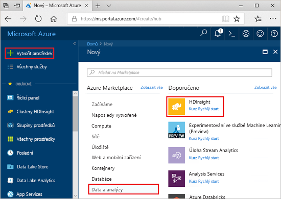
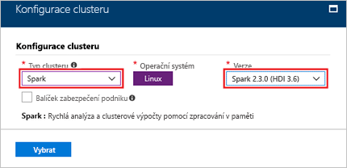
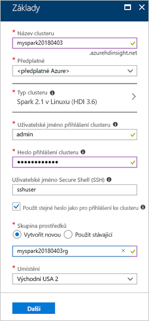

# <a name="quickstart-create-a-spark-cluster-in-hdinsight-using-the-azure-portal"></a>Rychlý start: Vytvoření clusteru Spark v HDInsight pomocí portálu Azure Portal
Zjistěte, jak vytvořit cluster Apache Spark v Azure HDInsight a jak spustit dotazy Spark SQL na tabulky Hive. Apache Spark umožňuje rychlou analýzu dat a clusterové výpočty s využitím zpracování v paměti. Informace o Apache Spark ve službě HDInsight najdete v tématu [Přehled: Apache Spark v Azure HDInsight](apache-spark-overview.md).

V tomto rychlém startu pomocí portálu Azure Portal vytvoříte cluster HDInsight Spark. Cluster jako úložiště využívá Azure Storage Blob.

> [!IMPORTANT]
> Clustery HDInsight se fakturují za minutu bez ohledu na to, jestli je používáte, nebo ne. Až přestanete cluster používat, nezapomeňte ho odstranit. Další informace najdete v části [Vyčištění prostředků](#clean-up-resources) tohoto článku.

Pokud ještě nemáte předplatné Azure, [vytvořte si bezplatný účet](https://azure.microsoft.com/free/) před tím, než začnete.

## <a name="create-an-hdinsight-spark-cluster"></a>Vytvoření clusteru HDInsight Spark

1. Na portálu Azure Portal vyberte **Vytvořit prostředek** > **Data a analýzy** > **HDInsight**. 

    
2. V části **Základy** zadejte tyto hodnoty:
     
    |Vlastnost  |Popis  |
    |---------|---------|
    |**Název clusteru**     | Pojmenujte svůj cluster HDInsight Spark. V tomto rychlém startu se používá název clusteru **myspark20180403**.|
    |**Předplatné**     | V rozevíracím seznamu vyberte předplatné Azure používané pro tento cluster. V tomto rychlém startu se používá předplatné **&lt;Předplatné Azure**. |
    |**Typ clusteru**| Tuto položku rozbalte a pak jako typ clusteru vyberte **Spark** a zvolte verzi clusteru Spark. <br/>  |
    |**Uživatelské jméno přihlášení clusteru**| Zadejte uživatelské jméno přihlášení clusteru.  Výchozí uživatelské jméno je *admin* (správce). Tento účet použijete pro přihlášení k poznámkovému bloku Jupyter v pozdější fázi rychlého startu. |
    |**Heslo přihlášení clusteru**| Zadejte přihlašovací heslo clusteru. |
    |**Uživatelské jméno Secure Shell (SSH)**| Zadejte uživatelské jméno SSH. V tomto rychlém startu se používá uživatelské jméno SSH **sshuser** (uživatelssh). Ve výchozím nastavení má tento účet stejné heslo jako účet *Uživatelské jméno přihlášení clusteru*. |
    |**Skupina prostředků**     | Určete, jestli chcete vytvořit novou skupinu prostředků, nebo použít existující. Skupina prostředků je kontejner, který obsahuje související prostředky pro řešení Azure. V tomto rychlém startu se používá název skupiny prostředků **myspark20180403rg**. |
    |**Umístění**     | Vyberte umístění skupiny prostředků. Šablona toto umístění používá k vytvoření clusteru i jako výchozí úložiště clusteru. V tomto rychlém startu se používá umístění **USA – východ 2**. |

    

    Pomocí **Další** pokračujte na stránku **Úložiště**.
3. V části **Úložiště** zadejte tyto hodnoty:

    - **Vyberte účet úložiště**: vyberte **Vytvořit nový** a pak zadejte název nového účtu úložiště. V tomto rychlém startu se používá název účtu úložiště **myspark20180403store**.

    

    > [!NOTE] 
    > Na snímku obrazovky je vidět **Vybrat existující**. Odkaz se přepíná mezi **Vytvořit nový** a **Vybrat existující**.

    **Výchozí kontejner** má výchozí název.  Pokud chcete, můžete název změnit.

    Pomocí **Další** pokračujte na stránku **Souhrn**. 


3. V **Souhrnu** vyberte **Vytvořit**. Vytvoření clusteru trvá přibližně 20 minut. Než budete moct pokračovat k další relaci, musí se cluster nejdříve vytvořit.

Pokud narazíte na problém s vytvářením clusterů HDInsight, může to být způsobeno tím, že k tomu nemáte správná oprávnění. Další informace najdete v tématu popisujícím [požadavky na řízení přístupu](../hdinsight-administer-use-portal-linux.md#create-clusters).

## <a name="create-a-jupyter-notebook"></a>Vytvoření poznámkového bloku Jupyter

Jupyter Notebook je interaktivní prostředí poznámkového bloku, které podporuje různé programovací jazyky. Poznámkový blok umožňuje pracovat s daty, kombinovat kód s textem markdownu a provádět jednoduché vizualizace. 

1. Otevřete web [Azure Portal](https://portal.azure.com).
2. Vyberte **Clustery HDInsight** a pak vyberte cluster, který jste vytvořili.

    

3. Na portálu vyberte **Řídicí panely clusteru** a pak vyberte **Jupyter Notebook**. Po zobrazení výzvy zadejte přihlašovací údaje clusteru.

   

4. Vyberte **Nový** > **PySpark** a vytvořte poznámkový blok. 

   

   Nový poznámkový blok se vytvoří a otevře s názvem Bez názvu (Bez názvu.pynb).


## <a name="run-spark-sql-statements"></a>Spouštění příkazů Spark SQL

Jazyk SQL (Structured Query Language) je nejběžnějším a široce používaným jazykem pro dotazování a definování dat. Spark SQL funguje jako rozšíření Apache Spark pro zpracování strukturovaných dat a používá známou syntaxi jazyka SQL.

1. Ověřte, že je jádro připravené. Jádro bude připravené, až se vedle názvu jádra v poznámkovém bloku zobrazí prázdný kroužek. Plný kruh označuje, že je jádro zaneprázdněno.

    

    Při prvním spuštění poznámkového bloku jádro provede některé úlohy na pozadí. Počkejte, až bude jádro připravené. 
2. Do prázdné buňky vložte následující kód a stisknutím **SHIFT + ENTER** kód spusťte. Příkaz vypíše tabulky Hive v clusteru:

    ```PySpark
    %%sql
    SHOW TABLES
    ```
    Pokud používáte poznámkový blok Jupyter s clusterem HDInsight Spark, získáte přednastavený kontext `sqlContext`, který můžete použít ke spouštění dotazů Hive pomocí Spark SQL. `%%sql` říká poznámkovému bloku Jupyter, aby ke spuštění dotazu Hive použil přednastavený kontext `sqlContext`. Dotaz načte prvních 10 řádků z tabulky Hive (**hivesampletable**), která je ve výchozím nastavení k dispozici na všech clusterech HDInsight. Získání výsledků trvá přibližně 30 sekund. Výstup bude vypadat následovně: 

    

    Při každém spuštění dotazu v Jupyter se v názvu okna webového prohlížeče zobrazí stav **(Busy)** (Zaneprázdněn) společně s názvem poznámkového bloku. Zobrazí se také plný kroužek vedle textu **PySpark** v pravém horním rohu.
    
2. Spuštěním dalšího dotazu zobrazíte data v tabulce `hivesampletable`.

    ```PySpark
    %%sql
    SELECT * FROM hivesampletable LIMIT 10
    ```
    
    Obrazovka by se měla aktualizovat a zobrazit výstup dotazu.

    

2. V nabídce **Soubor** poznámkového bloku vyberte **Zavřít a zastavit**. Ukončením poznámkového bloku se uvolní prostředky clusteru.

## <a name="clean-up-resources"></a>Vyčištění prostředků
HDInsight ukládá vaše data ve službě Azure Storage nebo Azure Data Lake Store, takže můžete cluster bezpečně odstranit, když se nepoužívá. Za cluster služby HDInsight se účtují poplatky, i když se nepoužívá. Vzhledem k tomu, že poplatky za cluster představují několikanásobek poplatků za úložiště, dává ekonomický smysl odstraňovat clustery, které nejsou používány. Pokud se chystáte hned začít pracovat na kurzu uvedeném v části [Další kroky](#next-steps), měli byste cluster zachovat.

Přepněte zpět na web Azure Portal a vyberte **Odstranit**.


Můžete také výběrem názvu skupiny prostředků otevřít stránku skupiny prostředků a pak vybrat **Odstranit skupinu prostředků**. Odstraněním skupiny prostředků odstraníte cluster HDInsight Spark i výchozí účet úložiště.

## <a name="next-steps"></a>Další kroky 

V tomto rychlém startu jste zjistili, jak vytvořit cluster HDInsight Spark a spustit základní dotaz Spark SQL. V dalším kurzu se dozvíte, jak pomocí clusteru HDInsight Spark spouštět interaktivní dotazy na ukázková data.

> [!div class="nextstepaction"]
>[Spouštění interaktivních dotazů na Spark](./apache-spark-load-data-run-query.md)
