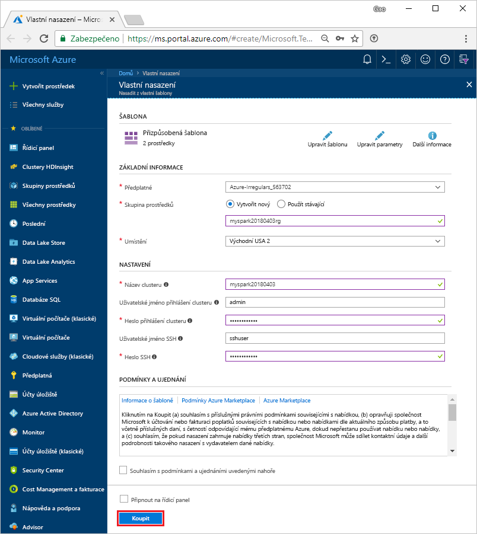
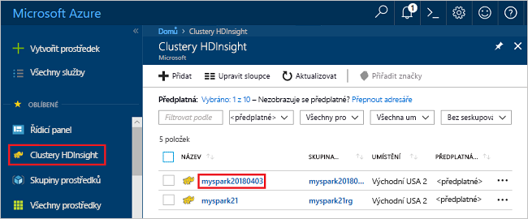
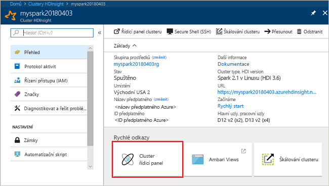
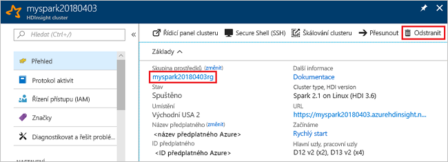

# <a name="quickstart-create-a-spark-cluster-in-hdinsight-using-template"></a>Rychlý start: Vytvoření clusteru Spark ve službě HDInsight pomocí šablony

Zjistěte, jak vytvořit cluster Apache Spark ve službě Azure HDInsight a jak spouštět dotazy Spark SQL na tabulky Hive. Apache Spark umožňuje rychlou analýzu dat a clusterové výpočty s využitím zpracování v paměti. Informace o Apache Spark ve službě HDInsight najdete v tématu [Přehled: Apache Spark v Azure HDInsight](apache-spark-overview.md).

V tomto rychlém startu pomocí šablony Resource Manageru vytvoříte cluster HDInsight Spark. Cluster jako úložiště využívá Azure Storage Blob.

> [!IMPORTANT]
> Clustery HDInsight se fakturují za minutu bez ohledu na to, jestli je používáte, nebo ne. Až přestanete cluster používat, nezapomeňte ho odstranit. Další informace najdete v části [Vyčištění prostředků](#clean-up-resources) tohoto článku.

Pokud ještě nemáte předplatné Azure, [vytvořte si bezplatný účet](https://azure.microsoft.com/free/) před tím, než začnete.

## <a name="create-an-hdinsight-spark-cluster"></a>Vytvoření clusteru HDInsight Spark

Vytvořte cluster HDInsight Spark pomocí šablony Azure Resource Manageru. Šablonu jde najít v [GitHubu](https://azure.microsoft.com/resources/templates/101-hdinsight-spark-linux/). 

1. Výběrem následujícího odkazu otevřete šablonu na webu Azure Portal na nové kartě prohlížeče:         

    <a href="https://portal.azure.com/#create/Microsoft.Template/uri/https%3A%2F%2Fraw.githubusercontent.com%2FAzure%2Fazure-quickstart-templates%2Fmaster%2F101-hdinsight-spark-linux%2Fazuredeploy.json" target="_blank">Nasazení do Azure</a>

2. Zadejte následující hodnoty:

    | Vlastnost | Hodnota |
    |---|---|
    |**Předplatné**|Vyberte předplatné Azure použité k vytvoření tohoto clusteru. V tomto rychlém startu se používá předplatné **&lt;název předplatného Azure>**. |
    | **Skupina prostředků**|Vytvořte skupinu prostředků nebo vyberte existující. Skupina prostředků slouží ke správě prostředků Azure pro vaše projekty. V tomto rychlém startu se používá název nové skupiny prostředků **myspark20180403rg**.|
    | **Umístění**|Vyberte umístění skupiny prostředků. Šablona toto umístění používá k vytvoření clusteru i jako výchozí úložiště clusteru. V tomto rychlém startu se používá umístění **USA – východ 2**.|
    | **Název clusteru**|Zadejte název clusteru HDInsight, který chcete vytvořit. V tomto rychlém startu se používá název nového clusteru **myspark20180403**.|
    | **Přihlašovací jméno a heslo clusteru**|Výchozí přihlašovací jméno je admin. Zvolte heslo pro přihlášení ke clusteru. V tomto rychlém startu se používá přihlašovací jméno **admin**.|
    | **Uživatelské jméno a heslo SSH**|Zvolte heslo pro uživatele SSH. V tomto rychlém startu se používá uživatelské jméno SSH **sshuser**.|

    

3. Vyberte **Souhlasím s podmínkami a ujednáními uvedenými nahoře**, vyberte **Připnout na řídicí panel** a pak vyberte **Koupit**. Zobrazí se nová dlaždice s názvem **Nasazení šablony**. Vytvoření clusteru trvá přibližně 20 minut. Než budete moct pokračovat k další relaci, musí se cluster nejdříve vytvořit.

Pokud narazíte na problém s vytvářením clusterů HDInsight, může to být způsobeno tím, že k tomu nemáte správná oprávnění. Další informace najdete v tématu popisujícím [požadavky na řízení přístupu](../hdinsight-administer-use-portal-linux.md#create-clusters).

## <a name="install-intellijeclipse-for-spark-application"></a>Instalace IntelliJ/Eclipse pro aplikaci Spark
Použijte sadu nástrojů Azure pro modul plug-in IntelliJ/Eclipse k vývoji aplikací Spark napsaných v jazyce Scala a pak je přímo z integrovaného vývojového prostředí (IDE) IntelliJ/Eclipse odešlete do clusteru Azure HDInsight Spark. Další informace najdete v článcích [o použití IntelliJ k vytvoření/odeslání aplikace Spark](./apache-spark-intellij-tool-plugin.md) a [o použití Eclipse k vytvoření/odeslání aplikace Spark](./apache-spark-eclipse-tool-plugin.md).

## <a name="install-vscode-for-pysparkhive-applications"></a>Instalace nástroje VSCode pro aplikace PySpark/Hive
Naučte se používat sadu nástrojů Azure HDInsight Tools for Visual Studio Code (VSCode) k vytvoření a odeslání dávkových úloh Hive, interaktivních dotazů Hive, dávky PySpark a interaktivních skriptů PySpark. Nástroje Azure HDInsight Tools můžete nainstalovat na platformách, které podporuje nástroj VSCode. Patří sem Windows, Linux a macOS. Další informace najdete v článku [o použití nástroje VSCode k vytvoření/odeslání aplikace PySpark](../hdinsight-for-vscode.md).

## <a name="create-a-jupyter-notebook"></a>Vytvoření poznámkového bloku Jupyter

Jupyter Notebook je interaktivní prostředí poznámkového bloku, které podporuje různé programovací jazyky. Poznámkový blok umožňuje pracovat s daty, kombinovat kód s textem markdownu a provádět jednoduché vizualizace. 

1. Otevřete web [Azure Portal](https://portal.azure.com).
2. Vyberte **Clustery HDInsight** a pak vyberte cluster, který jste vytvořili.

    

3. Na portálu vyberte **Řídicí panely clusteru** a pak vyberte **Jupyter Notebook**. Po zobrazení výzvy zadejte přihlašovací údaje clusteru.

   

4. Vyberte **Nový** > **PySpark** a vytvořte poznámkový blok. 

   

   Nový poznámkový blok se vytvoří a otevře s názvem Bez názvu (Bez názvu.pynb).


## <a name="run-spark-sql-statements"></a>Spouštění příkazů Spark SQL

Jazyk SQL (Structured Query Language) je nejběžnějším a široce používaným jazykem pro dotazování a definování dat. Spark SQL funguje jako rozšíření Apache Spark pro zpracování strukturovaných dat a používá známou syntaxi jazyka SQL.

1. Ověřte, že je jádro připravené. Jádro bude připravené, až se vedle názvu jádra v poznámkovém bloku zobrazí prázdný kroužek. Plný kruh označuje, že je jádro zaneprázdněno.

    

    Při prvním spuštění poznámkového bloku jádro provede některé úlohy na pozadí. Počkejte, až bude jádro připravené. 
2. Do prázdné buňky vložte následující kód a stisknutím **SHIFT + ENTER** kód spusťte. Příkaz vypíše tabulky Hive v clusteru:

    ```PySpark
    %%sql
    SHOW TABLES
    ```
    Pokud používáte poznámkový blok Jupyter s clusterem HDInsight Spark, získáte přednastavený kontext `sqlContext`, který můžete použít ke spouštění dotazů Hive pomocí Spark SQL. `%%sql` říká poznámkovému bloku Jupyter, aby ke spuštění dotazu Hive použil přednastavený kontext `sqlContext`. Dotaz načte prvních 10 řádků z tabulky Hive (**hivesampletable**), která je ve výchozím nastavení k dispozici na všech clusterech HDInsight. Získání výsledků trvá přibližně 30 sekund. Výstup bude vypadat následovně: 

    

    Při každém spuštění dotazu v Jupyter se v názvu okna webového prohlížeče zobrazí stav **(Busy)** (Zaneprázdněn) společně s názvem poznámkového bloku. Zobrazí se také plný kroužek vedle textu **PySpark** v pravém horním rohu.
    
2. Spuštěním dalšího dotazu zobrazíte data v tabulce `hivesampletable`.

    ```PySpark
    %%sql
    SELECT * FROM hivesampletable LIMIT 10
    ```
    
    Obrazovka by se měla aktualizovat a zobrazit výstup dotazu.

    

2. V nabídce **Soubor** poznámkového bloku vyberte **Zavřít a zastavit**. Ukončením poznámkového bloku se uvolní prostředky clusteru.

## <a name="clean-up-resources"></a>Vyčištění prostředků
HDInsight ukládá vaše data ve službě Azure Storage nebo Azure Data Lake Store, takže můžete cluster bezpečně odstranit, když se nepoužívá. Za cluster služby HDInsight se účtují poplatky, i když se nepoužívá. Vzhledem k tomu, že poplatky za cluster představují několikanásobek poplatků za úložiště, dává ekonomický smysl odstraňovat clustery, které nejsou používány. Pokud se chystáte hned začít pracovat na kurzu uvedeném v části [Další kroky](#next-steps), měli byste cluster zachovat.

Přepněte zpět na web Azure Portal a vyberte **Odstranit**.



Můžete také výběrem názvu skupiny prostředků otevřít stránku skupiny prostředků a pak vybrat **Odstranit skupinu prostředků**. Odstraněním skupiny prostředků odstraníte cluster HDInsight Spark i výchozí účet úložiště.

## <a name="next-steps"></a>Další kroky 

V tomto rychlém startu jste zjistili, jak vytvořit cluster HDInsight Spark a spustit základní dotaz Spark SQL. V dalším kurzu se dozvíte, jak pomocí clusteru HDInsight Spark spouštět interaktivní dotazy na ukázková data.

> [!div class="nextstepaction"]
>[Spouštění interaktivních dotazů na Spark](./apache-spark-load-data-run-query.md)


