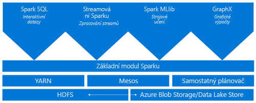
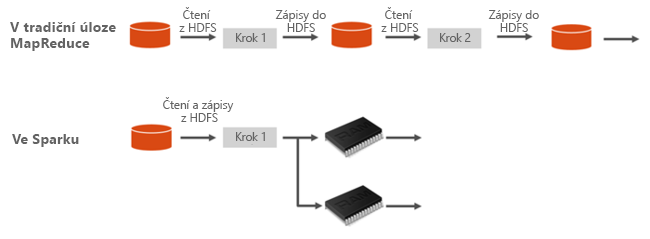
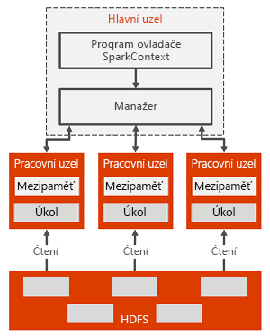

# Co je Apache Spark ve službě Azure HDInsight

*Apache Spark* je architektura pro paralelní zpracování, která podporuje zpracování v paměti pro zvýšení výkonu analytických aplikací s velkým objemem dat. Apache Spark ve službě Azure HDInsight je implementace Apache Hadoopu v cloudu od Microsoftu. HDInsight usnadňuje vytvoření a konfiguraci clusteru Spark v Azure. Clustery Spark ve službě HDInsight jsou kompatibilní se službami Azure Storage a Azure Data Lake Store. Clustery HDInsight Spark proto můžete použít ke zpracování dat uložených v Azure. Informace o komponentách a verzích najdete v tématu [Komponenty a verze Hadoopu ve službě Azure HDInsight](../hdinsight-component-versioning.md).

## Co je Spark?

Spark poskytuje primitivy pro clusterové výpočty v paměti. Úloha Spark může načítat data, ukládat je do paměti a opakovaně je dotazovat. Výpočty v paměti jsou mnohem rychlejší než aplikace založené na discích, jako je Hadoop, které sdílejí data prostřednictvím HDFS. Spark se také integruje do programovacího jazyka Scala a díky tomu umožňuje pracovat s distribuovanými datovými sadami stejně jako s místními kolekcemi. Není nutné strukturovat všechno jako mapovací a redukční operace.

Clustery Spark ve službě HDInsight nabízejí plně spravovanou službu Spark. Tady najdete výhody, které přináší vytvoření clusteru Spark ve službě HDInsight.

| Funkce | Popis |
| --- | --- |
| Snadné vytvoření |Nový cluster Spark ve službě HDInsight můžete vytvořit během několika minut pomocí webu Azure Portal, Azure PowerShellu nebo sady HDInsight .NET SDK. Viz [Začínáme s clusterem Spark v HDInsight](apache-spark-jupyter-spark-sql.md) |
| Snadné používání |Součástí clusteru Spark v prostředí HDInsight jsou poznámkové bloky Jupyter a Zeppelin. Tyto poznámkové bloky můžete použít pro interaktivní zpracování dat a vizualizaci.|
| Rozhraní REST API |Clustery Spark v HDInsight zahrnují [Livy](https://github.com/cloudera/hue/tree/master/apps/spark/java#welcome-to-livy-the-rest-spark-server), server úloh Spart založený na rozhraní REST API, který slouží ke vzdálenému odesílání a monitorování úloh. |
| Podpora pro Azure Data Lake Store | Clustery Spark ve službě HDInsight můžou používat Azure Data Lake Store jako primární i dodatečné úložiště. Další informace o Data Lake Store naleznete v tématu [Přehled o Azure Data Lake Store](../../data-lake-store/data-lake-store-overview.md). |
| Integrace se službami Azure |Cluster Spark ve službě HDInsight se dodává s konektorem k Azure Event Hubs. Můžete vytvářet aplikace streamování pomocí Event Hubs navíc k systému [Kafka](http://kafka.apache.org/), který je již k dispozici jako součást Sparku. |
| Podpora pro ML Server | Podpora pro ML Server v HDInsightu je k dispozici jako typ clusteru **ML Services**. Cluster ML Services můžete nastavit pro spouštění distribuovaných výpočtů v R s rychlostí, kterou zajišťuje cluster Spark. Další informace najdete v tématu [Začínáme používat ML Server ve službě HDInsight](../r-server/r-server-get-started.md). |
| Integrace v prostředí IDE třetích stran | HDInsight poskytuje několik modulů plug-in pro integrovaná vývojová prostředí (IDE), které jsou užitečné k vytváření a odesílání aplikací do clusteru HDInsight Spark. Další informace najdete v tématech o [použití sady Azure Toolkit pro IntelliJ IDEA](apache-spark-intellij-tool-plugin.md), [použití HDInsightu pro VSCode ](../hdinsight-for-vscode.md) a [použití sady Azure Toolkit pro Eclipse](apache-spark-eclipse-tool-plugin.md).|
| Počet souběžných dotazů |Clustery Spark v HDInsight podporují souběžné dotazy. Tato schopnost umožňuje sdílení stejných prostředků clusteru pro více dotazů od jednoho uživatele nebo více dotazů od různých uživatelů a aplikací. |
| Ukládání do mezipaměti na SSD |Data do mezipaměti můžete ukládat volitelně buď do paměti nebo na SSD disky připojené k uzlům clusteru. Ukládání do mezipaměti zajišťuje nejlepší výkon dotazů, ale může být nákladné. Ukládání na disky SSD poskytuje skvělou možnost pro zlepšení výkonu dotazů, aniž by bylo nutné vytvořit cluster velikosti, která je potřeba pro umístění celé datové sady do paměti. |
| Integrace s nástroji BI |Clustery Spark ve službě HDInsight nabízí konektory pro nástroje BI, například [Power BI](http://www.powerbi.com/) pro analýzu dat. |
| Předem zavedené knihovny Anaconda |Clustery Spark ve službě HDInsight obsahují předinstalované knihovny Anaconda. [Anaconda](http://docs.continuum.io/anaconda/) poskytuje téměř 200 knihoven pro machine learning, analýzy dat, vizualizace atd. |
| Škálovatelnost | HDInsight umožňuje změnit počet uzlů clusteru. Navíc clustery Spark můžete vyřadit bez ztráty dat, protože všechna data jsou uložená v Azure Storage nebo ve službě Data Lake Store. |
| SLA |Clustery Spark ve službě HDInsight přináší nepřetržitou podporu a smlouvu SLA zajišťující 99,9% dostupnost. |

Součástí clusterů Spark v HDInsight jsou následující komponenty, které jsou v nich k dispozici ve výchozím nastavení.

* [Spark Core](https://spark.apache.org/docs/1.5.1/). Obsahuje Spark Core, Spark SQL, rozhraní API pro vysílání datového proudu Spark, GraphX a MLlib.
* [Anaconda](http://docs.continuum.io/anaconda/)
* [Livy](https://github.com/cloudera/hue/tree/master/apps/spark/java#welcome-to-livy-the-rest-spark-server)
* [Poznámkový blok Jupyter](https://jupyter.org)
* [Poznámkový blok Zeppelin](http://zeppelin-project.org/)

Clustery Spark ve službě HDInsight také poskytují [ovladač ODBC](http://go.microsoft.com/fwlink/?LinkId=616229) umožňující připojení ke clusterům Spark ve službě HDInsight z nástrojů BI, například Microsoft Power BI.

## Architektura clusteru Spark

Komponenty Sparku snadno pochopíte, když porozumíte způsobu, jakým se Spark spouští na clusterech HDInsight.

Aplikace Spark se v clusteru spouští jako nezávislé sady procesů, které koordinuje objekt SparkContext v hlavním programu (označuje se jako řídicí program).

SparkContext se může připojit k několika typům správců clusterů, kteří přidělují prostředky napříč aplikacemi. Mezi tyto správce clusterů patří Apache Mesos, Apache YARN nebo správce clusteru Spark. V HDInsight se Spark spouští pomocí správce clusteru YARN. Po připojení Spark získá exekutory na pracovních uzlech v clusteru, což jsou procesy, které provádí výpočty a ukládají data pro vaši aplikaci. Pak do exekutorů odešle kód vaší aplikace (definovaný v souborech JAR nebo Pythonu předaných do objektu SparkContext). Nakonec SparkContext odešle do exekutorů úlohy ke spuštění.

SparkContext spouští hlavní funkci uživatele a provádí různé paralelní operace na pracovních uzlech. Potom SparkContext shromažďuje výsledky těchto operací. Pracovní uzly čtou data z distribuovaného systému souborů Hadoop (HDFS) a zapisují je do něj. Pracovní uzly také ukládají transformovaná data do paměti jako sady RDD (Resilient Distributed Dataset).

SparkContext se připojuje k hlavnímu uzlu Sparku a je zodpovědný za převod aplikace do orientovaného acyklického grafu (DAG) jednotlivých úloh, které se provádějí v rámci procesu exekutora na pracovních uzlech. Každá aplikace získá vlastní procesy exekutora, které zůstávají v provozu po dobu trvání celé aplikace a spouští úlohy ve více vláknech.

## Případy použití Sparku ve službě HDInsight

Clustery Spark v HDInsight podporují následující klíčové scénáře:

- Interaktivní analýzu dat a BI

    Apache Spark v HDInsight ukládá data do úložiště Azure Storage nebo služby Azure Data Lake Store. Obchodní specialisté a osoby provádějící klíčová rozhodnutí analyzují a vytváří z těchto dat sestavy a používají Microsoft Power BI pro vytváření interaktivních sestav z analyzovaných dat. Analytici mohou začínat z nestrukturovaných / částečně strukturovaných dat v úložišti clusteru, definovat schéma pro data s využitím poznámkových bloků a následně vytvořit modely dat pomocí Microsoft Power BI. Clustery Spark ve službě HDInsight podporují také různé nástroje BI třetích stran, například Tableau, a usnadňují tak práci datovým analytikům, obchodním specialistům a osobám provádějícím klíčová rozhodnutí.

    [Kurz: Vizualizace dat Sparku pomocí Power BI](apache-spark-use-bi-tools.md)
- Spark Machine Learning

    Systém Apache Spark je vybavený knihovnou [MLlib](http://spark.apache.org/mllib/) pro strojové učení, jejímž základem je Spark a kterou můžete používat z clusteru Spark v HDInsight. Cluster Spark ve službě HDInsight obsahuje také Anacondu, distribuci jazyka Python s různými balíčky pro strojové učení. Spojte tyto možnosti s integrovanou podporou pro poznámkové bloky Jupyter a Zeppelin a máte prostředí pro tvorbu aplikací strojového učení.

    [Kurz: Předpověď teplot budov pomocí dat HVAC](apache-spark-ipython-notebook-machine-learning.md) [Kurz:Předpověď výsledků kontroly potravin](apache-spark-machine-learning-mllib-ipython.md)    
- Vysílání datových proudů a analýza dat v reálném čase ve Sparku

    Clustery Spark v HDInsight nabízí bohatou podporu pro vytváření řešení pro analýzu v reálném čase. Zatímco Spark již obsahuje konektory pro načítání dat z mnoha zdrojů, například soketů Kafka, Flume, Twitter, ZeroMQ nebo TCP, Spark v HDInsight přidává prvotřídní podporu pro příjem dat z Azure Event Hubs. Event Hubs je nejpoužívanější službou řazení front v Azure. Díky integrované podpoře služby Event Hubs představují clustery Spark ve službě HDInsight ideální platformu pro vytvoření kanálu k analýze dat v reálném čase.
    
## Kde mám začít?

Další informace o Sparku ve službě HDInsight najdete v následujících článcích:

- [Rychlý start: Vytvoření clusteru Spark ve službě HDInsight a spuštění interaktivního dotazu pomocí Jupyter](./apache-spark-jupyter-spark-sql.md)
- [Kurz: Spuštění úlohy Sparku pomocí Jupyter](./apache-spark-load-data-run-query.md)
- [Kurz: Analýza dat pomocí nástrojů BI](./apache-spark-use-bi-tools.md)
- [Kurz: Strojové učení s využitím Sparku](./apache-spark-ipython-notebook-machine-learning.md)
- [Kurz: Vytvoření aplikace Scala Maven pomocí IntelliJ](./apache-spark-create-standalone-application.md)

## Další kroky

V tomto článku jste získali základní přehled Apache Sparku ve službě Azure HDInsight. V dalším článku se dozvíte, jak vytvořit cluster HDInsight Spark a spustit několik dotazů Spark SQL:

- [Vytvoření clusteru Spark ve službě HDInsight](./apache-spark-jupyter-spark-sql.md)

