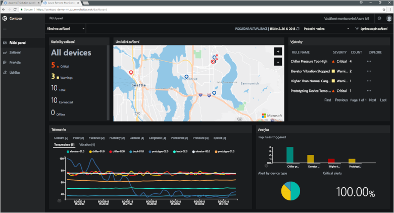

# Co jsou akcelerátory řešení Azure IoT?

Cloudová řešení IoT obvykle ke správě připojení zařízení, zpracování a analýze dat a jejich prezentaci využívají vlastní kód a několik cloudových služeb.

Akcelerátory řešení IoT jsou kolekce kompletních a ucelených řešení IoT připravených k nasazení, která implementují běžné scénáře IoT, jako je vzdálené monitorování, propojená továrna a prediktivní údržba. Když nasadíte akcelerátor řešení, součástí nasazení jsou všechny požadované cloudové služby i veškerý požadovaný kód aplikace.

Akcelerátory řešení představují výchozí body pro vaše vlastní řešení IoT. Zdrojový kód všech akcelerátorů řešení je open source a dostupný na GitHubu. Akcelerátory řešení si můžete stáhnout a [přizpůsobit](iot-accelerators-remote-monitoring-customize.md) podle svých potřeb.

Akcelerátory řešení můžete využít také jako učební nástroje před tím, než vytvoříte vlastní řešení IoT od nuly. Akcelerátory řešení implementují osvědčené postupy pro cloudová řešení IoT, které byste měli dodržovat.

Kód aplikace v každém akcelerátoru řešení obsahuje řídicí panel, na kterém můžete akcelerátor řešení spravovat. Pomocí řídicího panelu můžete například zobrazit telemetrii z připojených zařízení, zřizovat nová zařízení nebo upgradovat firmware na připojených zařízeních:

## Podporované scénáře IoT

V současné době jsou k dispozici čtyři akcelerátory řešení, které můžete nasadit:

### Vzdálené monitorování

Tento akcelerátor řešení můžete použít ke shromažďování telemetrie z několika vzdálených zařízení a k jejich ovládání. Mezi příklady zařízení patří chladící systémy nainstalované u vašich zákazníků nebo ventily nainstalované na vzdálených čerpacích stanicích.

### Propojená továrna

Tento akcelerátor řešení můžete použít ke shromažďování telemetrie z průmyslových prostředků s využitím rozhraní [OPC Unified Architecture](https://opcfoundation.org/about/opc-technologies/opc-ua/) a k jejich ovládání. Mezi průmyslové prostředky můžou patřit montážní a testovací stanice na výrobní lince továrny.

### Prediktivní údržba

Tento akcelerátor řešení můžete použít k předpovědi očekávaného selhání vzdáleného zařízení, abyste mohli provést údržbu před tím, než k předpokládanému selhání dojde. Tento akcelerátor řešení k předvídání selhání na základě telemetrie zařízení využívá algoritmy strojového učení. Příklady zařízení můžou být letadlové motory nebo výtahy.

### Simulace zařízení

Tento akcelerátor řešení můžete použít ke spuštění několika simulovaných zařízení, která generují realistickou telemetrii. Pomocí tohoto akcelerátoru řešení můžete testovat chování ostatních akcelerátorů řešení nebo testovat vlastní řešení IoT.

## Principy návrhu

Všechny akcelerátory řešení se řídí stejnými principy návrhu a mají stejné cíle. Jsou navržené tak, aby byly:

* **Škálovatelné** – umožňují vám připojit a spravovat miliony připojených zařízení.
* **Rozšiřitelné** – umožňují vám přizpůsobit je tak, aby splňovaly vaše požadavky.
* **Srozumitelné** – umožňují vám pochopit, jak fungují a jak se implementují.
* **Modulární** – umožňují vám vyměňovat služby za alternativy.
* **Bezpečné** – kombinují zabezpečení Azure s integrovanými možnostmi připojení a funkcemi zabezpečení zařízení.

## Architektury a jazyky

Původní akcelerátory řešení byly napsané v .NET a využívaly architekturu MVC (model-view-controller). Společnost Microsoft aktualizuje akcelerátory řešení, aby využívaly novou architekturu mikroslužeb. Všechny mikroslužby jsou k dispozici na GitHubu ve verzi pro [Javu](https://github.com/Azure/azure-iot-pcs-remote-monitoring-java) i [.NET](https://github.com/Azure/azure-iot-pcs-remote-monitoring-dotnet). Následující tabulka ukazuje aktuální stav akcelerátorů řešení:

| Akcelerátor řešení   | Architektura  | Jazyky     |
| ---------------------- | ------------- | ------------- |
| Vzdálené monitorování      | Mikroslužby | Java a .NET |
| Prediktivní údržba | MVC           | .NET          |
| Propojená továrna      | MVC           | .NET          |

Další informace o architekturách mikroslužeb najdete v tématech věnovaných [architektuře aplikací .NET](https://www.microsoft.com/net/learn/architecture) a [mikroslužbám jako revoluci v aplikacích, kterou umožnil cloud](https://azure.microsoft.com/blog/microservices-an-application-revolution-powered-by-the-cloud/).

## Možnosti nasazení

Akcelerátory řešení založené na mikroslužbách můžete nasadit v následujících konfiguracích:

* **Standard:** Nasazení rozšířené infrastruktury pro vývoj produkčního nasazení. Azure Container Service nasazuje mikroslužby do několika virtuálních počítačů Azure. Kubernetes orchestruje kontejnery Dockeru, které jsou hostiteli jednotlivých mikroslužeb.
* **Basic:** Verze s nižšími náklady pro ukázku nebo otestování nasazení. Všechny mikroslužby se nasazují do jednoho virtuálního počítače Azure.
* **Místní:** Nasazení do místního počítače pro účely vývoje a testování. S tímto přístupem se mikroslužby nasazují do místního kontejneru Dockeru a připojují se ke službám IoT Hub, Azure Cosmos DB a Azure Storage v cloudu.

Náklady na provoz akcelerátoru řešení představují celkovou hodnotu všech [nákladů na podpůrné služby Azure](https://azure.microsoft.com/pricing). Podrobnosti o použitých službách Azure se zobrazí po výběru možností nasazení.

## Další kroky

Pokud si chcete nějaký akcelerátor řešení IoT vyzkoušet, projděte si rychlý start [Nasazení cloudového řešení vzdáleného monitorování](quickstart-remote-monitoring-deploy.md).
