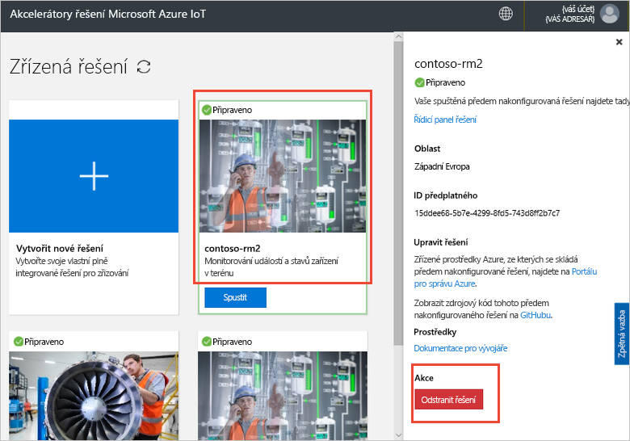

# Připojit zařízení IoT DevKit k akcelerátoru řešení vzdáleného monitorování

[!INCLUDE [iot-suite-selector-connecting](../../includes/iot-suite-selector-connecting.md)]

Tato příručka ukazuje, jak spustit ukázkovou aplikaci na vašem zařízení IoT DevKit. Vzorový kód odesílá telemetrii ze senzorů v zařízení DevKit akcelerátor řešení.

[MXChip IoT DevKit](https://aka.ms/iot-devkit) je vše v jednom Arduino kompatibilní deska bohaté periferní zařízení a senzorů. Můžete vyvíjet pro něj pomocí [Workbench zařízení Azure IoT](https://aka.ms/iot-workbench) nebo [nástroje Azure IoT](https://aka.ms/azure-iot-tools) balíček rozšíření pro Visual Studio Code. [Katalogu projektů](https://microsoft.github.io/azure-iot-developer-kit/docs/projects/) obsahuje ukázkové aplikace můžete řešení IoT prototypu.

## Před zahájením

K dokončení kroků v tomto kurzu, proveďte následující úlohy:

* Příprava vašich DevKit podle postupu v [připojení IoT DevKit AZ3166 se do služby Azure IoT Hub v cloudu](/azure/iot-hub/iot-hub-arduino-iot-devkit-az3166-get-started).

## Otevřete ukázkový projekt

Otevřete ukázkový vzdálené monitorování v nástroji VS Code:

1. Ujistěte se, že vaše IoT DevKit se k počítači. Nejprve spusťte VS Code a DevKit připojte se k počítači.

1. Klikněte na tlačítko `F1` otevřete paletu příkazů, zadejte a vyberte **Workbench zařízení Azure IoT: Otevřít příklady...** . Potom vyberte **IoT DevKit** jako panel.

1. Najít **vzdálené monitorování** a klikněte na tlačítko **otevřít ukázkové**. Otevře se nové okno VS Code zobrazující složku projektu:

  

## Konfigurace zařízení

Pro konfiguraci připojovací řetězec zařízení centra IoT DevKit zařízení:

1. Přepnout IoT DevKit do **režim konfigurace**:

    * Podržte tlačítko **A**.
    * Se službami push a verzi **resetování** tlačítko.

1. Na obrazovce se zobrazí DevKit ID a `Configuration`.

    

1. Stisknutím klávesy **F1** otevřete paletu příkazů, zadejte a vyberte **Workbench zařízení Azure IoT: Konfigurace nastavení zařízení... > připojovací řetězec zařízení Config**.

1. Vložte připojovací řetězec, který jste dříve zkopírovali a stiskněte klávesu **Enter** ke konfiguraci zařízení.

## Sestavení kódu

K vytvoření a nahrání kódu zařízení:

1. Stisknutím klávesy `F1` otevřete paletu příkazů, zadejte a vyberte **Workbench zařízení Azure IoT: Nahrát kód zařízení**:

1. VS Code kompiluje a odesílá kód do vašeho zařízení DevKit:

    

1. DevKit zařízení restartuje a spouští kód, který jste nahráli.

## Testování ukázky

Chcete-li ověřit, že ukázkovou aplikaci, kterou jste nahráli do zařízení DevKit funguje, proveďte následující kroky:

### Zobrazit telemetrická data odesílaná do řešení vzdáleného monitorování

Spuštění ukázkové aplikace zařízení DevKit odesílá telemetrii z jeho data snímačů přes Wi-Fi akcelerátor řešení. Chcete-li zobrazit telemetrická data:

1. Přejděte na řídicí panel řešení a klikněte na tlačítko **zařízení**.

1. Klikněte na název zařízení DevKit zařízení. na kartě napravo uvidíte telemetrii z DevKit v reálném čase:

    

### Ovládací prvek DevKit zařízení

Akcelerátor řešení vzdálené monitorování umožňuje vzdálené řízení zařízení. Vzorový kód implementuje tři metody, které se zobrazí v **metoda** části při výběru zařízení na **zařízení** stránky:

Chcete-li změnit barvu jednoho DevKit LED, použijte **LedColor** metody:

1. Vyberte název zařízení ze seznamu zařízení a klepněte na **úlohy**:

    

1. Konfigurace úloh pomocí následující hodnoty a klikněte na tlačítko **použít**:

    * Vyberte úlohu: **Run – metoda**
    * Název metody: **LedColor**
    * Název úlohy: **ChangeLedColor**

    

1. Za pár sekund, barva RGB LED (pod tlačítko A) na DevKit změny:

    

## Vyčištění prostředků

Pokud se budete chtít přesunout ke kurzům, ponechte akcelerátor řešení vzdáleného monitorování nasazený.

Pokud už nepotřebujete akcelerátor řešení, odstraníte ji ze stránky řešení zajištěno, že ji vyberete a potom kliknutím na Odstranit řešení:

## Problémy a zpětná vazba

Pokud narazíte na jakékoli problémy, podívejte se na [nejčastějších dotazech týkajících se IoT DevKit](https://microsoft.github.io/azure-iot-developer-kit/docs/faq/) nebo kontaktujte nás prostřednictvím následujících kanálů:

* [Gitter.IM](https://gitter.im/Microsoft/azure-iot-developer-kit)
* [Stack Overflow](https://stackoverflow.com/questions/tagged/iot-devkit)

## Další postup

Teď, když jste zjistili, jak připojit zařízení DevKit akcelerátor řešení vzdálené monitorování, zde jsou některé další navrhované kroky:

* [Přehled akcelerátorů řešení Azure IoT](https://docs.microsoft.com/azure/iot-accelerators/)
* [Přizpůsobení uživatelského rozhraní](iot-accelerators-remote-monitoring-customize.md)
* [IoT DevKit připojit k aplikaci Azure IoT Central](../iot-central/howto-connect-devkit.md)