# Rychlý start: Zkuste cloudové řešení ke správě mých průmyslová zařízení IoT

V tomto rychlém zprovoznění se dozvíte, jak nasadit akcelerátor řešení připojené továrny Azure IoT pro cloudovou simulaci monitorování a správy průmyslových zařízení IoT. Když nasadíte akcelerátor řešení připojené továrny, bude předem naplněný simulovanými prostředky, které vám umožní projít si běžný scénář z oblasti průmyslu IoT. K řešení je připojených několik simulovaných továren, které hlásí hodnoty dat potřebné k výpočtu celkové účinnosti vybavení (OEE) a klíčových ukazatelů výkonu (KPI). V tomto rychlém zprovoznění se dozvíte, jak pomocí řídicího panelu řešení provést tyto úkony:

* Monitorovat továrnu, výrobní linky, celkovou účinnost vybavení stanic a hodnoty klíčových ukazatelů výkonu
* Analyzovat telemetrická data generovaná z těchto zařízení
* Reagovat na upozornění

K dokončení tohoto rychlého startu potřebujete aktivní předplatné Azure.

Pokud ještě nemáte předplatné Azure, vytvořte si [bezplatný účet](https://azure.microsoft.com/free/?WT.mc_id=A261C142F) před tím, než začnete.

## Nasazení řešení

Při nasazování akcelerátoru řešení do předplatného Azure je potřeba nastavit několik možností konfigurace.

Přejděte na web [Akcelerátory řešení Microsoft Azure IoT](https://www.azureiotsolutions.com) a přihlaste se pomocí přihlašovacích údajů vašeho účtu Azure.

Klikněte na dlaždici **Připojená továrna**. Na stránce **Připojená továrna** klikněte na **Vyzkoušet**:

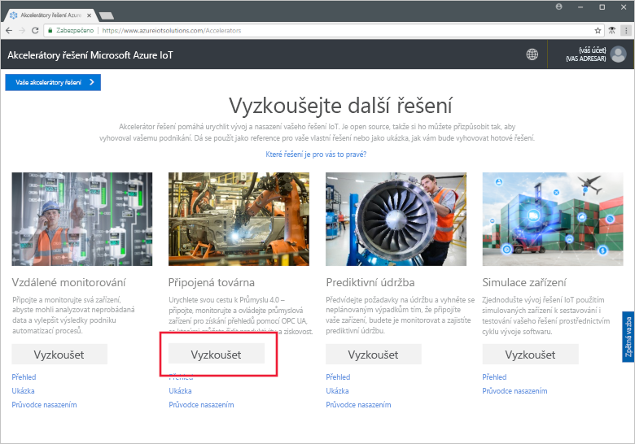

Na dlaždici **Vytvořit řešení připojené továrny** zadejte jedinečný **Název řešení** akcelerátoru řešení připojené továrny. Tento název odpovídá názvu skupiny prostředků Azure, která obsahuje všechny prostředky akcelerátoru řešení. V tomto rychlém startu se používá název **MyDemoConnectedFactory**.

Vyberte **Předplatné** a **Oblast**, které chcete při nasazování akcelerátoru řešení použít. Obvykle byste měli zvolit oblast, která je vám nejblíže. V tomto rychlém zprovoznění používáme možnosti **Visual Studio Enterprise** a **Východní USA**. V předplatném musíte být [globálním správcem nebo uživatelem](iot-accelerators-permissions.md).

Kliknutím na **Vytvořit řešení** zahájíte nasazování. Dokončení tohoto procesu trvá minimálně pět minut:

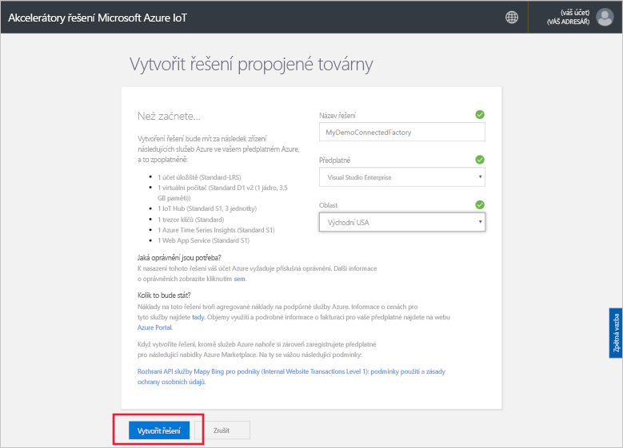

## Přihlášení k řešení

Po dokončení nasazení předplatného Azure se na dlaždici řešení zobrazí zelené zaškrtnutí a **Připraveno**. Teď se můžete přihlásit k řídicímu panelu akcelerátoru řešení připojené továrny.

Na stránce **Zřízená řešení** klikněte na nový akcelerátor řešení připojené továrny:

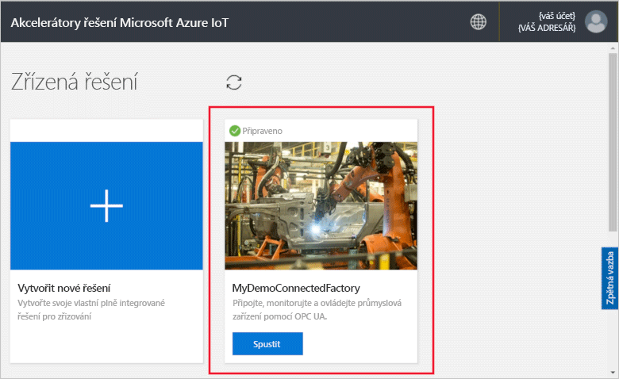

Na panelu, který se zobrazí, si můžete prohlédnout informace o akcelerátoru řešení připojené továrny. Zvolte **Řídicí panel řešení** a zobrazte akcelerátor řešení připojené továrny:

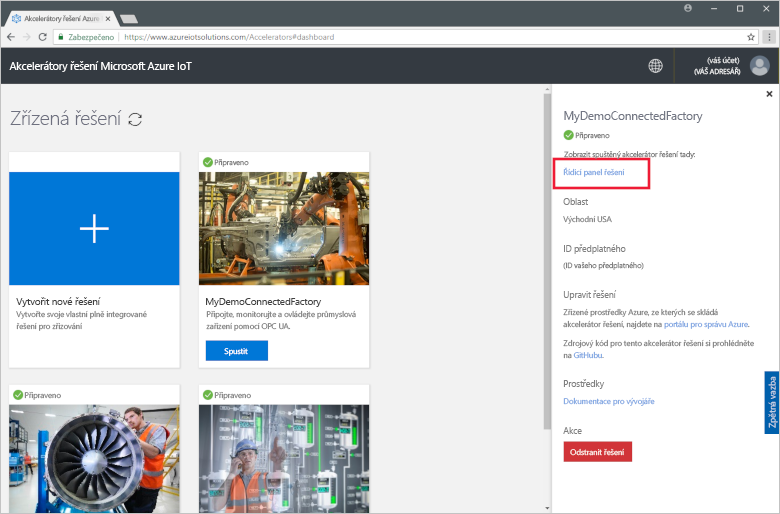

Kliknutím na **Přijmout** přijměte žádost o oprávnění. Ve vašem prohlížeči se zobrazí řídicí panel řešení připojené továrny. Obsahuje sadu simulovaných továren, výrobních linek a stanic.

## Zobrazení řídicího panelu

Výchozím zobrazením je *řídicí panel*. K přecházení do jiných oblastí portálu použijte nabídku na levé straně stránky:

[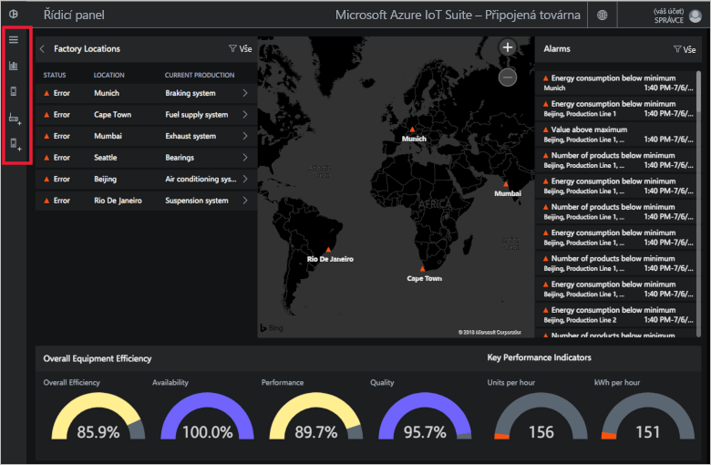](./media/quickstart-connected-factory-deploy/dashboard-expanded.png#lightbox)

Řídicí panel slouží ke správě průmyslových zařízení IoT. Připojená továrna zobrazuje globální konfiguraci továrny ve formě hierarchie. Na nejvyšší úrovni hierarchie je podnik, který obsahuje jednu nebo více továren. Každá továrna obsahuje výrobní linky a každá výrobní linka se skládá ze stanic. Na každé úrovni můžete zobrazit celkovou účinnost vybavení a klíčové ukazatele výkonu, publikovat nové uzly telemetrii a reagovat na upozornění.

Na řídicím panelu se zobrazují tyto položky:

## Celková účinnost vybavení

Panel **Celková efektivita zařízení** zobrazuje hodnoty celkové účinnosti vybavení pro celý podnik nebo továrnu / výrobní linku / stanici, kterou si právě prohlížíte. Tato hodnota se shromažďuje od zobrazení stanice až po úroveň podniku. Hodnotu celkové efektivity zařízení a elementy, ze kterých se skládá, můžete dále analyzovat.

[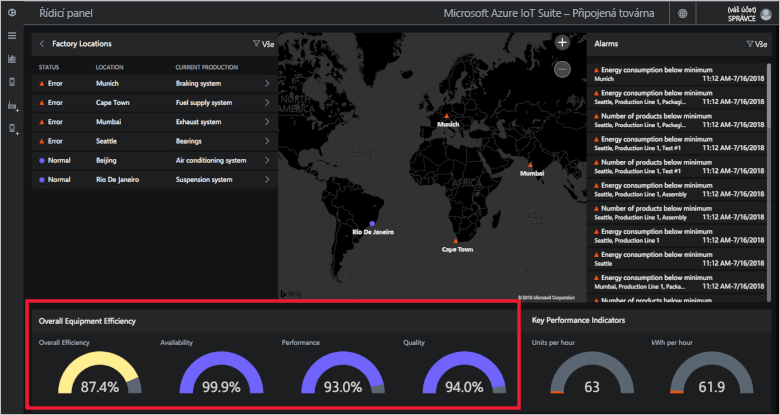](./media/quickstart-connected-factory-deploy/oee-expanded.png#lightbox)

Celková účinnost vybavení hodnotí efektivitu výrobního procesu pomocí provozních parametrů souvisejících s výrobou. Celková efektivita zařízení je v oboru standardním měřítkem a počítá se vynásobením míry dostupnosti, míry výkonu a míry kvality: OEE = dostupnost × výkon × kvalita.

Celkovou účinnost vybavení můžete hlouběji analyzovat na libovolné úrovni dat v hierarchii. Klikněte na ukazatel celkové účinnosti vybavení, dostupnosti, výkonu nebo kvality. Zobrazí se místní panel s vizualizacemi, která znázorňují data za různá časová období:

Pokud chcete data dál analyzovat, klikněte na požadovaný graf.

### Klíčové ukazatele výkonu

Panel **Klíčové ukazatele výkonu** udává počet jednotek vyrobených za hodinu a spotřebu energie (v kWh) pro celý podnik nebo továrnu / výrobní linku / stanici, kterou si právě prohlížíte. Tyto hodnoty se shromažďují od zobrazení stanice až po úroveň podniku.

[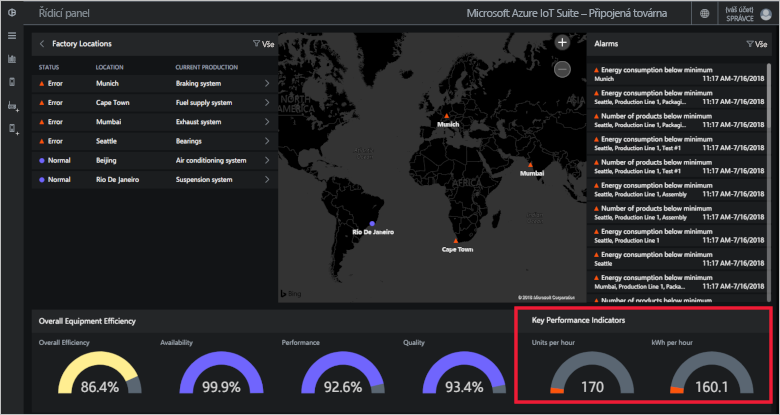](./media/quickstart-connected-factory-deploy/kpis-expanded.png#lightbox)

Klíčové ukazatele výkonu můžete hlouběji analyzovat na libovolné úrovni dat v hierarchii. Klikněte na ukazatel celkové účinnosti vybavení, dostupnosti, výkonu nebo kvality. Zobrazí se místní panel s vizualizacemi, která znázorňují data za různá časová období:

[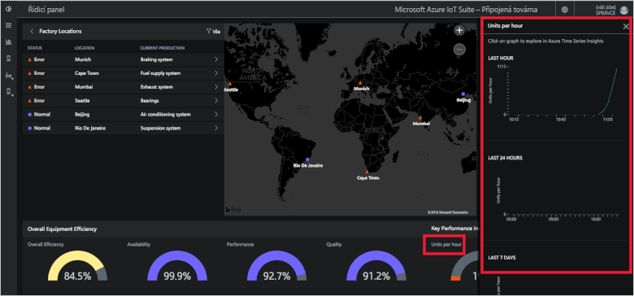](./media/quickstart-connected-factory-deploy/kpidetail-expanded.png#lightbox)

Pokud chcete data dál analyzovat, klikněte na požadovaný graf.

### Umístění továrny

Panel **Umístění továren**, na kterém se zobrazuje stav, umístění a aktuální konfigurace výroby továren v řešení. Při prvním spuštění akcelerátoru řešení se na řídicím panelu zobrazí simulovaná sada továren. Každá simulace výrobní linky se skládá ze tří skutečných serverů OPC UA, které provádějí simulované úlohy a sdílejí data. Další informace o OPC UA najdete v článku [Propojená továrna – nejčastější dotazy](iot-accelerators-faq-cf.md):

[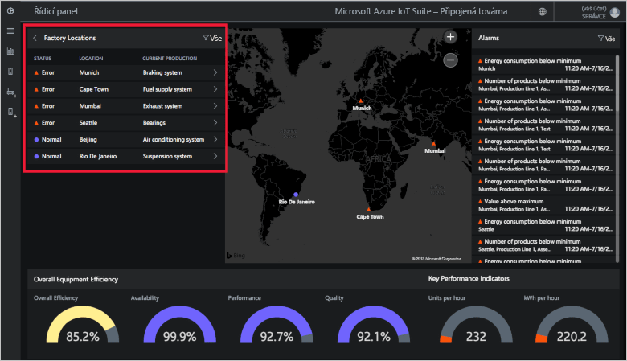](./media/quickstart-connected-factory-deploy/factorylocations-expanded.png#lightbox)

Můžete procházet hierarchii řešení a na každé úrovni si zobrazit hodnoty celkové účinnosti zařízení a klíčových ukazatelů výkonu:

1. V části **Umístění továrny** klikněte na **Mumbai**. Zobrazí se výrobní linky v tomto umístění.

1. Klikněte na **Výrobní linka 1**. Zobrazí se stanice na této výrobní lince.

1. Klikněte na **Balení**. Zobrazí se uzly OPC UA publikované touto stanicí.

1. Klikněte na **Spotřeba energie**. Zobrazí se několik grafů znázorňujících tuto hodnotu za různá časová období. Pokud chcete data dál analyzovat, klikněte na požadovaný graf.

[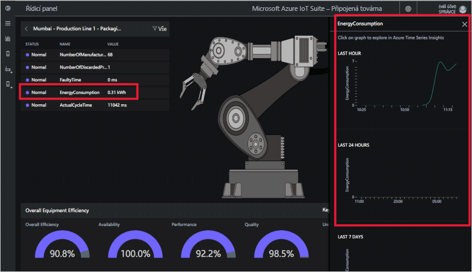](./media/quickstart-connected-factory-deploy/explorelocations-expanded.png#lightbox)

### Mapa

Pokud má vaše předplatné přístup k rozhraní [API pro Mapy Bing](iot-accelerators-faq-cf.md), na mapě *Továrny* se zobrazí zeměpisné umístění a stav všech továren v řešení. Pokud chcete zobrazit podrobnosti o umístění, klikněte na umístění zobrazená na mapě.

[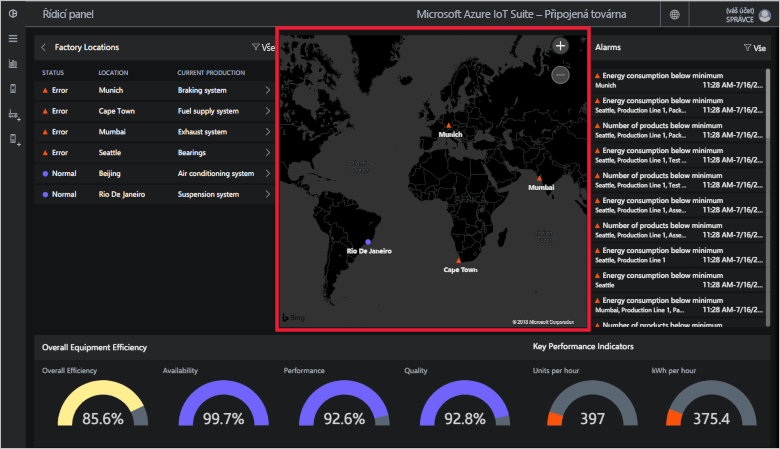](./media/quickstart-connected-factory-deploy/map-expanded.png#lightbox)

### Upozornění

Na panelu **Upozornění** se zobrazí upozornění vygenerovaná v případě, že některá hlášená hodnota nebo vypočítaná hodnota celkové efektivity zařízení nebo klíčového ukazatele výkonu překročí prahovou hodnotu. Tento panel zobrazuje upozornění na všech úrovních hierarchie, od úrovně jednotlivých stanic po úroveň celého podniku. Každé upozornění obsahuje popis, datum, čas, umístění a počet výskytů:

Na řídicím panelu můžete analyzovat data, která upozornění způsobila. Pokud jste správce, můžete na upozornění reagovat výchozími akcemi, jako jsou tyto:

* Zavřít alarm.
* Potvrdit alarm.

Klikněte na některé upozornění, v rozevírací nabídce **Zvolte akci** vyberte **Potvrdit upozornění** a klikněte na **Použít**:

[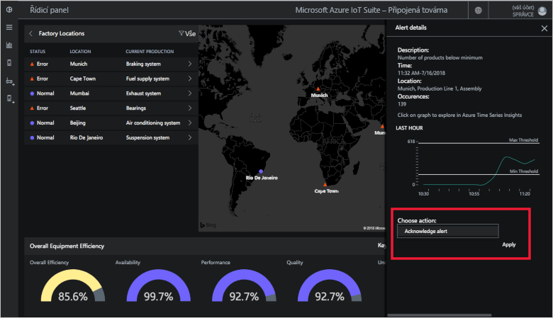](./media/quickstart-connected-factory-deploy/acknowledge-expanded.png#lightbox)

Pokud chcete hlouběji analyzovat data alarmu, klikněte na graf na panelu alarmů.

Tyto alarmy se generují podle pravidel zadaných v konfiguračním souboru v akcelerátoru řešení. Tato pravidla můžou generovat upozornění, pokud hodnoty celkové efektivity zařízení, klíčového ukazatele výkonu nebo uzlu OPC UA překročí prahovou hodnotu. Tuto prahovou hodnotu můžete nastavit.

## Vyčištění prostředků

Pokud chcete pokračovat v prozkoumávání, nechte akcelerátor řešení připojené továrny nasazený.

Pokud už akcelerátor řešení nepotřebujete, odstraňte ho na stránce [Zřízená řešení](https://www.azureiotsolutions.com/Accelerators#dashboard) tak, že ho vyberete a potom kliknete na **Odstranit řešení**:

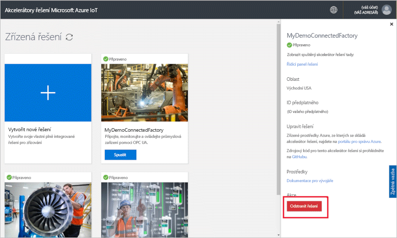

## Další postup

V tomto rychlém zprovoznění jste nasadili akcelerátor řešení připojené továrny a naučili se procházet továrny, výrobní linky a stanice. Taky jste se naučili zobrazit na libovolné úrovni hodnoty celkové účinnosti vybavení a klíčových ukazatelů výkonu a dozvěděli jste se, jak reagovat na upozornění.

Pokud chcete zjistit, jak spravovat průmyslová zařízení IoT pomocí dalších funkcí řídicího panelu, pokračujte k následujícímu průvodci:

> [!div class="nextstepaction"]
> [Použití řídicího panelu připojené továrny](iot-accelerators-connected-factory-dashboard.md)