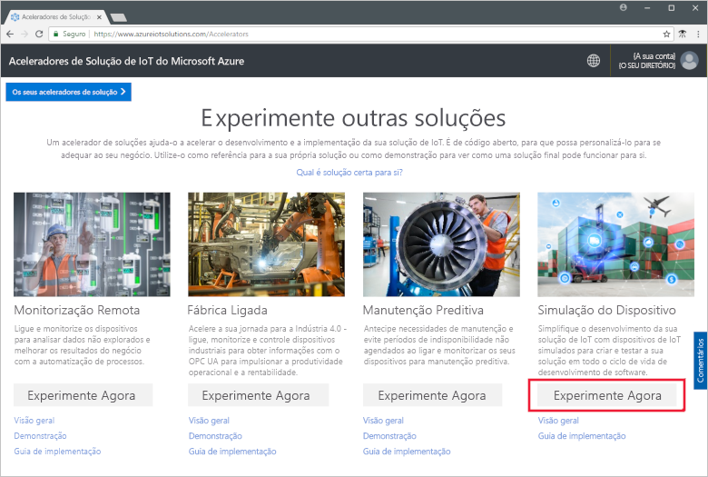
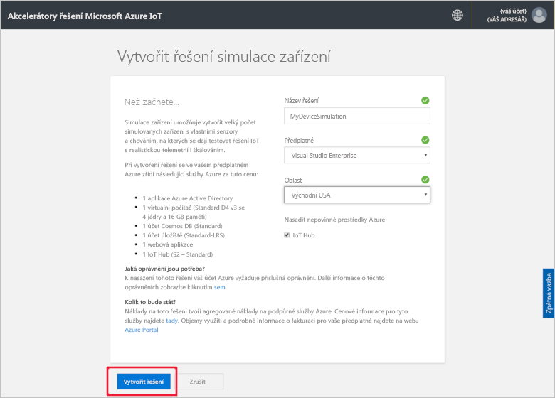
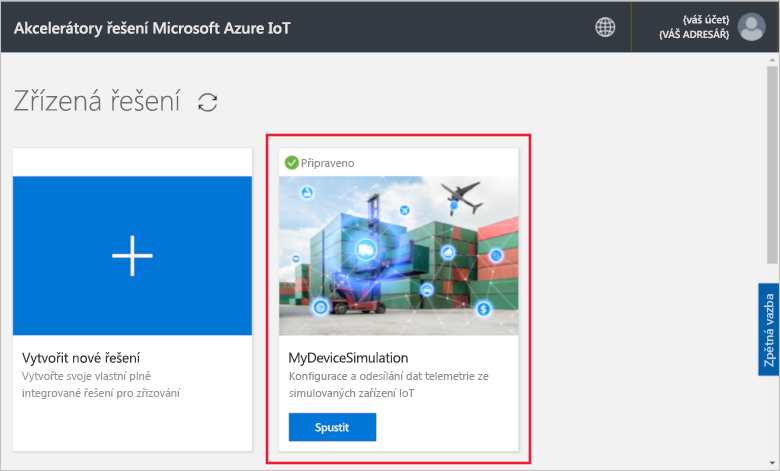
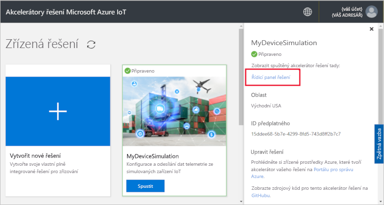
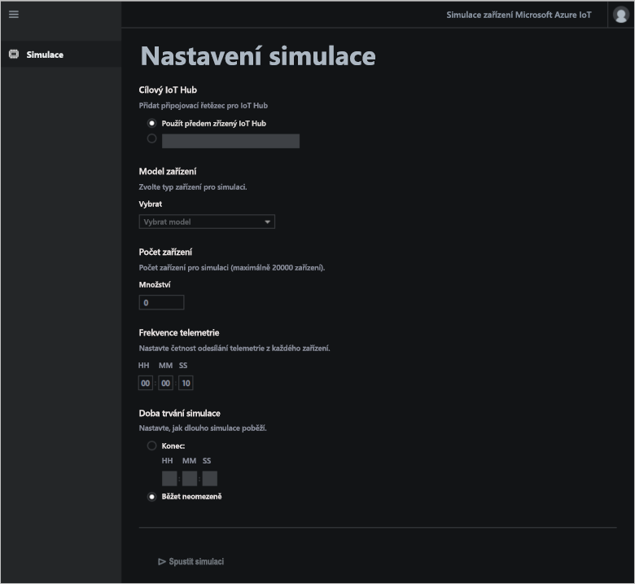
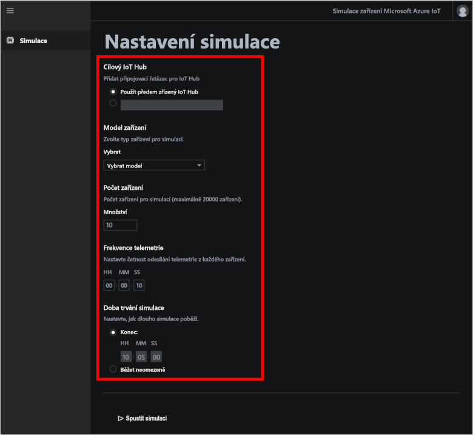
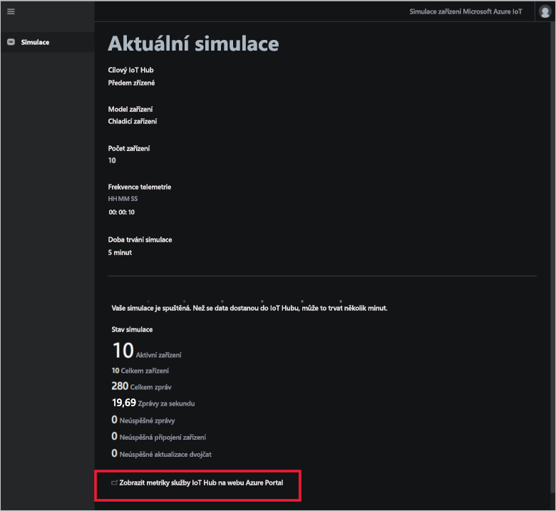
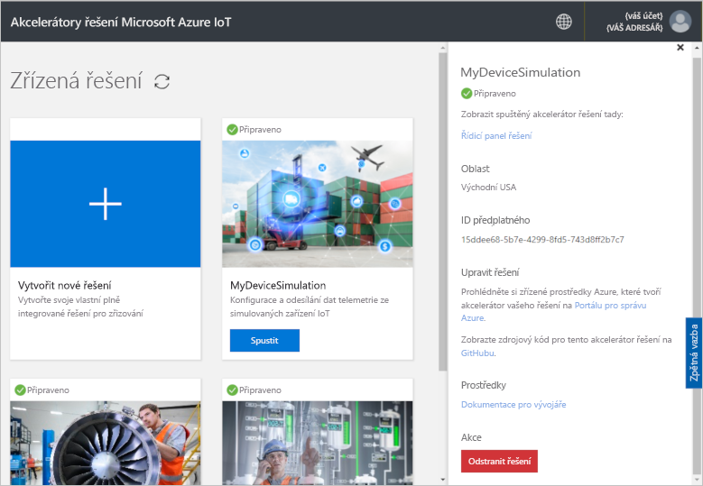

# Rychlý start: Nasazení a spuštění cloudového řešení simulace zařízení

V tomto rychlém startu se dozvíte, jak nasadit akcelerátor řešení simulace zařízení Azure IoT pro účely testování řešení IoT. Po nasazení akcelerátoru řešení na stránce **Simulace** vytvoříte a spustíte simulaci.

## Požadavky

K dokončení tohoto rychlého startu potřebujete aktivní předplatné Azure.

Pokud ještě nemáte předplatné Azure, vytvořte si [bezplatný účet](https://azure.microsoft.com/free/?WT.mc_id=A261C142F) před tím, než začnete.

## Nasazení řešení

Při nasazování akcelerátoru řešení do předplatného Azure je potřeba nastavit několik možností konfigurace.

Přihlaste se k webu [azureiotsolutions.com](https://www.azureiotsolutions.com/Accelerators) pomocí přihlašovacích údajů svého účtu Azure.

Klikněte na **Vyzkoušejte** na dlaždici **Simulace zařízení**.

Na stránce **Vytvoření řešení Simulace zařízení** zadejte jedinečný **Název řešení**. Název řešení si poznamenejte, je to název skupiny prostředků Azure, která obsahuje všechny prostředky řešení.

Vyberte **Předplatné** a **Oblast**, které chcete při nasazování akcelerátoru řešení použít. Obvykle byste měli zvolit oblast, která je vám nejblíže. V předplatném musíte být [globálním správcem nebo uživatelem](iot-accelerators-permissions.md).

Zaškrtněte políčko pro nasazení centra IoT pro použití s řešením simulace zařízení. Centrum IoT, které simulace využívá, můžete později kdykoli změnit.

Kliknutím na **Vytvořit řešení** zahájíte zřizování řešení. Dokončení tohoto procesu trvá minimálně pět minut:

## Přihlášení k řešení

Po dokončení procesu zřizování se můžete přihlásit k řídicímu panelu akcelerátoru řešení simulace zařízení.

Na stránce **Zřízená řešení** klikněte na nový akcelerátor řešení simulace zařízení:

Na panelu, který se zobrazí, si můžete prohlédnout informace o akcelerátoru řešení simulace zařízení. Zvolte **Řídicí panel řešení** a zobrazte akcelerátor řešení simulace zařízení:

Kliknutím na **Přijmout** přijměte žádost o oprávnění. Ve vašem prohlížeči se zobrazí řídicí panel řešení simulace zařízení:

## Konfigurace simulace

Simulaci nakonfigurujete a spustíte z řídicího panelu. Ke konfiguraci simulace použijte hodnoty v následující tabulce:

| Nastavení             | Hodnota                       |
| ------------------- | --------------------------- |
| Cílová služba IoT Hub      | Použít předem zřízenou službu IoT Hub |
| Model zařízení        | Chladič                     |
| Počet zařízení   | 10                          |
| Frekvence telemetrie | 10 sekund                  |
| Doba trvání simulace | 5 minut                   |

## Spuštění simulace

Klikněte na **Spustit simulaci**. Simulace bude spuštěná po vámi zvolenou dobu. Simulaci můžete kdykoli zastavit kliknutím na **Zastavit simulaci**. Simulace ukazuje statistiku aktuálního spuštění. Kliknutím na **Zobrazit metriky služby IoT Hub na webu Azure Portal** zobrazte metriky hlášené centrem IoT:

Z každé zřízené instance akcelerátoru řešení můžete spustit pouze jednu simulaci najednou.

## Vyčištění prostředků

Pokud chcete pokračovat v prozkoumávání, ponechte akcelerátor řešení simulace zařízení nasazený.

Pokud už akcelerátor řešení nepotřebujete, odstraňte ho na stránce [Zřízená řešení](https://www.azureiotsolutions.com/Accelerators#dashboard):

## Další kroky

V tomto rychlém startu jste nasadili akcelerátor řešení simulace zařízení a spustili jste simulaci zařízení IoT.

Informace o tom, jak v simulaci použít stávající službu IoT Hub, najdete v této příručce:

> [!div class="nextstepaction"]
> [Použití stávajícího centra IoT s akcelerátorem řešení simulace zařízení](iot-accelerators-device-simulation-choose-hub.md)