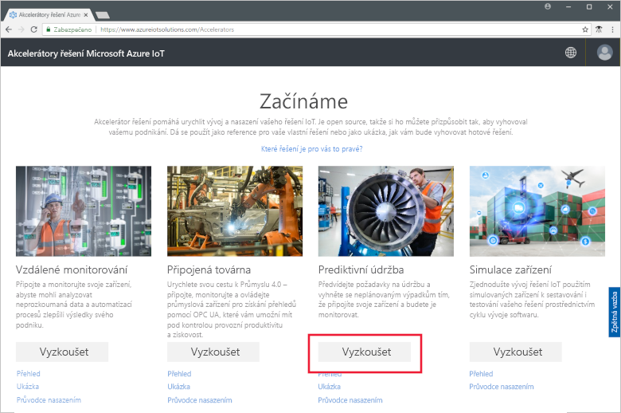
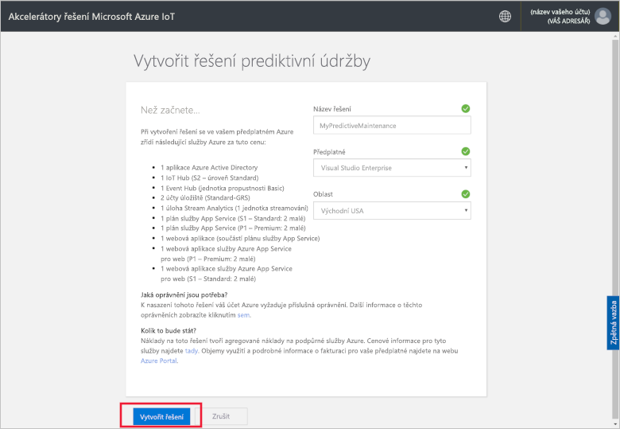
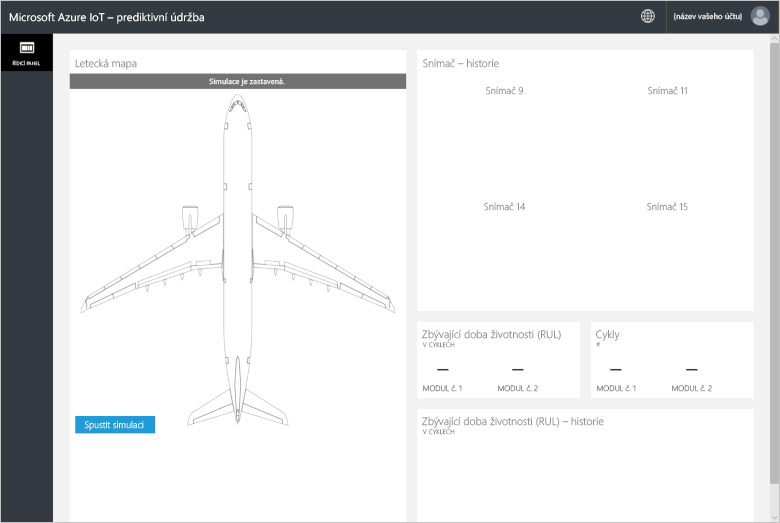
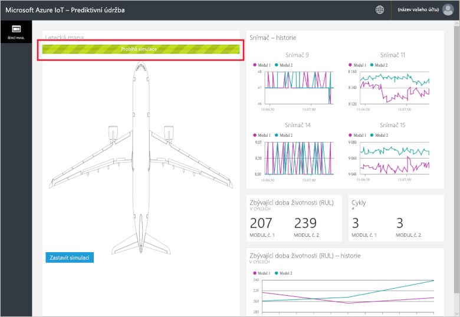
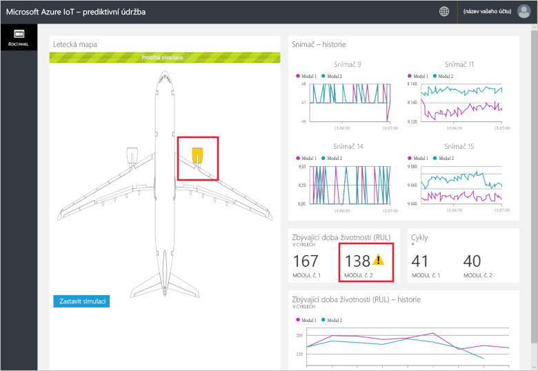
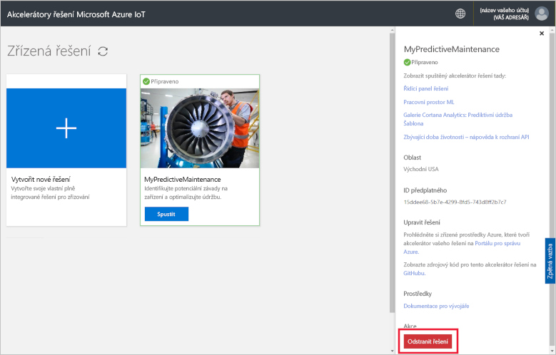

# Rychlý start: Zkuste cloudové řešení pro spuštění analýzy prediktivní údržby na připojené zařízení

V tomto rychlém startu se dozvíte, jak nasadit akcelerátor řešení prediktivní údržby Azure IoT, abyste mohli spustit cloudovou simulaci prediktivní údržby. Po nasazení akcelerátoru řešení spustíte na stránce **řídicího panelu** řešení analýzu prediktivní údržby u dat ze simulace leteckého motoru. Tento akcelerátor řešení můžete využít jako výchozí bod pro vlastní implementaci nebo jako učební nástroj.

V simulaci Fabrikam představuje regionální leteckou společnost, která se zaměřuje na pohodlí zákazníků za konkurenční ceny. Jednou z příčin zpoždění letů jsou problémy s údržbou, protože údržba leteckých motorů je velmi náročná. Společnost Fabrikam musí za každou cenu zabránit poruchám motorů během letu, a proto své motory pravidelně kontroluje a plánuje údržbu v souladu s plánem. Letecké motory se ale neopotřebovávají všechny stejně. Některou údržbu motorů není vždy nutné provádět. Naproti tomu se můžou vyskytnout problémy, kvůli kterým musí letadlo zůstat na zemi, dokud není opravené. Pokud je letadlo v místě, kde nejsou k dispozici vhodní technici nebo náhradní díly, pak tyto problémy můžou být zvláště nákladné.

Motory letadel společnosti Fabrikam jsou vybaveny snímači, které monitorují stav motoru během letu. Společnost Fabrikam má z těchto snímačů roky dat o provozu a selháních motorů. Odborníci přes data ve společnosti Fabrikam využili tato data k vytvoření modelu, který předvídá zbývající dobu životnosti (RUL) motorů letadel. Tento model využívá korelaci mezi daty ze čtyř snímačů v motoru a opotřebením motoru, které vede k jeho případnému selhání. I když společnost Fabrikam stále provádí pravidelné bezpečnostní kontroly, teď může pomocí modelů vypočítat zbývající dobu životnosti jednotlivých motorů po každém letu. Společnost Fabrikam teď může předpovídat budoucí selhání a plánovat údržbu tak, aby se minimalizovaly prostoje letadel. Tento proces snižuje provozní náklady a současně zajišťuje bezpečnost cestujících i posádek.

K dokončení tohoto rychlého startu potřebujete aktivní předplatné Azure.

Pokud ještě nemáte předplatné Azure, vytvořte si [bezplatný účet](https://azure.microsoft.com/free/?WT.mc_id=A261C142F) před tím, než začnete.

## Nasazení řešení

Při nasazování akcelerátoru řešení do předplatného Azure je potřeba nastavit několik možností konfigurace.

Přejděte na web [Akcelerátory řešení Microsoft Azure IoT](https://www.azureiotsolutions.com) a přihlaste se pomocí přihlašovacích údajů vašeho účtu Azure.

Klikněte na dlaždici **Prediktivní údržba**. Na stránce **Prediktivní údržba** klikněte na **Vyzkoušet**:

Na stránce **vytvoření řešení prediktivní údržby** zadejte jedinečný **název řešení** pro akcelerátor řešení prediktivní údržby. Pro účely tohoto rychlého startu používáme název **MyPredictiveMaintenance**.

Vyberte **Předplatné** a **Oblast**, které chcete při nasazování akcelerátoru řešení použít. Obvykle byste měli zvolit oblast, která je vám nejblíže. V tomto rychlém zprovoznění používáme možnosti **Visual Studio Enterprise** a **Východní USA**. V předplatném musíte být [globálním správcem nebo uživatelem](iot-accelerators-permissions.md).

Klikněte na tlačítko **vytvořit** spusťte nasazení. Dokončení tohoto procesu trvá minimálně pět minut:

## Přihlášení k řešení

Po dokončení nasazení předplatného Azure se na dlaždici řešení zobrazí zelené zaškrtnutí a **Připraveno**. Nyní se můžete přihlásit k řídicímu panelu akcelerátoru řešení prediktivní údržby.

Na stránce **Zřízená řešení** klikněte na nový akcelerátor řešení prediktivní údržby.

 Informace o akcelerátor řešení můžete zobrazit na stránce, které se zobrazí. Zvolte **přejít na akcelerátor řešení** zobrazíte akcelerátor řešení prediktivní údržby:

Kliknutím na **Přijmout** přijměte žádost o oprávnění. Ve vašem prohlížeči se zobrazí řídicí panel řešení prediktivní údržby:

Kliknutím na **Spustit simulaci** zahajte simulaci. Na řídicím panelu se zobrazí historie hodnot snímačů, zbývající doba životnosti (RUL), počet cyklů a historie hodnot RUL:

Když je zbývající doba životnosti (RUL) nižší než 160 (libovolná prahová hodnota zvolená pro demonstrační účely), portál řešení zobrazí vedle hodnoty RUL symbol upozornění. Portál řešení také zvýrazní daný motor letadla žlutou barvou. Můžete si všimnout, že hodnoty zbývající doby životnosti (RUL) mají obecné klesající trend, ale kolísají nahoru a dolů. Toto chování vyplývá z různých délek cyklu a přesnosti modelu.

Při úplné simulaci trvá dokončení 148 cyklů asi 35 minut. Prahová hodnota 160 pro zbývající dobu životnosti (RUL) je poprvé dosažena přibližně po 5 minutách simulace a oba motory se na tuto hodnotu dostanou přibližně po 8 minutách.

Simulace zpracuje úplnou datovou sadu s údaji o 148 cyklech a vytvoří konečnou hodnotu RUL a cyklů.

Simulaci lze zastavit v libovolný okamžik, ale kliknutím na tlačítko **Start simulace** spustíte simulaci znovu od začátku datové sady.

## Vyčištění prostředků

Pokud chcete pokračovat v prozkoumávání, ponechte akcelerátor řešení prediktivní údržby nasazený.

Pokud už akcelerátor řešení nepotřebujete, odstraňte ho na stránce [Zřízená řešení](https://www.azureiotsolutions.com/Accelerators#dashboard) tak, že ho vyberete a pak kliknete na **Odstranit řešení**:

## Další postup

V tomto rychlém startu jste nasadili akcelerátor řešení prediktivní údržby a spustili jste simulaci.

Další informace o akcelerátoru řešení a simulovaných leteckých motorech najdete v následujícím článku.

> [!div class="nextstepaction"]
> [Přehled akcelerátorů řešení prediktivní údržby](iot-accelerators-predictive-walkthrough.md)
