# Rychlý start: Vyzkoušení cloudového řešení pro vzdálené monitorování

V tomto rychlém startu se dozvíte, jak nasadit akcelerátor řešení pro vzdálené monitorování Azure IoT. V tomto cloudovém řešení použijete stránku **Řídicí panel** k vizualizaci simulovaných zařízení na mapě a stránku **Údržba** k reakci na upozornění na tlak ze simulovaného chladícího zařízení. Tento akcelerátor řešení můžete využít jako výchozí bod pro vlastní implementaci nebo jako učební nástroj.

V počátečním nasazení se akcelerátor řešení nakonfiguruje pro společnost Contoso. Jako operátor ve společnosti Contoso spravujete výběr různých typů zařízení, například chladiče, nasazených v různých fyzických prostředích. Chladící zařízení do akcelerátoru řešení pro vzdálené monitorování odesílá telemetrická data o teplotě, vlhkosti a tlaku.

V tomto rychlém startu se nasadí **základní** verze akcelerátoru řešení pro testovací a demonstrační účely, které minimalizují náklady. Další informace o různých verzích, které můžete nasadit, najdete v tématu [základní a standardní nasazení](iot-accelerators-remote-monitoring-deploy-cli.md#basic-and-standard-deployments).

K dokončení tohoto rychlého startu potřebujete aktivní předplatné Azure.

Pokud ještě nemáte předplatné Azure, vytvořte si napřed [bezplatný účet](https://azure.microsoft.com/free/?WT.mc_id=A261C142F).

## Nasazení řešení

Při nasazování akcelerátoru řešení do předplatného Azure je potřeba nastavit několik možností konfigurace.

Přihlaste se k webu [azureiotsolutions.com](https://www.azureiotsolutions.com/Accelerators) pomocí přihlašovacích údajů svého účtu Azure.

Klikněte na dlaždici **vzdálené monitorování** . Na stránce **vzdálené monitorování** klikněte na možnost **vyzkoušet nyní**:

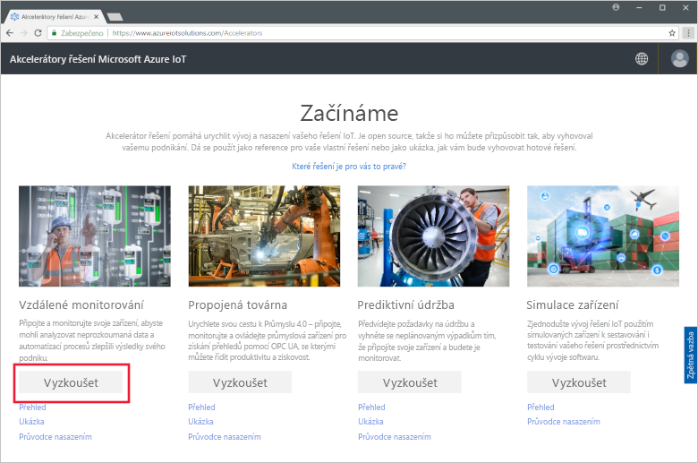

Jako **Možnosti nasazení**vyberte **mikroslužby C#** . Implementace Java a C# mají stejné funkce.

Zadejte jedinečný **Název řešení** pro váš akcelerátor řešení pro vzdálené monitorování. Pro tento rychlý Start voláme náš **Contoso-RM**.

Vyberte **Předplatné** a **Oblast**, které chcete při nasazování akcelerátoru řešení použít. Obvykle byste měli zvolit oblast, která je vám nejblíže. V tomto rychlém startu používáme **východní USA**.
Můžete vybrat **Visual Studio Enterprise**, ale musíte být [globálním správcem nebo uživatelem](iot-accelerators-permissions.md) .

Chcete-li zahájit nasazení, klikněte na tlačítko **vytvořit**. Dokončení tohoto procesu trvá minimálně pět minut:

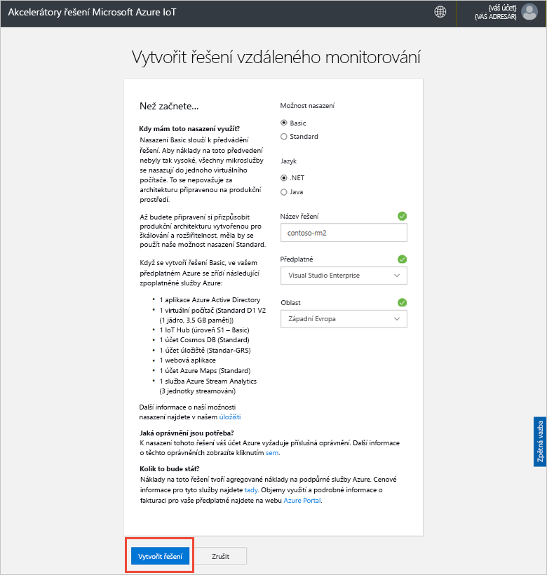

## Přihlášení k řešení

Po dokončení nasazení předplatného Azure se na dlaždici řešení zobrazí zelené zaškrtnutí a **Připraveno**. Teď se můžete přihlásit k řídicímu panelu akcelerátoru řešení pro vzdálené monitorování.

Na stránce **Zřízená řešení** klikněte na nový akcelerátor řešení pro vzdálené monitorování:

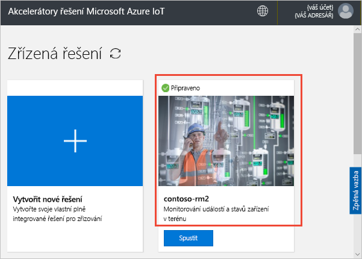

Na panelu, který se zobrazí, si můžete prohlédnout informace o akcelerátoru řešení pro vzdálené monitorování. Zvolením možnosti **Přejít do akcelerátoru řešení** můžete zobrazit akcelerátor řešení vzdáleného monitorování:

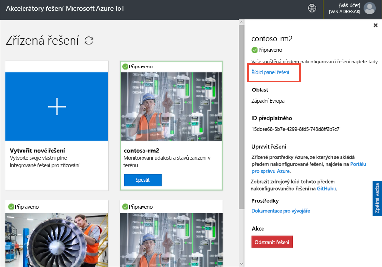

Kliknutím na **Přijmout** přijměte žádost o oprávnění. Ve vašem prohlížeči se zobrazí řídicí panel řešení pro vzdálené monitorování:

[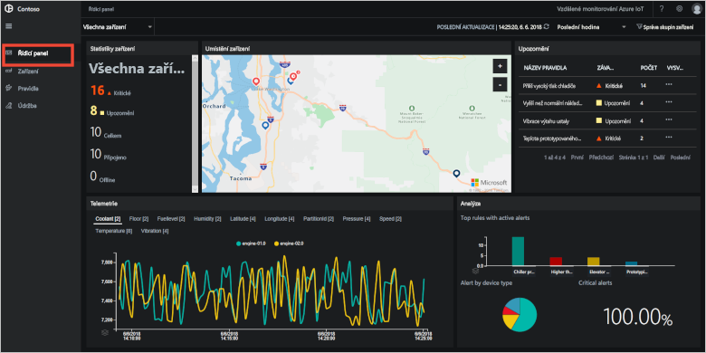](./media/quickstart-remote-monitoring-deploy/solutiondashboard-expanded.png#lightbox)

## Zobrazení zařízení

Na řídicím panelu řešení se zobrazí následující informace o simulovaných zařízeních společnosti Contoso:

* Na panelu **Statistika zařízení** se zobrazí souhrnné informace o upozorněních a celkový počet zařízení. Ve výchozím nasazení má Contoso 10 simulovaných zařízení různých typů.

* Na panelu **Umístění zařízení** se zobrazí fyzické umístění zařízení. Barva připínáčku značí případná upozornění ze zařízení.

* Na panelu **Upozornění** se zobrazí podrobnosti o upozorněních ze zařízení.

* Na panelu **Telemetrie** se zobrazí telemetrická data ze zařízení. Kliknutím na různé typy telemetrie v horní části můžete zobrazit různé datové proudy telemetrie.

* Na panelu **Analýza** se zobrazí kombinované informace o upozorněních ze zařízení.

## Reakce na upozornění

Jako operátor ve společnosti Contoso můžete z řídicího panelu řešení monitorovat vaše zařízení. Panel **Statistika zařízení** ukazuje, že došlo k několika kritickým upozorněním, a panel **Upozornění** ukazuje, že většina z nich pochází z chladícího zařízení. V případě chladících zařízení společnosti Contoso vnitřní tlak vyšší než 250 PSI značí, že zařízení nefunguje správně.

### Identifikace problému

Na stránce **Řídicí panel** na panelu **Upozornění** si můžete všimnout upozornění **Příliš vysoký tlak chladiče**. Chladič má na mapě červený připínáček (možná budete muset mapu posunout a přiblížit):

[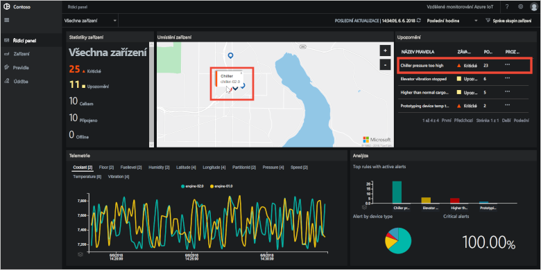](./media/quickstart-remote-monitoring-deploy/dashboardalarm-expanded.png#lightbox)

Na panelu **Upozornění** klikněte ve sloupci **Prozkoumat** na **...** vedle pravidla **Příliš vysoký tlak chladiče**. Tato akce vás přesměruje na stránku **Údržba**, kde si můžete prohlédnout podrobnosti o pravidle, které upozornění aktivovalo.

Na stránce údržby **Příliš vysoký tlak chladiče** se zobrazí podrobnosti o pravidle, které aktivovalo upozornění. Stránka také uvádí, kdy k upozorněním došlo a které zařízení je aktivovalo:

[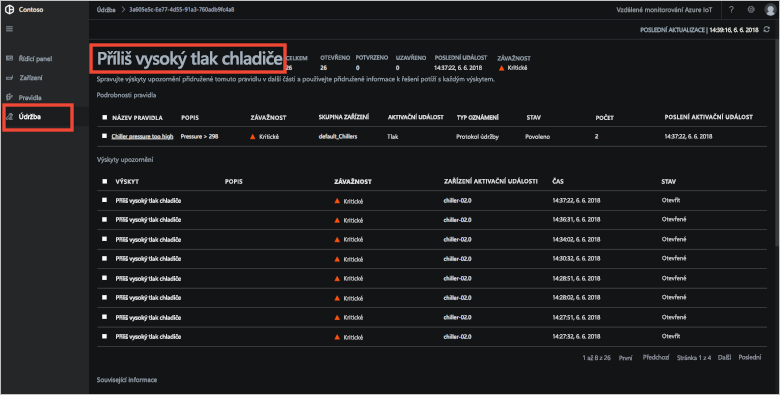](./media/quickstart-remote-monitoring-deploy/maintenancealarmlist-expanded.png#lightbox)

Právě jste identifikovali problém, který upozornění aktivoval, a přidružené zařízení. Jako operátor byste dále měli upozornění vzít na vědomí a opravit problém.

### Oprava problému

Abyste ostatním operátorům dali najevo, že na upozornění pracujete, vyberte ho a změňte **Stav upozornění** na **Potvrzeno**:

[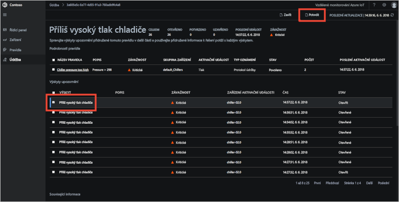](./media/quickstart-remote-monitoring-deploy/maintenanceacknowledge-expanded.png#lightbox)

Hodnota ve sloupci stavu se změní na **Potvrzeno**.

Pokud chcete pracovat na chladiči, posuňte se dolů do části **Související informace**, v seznamu **Zařízení s oznámeními** vyberte chladící zařízení a pak zvolte **Úlohy**:

[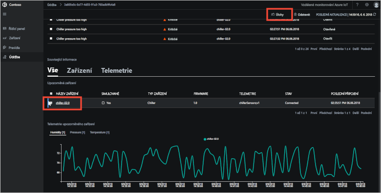](./media/quickstart-remote-monitoring-deploy/maintenanceschedule-expanded.png#lightbox)

Na panelu **Úlohy** vyberte **Spustit metodu** a pak metodu **EmergencyValveRelease**. Přidejte název úlohy **ChillerPressureRelease** a klikněte na **Použít**. Tato nastavení pro vás vytvoří úlohu, která se okamžitě spustí.

Pokud chcete zobrazit stav úlohy, vraťte se na stránku **Údržba** a prohlédněte si seznam úloh v zobrazení **Úlohy**. Možná budete muset počkat několik sekund, než uvidíte, že se úloha spustila:

[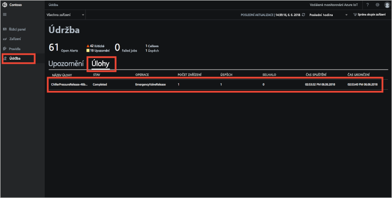](./media/quickstart-remote-monitoring-deploy/maintenancerunningjob-expanded.png#lightbox)

### Kontrola návratu tlaku do normálního stavu

Pokud chcete zobrazit telemetrická data o tlaku v chladiči, přejděte na stránku **Řídicí panel**, na panelu telemetrie vyberte **Tlak** a zkontrolujte, že je tlak v zařízení **chiller-02.0** opět v normálu:

[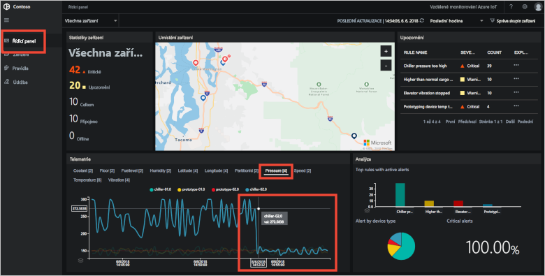](./media/quickstart-remote-monitoring-deploy/pressurenormal-expanded.png#lightbox)

Pokud chcete incident uzavřít, přejděte na stránku **Údržba**, vyberte upozornění a nastavte jeho stav na **Uzavřeno**:

[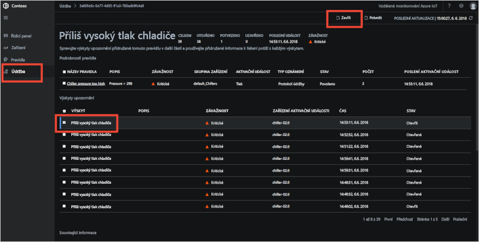](./media/quickstart-remote-monitoring-deploy/maintenanceclose-expanded.png#lightbox)

Hodnota ve sloupci stavu se změní na **Uzavřeno**.

## Vyčištění prostředků

Pokud se budete chtít přesunout ke kurzům, ponechte akcelerátor řešení pro vzdálené monitorování nasazený.

Pokud už akcelerátor řešení nepotřebujete, odstraňte ho ze stránky [zřízené řešení](https://www.azureiotsolutions.com/Accelerators#dashboard) , a to tak, že ho vyberete a pak kliknete na **Odstranit řešení**:

## Další kroky

V tomto rychlém startu jste nasadili akcelerátor řešení pro vzdálené monitorování a dokončili jste úlohu monitorování s využitím simulovaných zařízení ve výchozím nasazení Contoso.

Další informace o akcelerátoru řešení se simulovanými zařízeními získáte v následujícím kurzu.

> [!div class="nextstepaction"]
> [Kurz: Monitorování zařízení IoT](iot-accelerators-remote-monitoring-monitor.md)