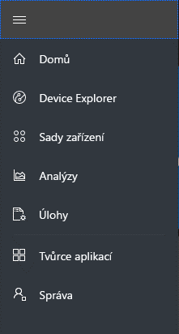
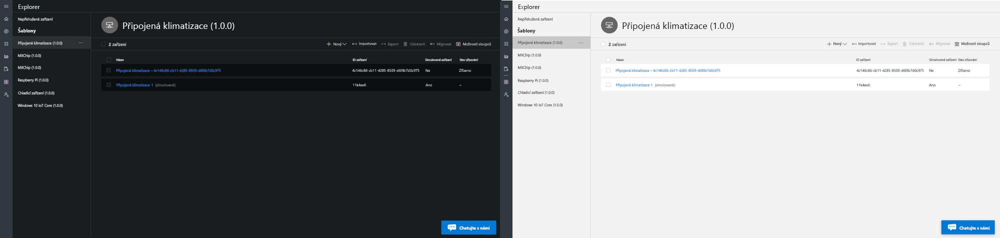
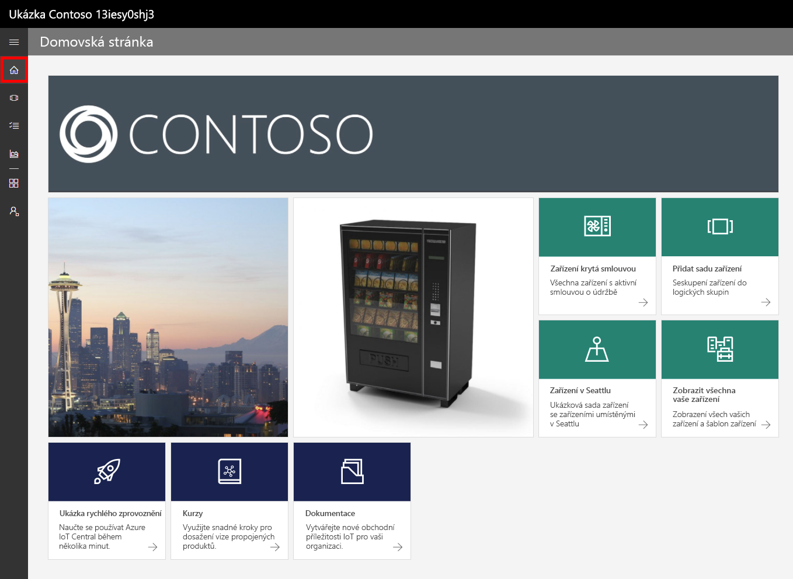
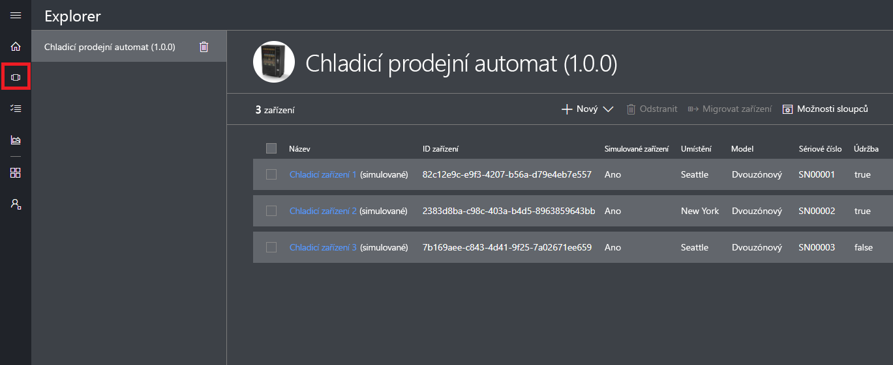
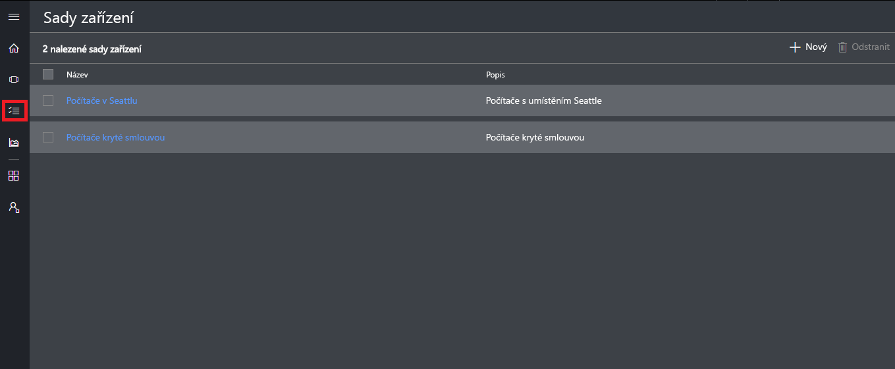
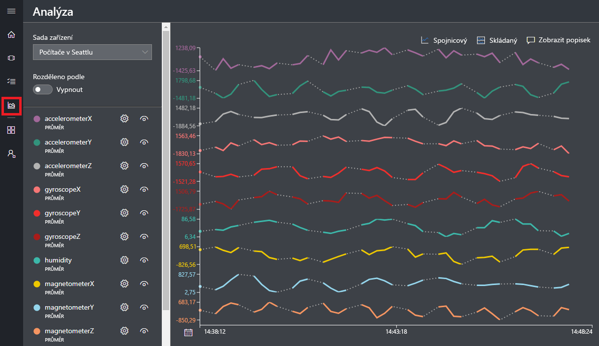
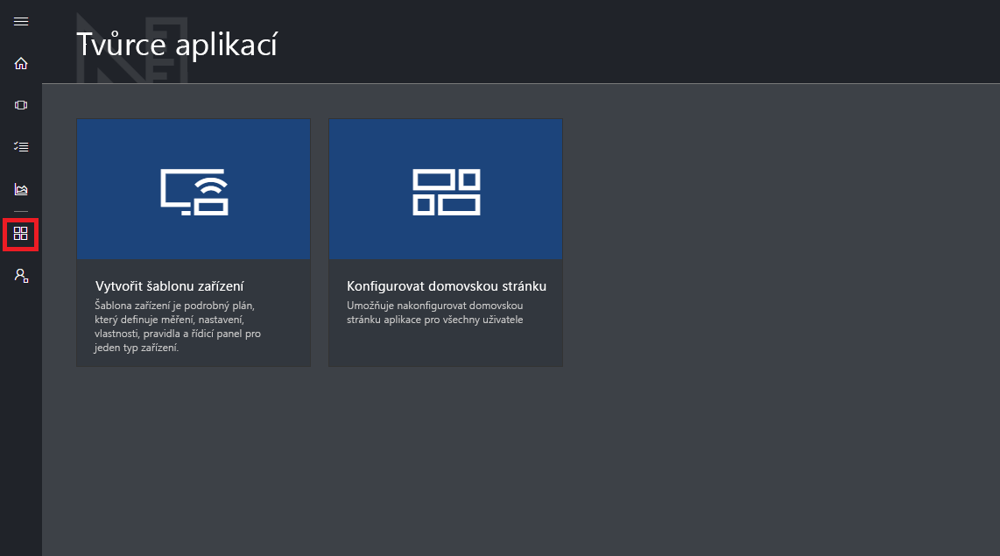
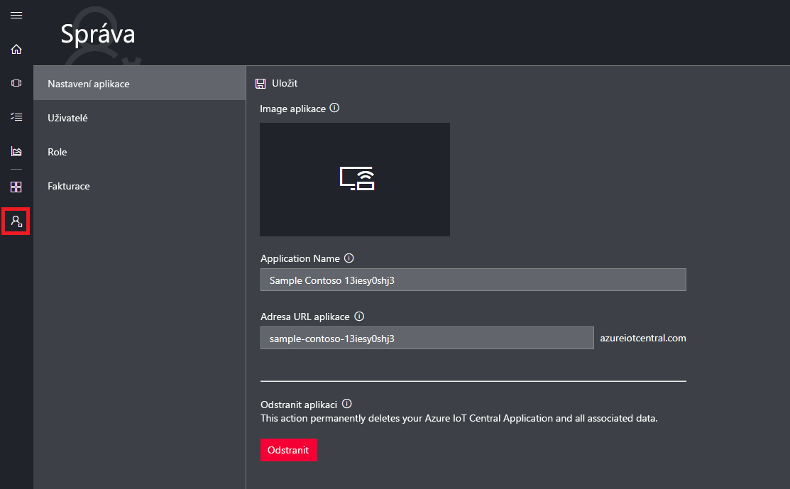

# Prohlídka uživatelského rozhraní Azure IoT Central

Tento článek vás seznámí s uživatelským rozhraním Microsoft Azure IoT Central. Pomocí uživatelského rozhraní můžete vytvořit, spravovat a používat řešení Azure IoT Central a připojená zařízení.

Jako _tvůrce_ můžete pomocí uživatelského rozhraní Azure IoT Central definovat své řešení Azure IoT Central. V uživatelském rozhraní můžete provést tyto kroky:

- Definovat typy zařízení, která se budou k řešení připojovat
- Nakonfigurovat pravidla a akce pro vaše zařízení
- Přizpůsobit uživatelské rozhraní pro _operátora_, který vaše řešení používá

Jako _operátor_ můžete pomocí uživatelského rozhraní Azure IoT Central spravovat řešení Azure IoT Central. V uživatelském rozhraní můžete provést tyto kroky:

- Monitorovat zařízení
- Konfigurovat zařízení
- Řešit potíže a odstraňovat problémy se zařízeními
- Zřizovat nová zařízení.

## Použití levé navigační nabídky

Pomocí levé navigační nabídky můžete získat přístup k různým oblastem aplikace:

| Nabídka | Popis |
| ---- | ----------- |
|  | <ul><li>Tlačítko **Home** (Domů) zobrazí domovskou stránku vaší aplikace. Jako tvůrce můžete tuto domovskou stránku přizpůsobit pro operátory.</li><li>Tlačítkem **Device Explorer** (Průzkumník zařízení) zobrazíte seznam šablon zařízení definovaných ve vaší aplikací a simulovaných i skutečných zařízení přidružených k jednotlivým šablonám zařízení. Jako operátor můžete tlačítko **Device Explorer** (Průzkumník zařízení) použít ke správě připojených zařízení.</li><li>Tlačítko **Device Sets** (Sady zařízení) umožňuje zobrazit a nastavit sady zařízení. Jako operátor můžete vytvořit sady zařízení představující logické kolekce zařízení specifikovaných určitým dotazem.</li><li>Tlačítko **Analytics** (Analýzy) zobrazuje analýzy odvozené z telemetrických dat pro zařízení a sady zařízení. Jako operátor můžete vedle dat zařízení vytvářet vlastní zobrazení, která vám pomůžou získat z aplikace požadované informace.</li><li>Tlačítko **Jobs** (Úlohy) umožňuje hromadnou správu zařízení tím, že vás nechá vytvořit a spustit úlohy pro provedení aktualizací škálovaně.</li><li>Tlačítko **Application Builder** (Tvůrce aplikací) zobrazí nástroje používané tvůrcem, třeba nástroj **Create Device Template** (Vytvořit šablonu zařízení).</li><li>Tlačítko **Administration** (Správa) zobrazí stránky správy aplikace, kde může správce spravovat nastavení aplikace, uživatele a role.</li></ul> |

## Hledání, nápověda a podpora

Na každé stránce se zobrazuje horní nabídka:

- Pokud chcete hledat zařízení a šablony zařízení, použijte ikonu **Hledání**.
- Pokud potřebujete nápovědu a podporu, otevřete rozevírací nabídku **Nápověda**, která obsahuje seznam zdrojů.
- Pokud chcete ovládat kurzy, změnit motiv uživatelského rozhraní nebo se odhlásit z aplikace, vyberte ikonu **Účet**.

Můžete si vybrat mezi světlým a tmavým motivem uživatelského rozhraní:

## Domovská stránka

Domovská stránka je první stránka, která se zobrazí, když se přihlásíte do aplikace Azure IoT Central. Jako tvůrce můžete domovskou stránku přizpůsobit pro jiné uživatele aplikace pomocí dlaždic. Další informace najdete v kurzu [Přizpůsobení zobrazení Azure IoT Central pro operátora](tutorial-customize-operator.md).

## Průzkumník zařízení

Stránka průzkumníka obsahuje _šablony zařízení_ a _zařízení_ ve vaší aplikaci Azure IoT Central.

* Šablona zařízení definuje typ zařízení, které se může připojit k vaší aplikaci. Další informace najdete v tématu [Definování nového typu zařízení v aplikaci Azure IoT Central](tutorial-define-device-type.md).
* Zařízení představuje v aplikaci buď skutečné, nebo simulované zařízení. Další informace najdete v tématu [Přidání nového zařízení do aplikace Azure IoT Central](tutorial-add-device.md).

## Sady zařízení

Stránka _Device Sets_ (Sady zařízení) obsahuje sady zařízení vytvořené tvůrcem. Sada zařízení je kolekce souvisejících zařízení. Tvůrce definuje dotaz, který určí zařízení obsažená v určité sadě zařízení. Sady zařízení se používají při přizpůsobování analýz ve vaší aplikaci. Další informace najdete v článku [Použití sad zařízení v aplikaci Azure IoT Central](howto-use-device-sets.md).

## Analýzy

Stránka analýz obsahuje grafy, které vám pomáhají pochopit chování zařízení připojených k aplikaci. Operátor pomocí této stránky monitoruje a zkoumá problémy s připojenými zařízeními. Tvůrce může určit, jaké grafy se mají na této stránce zobrazovat. Další informace najdete v článku [Vytvoření vlastních analýz pro aplikaci Azure IoT Central](howto-create-analytics.md).

## Úlohy

Stránka úloh vám umožňuje provádět operace hromadné správy vašeho zařízení. Tvůrce tuto stránku používá k aktualizaci vlastností zařízení, nastavení a příkazů. Další informace najdete v článku o [spuštění úlohy](howto-run-a-job.md).

## Tvůrce aplikací

Stránka tvůrce aplikací obsahuje odkazy na nástroje, které tvůrce používá k vytvoření aplikace Azure IoT Central, třeba k vytváření šablon zařízení a konfiguraci domovské stránky. Další informace najdete v kurzu [Definování nového typu zařízení v aplikaci Azure IoT Central](tutorial-define-device-type.md).

## Správa

Stránka správy obsahuje odkazy na nástroje používané správcem, třeba k definování uživatelů a rolí v aplikaci. Další informace najdete v článku [Správa aplikace Azure IoT Central](howto-administer.md).

## Další postup

Přečetli jste si přehled Azure IoT Central a orientujete se v rozložení uživatelského rozhraní. Jako další krok vám doporučujeme rychlý start [Vytvoření aplikace Azure IoT Central](quick-deploy-iot-central.md).