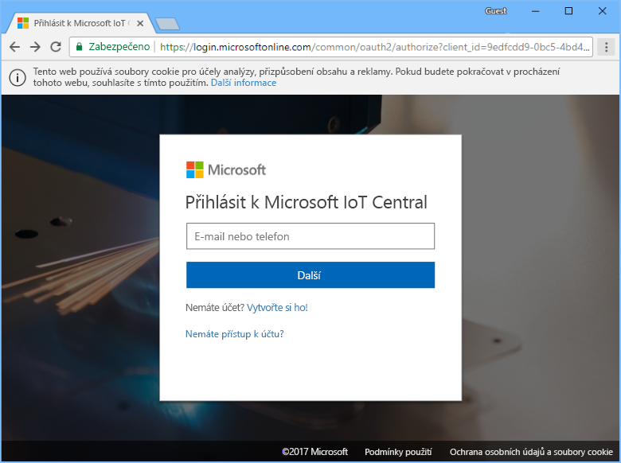
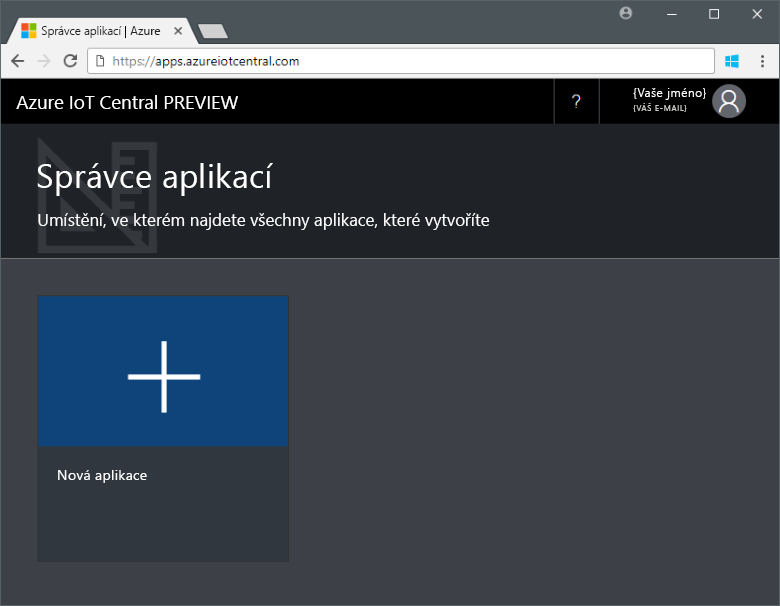
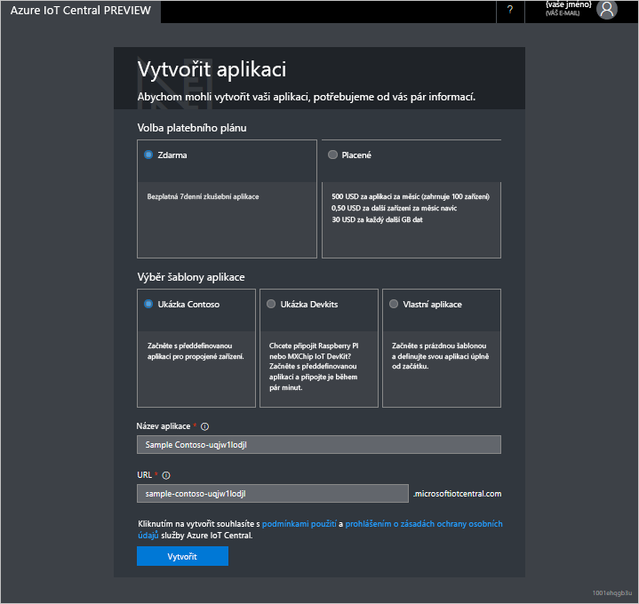

# Vytvoření aplikace Azure IoT Central

Jako _tvůrce_ můžete pomocí uživatelského rozhraní Azure IoT Central definovat vaši aplikaci Azure IoT Central. V tomto rychlém startu se dozvíte, jak vytvořit aplikaci Azure IoT Central, která obsahuje ukázkovou _šablonu zařízení_ a simulovaná _zařízení_.

## Vytvoření aplikace

K dokončení tohoto rychlého startu musíte vytvořit aplikaci Azure IoT Central z aplikační šablony **Sample Contoso**.

Přejděte na stránku [správce aplikací](https://aka.ms/iotcentral) Azure IoT Central. Potom zadejte e-mailovou adresu a heslo, které používáte pro přístup k vašemu předplatnému Azure:

Pokud chcete začít vytvářet novou aplikaci Azure IoT Central, zvolte **New Application** (Nová aplikace):

Vytvoření nové aplikace Azure IoT Central:

1. Zvolte platební plán **Free Trial Application**.
1. Zvolte popisný název, jako je třeba **Contoso IoT**. Azure IoT Central pro vás vygeneruje jedinečnou předponu URL. Tuto předponu URL můžete změnit, aby byla snáze zapamatovatelná.
1. Zvolte šablonu aplikace **Sample Contoso**.
1. Potom zvolte **Create** (Vytvořit).

## Další kroky

V tomto rychlém startu jste vytvořili předem naplněnou aplikaci Azure IoT Central, která obsahuje šablonu zařízení **Refrigerated Vending Machine** a simulovaná zařízení. Pokud se jako tvůrce chcete dozvědět víc o definování vlastních šablon zařízení, projděte si téma věnované [definování nové šablony zařízení ve vaší aplikaci](tutorial-define-device-type.md).
