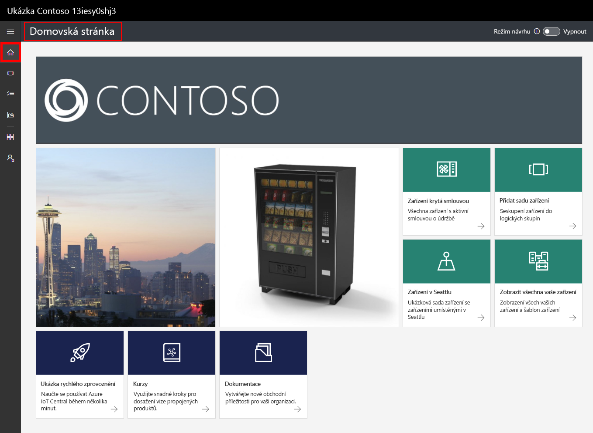
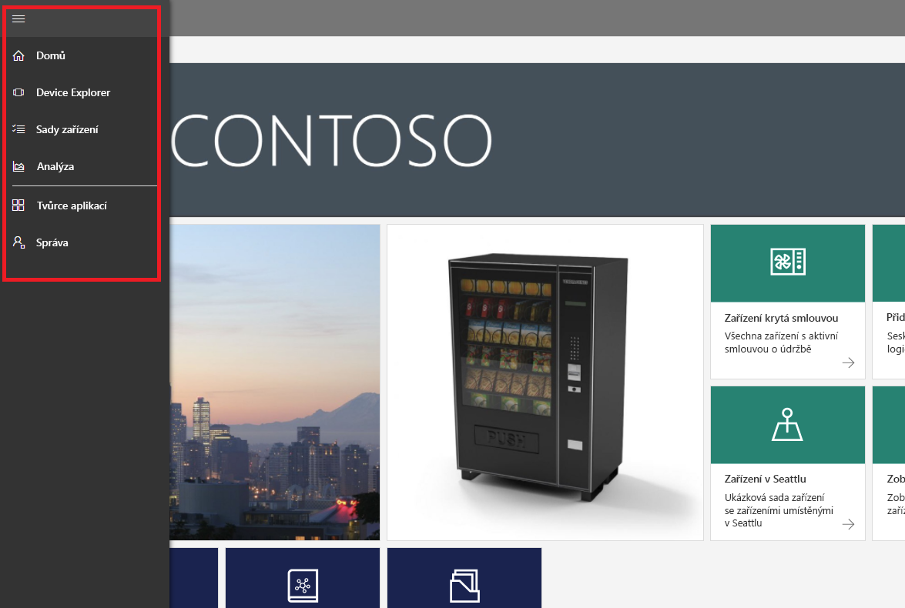
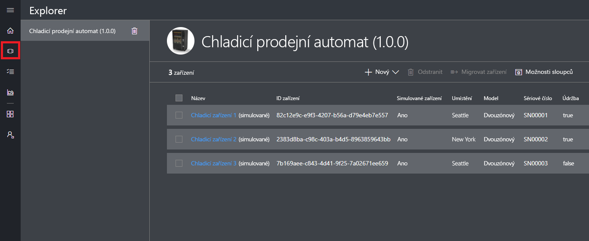
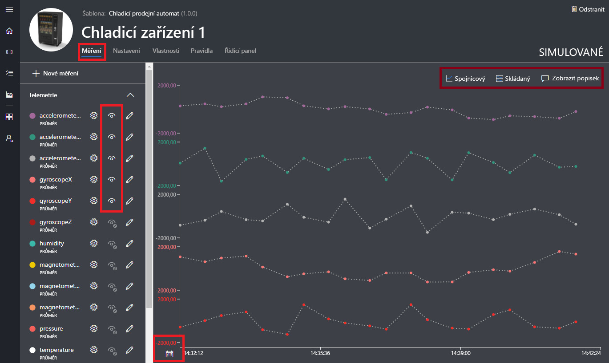
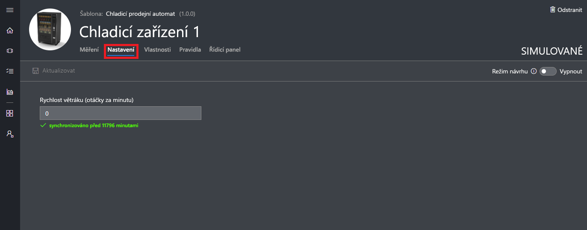
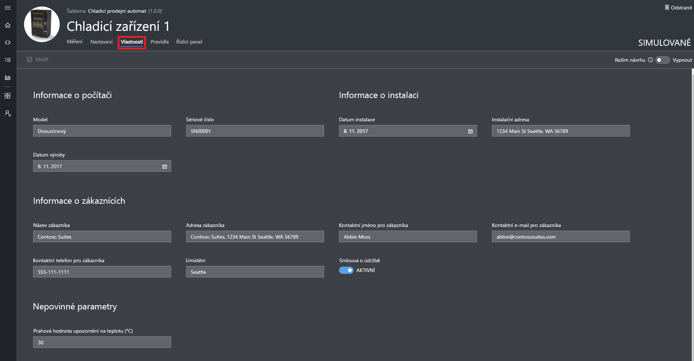
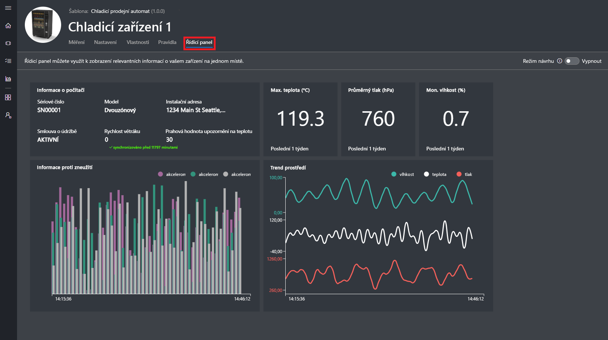
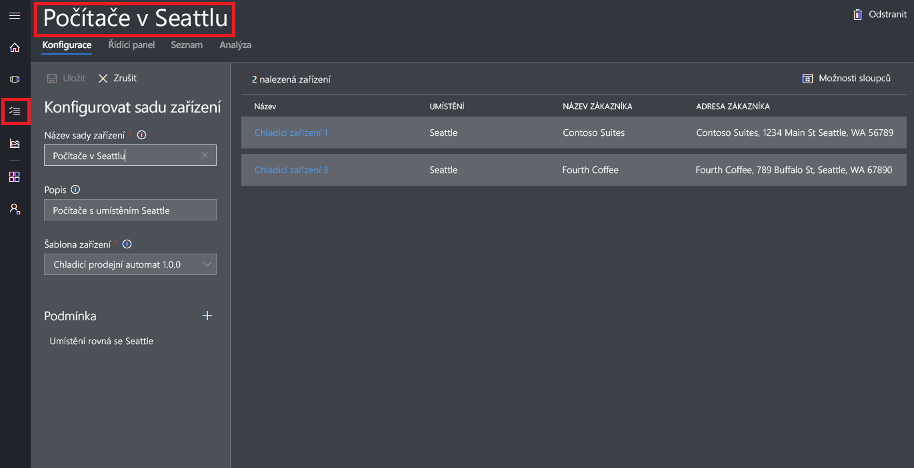
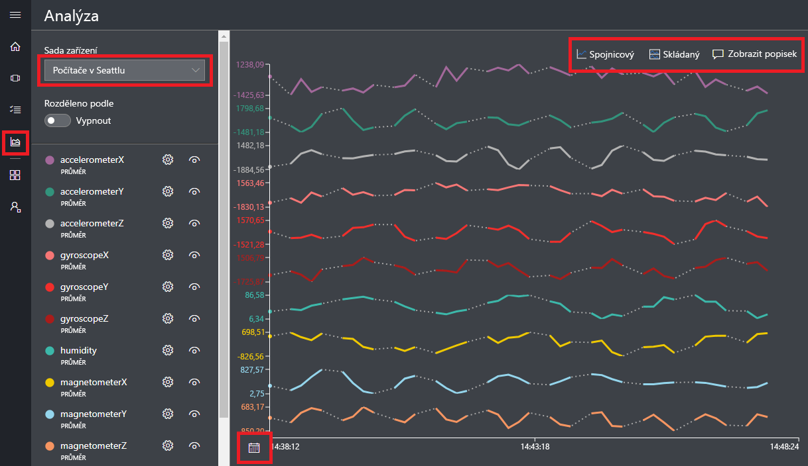

# Vytvoření aplikace Azure IoT Central

Jako _tvůrce_ můžete pomocí uživatelského rozhraní Azure IoT Central definovat vaši aplikaci Azure IoT Central. V tomto rychlém startu se naučíte:

- Vytvořit aplikaci Azure IoT Central, který obsahuje ukázkovou _šablonu zařízení_ a simulovaná _zařízení_
- Zobrazit funkce šablony zařízení **Refrigerated Vending Machine** (Chladící prodejní automat) ve vaší aplikaci
- Zobrazit telemetrická data a analýzy ze simulovaných zařízení **Refrigerator** (Chladící box).

V tomto rychlém startu zobrazíte simulované zařízení **Refrigerator** (Chladící box) ze šablony zařízení. Simulované zařízení:

* Odesílá do vaší aplikace telemetrická data, jako je například teploty a tlak.
* Hlásí vaší aplikaci hodnoty vlastností zařízení, jako je upozornění na pohyb.
* Má nastavení zařízení, jako je třeba rychlost ventilátoru, která můžete nastavit v aplikaci.

Aby bylo možné otestovat aplikaci před připojením skutečného zařízení, aplikace Azure IoT Central umožňuje vygenerovat simulované zařízení ze šablony zařízení.

## Vytvoření aplikace

K dokončení tohoto rychlého startu musíte vytvořit aplikaci Azure IoT Central z aplikační šablony **Sample Contoso**.

Přejděte na stránku [správce aplikací](https://aka.ms/iotcentral) Azure IoT Central. Potom zadejte e-mailovou adresu a heslo, které používáte pro přístup k vašemu předplatnému Azure:

Pokud chcete začít vytvářet novou aplikaci Azure IoT Central, zvolte **New Application** (Nová aplikace):

Vytvoření nové aplikace Azure IoT Central:

1. Zvolte platební plán **Free Trial Application**.
1. Zvolte popisný název, jako je třeba **Contoso IoT**. Azure IoT Central pro vás vygeneruje jedinečnou předponu URL. Tuto předponu URL můžete změnit, aby byla snáze zapamatovatelná.
1. Zvolte šablonu aplikace **Sample Contoso**.
1. Potom zvolte **Create** (Vytvořit).

## Přechod k aplikaci

Až bude vaše aplikace hotová, zobrazí se její **domovská stránka**. Pokud chcete tuto domovskou stránku upravit, můžete v horní části přepnout _Design Mode_ (Režim návrhu). Adresa URL aplikace je adresa URL, kterou jste zadali v předchozím kroku:

Pomocí _levé navigační nabídky_ můžete získat přístup k různým oblastem vaší nové aplikace Azure IoT Central:

Pokud chcete zobrazit zařízení a šablony zařízení ve vaší aplikaci, v levé navigační nabídce zvolte **Device Explorer**. Ukázková aplikace zahrnuje šablonu zařízení **Refrigerated Vending Machine** (Chladící prodejní automat). Z této šablony zařízení jsou už vygenerovaná tři simulovaná zařízení:

## Zobrazení zařízení a šablon zařízení

Pomocí následujících kroků zobrazíte chladící zařízení vytvořené ze šablony **Refrigerated Vending Machine**. Šablona zařízení definuje:

* _Měření_ odesílaná ze zařízení, jako jsou teplotní telemetrická data.
* _Nastavení_, která umožňují ovládat zařízení, jako je rychlost ventilátoru.
* _Vlastnosti_, které ukládají informace o zařízení, jako je sériové číslo.
* [Pravidla](howto-create-telemetry-rules.md), která umožňují automatizovat akce na základě chování zařízení.
* Přizpůsobitelný _řídicí panel_, který zobrazuje informace o zařízení.

Na základě šablony zařízení můžete vytvářet simulovaná i skutečná zařízení.

### Měření

Zobrazí se stránka **Měření** pro zařízení **Refrigerator 1**. Uvidíte seznam měření odeslaných ze simulovaného zařízení. Na této stránce se zobrazuje také přizpůsobitelný graf viditelných měření:

Můžete přepínat viditelnost jednotlivých prvků a přizpůsobit graf. Aktuální graf zobrazuje telemetrická data ze simulovaného zařízení. Pokud máte příslušná oprávnění, můžete do šablony zařízení přidat nová měření.

> [!NOTE]
> Pravděpodobně budete muset chvíli počkat, než se simulovaná data zobrazí v grafu.

### Nastavení

Zvolte **Settings** (Nastavení). Na stránce **Settings** (Nastavení) můžete ovládat zařízení. Můžete například upravit rychlost ventilátoru chladícího zařízení:

Jakmile zařízení rozpozná změnu nastavení, nastavení se zobrazí jako **synced** (Synchronizováno).

### Vlastnosti

Zvolte **Properties** (Vlastnosti). Na stránce **Properties** (Vlastnosti) můžete:

* Spravovat informace o vašem zařízení, jako je jméno zákazníka
* Zobrazovat hodnoty vlastností hlášené zařízením, jako je upozornění na pohyb

### Řídicí panel

Zvolte **Dashboard** (Řídicí panel). Řídicí panel je přizpůsobitelné zobrazení informací o vašem zařízení, jako jsou měření, vlastnosti a klíčové ukazatele výkonu:

## Zobrazení analýzy

Předchozí část vám ukázala, jak zobrazit informace o jednotlivých zařízeních. K zobrazení konsolidovaných informací z několika zařízení můžete využít [sady zařízení](howto-use-device-sets.md) a [analýzy](howto-create-analytics.md).

Sady zařízení používají dotazy k dynamickému výběru zařízení, která odpovídají kritériím. Například sada zařízení **Machines in Seattle** vybírá chladící zařízení umístěná v Seattlu. Pokud chcete zobrazit skupinu zařízení **Machines in Seattle**, v levé navigační nabídce zvolte **Device Sets** (Sady zařízení) a potom zvolte **Machines in Seattle**:

Analytická data pro zařízení ve skupině zařízení můžete zobrazit na stránce **Analytics** (Analýza):

## Další kroky

V tomto rychlém startu jste vytvořili předem naplněnou aplikaci Azure IoT Central, která obsahuje šablonu zařízení **Refrigerated Vending Machine** a simulovaná zařízení. Pokud se jako tvůrce chcete dozvědět víc o definování vlastních šablon zařízení, projděte si téma věnované [definování nové šablony zařízení ve vaší aplikaci](tutorial-define-device-type.md).
