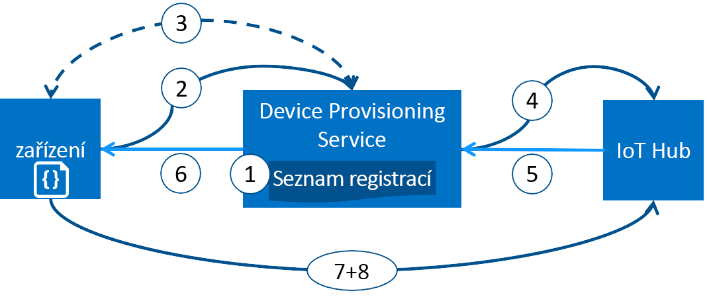

# Zřizování zařízení pomocí služby Azure IoT Hub Device Provisioning Service
Microsoft Azure poskytuje bohatou sadu integrovaných veřejných cloudových služeb pro všechny potřeby vašeho řešení IoT. IoT Hub Device Provisioning Service je pomocná služba pro IoT Hub. Umožňuje plně automatizované zřizování za běhu ve správném centru IoT, které nevyžaduje zásah člověka. Zákazníci tak můžou bezpečným a škálovatelným způsobem zřizovat miliony zařízení.

## Kdy použít službu Device Provisioning
Služba Device Provisioning je skvělou volbou pro konfiguraci a připojení zařízení ke službě IoT Hub v celé řadě scénářů zřizování, jako například:

* Plně automatizované zřizování do jednoho řešení IoT bez nutnosti pevně kódovat informace o připojení ke službě IoT Hub v továrně (počáteční nastavení)
* Vyrovnávání zatížení zařízení mezi několik center
* Připojování zařízení k řešení IoT jejich vlastníka na základě dat o prodejních transakcích (víceklientská architektura)
* Připojování zařízení ke konkrétnímu řešení IoT v závislosti na případu použití (izolace řešení)
* Připojování zařízení k centru IoT s nejnižší latencí (geografické horizontální dělení)
* Opětovné zřizování na základě změny v zařízení
* Obměna klíčů, které zařízení používá k připojení ke službě IoT Hub (pokud k připojení nepoužívá certifikáty X.509)

## Informace pro pokročilé uživatele
Všechny scénáře uvedené v předchozí části je možné provádět pomocí služby zřizování a docílit tak plně automatizovaného zřizování stejným postupem. Služba Device Provisioning automatizuje celou řadu ručně prováděných kroků, které jsou tradičně spojené se zřizováním, a zkracuje tak čas potřebný k nasazení zařízení IoT a snižuje riziko lidské chyby. Následující část popisuje, co se při zřizování zařízení děje na pozadí. První krok se provádí ručně, ale všechny následující kroky jsou automatizované.

1. Výrobce zařízení přidá informace o registraci zařízení do seznamu registrací na webu Azure Portal.
2. Zařízení kontaktuje koncový bod služby zřizování nastavený v továrně. Zařízení předá do služby zřizování identifikující informace a prokáže tak svou identitu.
3. Služba zřizování ověří identitu zařízení tím, že porovná ID a klíč registrace s příslušnou položkou seznamu registrací. Použije přitom buď kontrolu hodnoty Nonce ([Trusted Platform Module](https://trustedcomputinggroup.org/work-groups/trusted-platform-module/)), nebo standardní ověření X.509 (X.509).
4. Služba zřizování zaregistruje zařízení v centru IoT a vyplní [požadovaný stav dvojčete](../iot-hub/iot-hub-devguide-device-twins.md) zařízení.
5. Centrum IoT vrátí do služby zřizování informace o ID zařízení.
6. Služba zřizování vrátí do zařízení informace o připojení k centru IoT. Zařízení teď může začít odesílat data přímo do centra IoT.
7. Zařízení se připojí k centru IoT.
8. Zařízení získá požadovaný stav ze svého dvojčete zařízení v centru IoT.

## Proces zřizování
Proces nasazení zařízení zahrnuje dva různé kroky, kterých se zúčastní služba Device Provisioning a které je možné provést nezávisle na sobě:

* **Krok výroby**, při kterém se zařízení vytvoří a připraví v továrně.
* **Krok nastavení cloudu**, při kterém se ve službě Device Provisioning nakonfiguruje automatizované zřizování.

Oba tyto kroky se bezproblémově integrují do stávajících výrobních procesů a procesů nasazení. Služba Device Provisioning dokonce zjednodušuje některé procesy nasazení, které zahrnují množství ruční práce související s přenosem informací o připojení do zařízení.

### Krok výroby
Tento krok zahrnuje vše, co se děje na výrobní lince. Mezi role zapojené do tohoto kroku patří návrhář čipu, výrobce čipu, integrátor nebo koncový výrobce zařízení. Tento krok se týká samotného vytvoření hardwaru.

Služba Device Provisioning do výrobního procesu nezavádí žádný nový krok, místo toho se spojí se stávajícím krokem, při kterém se na zařízení nainstaluje počáteční software a (ideálně) HSM. Místo vytváření ID zařízení se v tomto kroku v zařízení naprogramují informace o službě zřizování, což zařízení umožní po zapnutí zavolat službu zřizování a získat informace o připojení nebo přiřazení řešení IoT.

V tomto kroku také výrobce zařízení poskytne nasazovači nebo operátorovi zařízení klíčové identifikující informace. Poskytnutí těchto informací může být jednoduché a spočívat pouze v potvrzení, že všechna zařízení mají certifikát X.509 vygenerovaný z podpisového certifikátu od nasazovače nebo operátora zařízení. Nebo může být složité a spočívat v extrahování veřejné části ověřovacího klíče TPM ze všech zařízení TPM. Tyto služby v současné době poskytuje celá řada výrobců čipů.

### Krok nastavení cloudu
Tento krok se týká konfigurace cloudu pro správné automatické zřizování. Do kroku nastavení cloudu se obvykle zapojují dva typy uživatelů: někdo, kdo ví, jaké má být počáteční nastavení zařízení (operátor zařízení), a někdo jiný, kdo ví, jak se mají zařízení rozdělit mezi centra IoT (operátor řešení).

Zřizování se musí zpočátku jednorázově nastavit, což obvykle provádí operátor řešení. Po nakonfigurování služby zřizování není potřeba ji upravovat, dokud se nezmění případ použití.

Po nakonfigurování služby pro automatické zřizování se služba musí připravit na registrování zařízení. Tento krok provádí operátor zařízení, který zná požadovanou konfiguraci zařízení a má na starosti zajištění, aby služba zřizování mohla při hledání odpovídajícího centra IoT správně ověřit identitu zařízení. Operátor zařízení vezme klíčové identifikující informace od výrobce a přidá je do seznamu registrací. Seznam registrací se následně může aktualizovat s ohledem na přidávání nových položek nebo aktualizaci nejnovějších informací o zařízeních ve stávajících položkách.

## Registrace a zřizování
Termín *zřizování* znamená různé věci v závislosti na odvětví, ve kterém se použije. V kontextu zřizování zařízení IoT v cloudovém řešení je zřizování proces skládající se ze dvou částí:

1. První část představuje navázání počátečního připojení mezi zařízením a řešením IoT prostřednictvím registrace zařízení.
2. Druhá část představuje použití správné konfigurace pro zařízení na základě konkrétních požadavků řešení, do kterého se zaregistrovalo.

Po dokončení obou těchto kroků můžeme říct, že je zařízení plně zřízené. Některé cloudové služby zajišťují pouze první krok procesu zřizování, tedy registraci zařízení do koncového bodu řešení IoT, ale už ne počáteční konfiguraci. Služba Device Provisioning oba kroky automatizuje a zajišťuje tak bezproblémové zřizování zařízení.

## Funkce služby Device Provisioning
Služba Device Provisioning obsahuje řadu funkcí, díky kterým je ideální pro zřizování zařízení.

* Podpora **zabezpečeného osvědčení** pro identity založené na X.509 i TPM.
* **Seznam registrací** obsahující úplné záznamy o zařízeních a skupinách zařízení, která se někdy můžou registrovat. Jakmile se zařízení zaregistruje, bude seznam registrací obsahovat informace o požadované konfiguraci zařízení a může se kdykoli aktualizovat.
* **Několik zásad přidělování**, pomocí kterých můžete řídit, jak služba Device Provisioning v rámci podpory vašich scénářů přiřazuje zařízení k centrům IoT.
* **Monitorování a protokolování diagnostiky** pro zajištění, že vše funguje správně.
* **Podpora více center** umožňuje službě Device Provisioning přiřazovat zařízení k více než jednomu centru IoT. Služba Device Provisioning může komunikovat s centry napříč několika předplatnými Azure.
* **Podpora více oblastí** umožňuje službě Device Provisioning přiřazovat zařízení k centrům IoT v jiných oblastech.

Další informace o konceptech a funkcích souvisejících se zřizováním zařízení najdete v [konceptech zařízení](concepts-device.md), [konceptech služby](concepts-service.md) a [konceptech zabezpečení](concepts-security.md).

## Podpora různých platforem
Služba Device Provisioning, stejně jako všechny služby Azure IoT, funguje na různých platformách s různými operačními systémy. Azure nabízí open source sady SDK v různých [jazycích](https://github.com/Azure/azure-iot-sdks), které usnadňují připojení zařízení a správu služby. Služba Device Provisioning podporuje připojení zařízení pomocí následujících protokolů:

* HTTPS
* AMQP
* AMQP přes webové sokety
* MQTT
* MQTT přes webové sokety

Pro operace služby podporuje služba Device Provisioning pouze připojení HTTPS.

## Oblasti
Služba Device Provisioning je dostupná v mnoha oblastech. Aktualizovaný seznam stávajících a nově ohlášených oblastí pro všechny služby najdete na stránce [Oblasti Azure](https://azure.microsoft.com/regions/). Dostupnost služby Device Provisioning můžete zkontrolovat na stránce [Stav Azure](https://azure.microsoft.com/status/).

> [!NOTE]
> Služba Device Provisioning je globální a není vázaná na konkrétní umístění. Musíte však určit oblast, ve které se budou nacházet metadata přidružená s vaším profilem služby Device Provisioning.

## Dostupnost
Smlouva o úrovni služeb, kterou si můžete [přečíst](https://azure.microsoft.com/support/legal/sla/iot-hub/), zajišťuje 99,9% dostupnost služby Device Provisioning. Úplná smlouva [Azure SLA](https://azure.microsoft.com/support/legal/sla/) vysvětluje garantovanou dostupnost Azure jako celku.

## Kvóty
Pro každé předplatné Azure platí výchozí omezení kvót, která můžou ovlivnit dosah vašeho řešení IoT. Aktuální omezení je 10 služeb Device Provisioning pro každé předplatné.

Další podrobnosti o limitech kvót:

* [Omezení služeb v předplatném Azure](../azure-subscription-service-limits.md)

## Související komponenty Azure
Služba Device Provisioning automatizuje zřizování zařízení s využitím služby Azure IoT Hub. Další informace o službě [IoT Hub](https://docs.microsoft.com/azure/iot-hub/).

## Další kroky
Teď máte přehled o zřizování zařízení IoT v Azure. Dalším krokem je vyzkoušet si kompletní scénář IoT.
> [!div class="nextstepaction"]
> [Nastavení služby IoT Hub Device Provisioning Service pomocí webu Azure Portal](quick-setup-auto-provision.md)
> [Vytvoření a zřízení simulovaného zařízení](quick-create-simulated-device.md)
> [Nastavení zařízení pro zřizování](tutorial-set-up-device.md)
