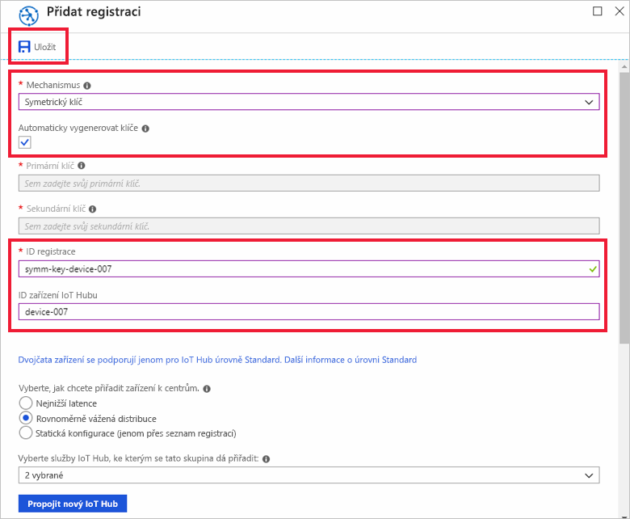
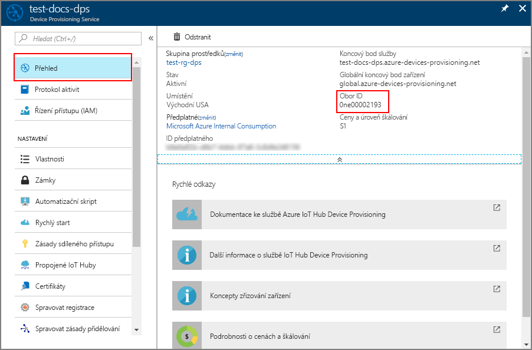
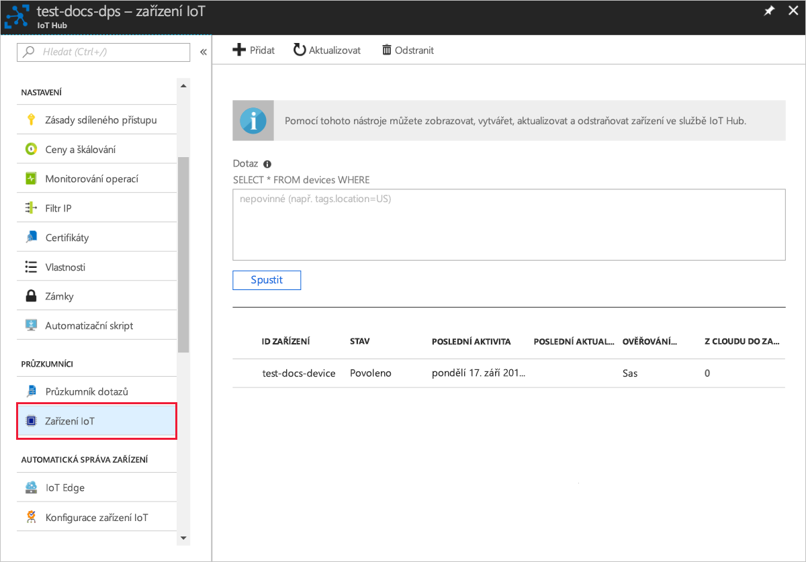

# <a name="quickstart-provision-a-simulated-device-with-symmetric-keys"></a>Rychlý start: Zřízení simulovaného zařízení se symetrickými klíči

V tomto rychlém startu se dozvíte, jak vytvořit a spustit simulátor zařízení na vývojovém počítači s Windows. Toto simulované zařízení nakonfigurujete tak, aby používalo k ověření instancí služby Device Provisioning Service symetrický klíč a přiřadilo se službě IoT Hub. K simulaci spouštěcí sekvence pro zařízení, které zahájí zřízení, se použije vzorový kód sady [Azure IoT C SDK](https://github.com/Azure/azure-iot-sdk-c). Zařízení se rozpozná na základě jednotlivé registrace v instanci služby zřizování a přiřadí se do služby IoT Hub.

Přestože tento článek popisuje zřizování pomocí jednotlivé registrace, můžete stejný postup použít i u skupin registrací. Jediným rozdílem je nutnost použití odvozeného klíče zařízení s jedinečným ID registrace zařízení. U skupin registrací se symetrický klíč během registrace nepoužívá přímo. Přestože skupiny registrací symetrického klíče nejsou omezené na starší verze zařízení, příklad skupiny registrací najdete v článku o [zřízení starší verze zařízení pomocí osvědčení symetrického klíče](how-to-legacy-device-symm-key.md). Další informace najdete v článku o [osvědčení symetrického klíče v části o skupinových registracích](concepts-symmetric-key-attestation.md#group-enrollments).

Pokud neznáte proces automatického zřizování, projděte si [koncepty automatického zřizování](concepts-auto-provisioning.md). 

Než budete pokračovat v tomto rychlém zprovoznění, ujistěte se také, že jste provedli kroky uvedené v tématu [Nastavení služby IoT Hub Device Provisioning Service pomocí webu Azure Portal](./quick-setup-auto-provision.md). Tento rychlý start vyžaduje vytvořenou instanci služby Device Provisioning Service.

Tento článek je orientovaný na pracovní stanici s Windows. Stejným postupem se však můžete řídit i na Linuxu. Příklad pro Linux najdete v článku o [zřizování architektury s více tenanty](how-to-provision-multitenant.md).


[!INCLUDE [quickstarts-free-trial-note](../../includes/quickstarts-free-trial-note.md)]


## <a name="prerequisites"></a>Požadavky

* Visual Studio 2015 nebo [Visual Studio 2017](https://www.visualstudio.com/vs/) s povolenou sadou funkcí [Vývoj desktopových aplikací pomocí C++](https://www.visualstudio.com/vs/support/selecting-workloads-visual-studio-2017/)
* Nainstalovaná nejnovější verze [Gitu](https://git-scm.com/download/)


<a id="setupdevbox"></a>

## <a name="prepare-an-azure-iot-c-sdk-development-environment"></a>Příprava vývojového prostředí Azure IoT C SDK

V této části připravíte vývojové prostředí použité k sestavení [Azure IoT C SDK](https://github.com/Azure/azure-iot-sdk-c). 

Sada SDK obsahuje vzorový kód pro simulované zařízení. Toto simulované zařízení se pokusí zřídit během spouštěcí sekvence zařízení.

1. Stáhněte si nejnovější vydanou verzi [sestavovacího systému CMake](https://cmake.org/download/). Na stejném webu si najděte kryptografickou hodnotu hash pro zvolenou binární distribuci. Stažený binární soubor ověřte pomocí odpovídající kryptografické hodnoty hash. Následující příklad používá Windows PowerShell k ověření kryptografické hodnoty hash pro verzi 3.11.4 distribuce x64 MSI:

    ```PowerShell
    PS C:\Users\wesmc\Downloads> $hash = get-filehash .\cmake-3.11.4-win64-x64.msi
    PS C:\Users\wesmc\Downloads> $hash.Hash -eq "56e3605b8e49cd446f3487da88fcc38cb9c3e9e99a20f5d4bd63e54b7a35f869"
    True
    ```

    Je důležité, aby požadavky na sadu Visual Studio (Visual Studio a sada funkcí Vývoj desktopových aplikací pomocí C++) byly na vašem počítači nainstalované ještě **před** zahájením instalace `CMake`. Jakmile jsou požadované součásti k dispozici a stažený soubor je ověřený, nainstalujte sestavovací systém CMake.

2. Otevřete prostředí příkazového řádku nebo Git Bash. Spusťte následující příkaz pro naklonování úložiště GitHub sady Azure IoT C SDK:
    
    ```cmd/sh
    git clone https://github.com/Azure/azure-iot-sdk-c.git --recursive
    ```
    Velikost tohoto úložiště je aktuálně přibližně 220 MB. Buďte připravení na to, že může trvat i několik minut, než se tato operace dokončí.


3. V kořenovém adresáři úložiště Git vytvořte podadresář `cmake` a přejděte do této složky. 

    ```cmd/sh
    cd azure-iot-sdk-c
    mkdir cmake
    cd cmake
    ```

4. Spuštěním následujícího příkazu sestavte verzi sady SDK určenou pro platformu vašeho vývojového klienta. V adresáři `cmake` se vygeneruje řešení Visual Studia pro simulované zařízení. 

    ```cmd
    cmake -Duse_prov_client:BOOL=ON ..
    ```
    
    Pokud `cmake` nenajde váš kompilátor C++, můžou se při spuštění výše uvedeného příkazu zobrazit chyby sestavení. Pokud k tomu dojde, zkuste tento příkaz spustit v [příkazovém řádku sady Visual Studio](https://docs.microsoft.com/dotnet/framework/tools/developer-command-prompt-for-vs). 

    Po úspěšném sestavení by posledních pár řádků výstupu mělo vypadat přibližně takto:

    ```cmd/sh
    $ cmake -Duse_prov_client:BOOL=ON ..
    -- Building for: Visual Studio 15 2017
    -- Selecting Windows SDK version 10.0.16299.0 to target Windows 10.0.17134.
    -- The C compiler identification is MSVC 19.12.25835.0
    -- The CXX compiler identification is MSVC 19.12.25835.0

    ...

    -- Configuring done
    -- Generating done
    -- Build files have been written to: E:/IoT Testing/azure-iot-sdk-c/cmake
    ```


## <a name="create-a-device-enrollment-entry-in-the-portal"></a>Vytvoření položky registrace zařízení na portálu

1. Přihlaste se k webu Azure Portal, v nabídce vlevo klikněte na tlačítko **Všechny prostředky** a otevřete svou službu Device Provisioning.

2. Vyberte kartu **Správa registrací** a potom v horní části klikněte na tlačítko **Přidat jednotlivou registraci**. 

3. V části **Přidat registraci** zadejte následující informace a klikněte na tlačítko **Uložit**.

    - **Mechanismus:** Jako *Mechanismus* pro ověření identity vyberte **Symetrický klíč**.

    - **Automaticky vygenerovat klíče**: Toto políčko zaškrtněte.

    - **ID registrace**: Zadejte ID registrace k identifikaci registrace. Použijte k tomu pouze malá písmena, číslice a spojovník („-“). Například, `symm-key-device-007`.

    - **ID zařízení IoT Hubu**: Zadejte identifikátor zařízení – například **zařízení 007**.

    

4. Po uložení registrace se vygeneruje **Primární klíč** a **Sekundární klíč** a tyto klíče se přidají do položky registrace. Symetrický klíč registrace zařízení se zobrazí na kartě *Jednotlivé registrace* ve sloupci *ID registrace* jako **symm-key-device-007**. 

    Otevřete registraci a zkopírujte hodnotu vygenerovaného **primárního klíče**.


<a id="firstbootsequence"></a>

## <a name="simulate-first-boot-sequence-for-the-device"></a>Simulace první spouštěcí sekvence pro zařízení

V této části aktualizujete vzorový kód tak, aby odeslal spouštěcí sekvenci zařízení do instance služby Device Provisioning Service. Tato spouštěcí sekvence způsobí, že se zařízení rozpozná a přiřadí službě IoT Hub propojené s instancí služby Device Provisioning Service.


1. Na webu Azure Portal vyberte okno **Přehled** vaší služby Device Provisioning Service a poznamenejte si hodnotu **_Rozsah ID_**.

     

2. V sadě Visual Studio otevřete soubor řešení **azure_iot_sdks.sln**, který se vygeneroval spuštěním CMake. Soubor řešení by se měl nacházet v následujícím umístění:

    ```
    \azure-iot-sdk-c\cmake\azure_iot_sdks.sln
    ```

3. V podokně *Průzkumník řešení* sady Visual Studio přejděte do složky **Provision\_Samples**. Rozbalte ukázkový projekt s názvem **prov\_dev\_client\_sample**. Rozbalte **zdrojové soubory** a otevřete **prov\_dev\_client\_sample.c**.

4. Najděte konstantu `id_scope` a nahraďte její hodnotu hodnotou **Rozsah ID**, kterou jste si zkopírovali. 

    ```c
    static const char* id_scope = "0ne00002193";
    ```

5. Ve stejném souboru vyhledejte definici funkce `main()`. Zkontrolujte, jestli je proměnná `hsm_type` nastavená na hodnotu `SECURE_DEVICE_TYPE_SYMMETRIC_KEY`, jak je vidět dole:

    ```c
    SECURE_DEVICE_TYPE hsm_type;
    //hsm_type = SECURE_DEVICE_TYPE_TPM;
    //hsm_type = SECURE_DEVICE_TYPE_X509;
    hsm_type = SECURE_DEVICE_TYPE_SYMMETRIC_KEY;
    ```

6. Klikněte pravým tlačítkem na projekt **prov\_dev\_client\_sample** a vyberte **Nastavit jako spouštěný projekt**. 

7. V okně *Průzkumník řešení* sady Visual Studio přejděte na projekt **hsm\_security\_client** a rozbalte ho. Rozbalte **zdrojové soubory** a otevřete soubor **hsm\_client\_key.c**. 

    Vyhledejte deklaraci konstant `REGISTRATION_NAME` a `SYMMETRIC_KEY_VALUE`. Proveďte následující změny a soubor uložte.

    Hodnotu konstanty `REGISTRATION_NAME` aktualizujte vaším **ID registrace**.
    
    Hodnotu konstanty `SYMMETRIC_KEY_VALUE` aktualizujte vaším **primárním klíčem**.

    ```c
    static const char* const REGISTRATION_NAME = "symm-key-device-007";
    static const char* const SYMMETRIC_KEY_VALUE = "<enter your Symmetric primary key>";
    ```

7. V nabídce sady Visual Studio vyberte **Ladit** > **Spustit bez ladění** a spusťte řešení. Po zobrazení výzvy k opětovnému sestavení projektu klikněte na **Ano** a před spuštěním projekt znovu sestavte.

    Následující výstup je příkladem úspěšného spuštění simulovaného zařízení a připojení k instanci služby zřizování pro přiřazení k IoT Hubu:

    ```cmd
    Provisioning API Version: 1.2.8

    Registering Device

    Provisioning Status: PROV_DEVICE_REG_STATUS_CONNECTED
    Provisioning Status: PROV_DEVICE_REG_STATUS_ASSIGNING
    Provisioning Status: PROV_DEVICE_REG_STATUS_ASSIGNING

    Registration Information received from service: 
    test-docs-hub.azure-devices.net, deviceId: device-007    
    Press enter key to exit:
    ```

8. Na webu Azure Portal přejděte do IoT Hubu, kam se simulované zařízení přiřadilo, a klikněte na kartu **Zařízení IoT**. Po úspěšném zřízení simulovaného zařízení v IoT Hubu se ID tohoto zařízení zobrazí v okně **Zařízení IoT** a jeho *STAV* se zobrazí jako **povoleno**. Možná budete muset nahoře kliknout na tlačítko **Aktualizovat**. 

     


## <a name="clean-up-resources"></a>Vyčištění prostředků

Pokud chcete pokračovat v práci s touto ukázkou klienta zařízení a jejím prozkoumáváním, nevyčišťujte prostředky vytvořené v rámci tohoto rychlého startu. Pokud pokračovat nechcete, pomocí následujícího postupu odstraňte všechny prostředky vytvořené tímto rychlým startem.

1. Zavřete na svém počítači okno výstupu ukázky klienta zařízení.
1. V nabídce vlevo na webu Azure Portal klikněte na **Všechny prostředky** a vyberte svou službu Device Provisioning. Otevřete okno **Správa registrací** pro vaši službu a potom klikněte na kartu **Jednotlivé registrace**. Vyberte *ID REGISTRACE* zařízení, které jste zaregistrovali v rámci tohoto rychlého startu, a klikněte na tlačítko **Odstranit** v horní části. 
1. V nabídce vlevo na webu Azure Portal klikněte na **Všechny prostředky** a vyberte své centrum IoT. Otevřete **Zařízení IoT** pro vaše centrum, vyberte *ID ZAŘÍZENÍ*, které jste zaregistrovali v rámci tohoto rychlého zprovoznění, a potom klikněte na tlačítko **Odstranit** v horní části.

## <a name="next-steps"></a>Další kroky

V rámci tohoto rychlého startu jste na svém počítači s Windows vytvořili simulované zařízení a pomocí služby Azure IoT Hub Device Provisioning na webu Azure Portal a symetrického klíče jste ho zřídili pro svůj IoT Hub. Pokud chcete zjistit, jak zaregistrovat zařízení prostřednictvím kódu programu, pokračujte k rychlému startu pro registraci zařízení X.509 prostřednictvím kódu programu. 

> [!div class="nextstepaction"]
> [Rychlý start Azure – Registrace zařízení X.509 do služby Azure IoT Hub Device Provisioning](quick-enroll-device-x509-java.md)
