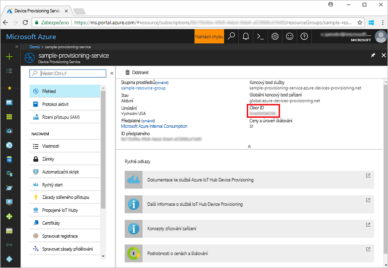
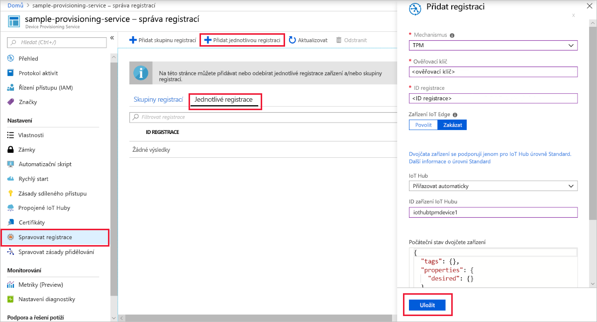
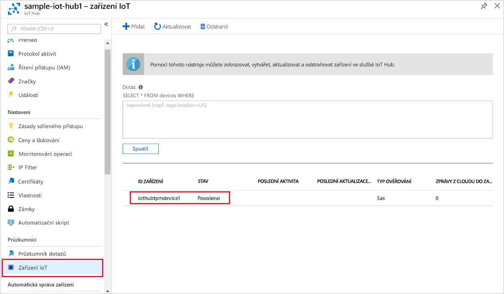

# <a name="quickstart-create-and-provision-a-simulated-tpm-device-using-c-device-sdk-for-iot-hub-device-provisioning-service"></a>Rychlý Start: vytvoření a zřízení simulovaného zařízení TPM pomocí sady SDK pro zařízení v jazyce C# pro IoT Hub Device Provisioning Service

[!INCLUDE [iot-dps-selector-quick-create-simulated-device-tpm](../../includes/iot-dps-selector-quick-create-simulated-device-tpm.md)]

Tyto kroky ukazují, jak používat [ukázky Azure IoT pro jazyk C#](https://github.com/Azure-Samples/azure-iot-samples-csharp) k simulaci zařízení TPM na vývojovém počítači s operačním systémem Windows. Ukázka také připojí simulované zařízení k IoT Hub pomocí služby Device Provisioning. 

Vzorový kód používá simulátor Windows TPM jako [modul hardwarového zabezpečení (HSM)](https://azure.microsoft.com/blog/azure-iot-supports-new-security-hardware-to-strengthen-iot-security/) zařízení. 

Pokud nejste obeznámeni s procesem autozřizování, přečtěte si přehled [zřizování](about-iot-dps.md#provisioning-process) . Než budete pokračovat, ujistěte se také, že jste provedli kroky uvedené v tématu [Nastavení služby IoT Hub Device Provisioning Service pomocí webu Azure Portal](./quick-setup-auto-provision.md). 

Služba Azure IoT Device Provisioning podporuje dva typy registrací:

- [Skupiny registrací:](concepts-service.md#enrollment-group) Slouží k registraci několika souvisejících zařízení.
- [Jednotlivé registrace:](concepts-service.md#individual-enrollment) Slouží k registraci jednoho zařízení.

V tomto článku si předvedeme jednotlivé registrace.

[!INCLUDE [IoT Device Provisioning Service basic](../../includes/iot-dps-basic.md)]

<a id="setupdevbox"></a>
## <a name="prepare-the-development-environment"></a>Příprava vývojového prostředí 

1. Ujistěte se, že máte na svém počítači nainstalovanou [sadu .NET Core 2,1 SDK nebo novější](https://www.microsoft.com/net/download/windows) . 

1. Ujistěte se, že je na vašem počítači nainstalovaný `git` a že je přidaný do proměnných prostředí, ke kterým má příkazové okno přístup. Na stránce [klientských nástrojů Git organizace Software Freedom Conservancy](https://git-scm.com/download/) najdete nejnovější verzi nástrojů `git` k instalaci. Jejich součástí je i **Git Bash**, aplikace příkazového řádku, pomocí které můžete pracovat se svým místním úložištěm Git. 

1. Otevřete příkazový řádek nebo Git Bash. Naklonujte ukázky Azure IoT pro úložiště GitHub v jazyce C#:

    ```cmd
    git clone https://github.com/Azure-Samples/azure-iot-samples-csharp.git
    ```

## <a name="provision-the-simulated-device"></a>Zřízení simulovaného zařízení

1. Přihlaste se k portálu Azure. V nabídce na levé straně vyberte tlačítko **všechny prostředky** a otevřete svou službu Device Provisioning. V okně **Přehled** si poznamenejte hodnotu **_Rozsah ID_** .

     

1. V příkazovém řádku přejděte do adresáře projektu s ukázkou zřizování zařízení TPM.

    ```cmd
    cd .\azure-iot-samples-csharp\provisioning\Samples\device\TpmSample
    ```

1. Zadejte následující příkaz, který sestaví a spustí ukázku zřizování zařízení TPM. Hodnotu `<IDScope>` nahraďte hodnotou Rozsah ID pro vaši službu zřizování. 

    ```cmd
    dotnet run <IDScope>
    ```

    Tento příkaz spustí simulátor čipu TPM v samostatném příkazovém řádku. V systému Windows se může zobrazit výstraha zabezpečení systému Windows s dotazem, zda chcete, aby Simulator.exe mohl komunikovat s veřejnými sítěmi. Pro účely této ukázky můžete žádost zrušit.

1. V původním příkazovém okně se zobrazí **_ověřovací klíč_**, **_ID registrace_** a navrhované **_ID zařízení_** potřebné pro registraci zařízení. Poznamenejte si tyto hodnoty. Tato hodnota se používá k vytvoření jednotlivé registrace v instanci služby Device Provisioning. 
   > [!NOTE]
   > Nespleťte si okno obsahující výstup příkazu s oknem obsahujícím výstup ze simulátoru TPM. Možná budete muset vybrat původní příkazové okno, abyste ho mohli přenést do popředí.

     

1. V Azure Portal v nabídce služba Device Provisioning vyberte **spravovat registrace**. Vyberte kartu **jednotlivé registrace** a v horní části vyberte tlačítko **přidat jednotlivou registraci** . 

1. Na panelu **Přidat registraci** zadejte následující informace:
   - Jako *Mechanismus* ověření identity vyberte **TPM**.
   - Zadejte *ID registrace* a *ověřovací klíč* pro vaše zařízení TPM z hodnot, které jste si poznamenali dříve.
   - Vyberte centrum IoT propojené s vaší zřizovací službou.
   - Volitelně můžete zadat následující informace:
       - Zadejte jedinečné *ID zařízení* (můžete použít navržený nebo zadat vlastní). Při pojmenování zařízení se ujistěte, že nepoužíváte citlivá data. Pokud se rozhodnete nezadat žádný, místo toho se použije ID registrace k identifikaci zařízení.
       - Aktualizujte **Počáteční stav dvojčete zařízení** s použitím požadované počáteční konfigurace zařízení.
   - Po dokončení klikněte na tlačítko **Uložit** . 

       

   Po úspěšné registraci se *ID registrace* vašeho zařízení zobrazí v seznamu na kartě *Jednotlivé registrace*. 

1. V příkazovém okně stiskněte klávesu *ENTER* (tu, která zobrazuje **_ověřovací klíč_**, **_ID registrace_** a navrhované **_ID zařízení_**) k registraci simulovaného zařízení. Všimněte si zpráv, které simulují spouštění zařízení a jeho připojování ke službě Device Provisioning pro získání informací o vašem centru IoT. 

1. Ověřte zřízení zařízení. Po úspěšném zřízení simulovaného zařízení pro Centrum IoT propojené se službou zřizování se ID zařízení zobrazí v okně **zařízení IoT** centra. 

     

    Pokud jste v položce registrace pro vaše zařízení změnili *počáteční stav dvojčete zařízení* z výchozí hodnoty, může si zařízení požadovaný stav dvojčete vyžádat z centra a příslušně na něj reagovat. Další informace najdete v tématu [Principy a použití dvojčat zařízení ve službě IoT Hub](../iot-hub/iot-hub-devguide-device-twins.md).

## <a name="clean-up-resources"></a>Vyčištění prostředků

Pokud máte v úmyslu pokračovat v práci a prozkoumat si ukázku klienta zařízení, neprovádějte čištění prostředků vytvořených v rámci tohoto rychlého startu. Pokud pokračovat nechcete, pomocí následujícího postupu odstraňte všechny prostředky vytvořené tímto rychlým startem.

1. Zavřete na svém počítači okno výstupu ukázky klienta zařízení.
1. Zavřete na svém počítači okno simulátoru TPM.
1. V nabídce na levé straně Azure Portal vyberte **všechny prostředky** a potom vyberte svou službu Device Provisioning. V horní části okna **Přehled** klikněte v horní části podokna na **Odstranit** .  
1. V nabídce na levé straně Azure Portal vyberte **všechny prostředky** a potom vyberte Centrum IoT. V horní části okna **Přehled** klikněte v horní části podokna na **Odstranit** .  

## <a name="next-steps"></a>Další kroky

V tomto rychlém startu jste na svém počítači vytvořili simulované zařízení TPM a pomocí IoT Hub Device Provisioning Service ho zřídili ve službě IoT Hub. Informace o tom, jak zaregistrovat zařízení TPM prostřednictvím kódu programu, najdete v rychlém startu pro programovou registraci zařízení TPM. 

> [!div class="nextstepaction"]
> [Rychlý Start Azure – registrace zařízení TPM do Azure IoT Hub Device Provisioning Service](quick-enroll-device-tpm-csharp.md)
