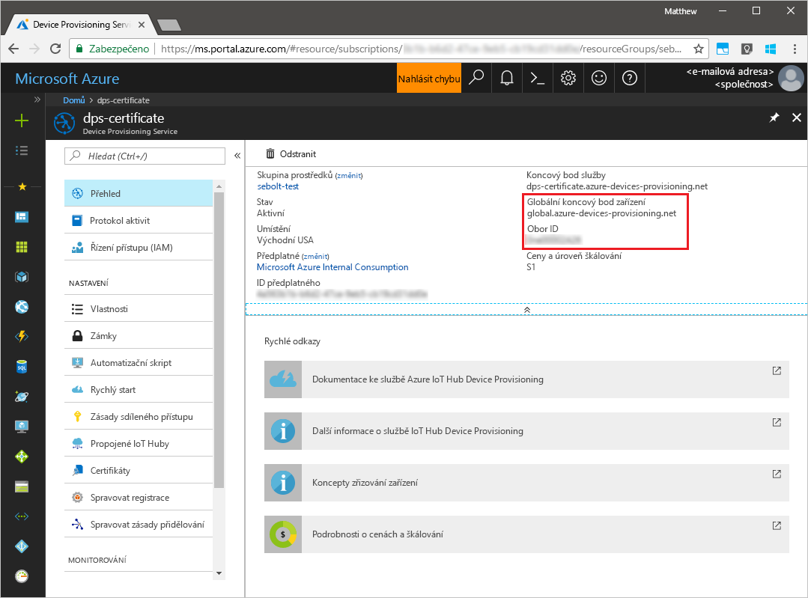
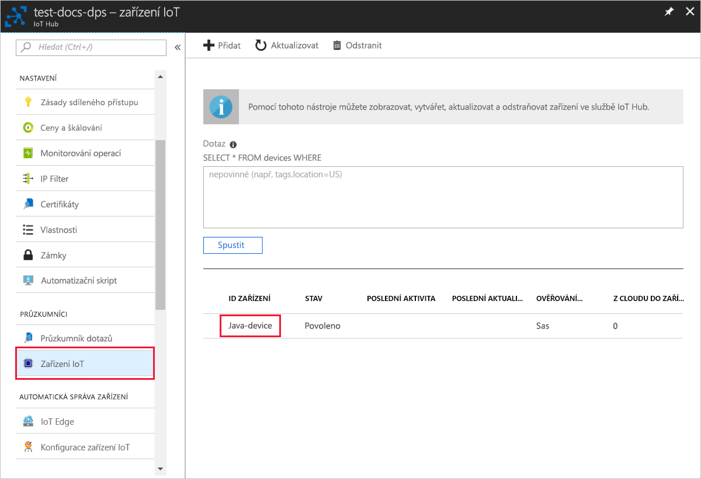

# <a name="quickstart-create-and-provision-a-simulated-tpm-device-using-java-device-sdk-for-azure-iot-hub-device-provisioning-service"></a>Quickstart: Create and provision a simulated TPM device using Java device SDK for Azure IoT Hub Device Provisioning Service

[!INCLUDE [iot-dps-selector-quick-create-simulated-device-tpm](../../includes/iot-dps-selector-quick-create-simulated-device-tpm.md)]

Tyto kroky ukazují, jak na vývojovém počítači s operačním systémem Windows vytvořit simulované zařízení, spustit simulátor Windows TPM jako [modul hardwarového zabezpečení (HSM)](https://azure.microsoft.com/blog/azure-iot-supports-new-security-hardware-to-strengthen-iot-security/) zařízení a jak pomocí vzorového kódu propojit toto simulované zařízení se službou Device Provisioning a centrem IoT. 

Pokud neznáte proces automatického zřizování, měli byste se seznámit také s [koncepty automatického zřizování](concepts-auto-provisioning.md). Než budete pokračovat, ujistěte se také, že jste provedli kroky uvedené v tématu [Nastavení služby IoT Hub Device Provisioning Service pomocí webu Azure Portal](./quick-setup-auto-provision.md). 

Služba Azure IoT Device Provisioning podporuje dva typy registrací:
- [Skupiny registrací:](concepts-service.md#enrollment-group) Slouží k registraci několika souvisejících zařízení.
- [Jednotlivé registrace:](concepts-service.md#individual-enrollment) Slouží k registraci jednoho zařízení.

V tomto článku si předvedeme jednotlivé registrace.

[!INCLUDE [IoT Device Provisioning Service basic](../../includes/iot-dps-basic.md)]

## <a name="prepare-the-environment"></a>Příprava prostředí 

1. Ujistěte se, že na svém počítači máte nainstalované prostředí [Java SE Development Kit 8](https://aka.ms/azure-jdks).

1. Stáhněte a nainstalujte [Maven](https://maven.apache.org/install.html).

1. Ujistěte se, že je na vašem počítači nainstalovaný `git` a že je přidaný do proměnných prostředí, ke kterým má příkazové okno přístup. Na stránce [klientských nástrojů Git organizace Software Freedom Conservancy](https://git-scm.com/download/) najdete nejnovější verzi nástrojů `git` k instalaci. Jejich součástí je i **Git Bash**, aplikace příkazového řádku, pomocí které můžete pracovat se svým místním úložištěm Git. 

1. Otevřete příkazový řádek. Naklonujte úložiště GitHub se vzorovým kódem pro simulaci zařízení.
    
    ```cmd/sh
    git clone https://github.com/Azure/azure-iot-sdk-java.git --recursive
    ```

1. Spusťte simulátor [TPM](https://docs.microsoft.com/windows/device-security/tpm/trusted-platform-module-overview). Kliknutím na **Povolit přístup** povolte změny nastavení brány _Windows Firewall_. Ten naslouchá přes soket na portech 2321 a 2322. Do not close this window; you need to keep this simulator running until the end of this quickstart guide. 

    ```cmd/sh
    .\azure-iot-sdk-java\provisioning\provisioning-tools\tpm-simulator\Simulator.exe
    ```

    

1. V samostatném příkazovém řádku přejděte do kořenové složky a sestavte ukázkové závislosti.

    ```cmd/sh
    cd azure-iot-sdk-java
    mvn install -DskipTests=true
    ```

1. Přejděte do složky s ukázkou.

    ```cmd/sh
    cd provisioning/provisioning-samples/provisioning-tpm-sample
    ```

1. Sign in to the Azure portal, select the **All resources** button on the left-hand menu and open your Device Provisioning service. Poznamenejte si _Rozsah ID_ a _Globální koncový bod služby zřizování_.

    

1. Upravte soubor `src/main/java/samples/com/microsoft/azure/sdk/iot/ProvisioningTpmSample.java` tak, aby zahrnoval váš _Rozsah ID_ a _Globální koncový bod služby zřizování_, které jste si poznamenali dříve.  

    ```java
    private static final String idScope = "[Your ID scope here]";
    private static final String globalEndpoint = "[Your Provisioning Service Global Endpoint here]";
    private static final ProvisioningDeviceClientTransportProtocol PROVISIONING_DEVICE_CLIENT_TRANSPORT_PROTOCOL = ProvisioningDeviceClientTransportProtocol.HTTPS;
    ```
    Uložte soubor.

1. Use the following commands to build the project, navigate to the target folder, and execute the created .jar file. Replace the `version` placeholder with your version of Java.

    ```cmd/sh
    mvn clean install
    cd target
    java -jar ./provisioning-tpm-sample-{version}-with-deps.jar
    ```

1. Program se spustí. Note the _Endorsement key_ and _Registration ID_ for the next section and leave the program running.

    
    

## <a name="create-a-device-enrollment-entry"></a>Vytvoření položky registrace zařízení

1. Sign in to the Azure portal, select the **All resources** button on the left-hand menu and open your Device Provisioning service.

1. From the Device Provisioning Service menu, select **Manage enrollments**. Select **Individual Enrollments** tab and select the **Add individual enrollment** button at the top. 

1. In the **Add Enrollment** panel, enter the following information:
   - Jako *Mechanismus* ověření identity vyberte **TPM**.
   - Enter the *Registration ID* and *Endorsement key* for your TPM device from the values you noted previously.
   - Vyberte centrum IoT propojené s vaší zřizovací službou.
   - Volitelně můžete zadat následující informace:
       - Enter a unique *Device ID*. Při pojmenování zařízení se ujistěte, že nepoužíváte citlivá data. If you choose not to provide one, the registration ID will be used to identify the device instead.
       - Aktualizujte **Počáteční stav dvojčete zařízení** s použitím požadované počáteční konfigurace zařízení.
   - Once complete, press the **Save** button. 

       

   Po úspěšné registraci se *ID registrace* vašeho zařízení zobrazí v seznamu na kartě *Jednotlivé registrace*. 


## <a name="simulate-the-device"></a>Simulace zařízení

1. On the command window running the Java sample code on your machine, press *Enter* to continue running the application. Všimněte si zpráv, které simulují spouštění zařízení a jeho připojování ke službě Device Provisioning pro získání informací o vašem centru IoT.  

    

1. On successful provisioning of your simulated device to the IoT hub linked with your provisioning service, the device ID appears on the hub's **IoT devices** blade.

     

    Pokud jste v položce registrace pro vaše zařízení změnili *počáteční stav dvojčete zařízení* z výchozí hodnoty, může si zařízení požadovaný stav dvojčete vyžádat z centra a příslušně na něj reagovat. Další informace najdete v tématu [Principy a použití dvojčat zařízení ve službě IoT Hub](../iot-hub/iot-hub-devguide-device-twins.md).


## <a name="clean-up-resources"></a>Vyčištění prostředků

If you plan to continue working on and exploring the device client sample, do not clean up the resources created in this quickstart. If you do not plan to continue, use the following steps to delete all resources created by this quickstart.

1. Zavřete na svém počítači okno výstupu ukázky klienta zařízení.
1. Zavřete na svém počítači okno simulátoru TPM.
1. From the left-hand menu in the Azure portal, select **All resources** and then select your Device Provisioning service. Open the **Manage Enrollments** blade for your service, and then select the **Individual Enrollments** tab. Select the check box next to the *REGISTRATION ID* of the device you enrolled in this quickstart, and press the **Delete** button at the top of the pane. 
1. From the left-hand menu in the Azure portal, select **All resources** and then select your IoT hub. Open the **IoT devices** blade for your hub, select the check box next to the *DEVICE ID* of the device you registered in this quickstart, and then press the **Delete** button at the top of the pane.

## <a name="next-steps"></a>Další kroky

In this quickstart, you’ve created a TPM simulated device on your machine and provisioned it to your IoT hub using the IoT Hub Device Provisioning Service. To learn how to enroll your TPM device programmatically, continue to the quickstart for programmatic enrollment of a TPM device. 

> [!div class="nextstepaction"]
> [Azure quickstart - Enroll TPM device to Azure IoT Hub Device Provisioning Service](quick-enroll-device-tpm-java.md)
