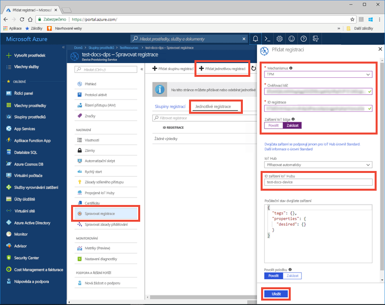
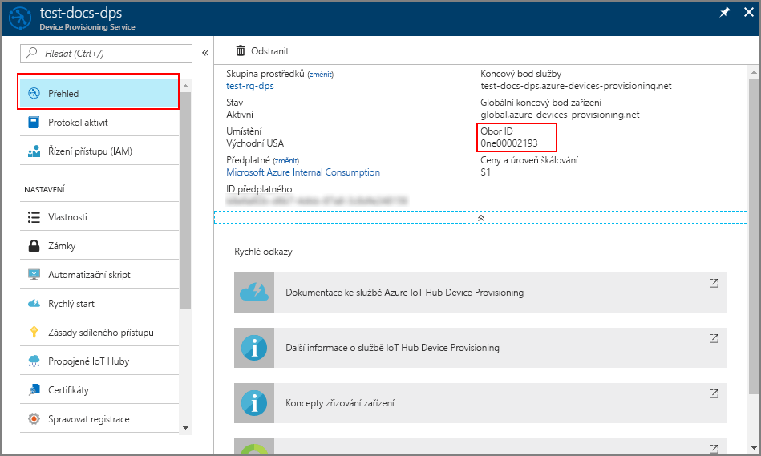

# <a name="create-and-provision-a-simulated-tpm-device-using-nodejs-device-sdk-for-iot-hub-device-provisioning-service"></a>Vytvoření a zřízení simulovaného zařízení TPM pomocí sady Node.js SDK pro zařízení pro službu IoT Hub Device Provisioning

[!INCLUDE [iot-dps-selector-quick-create-simulated-device-tpm](../../includes/iot-dps-selector-quick-create-simulated-device-tpm.md)]

Tyto kroky ukazují, jak na vývojovém počítači s operačním systémem Windows vytvořit simulované zařízení, spustit simulátor Windows TPM jako [modul hardwarového zabezpečení (HSM)](https://azure.microsoft.com/blog/azure-iot-supports-new-security-hardware-to-strengthen-iot-security/) zařízení a jak pomocí vzorového kódu propojit toto simulované zařízení se službou Device Provisioning a centrem IoT. 

Pokud neznáte proces automatického zřizování, měli byste se seznámit také s [koncepty automatického zřizování](concepts-auto-provisioning.md). Než budete pokračovat, ujistěte se také, že jste provedli kroky uvedené v tématu [Nastavení služby IoT Hub Device Provisioning Service pomocí webu Azure Portal](./quick-setup-auto-provision.md). 

[!INCLUDE [IoT Device Provisioning Service basic](../../includes/iot-dps-basic.md)]

## <a name="prepare-the-environment"></a>Příprava prostředí 

1. Ujistěte se, že na svém počítači máte nainstalované [Node.js v4.0 nebo novější](https://nodejs.org).

1. Ujistěte se, že je na vašem počítači nainstalovaný `git` a že je přidaný do proměnných prostředí, ke kterým má příkazové okno přístup. Na stránce [klientských nástrojů Git organizace Software Freedom Conservancy](https://git-scm.com/download/) najdete nejnovější verzi nástrojů `git` k instalaci. Jejich součástí je i **Git Bash**, aplikace příkazového řádku, pomocí které můžete pracovat se svým místním úložištěm Git. 


## <a name="simulate-a-tpm-device"></a>Simulace zařízení TPM

1. Otevřete příkazový řádek nebo Git Bash. Naklonujte úložiště GitHub `azure-utpm-c`:
    
    ```cmd/sh
    git clone https://github.com/Azure/azure-utpm-c.git
    ```

1. Přejděte do kořenové složky GitHub a spusťte simulátor [TPM](https://docs.microsoft.com/windows/device-security/tpm/trusted-platform-module-overview). Ten naslouchá přes soket na portech 2321 a 2322. Toto příkazové okno nezavírejte, simulátor je potřeba nechat spuštěný až do konce této úvodní příručky: 

    ```cmd/sh
    .\azure-utpm-c\tools\tpm_simulator\Simulator.exe
    ```

1. Vytvořte novou prázdnou složku s názvem **registerdevice**. Ve složce **registerdevice** vytvořte soubor package.json pomocí následujícího příkazu na příkazovém řádku. Nezapomeňte zodpovědět všechny otázky, které `npm` zobrazí, nebo přijměte výchozí hodnoty, pokud vám vyhovují:
   
    ```cmd/sh
    npm init
    ```

1. Nainstalujte následující balíčky prekurzorů:

    ```cmd/sh
    npm install node-gyp -g
    npm install ffi -g
    ```

    > [!NOTE]
    > Při instalaci výše uvedených balíčků dochází k několika známým problémům. Tyto problémy vyřešíte tak, že na příkazovém řádku v režimu **Spustit jako správce** spustíte příkaz `npm install --global --production windows-build-tools`, pak spustíte příkaz `SET VCTargetsPath=C:\Program Files (x86)\MSBuild\Microsoft.Cpp\v4.0\V140`, ve kterém použijete cestu k vaší nainstalované verzi, a pak znovu spustíte výše uvedené příkazy pro instalaci.
    >

1. Nainstalujte následující balíčky, které obsahují komponenty používané během instalace:

    - Klient zabezpečení, který funguje s TPM: `azure-iot-security-tpm`
    - Přenos umožňující připojení zařízení ke službě Device Provisioning: `azure-iot-provisioning-device-http` nebo `azure-iot-provisioning-device-amqp`
    - Klient, který použije přenos a klienta zabezpečení: `azure-iot-provisioning-device`

    Jakmile bude zařízení zaregistrované, můžete pomocí obvyklých klientských balíčků zařízení IoT Hub připojit zařízení s použitím přihlašovacích údajů, které jste zadali při registraci. Budete potřebovat:

    - Klienta zařízení: `azure-iot-device`
    - Přenos: `azure-iot-device-amqp`, `azure-iot-device-mqtt` nebo `azure-iot-device-http`
    - Klienta zabezpečení, kterého jste už nainstalovali: `azure-iot-security-tpm`

    > [!NOTE]
    > V níže uvedených ukázkách se používají přenosy `azure-iot-provisioning-device-http` a `azure-iot-device-mqtt`.
    > 

    Všechny tyto balíčky můžete nainstalovat najednou spuštěním následujícího příkazu na příkazovém řádku ve složce **registerdevice**:

        ```cmd/sh
        npm install --save azure-iot-device azure-iot-device-mqtt azure-iot-security-tpm azure-iot-provisioning-device-http azure-iot-provisioning-device
        ```

1. Pomocí textového editoru vytvořte ve složce **registerdevice** nový soubor **ExtractDevice.js**.

1. Na začátek souboru **ExtractDevice.js** přidejte následující příkazy `require`:
   
    ```
    'use strict';

    var tpmSecurity = require('azure-iot-security-tpm');
    var tssJs = require("tss.js");

    var myTpm = new tpmSecurity.TpmSecurityClient(undefined, new tssJs.Tpm(true));
    ```

1. Přidejte následující funkci, která metodu implementuje:
   
    ```
    myTpm.getEndorsementKey(function(err, endorsementKey) {
      if (err) {
        console.log('The error returned from get key is: ' + err);
      } else {
        console.log('the endorsement key is: ' + endorsementKey.toString('base64'));
        myTpm.getRegistrationId((getRegistrationIdError, registrationId) => {
          if (getRegistrationIdError) {
            console.log('The error returned from get registration id is: ' + getRegistrationIdError);
          } else {
            console.log('The Registration Id is: ' + registrationId);
            process.exit();
          }
        });
      }
    });
    ```

1. Uložte a zavřete soubor **ExtractDevice.js**. Spusťte ukázku:

    ```cmd/sh
    node ExtractDevice.js
    ```

1. V okně výstupu se zobrazí **_Ověřovací klíč_** a **_ID registrace_** potřebné pro registraci zařízení. Poznamenejte si tyto hodnoty. 


## <a name="create-a-device-entry"></a>Vytvoření položky zařízení

1. Přihlaste se k webu Azure Portal, v nabídce vlevo klikněte na tlačítko **Všechny prostředky** a otevřete svou službu Device Provisioning.

1. V okně s přehledem služby Device Provisioning vyberte **Správa registrací**. Vyberte kartu **Jednotlivé registrace** a nahoře klikněte na tlačítko **Přidat jednotlivou registraci**. 

1. V části **Přidat registraci** zadejte následující informace:
    - Jako *Mechanismus* ověření identity vyberte **TPM**.
    - Zadejte *ID registrace* a *Ověřovací klíč* pro zařízení TPM.
    - Volitelně můžete zadat následující informace:
        - Vyberte centrum IoT propojené s vaší zřizovací službou.
        - Zadejte jedinečné ID zařízení. Při pojmenování zařízení se ujistěte, že nepoužíváte citlivá data.
        - Aktualizujte **Počáteční stav dvojčete zařízení** s použitím požadované počáteční konfigurace zařízení.
    - Jakmile budete hotovi, klikněte na tlačítko **Uložit**. 

      

   Po úspěšné registraci se *ID registrace* vašeho zařízení zobrazí v seznamu na kartě *Jednotlivé registrace*. 


## <a name="register-the-device"></a>Registrace zařízení

1. Na webu Azure Portal vyberte okno **Přehled** vaší služby Device Provisioning a poznamenejte si hodnoty **_Globální koncový bod zařízení_** a **_Rozsah ID_**.

     

1. Pomocí textového editoru vytvořte ve složce **registerdevice** nový soubor **RegisterDevice.js**.

1. Na začátek souboru **RegisterDevice.js** přidejte následující příkazy `require`:
   
    ```
    'use strict';

    var ProvisioningTransport = require('azure-iot-provisioning-device-http').Http;
    var iotHubTransport = require('azure-iot-device-mqtt').Mqtt;
    var Client = require('azure-iot-device').Client;
    var Message = require('azure-iot-device').Message;
    var tpmSecurity = require('azure-iot-security-tpm');
    var ProvisioningDeviceClient = require('azure-iot-provisioning-device').ProvisioningDeviceClient;
    ```

    > [!NOTE]
    > Sada **Azure IoT SDK pro Node.js** podporuje i další protokoly jako _AMQP_, _AMQP WS_ a _MQTT WS_.  Další příklady najdete v [ukázkách pro sadu SDK služby Device Provisioning pro Node.js](https://github.com/Azure/azure-iot-sdk-node/tree/master/provisioning/device/samples).
    > 

1. Přidejte proměnné **globalDeviceEndpoint** a **idScope** a použijte je k vytvoření instance **ProvisioningDeviceClient**. Nahraďte **{globalDeviceEndpoint}** a **{idScope}** hodnotami **_globálního koncového bodu zařízení_** a **_rozsahu ID_** z **kroku 1**:
   
    ```
    var provisioningHost = '{globalDeviceEndpoint}';
    var idScope = '{idScope}';

    var tssJs = require("tss.js");
    var securityClient = new tpmSecurity.TpmSecurityClient('', new tssJs.Tpm(true));
    // if using non-simulated device, replace the above line with following:
    //var securityClient = new tpmSecurity.TpmSecurityClient();

    var provisioningClient = ProvisioningDeviceClient.create(provisioningHost, idScope, new ProvisioningTransport(), securityClient);
    ```

1. Přidejte následující funkci, která metodu implementuje na zařízení:
   
    ```
    provisioningClient.register(function(err, result) {
      if (err) {
        console.log("error registering device: " + err);
      } else {
        console.log('registration succeeded');
        console.log('assigned hub=' + result.registrationState.assignedHub);
        console.log('deviceId=' + result.registrationState.deviceId);
        var tpmAuthenticationProvider = tpmSecurity.TpmAuthenticationProvider.fromTpmSecurityClient(result.registrationState.deviceId, result.registrationState.assignedHub, securityClient);
        var hubClient = Client.fromAuthenticationProvider(tpmAuthenticationProvider, iotHubTransport);

        var connectCallback = function (err) {
          if (err) {
            console.error('Could not connect: ' + err.message);
          } else {
            console.log('Client connected');
            var message = new Message('Hello world');
            hubClient.sendEvent(message, printResultFor('send'));
          }
        };

        hubClient.open(connectCallback);

        function printResultFor(op) {
          return function printResult(err, res) {
            if (err) console.log(op + ' error: ' + err.toString());
            if (res) console.log(op + ' status: ' + res.constructor.name);
            process.exit(1);
          };
        }
      }
    });
    ```

1. Uložte a zavřete soubor **RegisterDevice.js**. Spusťte ukázku:

    ```cmd/sh
    node RegisterDevice.js
    ```

1. Všimněte si zpráv, které simulují spouštění zařízení a jeho připojování ke službě Device Provisioning pro získání informací o vašem centru IoT. Po úspěšném zřízení simulovaného zařízení pro centrum IoT propojené se službou zřizování se ID zařízení zobrazí v okně **Zařízení IoT** centra. 

     

    Pokud jste v položce registrace pro vaše zařízení změnili *počáteční stav dvojčete zařízení* z výchozí hodnoty, může si zařízení požadovaný stav dvojčete vyžádat z centra a příslušně na něj reagovat. Další informace najdete v tématu [Principy a použití dvojčat zařízení ve službě IoT Hub](../iot-hub/iot-hub-devguide-device-twins.md).


## <a name="clean-up-resources"></a>Vyčištění prostředků

Pokud chcete pokračovat v práci s touto ukázkou klienta zařízení a jejím prozkoumáváním, nevyčišťujte prostředky vytvořené v rámci tohoto rychlého startu. Pokud pokračovat nechcete, pomocí následujícího postupu odstraňte všechny prostředky vytvořené tímto rychlým startem.

1. Zavřete na svém počítači okno výstupu ukázky klienta zařízení.
1. Zavřete na svém počítači okno simulátoru TPM.
1. V nabídce vlevo na webu Azure Portal klikněte na **Všechny prostředky** a vyberte svou službu Device Provisioning. Otevřete okno **Správa registrací** pro vaši službu a pak klikněte na kartu **Jednotlivé registrace**. Vyberte *ID REGISTRACE* zařízení, které jste zaregistrovali v rámci tohoto rychlého startu, a klikněte na tlačítko **Odstranit** v horní části. 
1. V nabídce vlevo na webu Azure Portal klikněte na **Všechny prostředky** a vyberte své centrum IoT. Otevřete okno **Zařízení IoT** pro vaše centrum, vyberte *ID ZAŘÍZENÍ*, které jste zaregistrovali v rámci tohoto rychlého startu, a pak klikněte na tlačítko **Odstranit** v horní části.


## <a name="next-steps"></a>Další kroky

V rámci tohoto rychlého startu jste na svém počítači vytvořili simulované zařízení TPM a pomocí služby IoT Hub Device Provisioning jste ho zřídili pro své centrum IoT. Pokud chcete zjistit, jak zaregistrovat zařízení TPM prostřednictvím kódu programu, pokračujte k rychlému startu pro registraci zařízení TPM prostřednictvím kódu programu. 

> [!div class="nextstepaction"]
> [Rychlý start Azure – Registrace zařízení TPM do služby Azure IoT Hub Device Provisioning](quick-enroll-device-tpm-node.md)
