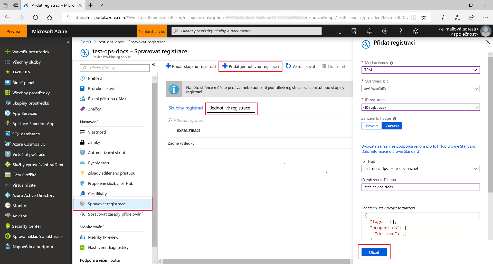
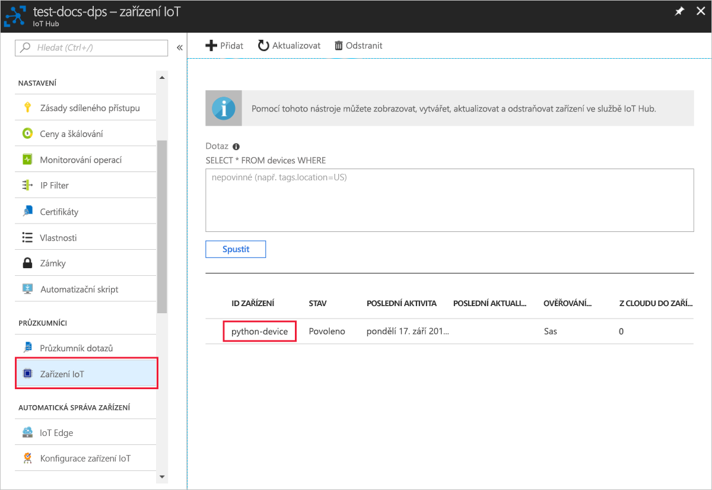

# <a name="quickstart-create-and-provision-a-simulated-tpm-device-using-python-device-sdk-for-iot-hub-device-provisioning-service"></a>Rychlý Start: vytvoření a zřízení simulovaného zařízení TPM pomocí sady SDK pro zařízení Python pro IoT Hub Device Provisioning Service

[!INCLUDE [iot-dps-selector-quick-create-simulated-device-tpm](../../includes/iot-dps-selector-quick-create-simulated-device-tpm.md)]

V tomto rychlém startu vytvoříte simulované zařízení IoT na počítači s Windows. Simulované zařízení zahrnuje simulátor čipu TPM jako modul hardwarového zabezpečení (HSM). Pomocí ukázkového kódu Pythonu zařízení můžete propojit toto simulované zařízení se službou IoT Hub s využitím individuální registrace ve službě Device Provisioning (DPS).

## <a name="prerequisites"></a>Požadavky

- Seznamte se s koncepty [zřizování](about-iot-dps.md#provisioning-process) .
- Dokončení [nastavení IoT Hub Device Provisioning Service s Azure Portal](./quick-setup-auto-provision.md).
- Účet Azure s aktivním předplatným. [Vytvořte si ho zdarma](https://azure.microsoft.com/free/?ref=microsoft.com&utm_source=microsoft.com&utm_medium=docs&utm_campaign=visualstudio).
- [Visual Studio 2015 +](https://visualstudio.microsoft.com/vs/) s desktopovým vývojem v jazyce C++.
- [Systém sestavení cmake](https://cmake.org/download/).
- [Git](https://git-scm.com/download/).

> [!IMPORTANT]
> Tento článek platí jenom pro zastaralé sady SDK verze V1 Pythonu. Klienti zařízení a služeb pro službu IoT Hub Device Provisioning ještě nejsou ve verzi v2 k dispozici. V současné době je tým v práci, aby se do parity funkcí přineslo v2.

[!INCLUDE [IoT Device Provisioning Service basic](../../includes/iot-dps-basic.md)]

## <a name="prepare-the-environment"></a>Příprava prostředí 

1. Ujistěte se, že máte nainstalovanou [aplikaci Visual studio](https://visualstudio.microsoft.com/vs/) 2015 nebo novější, se zapnutou úlohou vývoj desktopových aplikací v jazyce C++ pro instalaci sady Visual Studio.

1. Stáhněte a nainstalujte [sestavovací systém CMake](https://cmake.org/download/).

1. Ujistěte se, že je na vašem počítači nainstalovaný `git` a že je přidaný do proměnných prostředí, ke kterým má příkazové okno přístup. Na stránce [klientských nástrojů Git organizace Software Freedom Conservancy](https://git-scm.com/download/) najdete nejnovější verzi nástrojů `git` k instalaci. Jejich součástí je i **Git Bash**, aplikace příkazového řádku, pomocí které můžete pracovat se svým místním úložištěm Git. 

1. Otevřete příkazový řádek nebo Git Bash. Naklonujte úložiště GitHub se vzorovým kódem pro simulaci zařízení:
    
    ```cmd/sh
    git clone --single-branch --branch v1-deprecated https://github.com/Azure/azure-iot-sdk-python.git --recursive
    ```

1. V lokální kopii tohoto úložiště GitHub vytvořte složku pro proces sestavení CMake. 

    ```cmd/sh
    cd azure-iot-sdk-python/c
    mkdir cmake
    cd cmake
    ```

1. Vzorový kód používá simulátor Windows TPM. Spusťte následující příkaz, kterým povolíte ověřování pomocí tokenu SAS. Zároveň se vygeneruje řešení v sadě Visual Studio pro simulované zařízení.

    ```cmd/sh
    cmake -Duse_prov_client:BOOL=ON -Duse_tpm_simulator:BOOL=ON ..
    ```

1. V samostatném příkazovém řádku přejděte do složky simulátoru TPM a spusťte simulátor [čipu TPM](https://docs.microsoft.com/windows/device-security/tpm/trusted-platform-module-overview) , který bude modul [hardwarového](https://azure.microsoft.com/blog/azure-iot-supports-new-security-hardware-to-strengthen-iot-security/) zabezpečení pro simulované zařízení. Klikněte na **Povolit přístup**. Ten naslouchá přes soket na portech 2321 a 2322. Toto příkazové okno nezavírejte; je potřeba, aby byl tento simulátor spuštěný až do konce tohoto průvodce rychlým startem. 

    ```cmd/sh
    .\azure-iot-sdk-python\c\provisioning_client\deps\utpm\tools\tpm_simulator\Simulator.exe
    ```

    


## <a name="create-a-device-enrollment-entry"></a>Vytvoření položky registrace zařízení

Služba Azure IoT Device Provisioning podporuje dva typy registrací:

- [Skupiny registrací:](concepts-service.md#enrollment-group) Slouží k registraci několika souvisejících zařízení.
- [Jednotlivé registrace](concepts-service.md#individual-enrollment): používá se k registraci jednoho zařízení.

Tento článek ukazuje jednotlivé registrace.

1. Otevřete řešení `azure_iot_sdks.sln` vygenerované ve složce *cmake* a sestavte ho v sadě Visual Studio.

1. Klikněte pravým tlačítkem na projekt **tpm_device_provision** a vyberte **Nastavit jako spouštěný projekt**. Spusťte řešení. V okně výstup se zobrazí **_ověřovací klíč_** a **_ID registrace_** potřebné pro registraci zařízení. Poznamenejte si tyto hodnoty. 

    

1. Přihlaste se k Azure Portal, v nabídce na levé straně vyberte tlačítko **všechny prostředky** a otevřete svou službu Device Provisioning.

1. V nabídce služba Device Provisioning vyberte **spravovat registrace**. Vyberte kartu **jednotlivé registrace** a v horní části vyberte tlačítko **přidat jednotlivou registraci** . 

1. Na panelu **Přidat registraci** zadejte následující informace:
   - Jako *Mechanismus* ověření identity vyberte **TPM**.
   - Zadejte *ID registrace* a *ověřovací klíč* pro vaše zařízení TPM z hodnot, které jste si poznamenali dříve.
   - Vyberte centrum IoT propojené s vaší zřizovací službou.
   - Volitelně můžete zadat následující informace:
       - Zadejte jedinečné *ID zařízení*. Při pojmenování zařízení se ujistěte, že nepoužíváte citlivá data. Pokud se rozhodnete nezadat žádný, místo toho se použije ID registrace k identifikaci zařízení.
       - Aktualizujte **Počáteční stav dvojčete zařízení** s použitím požadované počáteční konfigurace zařízení.
   - Po dokončení klikněte na tlačítko **Uložit** . 

       

   Po úspěšné registraci se *ID registrace* vašeho zařízení zobrazí v seznamu na kartě *Jednotlivé registrace*. 


## <a name="simulate-the-device"></a>Simulace zařízení

1. Stáhněte a nainstalujte [Python 2.x nebo 3.x](https://www.python.org/downloads/). Ujistěte se, že používáte 32bitovou, nebo 64bitovou instalaci podle požadavků vašeho nastavení. Po zobrazení výzvy v průběhu instalace nezapomeňte přidat Python do proměnných prostředí pro konkrétní platformu.
    - Pokud používáte operační systém Windows, je k povolení používání nativních knihoven DLL z Pythonu potřeba [balíček distribuovatelných součástí Visual C++](https://support.microsoft.com/help/2977003/the-latest-supported-visual-c-downloads).

1. Pomocí [těchto pokynů](https://github.com/Azure/azure-iot-sdk-python/blob/v1-deprecated/doc/python-devbox-setup.md) sestavte balíčky Pythonu.

   > [!NOTE]
   > Pokud používáte `build_client.cmd`, nezapomeňte použít příznak `--use-tpm-simulator`.
   > 
   > [!NOTE]
   > Pokud používáte `pip`, nezapomeňte nainstalovat také balíček `azure-iot-provisioning-device-client`. Poznámka: vydané balíčky PIP skutečně využívají TPM, a ne simulátor. Pokud chcete použít simulátor, musíte je zkompilovat ze zdroje s použitím příznaku `--use-tpm-simulator`.

1. Přejděte do složky s ukázkami.

    ```cmd/sh
    cd azure-iot-sdk-python/provisioning_device_client/samples
    ```

1. Pomocí svého integrovaného vývojového prostředí (IDE) pro Python upravte skript Pythonu **provisioning\_device\_client\_sample.py**. Změňte proměnné * \_ \_ identifikátor URI* a  * \_ Rozsah ID* globální prov na hodnoty uvedené dříve. Ujistěte se také, že *SECURITY\_DEVICE\_TYPE* je nastaven na `ProvisioningSecurityDeviceType.TPM`.

    ```python
    GLOBAL_PROV_URI = "{globalServiceEndpoint}"
    ID_SCOPE = "{idScope}"
    SECURITY_DEVICE_TYPE = ProvisioningSecurityDeviceType.TPM
    PROTOCOL = ProvisioningTransportProvider.HTTP
    ```

    

1. Spusťte ukázku. 

    ```cmd/sh
    python provisioning_device_client_sample.py
    ```

1. Všimněte si zpráv, které simulují spouštění zařízení a jeho připojování ke službě Device Provisioning pro získání informací o vašem centru IoT. 

    

1. Po úspěšném zřízení simulovaného zařízení pro Centrum IoT propojené se službou zřizování se ID zařízení zobrazí v okně **zařízení IoT** centra.

     

    Pokud jste v položce registrace pro vaše zařízení změnili *počáteční stav dvojčete zařízení* z výchozí hodnoty, může si zařízení požadovaný stav dvojčete vyžádat z centra a příslušně na něj reagovat. Další informace najdete v tématu [pochopení a používání nevláken zařízení v IoT Hub](../iot-hub/iot-hub-devguide-device-twins.md)


## <a name="clean-up-resources"></a>Vyčištění prostředků

Pokud máte v úmyslu pokračovat v práci a prozkoumat si ukázku klienta zařízení, neprovádějte čištění prostředků vytvořených v rámci tohoto rychlého startu. Pokud pokračovat nechcete, pomocí následujícího postupu odstraňte všechny prostředky vytvořené tímto rychlým startem.

1. Zavřete na svém počítači okno výstupu ukázky klienta zařízení.
1. Zavřete na svém počítači okno simulátoru TPM.
1. V nabídce na levé straně Azure Portal vyberte **všechny prostředky** a potom vyberte svou službu Device Provisioning. Otevřete okno **Správa** registrací pro vaši službu a pak vyberte kartu **jednotlivé registrace** . Zaškrtněte políčko vedle *ID registrace* zařízení, které jste zaregistrovali v rámci tohoto rychlého startu, a klikněte na tlačítko **Odstranit** v horní části podokna. 
1. V nabídce na levé straně Azure Portal vyberte **všechny prostředky** a potom vyberte Centrum IoT. Otevřete okno **zařízení IoT** pro vaše centrum, zaškrtněte políčko vedle *ID zařízení* , které jste zaregistrovali v rámci tohoto rychlého startu, a pak klikněte na tlačítko **Odstranit** v horní části podokna.

## <a name="next-steps"></a>Další kroky

V tomto rychlém startu jste na svém počítači vytvořili simulované zařízení TPM a pomocí IoT Hub Device Provisioning Service ho zřídili ve službě IoT Hub. Informace o tom, jak zaregistrovat zařízení TPM prostřednictvím kódu programu, najdete v rychlém startu pro programovou registraci zařízení TPM. 

> [!div class="nextstepaction"]
> [Rychlý Start Azure – registrace zařízení TPM do Azure IoT Hub Device Provisioning Service](quick-enroll-device-tpm-python.md)
