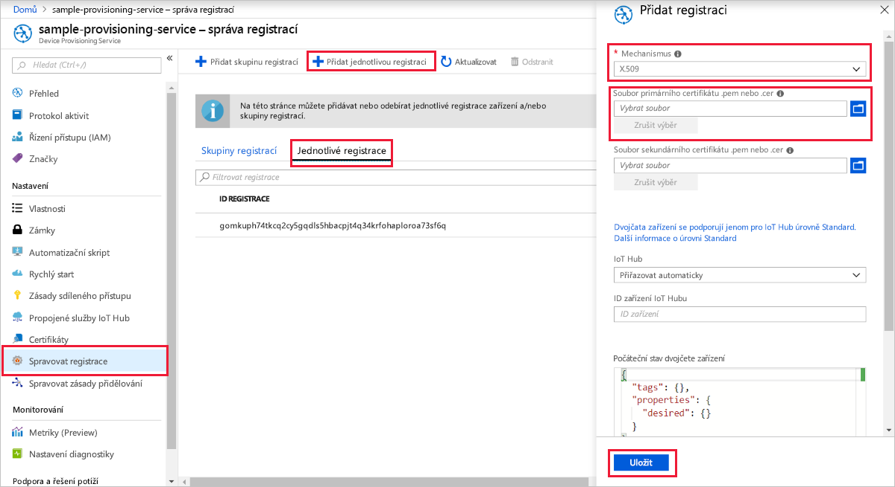
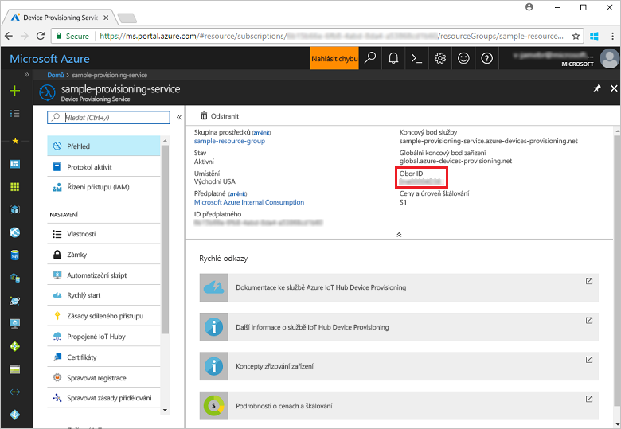
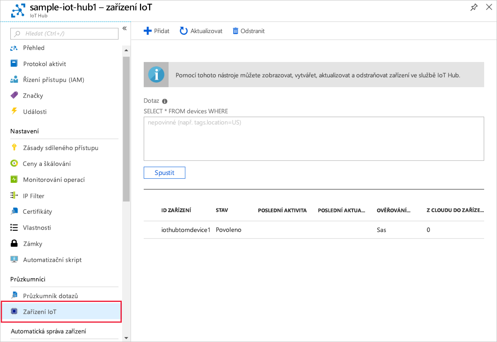

# <a name="quickstart-create-and-provision-an-x509-device-using-c-device-sdk-for-iot-hub-device-provisioning-service"></a>Rychlý Start: vytvoření a zřízení zařízení X. 509 pomocí sady SDK pro zařízení v jazyce C# pro IoT Hub Device Provisioning Service

[!INCLUDE [iot-dps-selector-quick-create-simulated-device-x509](../../includes/iot-dps-selector-quick-create-simulated-device-x509.md)]

Tyto kroky ukazují, jak pomocí kódu zařízení ze [vzorků Azure IoT pro jazyk C#](https://github.com/Azure-Samples/azure-iot-samples-csharp) zřídit zařízení X. 509. V tomto článku spustíte ukázkový kód zařízení na vašem vývojovém počítači a připojíte se k IoT Hub pomocí služby Device Provisioning.

## <a name="prerequisites"></a>Požadavky

Pokud nejste obeznámeni s procesem autozřizování, přečtěte si přehled [zřizování](about-iot-dps.md#provisioning-process) . Než budete pokračovat, ujistěte se také, že jste provedli kroky uvedené v tématu [Nastavení služby IoT Hub Device Provisioning Service pomocí webu Azure Portal](./quick-setup-auto-provision.md).

Služba Azure IoT Device Provisioning podporuje dva typy registrací:
- [Skupiny registrací:](concepts-service.md#enrollment-group) Slouží k registraci několika souvisejících zařízení.
- [Jednotlivé registrace:](concepts-service.md#individual-enrollment) Slouží k registraci jednoho zařízení.

V tomto článku si předvedeme jednotlivé registrace.

[!INCLUDE [IoT Device Provisioning Service basic](../../includes/iot-dps-basic.md)]

<a id="setupdevbox"></a>
## <a name="prepare-the-development-environment"></a>Příprava vývojového prostředí 

1. Ujistěte se, že je na vašem počítači nainstalovaný `git` a že je přidaný do proměnných prostředí, ke kterým má příkazové okno přístup. Na stránce [klientských nástrojů Git organizace Software Freedom Conservancy](https://git-scm.com/download/) najdete nejnovější verzi nástrojů `git` k instalaci. Jejich součástí je i **Git Bash**, aplikace příkazového řádku, pomocí které můžete pracovat se svým místním úložištěm Git. 

1. Otevřete příkazový řádek nebo Git Bash. Naklonujte ukázky Azure IoT pro úložiště GitHub v jazyce C#:
    
    ```bash
    git clone https://github.com/Azure-Samples/azure-iot-samples-csharp.git
    ```

1. Ujistěte se, že máte na počítači nainstalovanou [sadu .NET Core 3.0.0 SDK nebo novější](https://www.microsoft.com/net/download/windows) . K ověření vaší verze můžete použít následující příkaz.

    ```bash
    dotnet --info
    ```

## <a name="create-a-self-signed-x509-device-certificate"></a>Vytvoření certifikátu zařízení X.509 podepsaného svým držitelem

V této části vytvoříte testovací certifikát X. 509 podepsaný svým držitelem, který se používá `iothubx509device1` jako běžný název subjektu. Mějte na paměti následující důležité skutečnosti:

* Certifikáty podepsané svým držitelem jsou určené jenom pro testování a neměly by se používat v produkčním prostředí.
* Výchozí datum vypršení platnosti certifikátu podepsaného svým držitelem je jeden rok.
* ID zařízení zařízení IoT bude běžný název subjektu v certifikátu. Nezapomeňte použít název subjektu, který splňuje [požadavky na řetězec ID zařízení](../iot-hub/iot-hub-devguide-identity-registry.md#device-identity-properties).

Pomocí ukázkového kódu z [X509Sample](https://github.com/Azure-Samples/azure-iot-samples-csharp/tree/master/provisioning/Samples/device/X509Sample) vytvoříte certifikát, který se má použít spolu s položkou zápisu na jednotlivé zařízení.


1. V příkazovém řádku PowerShellu přejděte do adresáře projektu s ukázkou zřizování zařízení X. 509.

    ```powershell
    cd .\azure-iot-samples-csharp\provisioning\Samples\device\X509Sample
    ```

2. Vzorový kód je nastavený tak, aby používal certifikáty X.509 uložené v souboru ve formátu PKCS12 chráněném heslem (certificate.pfx). Kromě toho budete potřebovat soubor certifikátu veřejného klíče (Certificate. cer) k vytvoření jednotlivé registrace později v tomto rychlém startu. Pokud chcete vygenerovat certifikát podepsaný svým držitelem a přidružené soubory. cer a. pfx, spusťte následující příkaz:

    ```powershell
    PS D:\azure-iot-samples-csharp\provisioning\Samples\device\X509Sample> .\GenerateTestCertificate.ps1 iothubx509device1
    ```

3. Skript váz vyzve k zadání hesla PFX. Toto heslo si zapamatujte, budete ho muset později použít při spuštění ukázky. Můžete spustit `certutil` Výpis certifikátu a ověřit název subjektu.

    ```powershell
    PS D:\azure-iot-samples-csharp\provisioning\Samples\device\X509Sample> certutil .\certificate.pfx
    Enter PFX password:
    ================ Certificate 0 ================
    ================ Begin Nesting Level 1 ================
    Element 0:
    Serial Number: 7b4a0e2af6f40eae4d91b3b7ff05a4ce
    Issuer: CN=iothubx509device1, O=TEST, C=US
     NotBefore: 2/1/2021 6:18 PM
     NotAfter: 2/1/2022 6:28 PM
    Subject: CN=iothubx509device1, O=TEST, C=US
    Signature matches Public Key
    Root Certificate: Subject matches Issuer
    Cert Hash(sha1): e3eb7b7cc1e2b601486bf8a733887a54cdab8ed6
    ----------------  End Nesting Level 1  ----------------
      Provider = Microsoft Strong Cryptographic Provider
    Signature test passed
    CertUtil: -dump command completed successfully.    
    ```

 ## <a name="create-an-individual-enrollment-entry-for-the-device"></a>Vytvořit jednotlivou položku registrace pro zařízení


1. Přihlaste se k Azure Portal, v nabídce na levé straně vyberte tlačítko **všechny prostředky** a otevřete svou službu zřizování.

2. V nabídce služba Device Provisioning vyberte **spravovat registrace**. Vyberte kartu **jednotlivé registrace** a v horní části vyberte tlačítko **přidat jednotlivou registraci** . 

3. Na panelu **Přidat registraci** zadejte následující informace:
   - Jako *Mechanismus* ověření identity vyberte **X.509**.
   - V části *soubor. pem nebo. cer primárního certifikátu* zvolte *Vybrat soubor* a vyberte soubor certifikátu **Certificate. cer** vytvořený v předchozích krocích.
   - **ID zařízení** nechte prázdné. Vaše zařízení se zřídí s ID zařízení nastaveným na běžný název v certifikátu X.509, tedy **iothubx509device1**. Tento běžný název bude také názvem, který se používá pro ID registrace pro jednotlivou položku registrace. 
   - Volitelně můžete zadat následující informace:
       - Vyberte centrum IoT propojené s vaší zřizovací službou.
       - Aktualizujte **Počáteční stav dvojčete zařízení** s použitím požadované počáteční konfigurace zařízení.
   - Po dokončení klikněte na tlačítko **Uložit** . 

     [](./media/quick-create-simulated-device-x509-csharp/device-enrollment.png#lightbox)
    
   Po úspěšné registraci se záznam vaší registrace X.509 zobrazí jako **iothubx509device1** ve sloupci *ID registrace* na kartě *Jednotlivé registrace*. 


## <a name="provision-the-device"></a>Zřízení zařízení

1. V okně **Přehled** pro vaši službu zřizování si poznamenejte hodnotu **_Rozsah ID_** .

     


2. Zadejte následující příkaz, který sestaví a spustí ukázku zřizování zařízení X.509. Hodnotu `<IDScope>` nahraďte hodnotou Rozsah ID pro vaši službu zřizování. 

    Soubor certifikátu bude ve výchozím nastavení nastaven na *./Certificate.pfx* a zobrazí výzvu k zadání hesla. pfx.  

    ```powershell
    dotnet run -- -s <IDScope>
    ```

    Pokud chcete předat vše jako parametr, můžete použít následující příklad formátu.

    ```powershell
    dotnet run -- -s 0ne00000A0A -c certificate.pfx -p 1234
    ```


3. Zařízení se připojí k DPS a bude přiřazeno k IoT Hub. Zařízení také pošle zprávu telemetrie do centra.

    ```output
    Loading the certificate...
    Found certificate: 10952E59D13A3E388F88E534444484F52CD3D9E4 CN=iothubx509device1, O=TEST, C=US; PrivateKey: True
    Using certificate 10952E59D13A3E388F88E534444484F52CD3D9E4 CN=iothubx509device1, O=TEST, C=US
    Initializing the device provisioning client...
    Initialized for registration Id iothubx509device1.
    Registering with the device provisioning service...
    Registration status: Assigned.
    Device iothubx509device2 registered to sample-iot-hub1.azure-devices.net.
    Creating X509 authentication for IoT Hub...
    Testing the provisioned device with IoT Hub...
    Sending a telemetry message...
    Finished.
    ```

4. Ověřte zřízení zařízení. Po úspěšném zřízení zařízení pro Centrum IoT propojené se službou zřizování se ID zařízení zobrazí v okně **zařízení IoT** centra. 

     

    Pokud jste v položce registrace pro vaše zařízení změnili *počáteční stav dvojčete zařízení* z výchozí hodnoty, může si zařízení požadovaný stav dvojčete vyžádat z centra a příslušně na něj reagovat. Další informace najdete v tématu [pochopení a používání nevláken zařízení v IoT Hub](../iot-hub/iot-hub-devguide-device-twins.md)


## <a name="clean-up-resources"></a>Vyčištění prostředků

Pokud máte v úmyslu pokračovat v práci a prozkoumat si ukázku klienta zařízení, neprovádějte čištění prostředků vytvořených v rámci tohoto rychlého startu. Pokud pokračovat nechcete, pomocí následujícího postupu odstraňte všechny prostředky vytvořené tímto rychlým startem.

1. Zavřete na svém počítači okno výstupu ukázky klienta zařízení.
1. Zavřete na svém počítači okno simulátoru TPM.
1. V nabídce na levé straně Azure Portal vyberte **všechny prostředky** a potom vyberte svou službu Device Provisioning. V horní části okna **Přehled** klikněte v horní části podokna na **Odstranit** .  
1. V nabídce na levé straně Azure Portal vyberte **všechny prostředky** a potom vyberte Centrum IoT. V horní části okna **Přehled** klikněte v horní části podokna na **Odstranit** .  

## <a name="next-steps"></a>Další kroky

V tomto rychlém startu jste ve službě IoT Hub zřídili zařízení X. 509 s využitím Azure IoT Hub Device Provisioning Service. Informace o tom, jak zaregistrovat zařízení X. 509 prostřednictvím kódu programu, najdete v rychlém startu pro programovou registraci zařízení X. 509. 

> [!div class="nextstepaction"]
> [Rychlý Start Azure – registrace zařízení X. 509 do Azure IoT Hub Device Provisioning Service](quick-enroll-device-x509-csharp.md)
