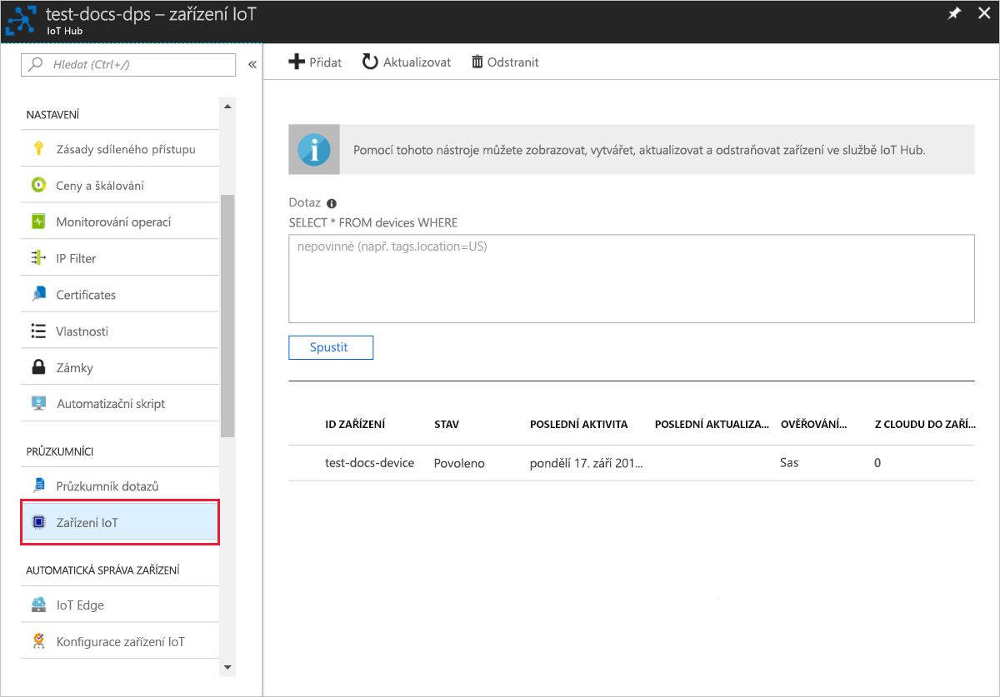

# <a name="quickstart-create-and-provision-an-x509-simulated-device-using-nodejs-device-sdk-for-iot-hub-device-provisioning-service"></a>Úvodní příručka: Vytvoření a zřízení simulovaného zařízení X.509 pomocí sady SDK zařízení Node.js pro službu zřizování zařízení centra IoT Hub

[!INCLUDE [iot-dps-selector-quick-create-simulated-device-x509](../../includes/iot-dps-selector-quick-create-simulated-device-x509.md)]

V tomto rychlém startu vytvoříte simulované zařízení X.509 v počítači se systémem Windows. Ke připojení tohoto simulovaného zařízení k centru IoT pomocí individuální registrace pomocí služby Device Provisioning Service (DPS) se používá ukázkový kód Node.js.

## <a name="prerequisites"></a>Požadavky

- Přehled [konceptů automatického zřizování](concepts-auto-provisioning.md).
- Dokončení [nastavení služby zřizování zařízení služby IoT Hub na webu Azure Portal](./quick-setup-auto-provision.md).
- Účet Azure s aktivním předplatným. [Vytvořte si ho zdarma](https://azure.microsoft.com/free/?ref=microsoft.com&utm_source=microsoft.com&utm_medium=docs&utm_campaign=visualstudio).
- [Node.js v4.0+](https://nodejs.org).
- [Git](https://git-scm.com/download/).
- [Openssl](https://www.openssl.org/).

[!INCLUDE [IoT Device Provisioning Service basic](../../includes/iot-dps-basic.md)]

## <a name="prepare-the-environment"></a>Příprava prostředí 

1. Než budete pokračovat, dokončete kroky v tématu [Nastavení služby IoT Hub Device Provisioning pomocí webu Azure Portal](./quick-setup-auto-provision.md).

2. Ujistěte se, že na svém počítači máte nainstalované [Node.js v4.0 nebo novější](https://nodejs.org).

3. Ujistěte se, že je [Git](https://git-scm.com/download/) nainstalovaný ve vašem počítači a je přidán do proměnných prostředí přístupných do příkazového okna. 

4. Ujistěte se, že je na vašem počítači nainstalovaná knihovna [OpenSSL](https://www.openssl.org/) a že je přidaná do proměnných prostředí, ke kterým má příkazové okno přístup. Tuto knihovnu je možné sestavit a nainstalovat ze zdroje nebo stáhnout a nainstalovat od [třetí strany](https://wiki.openssl.org/index.php/Binaries), jako je [tato](https://sourceforge.net/projects/openssl/). 

    > [!NOTE]
    > Pokud již máte vytvořené _kořenové_, _zprostředkující_ nebo _listové_ certifikáty X.509, můžete tento krok a všechny další kroky týkající se generování certifikátů přeskočit.
    >

## <a name="create-a-self-signed-x509-device-certificate-and-individual-enrollment-entry"></a>Vytvoření certifikátu zařízení X.509 podepsaného svým držitelem a položky jednotlivé registrace

V této části budete používat certifikát X.509 podepsaný svým držitelem. Je důležité vzít v úvahu následující body:

* Certifikáty podepsané svým držitelem jsou určené jenom pro testování a neměly by se používat v produkčním prostředí.
* Výchozí datum vypršení platnosti certifikátu podepsaného svým držitelem je jeden rok.

Pomocí vzorového kódu ze sady [Azure IoT SDK pro Node.js](https://github.com/Azure/azure-iot-sdk-node.git) vytvoříte certifikát, který použije položka registrace pro simulované zařízení.

Služba Azure IoT Device Provisioning podporuje dva typy registrací:

- [Skupiny registrací:](concepts-service.md#enrollment-group) Slouží k registraci několika souvisejících zařízení.
- [Jednotlivé registrace](concepts-service.md#individual-enrollment): Používá se k registraci jednoho zařízení.

Tento článek ukazuje jednotlivé zápisy.

1. Otevřete příkazový řádek. Naklonujte úložiště GitHub se vzorovými kódy:
    
    ```cmd/sh
    git clone https://github.com/Azure/azure-iot-sdk-node.git --recursive
    ```

2. Přejděte ke skriptu generátoru certifikátů a sestavte projekt. 

    ```cmd/sh
    cd azure-iot-sdk-node/provisioning/tools
    npm install
    ```

3. Vytvořte _listový_ certifikát X.509 spuštěním skriptu s použitím vlastního názvu certifikátu (_certificate-name_). Běžný název listového certifikátu se použije jako [ID registrace](https://docs.microsoft.com/azure/iot-dps/concepts-device#registration-id), takže nezapomeňte použít pouze malé alfanumerické znaky a pomlčky.

    ```cmd/sh
    node create_test_cert.js device {certificate-name}
    ```

4. Přihlaste se k [portálu Azure](https://portal.azure.com), vyberte tlačítko **Všechny prostředky** v levé nabídce a otevřete instanci služby Zřizování zařízení.

5. V nabídce Služba zřizování zařízení vyberte **Spravovat registrace**. Vyberte **kartu Jednotlivé registrace** a nahoře vyberte tlačítko Přidat jednotlivé **zápisy.** 

6. V panelu **Přidat zápis** zadejte následující informace:
   - Jako *Mechanismus* ověření identity vyberte **X.509**.
   - V části *Primární certifikát .pem nebo soubor CER*zvolte Vybrat *soubor* a vyberte soubor certifikátu **{certificate-name}_cert.pem** vytvořený v předchozích krocích.  
   - Volitelně můžete zadat následující informace:
     - Vyberte centrum IoT propojené s vaší zřizovací službou.
     - Zadejte jedinečné ID zařízení. Při pojmenování zařízení se ujistěte, že nepoužíváte citlivá data. 
     - Aktualizujte **Počáteční stav dvojčete zařízení** s použitím požadované počáteční konfigurace zařízení.
     - Po dokončení stiskněte tlačítko **Uložit.** 

     [](./media/quick-create-simulated-device-x509-node/device-enrollment.png#lightbox)

     Při úspěšném zápisu se zařízení X.509 zobrazí jako **{certificatename}** ve *sloupci ID registrace* na kartě *Individuální zápisy.*

## <a name="simulate-the-device"></a>Simulace zařízení

Sada [SDK pro zařízení Azure IoT Hub pro Node.js](https://github.com/Azure/azure-iot-sdk-node) poskytuje snadný způsob, jak simulovat zařízení. Další informace najdete v tématu [Koncepty zařízení](https://docs.microsoft.com/azure/iot-dps/concepts-device).

1. Na webu Azure Portal vyberte okno **Přehled** pro službu Zřizování zařízení a poznamenejte si hodnoty **_koncového bodu zařízení GLobal_** a **_oboridu ID._**

     

2. Zkopírujte svůj _certifikát_ a _klíč_ do složky s ukázkou.

    ```cmd/sh
    copy .\{certificate-name}_cert.pem ..\device\samples\{certificate-name}_cert.pem
    copy .\{certificate-name}_key.pem ..\device\samples\{certificate-name}_key.pem
    ```

3. Přejděte do skriptu testu zařízení a sestavte projekt. 

    ```cmd/sh
    cd ..\device\samples
    npm install
    ```

4. Upravte soubor **register\_x509.js**. Po provedení následujících změn soubor uložte.
    - Hodnotu `provisioning host` nahraďte za **_Globální koncový bod zařízení_**, který jste si poznamenali dříve v **kroku 1**.
    - Nahraďte `id scope` **_rozsah ID_** uvedený v kroku **1** výše. 
    - Nahraďte `registration id` **_id registrace_** uvedenou v předchozí části.
    - Hodnoty `cert filename` a `key filename` nahraďte za soubory, které jste si zkopírovali dříve v **kroku 2**. 

5. Spusťte skript a ověřte úspěšné zřízení zařízení.

    ```cmd/sh
    node register_x509.js
    ```   

6. Na portálu přejděte do centra IoT propojeného s vaší zřizovací službou a otevřete okno **zařízení IoT.** Při úspěšném zřizování simulovaného zařízení X.509 do rozbočovače se jeho ID zařízení zobrazí na okně **zařízení IoT** s *funkcí STATUS* jako **povolenou**. Možná budete muset stisknout tlačítko **Aktualizovat** v horní části, pokud jste již otevřeli okno před spuštěním ukázkové aplikace zařízení. 

     

    Pokud jste v položce registrace pro vaše zařízení změnili *počáteční stav dvojčete zařízení* z výchozí hodnoty, může si zařízení požadovaný stav dvojčete vyžádat z centra a příslušně na něj reagovat. Další informace najdete v tématu [Principy a použití dvojčat zařízení ve službě IoT Hub](../iot-hub/iot-hub-devguide-device-twins.md).


## <a name="clean-up-resources"></a>Vyčištění prostředků

Pokud máte v plánu pokračovat v práci a zkoumání ukázky klienta zařízení, nečistěte prostředky vytvořené v tomto rychlém startu. Pokud neplánujete pokračovat, odstraňte pomocí následujících kroků všechny prostředky vytvořené tímto rychlým startem.

1. Zavřete na svém počítači okno výstupu ukázky klienta zařízení.
2. V levé nabídce na webu Azure Portal vyberte **Všechny prostředky** a pak vyberte službu Zřizování zařízení. Otevřete okno **Spravovat registrace** pro vaši službu a pak zaškrtněte kartu **Jednotlivé registrace.** Zaškrtněte políčko vedle *ID registrace* zařízení, které jste zaregistrovali v tomto rychlém startu, a stiskněte tlačítko **Odstranit** v horní části podokna. 
3. V levé nabídce na webu Azure Portal vyberte **Všechny prostředky** a pak vyberte své centrum IoT. Otevřete okno **zařízení IoT** pro váš rozbočovač, zaškrtněte políčko vedle *ID zařízení* zařízení, které jste zaregistrovali v tomto rychlém startu, a stiskněte tlačítko **Odstranit** v horní části podokna.


## <a name="next-steps"></a>Další kroky

V tomto rychlém startu jste vytvořili simulované zařízení X.509 a zřídíte ho do vašeho centra IoT hub pomocí služby Azure IoT Hub DeviceProvisioning Service na portálu. Chcete-li se dozvědět, jak zaregistrovat zařízení X.509 programově, pokračujte na rychlém startu pro programovou registraci zařízení X.509. 

> [!div class="nextstepaction"]
> [Azure quickstart – registrace zařízení X.509 do služby Azure IoT Hub Device Provisioning Service](quick-enroll-device-x509-node.md)
