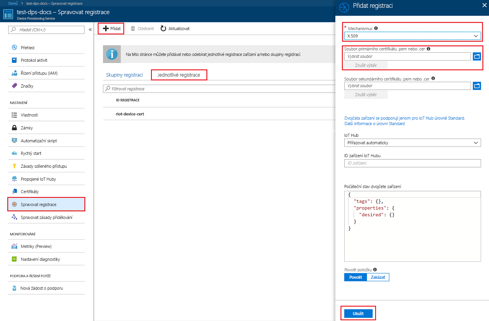
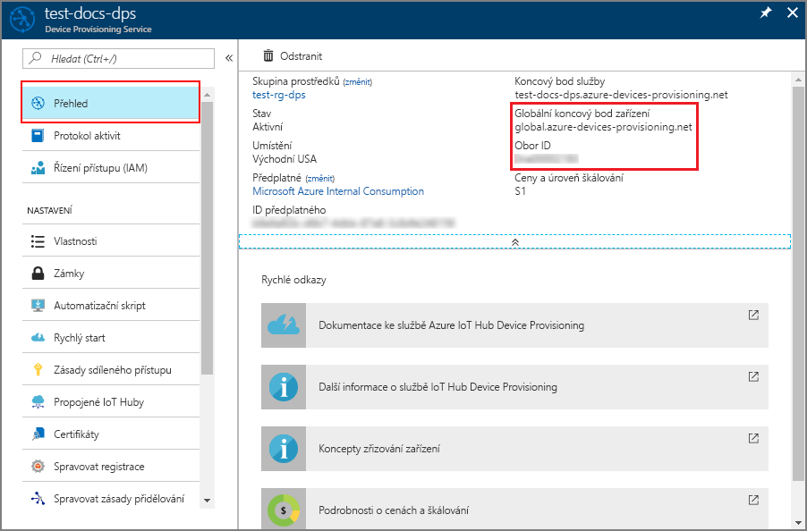
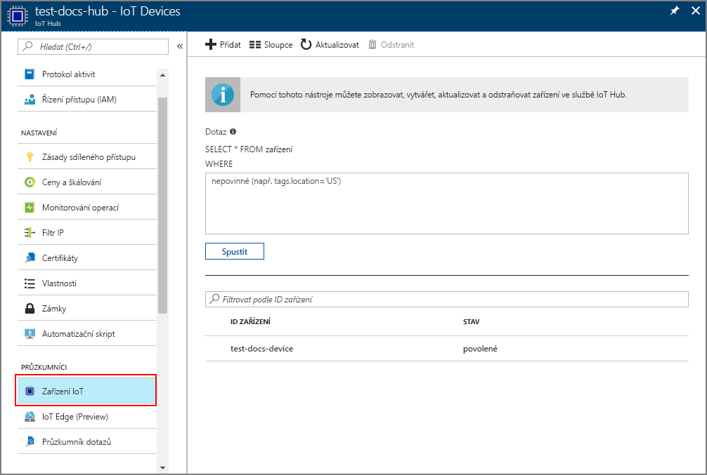

# <a name="create-and-provision-an-x509-simulated-device-using-nodejs-device-sdk-for-iot-hub-device-provisioning-service"></a>Vytvoření a zřízení simulovaného zařízení X.509 pomocí sady Node.js SDK pro zařízení pro službu IoT Hub Device Provisioning
[!INCLUDE [iot-dps-selector-quick-create-simulated-device-x509](../../includes/iot-dps-selector-quick-create-simulated-device-x509.md)]

Tyto kroky ukazují, jak vytvořit položku registrace ve službě Device Provisioning, simulovat zařízení X.509 na vývojovém počítači, propojit simulované zařízení se službou Device Provisioning a zaregistrovat zařízení v centru IoT pomocí sady [SDK pro zařízení Azure IoT Hub pro Node.js](https://github.com/Azure/azure-iot-sdk-node).

Pokud neznáte proces automatického zřizování, měli byste se seznámit také s [koncepty automatického zřizování](concepts-auto-provisioning.md). Než budete pokračovat, ujistěte se také, že jste provedli kroky uvedené v tématu [Nastavení služby IoT Hub Device Provisioning Service pomocí webu Azure Portal](./quick-setup-auto-provision.md). 

[!INCLUDE [IoT DPS basic](../../includes/iot-dps-basic.md)]

## <a name="prepare-the-environment"></a>Příprava prostředí 

1. Než budete pokračovat, dokončete kroky v tématu [Nastavení služby IoT Hub Device Provisioning pomocí webu Azure Portal](./quick-setup-auto-provision.md).

2. Ujistěte se, že na svém počítači máte nainstalované [Node.js v4.0 nebo novější](https://nodejs.org).

3. Ujistěte se, že je na vašem počítači nainstalovaný [Git](https://git-scm.com/download/) a že je přidaný do proměnných prostředí, ke kterým má příkazové okno přístup. 

4. Ujistěte se, že je na vašem počítači nainstalovaná knihovna [OpenSSL](https://www.openssl.org/) a že je přidaná do proměnných prostředí, ke kterým má příkazové okno přístup. Tuto knihovnu je možné sestavit a nainstalovat ze zdroje nebo stáhnout a nainstalovat od [třetí strany](https://wiki.openssl.org/index.php/Binaries), jako je [tato](https://sourceforge.net/projects/openssl/). 

    > [!NOTE]
    > Pokud již máte vytvořené _kořenové_, _zprostředkující_ nebo _listové_ certifikáty X.509, můžete tento krok a všechny další kroky týkající se generování certifikátů přeskočit.
    >

## <a name="create-a-self-signed-x509-device-certificate-and-individual-enrollment-entry"></a>Vytvoření certifikátu zařízení X.509 podepsaného svým držitelem a položky jednotlivé registrace

1. Otevřete příkazový řádek. Naklonujte úložiště GitHub se vzorovými kódy:
    
    ```cmd/sh
    git clone https://github.com/Azure/azure-iot-sdk-node.git --recursive
    ```

2. Přejděte ke skriptu generátoru certifikátů a sestavte projekt. 

    ```cmd/sh
    cd azure-iot-sdk-node/provisioning/tools
    npm install
    ```

3. Vytvořte _listový_ certifikát X.509 spuštěním skriptu s použitím vlastního názvu certifikátu (_certificate-name_). Poznámka: Běžný název listového certifikátu se použije jako [ID registrace](https://docs.microsoft.com/azure/iot-dps/concepts-device#registration-id), takže nezapomeňte použít pouze malé alfanumerické znaky a pomlčky.

    ```cmd/sh
    node create_test_cert.js device {certificate-name}
    ```

4. Přihlaste se k webu [Azure Portal](https://portal.azure.com), v nabídce vlevo klikněte na tlačítko **Všechny prostředky** a otevřete svou instanci služby Device Provisioning Service.

5. V okně s přehledem služby Device Provisioning vyberte **Správa registrací**. Vyberte kartu **Jednotlivé registrace** a klikněte na tlačítko **Přidat** v horní části. 

6. Na panelu **Přidat registraci** zadejte následující informace:
    - Jako *Mechanismus* ověření identity vyberte **X.509**.
    - V části *Soubor .pem nebo .cer primárního certifikátu* klikněte na *Vyberte soubor* a vyberte soubor certifikátu **{název_certifikátu}_cert.pem** vytvořený v předchozích krocích.  
    - Volitelně můžete zadat následující informace:
      - Vyberte centrum IoT propojené s vaší zřizovací službou.
      - Zadejte jedinečné ID zařízení. Při pojmenování zařízení se ujistěte, že nepoužíváte citlivá data. 
      - Aktualizujte **Počáteční stav dvojčete zařízení** s použitím požadované počáteční konfigurace zařízení.
   - Jakmile budete hotovi, klikněte na tlačítko **Uložit**. 

    [](./media/quick-create-simulated-device-x509-node/individual-enrollment.png#lightbox)

    Po úspěšné registraci se vaše zařízení X.509 zobrazí jako **{název_certifikátu}** ve sloupci *ID registrace* na kartě *Jednotlivé registrace*. Tuto hodnotu si poznamenejte pro pozdější použití.

## <a name="simulate-the-device"></a>Simulace zařízení

Sada [SDK pro zařízení Azure IoT Hub pro Node.js](https://github.com/Azure/azure-iot-sdk-node) poskytuje snadný způsob, jak simulovat zařízení. Další informace najdete v tématu [Koncepty zařízení](https://docs.microsoft.com/azure/iot-dps/concepts-device).

1. Na webu Azure Portal vyberte okno **Přehled** vaší služby Device Provisioning a poznamenejte si hodnoty **_Globální koncový bod zařízení_** a **_Rozsah ID_**.

     

2. Zkopírujte svůj _certifikát_ a _klíč_ do složky s ukázkou.

    ```cmd/sh
    copy .\{certificate-name}_cert.pem ..\device\samples\{certificate-name}_cert.pem
    copy .\{certificate-name}_key.pem ..\device\samples\{certificate-name}_key.pem
    ```

3. Přejděte do skriptu testu zařízení a sestavte projekt. 

    ```cmd/sh
    cd ..\device\samples
    npm install
    ```

4. Upravte soubor **register\_x509.js**. Po provedení následujících změn soubor uložte.
    - Hodnotu `provisioning host` nahraďte za **_Globální koncový bod zařízení_**, který jste si poznamenali dříve v **kroku 1**.
    - Hodnotu `id scope` nahraďte za **_Rozsah ID_**, který jste si poznamenali dříve v **kroku 1**. 
    - Hodnotu `registration id` nahraďte za **_ID registrace_**, které jste si poznamenali v předchozí části.
    - Hodnoty `cert filename` a `key filename` nahraďte za soubory, které jste si zkopírovali dříve v **kroku 2**. 

5. Spusťte skript a ověřte úspěšné zřízení zařízení.

    ```cmd/sh
    node register_x509.js
    ```   

6. Na portálu přejděte k centru IoT propojenému s vaší službou zřizování a otevřete okno **Zařízení IoT**. Po úspěšném zřízení simulovaného zařízení X.509 pro toto centrum se ID tohoto zařízení zobrazí v okně **Zařízení IoT** a jeho *STAV* bude **povoleno**. Pokud jste okno otevřeli už před spuštěním ukázkové aplikace zařízení, možná bude potřeba kliknout na tlačítko **Aktualizovat** v horní části. 

     

    Pokud jste v položce registrace pro vaše zařízení změnili *počáteční stav dvojčete zařízení* z výchozí hodnoty, může si zařízení požadovaný stav dvojčete vyžádat z centra a příslušně na něj reagovat. Další informace najdete v tématu [Principy a použití dvojčat zařízení ve službě IoT Hub](../iot-hub/iot-hub-devguide-device-twins.md).


## <a name="clean-up-resources"></a>Vyčištění prostředků

Pokud chcete pokračovat v práci s touto ukázkou klienta zařízení a jejím prozkoumáváním, nevyčišťujte prostředky vytvořené v rámci tohoto rychlého startu. Pokud pokračovat nechcete, pomocí následujícího postupu odstraňte všechny prostředky vytvořené tímto rychlým startem.

1. Zavřete na svém počítači okno výstupu ukázky klienta zařízení.
2. V nabídce vlevo na webu Azure Portal klikněte na **Všechny prostředky** a vyberte svou službu Device Provisioning. Otevřete okno **Správa registrací** pro vaši službu a pak klikněte na kartu **Jednotlivé registrace**. Vyberte *ID REGISTRACE* zařízení, které jste zaregistrovali v rámci tohoto rychlého startu, a klikněte na tlačítko **Odstranit** v horní části. 
3. V nabídce vlevo na webu Azure Portal klikněte na **Všechny prostředky** a vyberte své centrum IoT. Otevřete okno **Zařízení IoT** pro vaše centrum, vyberte *ID ZAŘÍZENÍ*, které jste zaregistrovali v rámci tohoto rychlého startu, a pak klikněte na tlačítko **Odstranit** v horní části.


## <a name="next-steps"></a>Další kroky

V rámci tohoto rychlého startu jste vytvořili simulované zařízení X.509 a pomocí služby Azure IoT Hub Device Provisioning na portálu jste ho zřídili pro své centrum IoT. Pokud chcete zjistit, jak zaregistrovat zařízení X.509 prostřednictvím kódu programu, pokračujte k rychlému startu pro registraci zařízení X.509 prostřednictvím kódu programu. 

> [!div class="nextstepaction"]
> [Rychlý start Azure – Registrace zařízení X.509 do služby Azure IoT Hub Device Provisioning](quick-enroll-device-x509-node.md)
