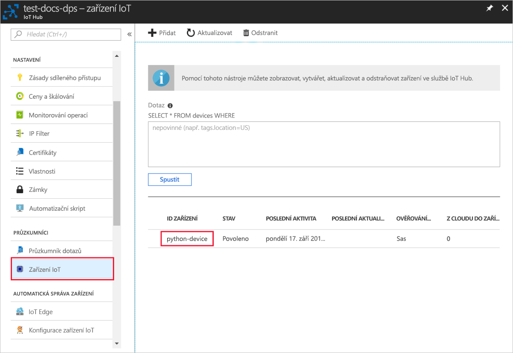

# <a name="quickstart-create-and-provision-a-simulated-x509-device-using-python-device-sdk-for-iot-hub-device-provisioning-service"></a>Rychlý Start: vytvoření a zřízení simulovaného zařízení X. 509 pomocí sady SDK pro zařízení Python pro IoT Hub Device Provisioning Service

[!INCLUDE [iot-dps-selector-quick-create-simulated-device-x509](../../includes/iot-dps-selector-quick-create-simulated-device-x509.md)]

V tomto rychlém startu vytvoříte simulované zařízení X. 509 na počítači se systémem Windows. Pomocí ukázkového kódu Pythonu zařízení můžete propojit toto simulované zařízení se službou IoT Hub s využitím individuální registrace ve službě Device Provisioning (DPS).

## <a name="prerequisites"></a>Požadavky

- Seznamte se s koncepty [zřizování](about-iot-dps.md#provisioning-process) .
- Dokončení [nastavení IoT Hub Device Provisioning Service s Azure Portal](./quick-setup-auto-provision.md).
- Účet Azure s aktivním předplatným. [Vytvořte si ho zdarma](https://azure.microsoft.com/free/?ref=microsoft.com&utm_source=microsoft.com&utm_medium=docs&utm_campaign=visualstudio).
- [Visual Studio 2015 +](https://visualstudio.microsoft.com/vs/) s desktopovým vývojem v jazyce C++.
- [Systém sestavení cmake](https://cmake.org/download/).
- [Git](https://git-scm.com/download/).

> [!IMPORTANT]
> Tento článek platí jenom pro zastaralé sady SDK verze V1 Pythonu. Klienti zařízení a služeb pro službu IoT Hub Device Provisioning ještě nejsou ve verzi v2 k dispozici. V současné době je tým v práci, aby se do parity funkcí přineslo v2.

[!INCLUDE [IoT Device Provisioning Service basic](../../includes/iot-dps-basic.md)]

## <a name="prepare-the-environment"></a>Příprava prostředí 

1. Ujistěte se, že máte nainstalovanou [aplikaci Visual studio](https://visualstudio.microsoft.com/vs/) 2015 nebo novější, se zapnutou úlohou vývoj desktopových aplikací v jazyce C++ pro instalaci sady Visual Studio.

2. Stáhněte a nainstalujte [sestavovací systém CMake](https://cmake.org/download/).

3. Ujistěte se, že je na vašem počítači nainstalovaný `git` a že je přidaný do proměnných prostředí, ke kterým má příkazové okno přístup. Na stránce [klientských nástrojů Git organizace Software Freedom Conservancy](https://git-scm.com/download/) najdete nejnovější verzi nástrojů `git` k instalaci. Jejich součástí je i **Git Bash**, aplikace příkazového řádku, pomocí které můžete pracovat se svým místním úložištěm Git. 

4. Otevřete příkazový řádek nebo Git Bash. Naklonujte úložiště GitHub se vzorovým kódem pro simulaci zařízení.
    
    ```cmd/sh
    git clone https://github.com/Azure/azure-iot-sdk-python.git --recursive
    ```

5. V lokální kopii tohoto úložiště GitHub vytvořte složku pro proces sestavení CMake. 

    ```cmd/sh
    cd azure-iot-sdk-python/c
    mkdir cmake
    cd cmake
    ```

6. Spuštěním následujícího příkazu vytvořte v sadě Visual Studio řešení pro klienta zřizování.

    ```cmd/sh
    cmake -Duse_prov_client:BOOL=ON ..
    ```


## <a name="create-a-self-signed-x509-device-certificate-and-individual-enrollment-entry"></a>Vytvoření certifikátu zařízení X.509 podepsaného svým držitelem a položky jednotlivé registrace

V této části použijete certifikát zařízení X.509 podepsaný svým držitelem. Mějte na paměti následující důležité skutečnosti:

* Certifikáty podepsané svým držitelem jsou určené jenom pro testování a neměly by se používat v produkčním prostředí.
* Výchozí datum vypršení platnosti certifikátu podepsaného svým držitelem je jeden rok.

Pomocí vzorového kódu ze sady Azure IoT C SDK vytvoříte certifikát, který použije položka registrace pro simulované zařízení.

Služba Azure IoT Device Provisioning podporuje dva typy registrací:

- [Skupiny registrací:](concepts-service.md#enrollment-group) Slouží k registraci několika souvisejících zařízení.
- [Jednotlivé registrace](concepts-service.md#individual-enrollment): používá se k registraci jednoho zařízení.

Tento článek ukazuje jednotlivé registrace.

1. Otevřete řešení `azure_iot_sdks.sln` vygenerované ve složce *cmake* a sestavte ho v sadě Visual Studio.

2. Klikněte pravým tlačítkem na projekt **dice\_device\_enrollment** ve složce **Provision\_Tools** a vyberte **Nastavit jako spouštěný projekt**. Spusťte řešení. 

3. Po zobrazení výzvy zadejte v okně Výstup `i` pro jednotlivou registraci. V okně Výstup se zobrazí místně vygenerovaný certifikát X.509 pro vaše simulované zařízení. 
    
    ```output
    Copy the first certificate to clipboard. Begin with the first occurrence of:
    
        -----BEGIN CERTIFICATE----- 
        
    End you copying after the first occurrence of:
    
        -----END CERTIFICATE-----
        
    Make sure to include both of those lines as well.
    ``` 

    
 
4. Na svém počítači s Windows vytvořte soubor **_X509testcertificate.pem_**, otevřete ho v libovolném editoru a zkopírujte do něj obsah schránky. Soubor uložte. 

5. Přihlaste se k Azure Portal, v nabídce na levé straně vyberte tlačítko **všechny prostředky** a otevřete svou službu zřizování.

6. V nabídce služba Device Provisioning vyberte **spravovat registrace**. Vyberte kartu **jednotlivé registrace** a v horní části vyberte tlačítko **přidat jednotlivou registraci** . 

7. Na panelu **Přidat registraci** zadejte následující informace:
   - Jako *Mechanismus* ověření identity vyberte **X.509**.
   - V části *soubor. pem nebo. cer primárního certifikátu*zvolte *Vybrat soubor* a vyberte soubor certifikátu **X509testcertificate. pem** vytvořený v předchozích krocích.
   - Volitelně můžete zadat následující informace:
     - Vyberte centrum IoT propojené s vaší zřizovací službou.
     - Zadejte jedinečné ID zařízení. Při pojmenování zařízení se ujistěte, že nepoužíváte citlivá data. 
     - Aktualizujte **Počáteční stav dvojčete zařízení** s použitím požadované počáteční konfigurace zařízení.
   - Po dokončení klikněte na tlačítko **Uložit** . 

     [](./media/python-quick-create-simulated-device-x509/device-enrollment.png#lightbox)

   Po úspěšné registraci se vaše zařízení X.509 zobrazí jako **riot-device-cert** ve sloupci *ID registrace* na kartě *Jednotlivé registrace*. 

## <a name="simulate-the-device"></a>Simulace zařízení

1. V nabídce služba Device Provisioning vyberte **Přehled**. Poznamenejte si _Rozsah ID_ a _Globální koncový bod služby_.

    

2. Stáhněte a nainstalujte [Python 2.x nebo 3.x](https://www.python.org/downloads/). Ujistěte se, že používáte 32bitovou, nebo 64bitovou instalaci podle požadavků vašeho nastavení. Po zobrazení výzvy v průběhu instalace nezapomeňte přidat Python do proměnných prostředí pro konkrétní platformu. Pokud používáte Python 2.x, možná bude nutné [nainstalovat nebo upgradovat *pip*, systém pro správu balíčků Pythonu](https://pip.pypa.io/en/stable/installing/).
    
    > [!NOTE] 
    > Pokud používáte Windows, nainstalujte také [Distribuovatelné součásti Visual C++ pro Visual Studio 2015](https://support.microsoft.com/help/2977003/the-latest-supported-visual-c-downloads). Balíčky pip vyžadují tyto distribuovatelné součásti k načítání nebo spouštění knihoven DLL jazyka C.

3. Pomocí [těchto pokynů](https://github.com/Azure/azure-iot-sdk-python/blob/v1-deprecated/doc/python-devbox-setup.md) sestavte balíčky Pythonu.

   > [!NOTE]
   > Pokud používáte `pip`, nezapomeňte nainstalovat také balíček `azure-iot-provisioning-device-client`.

4. Přejděte do složky s ukázkami.

    ```cmd/sh
    cd azure-iot-sdk-python/provisioning_device_client/samples
    ```

5. Pomocí svého integrovaného vývojového prostředí (IDE) pro Python upravte skript Pythonu **provisioning\_device\_client\_sample.py**. Proměnné _GLOBAL\_PROV\_URI_ a _ID\_SCOPE_ změňte na hodnoty, které jste si poznamenali dříve.

    ```python
    GLOBAL_PROV_URI = "{globalServiceEndpoint}"
    ID_SCOPE = "{idScope}"
    SECURITY_DEVICE_TYPE = ProvisioningSecurityDeviceType.X509
    PROTOCOL = ProvisioningTransportProvider.HTTP
    ```

6. Spusťte ukázku. 

    ```cmd/sh
    python provisioning_device_client_sample.py
    ```

7. Aplikace se připojí, zaregistruje zařízení a zobrazí zprávu o úspěšné registraci.

    

8. Na portálu přejděte k centru IoT propojenému s vaší službou zřizování a otevřete okno **Device Explorer**. Po úspěšném zřízení simulovaného zařízení X.509 pro toto centrum se ID tohoto zařízení zobrazí v okně **Device Explorer** a jeho *STAV* bude **povoleno**. Pokud jste okno už otevřeli před spuštěním ukázkové aplikace zařízení, možná budete muset stisknout tlačítko **aktualizovat** v horní části. 

     

> [!NOTE]
> Pokud jste v položce registrace pro vaše zařízení změnili *počáteční stav dvojčete zařízení* z výchozí hodnoty, může si zařízení požadovaný stav dvojčete vyžádat z centra a příslušně na něj reagovat. Další informace najdete v tématu [Principy a použití dvojčat zařízení ve službě IoT Hub](../iot-hub/iot-hub-devguide-device-twins.md).
>

## <a name="clean-up-resources"></a>Vyčištění prostředků

Pokud máte v úmyslu pokračovat v práci a prozkoumat si ukázku klienta zařízení, neprovádějte čištění prostředků vytvořených v rámci tohoto rychlého startu. Pokud pokračovat nechcete, pomocí následujícího postupu odstraňte všechny prostředky vytvořené tímto rychlým startem.

1. Zavřete na svém počítači okno výstupu ukázky klienta zařízení.
2. V nabídce na levé straně Azure Portal vyberte **všechny prostředky** a potom vyberte svou službu Device Provisioning. Otevřete okno **Správa** registrací pro vaši službu a pak vyberte kartu **jednotlivé registrace** . Zaškrtněte políčko vedle *ID registrace* zařízení, které jste zaregistrovali v rámci tohoto rychlého startu, a klikněte na tlačítko **Odstranit** v horní části podokna. 
3. V nabídce na levé straně Azure Portal vyberte **všechny prostředky** a potom vyberte Centrum IoT. Otevřete okno **zařízení IoT** pro vaše centrum, zaškrtněte políčko vedle *ID zařízení* , které jste zaregistrovali v rámci tohoto rychlého startu, a pak klikněte na tlačítko **Odstranit** v horní části podokna.

## <a name="next-steps"></a>Další kroky

V tomto rychlém startu jste na svém počítači s Windows vytvořili simulované zařízení X. 509 a pomocí Azure IoT Hub Device Provisioning Service na portálu jste ho zřídili ve službě IoT Hub. Informace o tom, jak zaregistrovat zařízení X. 509 prostřednictvím kódu programu, najdete v rychlém startu pro programovou registraci zařízení X. 509. 

> [!div class="nextstepaction"]
> [Rychlý Start Azure – registrace zařízení X. 509 do Azure IoT Hub Device Provisioning Service](quick-enroll-device-x509-python.md)
