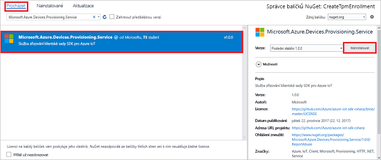

# <a name="quickstart-enroll-tpm-device-to-iot-hub-device-provisioning-service-using-c-service-sdk"></a>Rychlý Start: registrace zařízení TPM pro IoT Hub Device Provisioning Service pomocí sady SDK služby C#

[!INCLUDE [iot-dps-selector-quick-enroll-device-tpm](../../includes/iot-dps-selector-quick-enroll-device-tpm.md)]

Tento článek ukazuje, jak programově vytvořit jednotlivou registraci pro zařízení TPM v Azure IoT Hub Device Provisioning Service pomocí [sady SDK služby pro c#](https://github.com/Azure/azure-iot-sdk-csharp) a ukázkové aplikace .NET Core v c#. Můžete volitelně zaregistrovat simulované zařízení TPM do služby zřizování pomocí této položky individuální registrace. I když tyto kroky fungují na počítačích se systémem Windows i Linux, Tento článek používá vývojový počítač s Windows.

## <a name="prepare-the-development-environment"></a>Příprava vývojového prostředí

1. Ověřte, že máte v počítači nainstalovanou [aplikaci Visual Studio 2019](https://www.visualstudio.com/vs/) .

1. Ověřte, že máte v počítači nainstalovanou [.NET Core SDK](https://www.microsoft.com/net/download/windows) .

1. Než budete pokračovat, proveďte kroky v části [nastavení IoT Hub Device Provisioning Service s Azure Portal](./quick-setup-auto-provision.md) .

1. Volitelné Pokud chcete na konci tohoto rychlého startu zaregistrovat simulované zařízení, postupujte podle pokynů v části [Vytvoření a zřízení simulovaného zařízení TPM pomocí sady SDK pro zařízení C#](quick-create-simulated-device-tpm-csharp.md) až do kroku, kdy získáte ověřovací klíč pro zařízení. Uložte ověřovací klíč, ID registrace a volitelně ID zařízení, protože je potřebujete použít později v tomto rychlém startu.

   > [!NOTE]
   > Neprovádějte postup vytvoření jednotlivé registrace pomocí Azure Portal.

## <a name="get-the-connection-string-for-your-provisioning-service"></a>Získání připojovacího řetězce pro službu zřizování

Pro ukázku v tomto rychlém startu potřebujete připojovací řetězec pro vaši službu zřizování.

1. Přihlaste se k Azure Portal, vyberte **všechny prostředky** a službu Device Provisioning.

1. Zvolte **zásady sdíleného přístupu** a pak vyberte zásadu přístupu, kterou chcete použít k otevření jejích vlastností. V části **zásady přístupu** zkopírujte a uložte připojovací řetězec primárního klíče.

    

## <a name="create-the-individual-enrollment-sample"></a>Vytvoření ukázky jednotlivé registrace

V této části se dozvíte, jak vytvořit konzolovou aplikaci .NET Core, která do vaší služby zřizování přidá jednotlivou registraci pro zařízení TPM. S určitými úpravami můžete pomocí tohoto postupu vytvořit pro přidání jednotlivé registrace také konzolovou aplikaci [Windows IoT Core](https://developer.microsoft.com/en-us/windows/iot). Další informace o vývoji pomocí IoT Core najdete v [dokumentaci pro vývojáře pro Windows IoT Core](/windows/iot-core/).

1. Otevřete Visual Studio a vyberte **vytvořit nový projekt**. V části **vytvořit nový projekt** zvolte **Konzolová aplikace (.NET Core)** šablona projektu pro C# a vyberte **Další**.

1. Pojmenujte projekt *CreateTpmEnrollment* a stiskněte **vytvořit**.

    

1. Po otevření řešení v aplikaci Visual Studio klikněte v podokně **Průzkumník řešení** pravým tlačítkem myši na projekt **CreateTpmEnrollment** . Vyberte **Spravovat balíčky NuGet**.

1. V **nástroji Správce balíčků NuGet** vyberte **Procházet**, vyhledejte a zvolte **Microsoft. Azure. Devices. Provisioning. Service** a potom stiskněte **nainstalovat**.

   

   Tento krok stáhne a nainstaluje balíček NuGet [klientské sady SDK služby zřizování pro Azure IoT](https://www.nuget.org/packages/Microsoft.Azure.Devices.Provisioning.Service/) a jeho závislosti a přidá se na něj odkaz.

1. Přidejte následující `using` příkazy za další `using` příkazy v horní části `Program.cs` :
  
   ```csharp
   using System.Threading.Tasks;
   using Microsoft.Azure.Devices.Provisioning.Service;
   ```

1. Přidejte do třídy následující pole `Program` a proveďte níže uvedené změny.

   ```csharp
   private static string ProvisioningConnectionString = "{ProvisioningServiceConnectionString}";
   private const string RegistrationId = "sample-registrationid-csharp";
   private const string TpmEndorsementKey =
       "AToAAQALAAMAsgAgg3GXZ0SEs/gakMyNRqXXJP1S124GUgtk8qHaGzMUaaoABgCAAEMAEAgAAAAAAAEAxsj2gUS" +
       "cTk1UjuioeTlfGYZrrimExB+bScH75adUMRIi2UOMxG1kw4y+9RW/IVoMl4e620VxZad0ARX2gUqVjYO7KPVt3d" +
       "yKhZS3dkcvfBisBhP1XH9B33VqHG9SHnbnQXdBUaCgKAfxome8UmBKfe+naTsE5fkvjb/do3/dD6l4sGBwFCnKR" +
       "dln4XpM03zLpoHFao8zOwt8l/uP3qUIxmCYv9A7m69Ms+5/pCkTu/rK4mRDsfhZ0QLfbzVI6zQFOKF/rwsfBtFe" +
       "WlWtcuJMKlXdD8TXWElTzgh7JS4qhFzreL0c1mI0GCj+Aws0usZh7dLIVPnlgZcBhgy1SSDQMQ==";
       
   // Optional parameters
   private const string OptionalDeviceId = "myCSharpDevice";
   private const ProvisioningStatus OptionalProvisioningStatus = ProvisioningStatus.Enabled;
   ```

   * Nahraďte `ProvisioningServiceConnectionString` hodnotu zástupného symbolu připojovacím řetězcem služby zřizování, pro kterou chcete vytvořit registraci.

   * Volitelně můžete změnit ID registrace, ověřovací klíč, ID zařízení i stav zřizování.

   * Pokud používáte tento rychlý Start společně s [vytvořením a zřízení simulovaného zařízení TPM pomocí sady SDK pro zařízení C#](quick-create-simulated-device-tpm-csharp.md) ke zřízení simulovaného zařízení, nahraďte ověřovací klíč a ID registrace hodnotami, které jste si poznamenali v tomto rychlém startu. ID zařízení můžete nahradit hodnotou navrhovanou v tomto rychlém startu, použít vlastní hodnotu nebo použít výchozí hodnotu v této ukázce.

1. Do třídy přidejte následující metodu `Program` .  Tento kód vytvoří jednotlivou položku registrace a pak zavolá `CreateOrUpdateIndividualEnrollmentAsync` metodu `ProvisioningServiceClient` pro přidání jednotlivé registrace do služby zřizování.

   ```csharp
   public static async Task RunSample()
   {
       Console.WriteLine("Starting sample...");

       using (ProvisioningServiceClient provisioningServiceClient =
               ProvisioningServiceClient.CreateFromConnectionString(ProvisioningConnectionString))
       {
           #region Create a new individualEnrollment config
           Console.WriteLine("\nCreating a new individualEnrollment...");
           Attestation attestation = new TpmAttestation(TpmEndorsementKey);
           IndividualEnrollment individualEnrollment =
                   new IndividualEnrollment(
                           RegistrationId,
                           attestation);

           // The following parameters are optional. Remove them if you don't need them.
           individualEnrollment.DeviceId = OptionalDeviceId;
           individualEnrollment.ProvisioningStatus = OptionalProvisioningStatus;
           #endregion

           #region Create the individualEnrollment
           Console.WriteLine("\nAdding new individualEnrollment...");
           IndividualEnrollment individualEnrollmentResult =
               await provisioningServiceClient.CreateOrUpdateIndividualEnrollmentAsync(individualEnrollment).ConfigureAwait(false);
           Console.WriteLine("\nIndividualEnrollment created with success.");
           Console.WriteLine(individualEnrollmentResult);
           #endregion
        
       }
   }
   ```

1. Nakonec nahraďte `Main` metodu následujícími řádky:

   ```csharp
    static async Task Main(string[] args)
    {
        await RunSample();
        Console.WriteLine("\nHit <Enter> to exit ...");
        Console.ReadLine();
    }
   ```

1. Sestavte řešení.

## <a name="run-the-individual-enrollment-sample"></a>Spuštění ukázky jednotlivé registrace
  
Spusťte ukázku v sadě Visual Studio, aby se vytvořila jednotlivá registrace pro vaše zařízení TPM.

Zobrazí se okno příkazového řádku a začne zobrazovat potvrzovací zprávy. Po úspěšném vytvoření se v okně příkazového řádku zobrazí vlastnosti nového individuálního zápisu.

Můžete ověřit, zda byl vytvořen jednotlivý zápis. Přejít do přehledu služby Device Provisioning a vybrat **spravovat registrace** a pak vybrat **jednotlivé registrace**. Měla by se zobrazit nová položka registrace odpovídající ID registrace, které jste použili v ukázce.


Vyberte záznam pro ověření ověřovacího klíče a dalších vlastností položky.

Pokud jste se seznámili s postupem popsaným v rychlém startu [Vytvoření a zřízení simulovaného zařízení TPM pomocí sady SDK pro zařízení C#](quick-create-simulated-device-tpm-csharp.md) , můžete pokračovat zbývajícími kroky v tomto rychlém startu a zaregistrovat simulované zařízení. Nezapomeňte přeskočit kroky k vytvoření jednotlivé registrace pomocí webu Azure Portal.

## <a name="clean-up-resources"></a>Vyčištění prostředků

Pokud plánujete prozkoumat ukázku služby C#, neprovádějte čištění prostředků vytvořených v rámci tohoto rychlého startu. V opačném případě pomocí následujících kroků odstraňte všechny prostředky vytvořené tímto rychlým startem.

1. Zavřete okno výstup ukázky C# ve vašem počítači.

1. V Azure Portal přejděte do vaší služby Device Provisioning, vyberte **spravovat registrace** a pak vyberte kartu **jednotlivé registrace** . Zaškrtněte políčko vedle *ID registrace* pro položku registrace, kterou jste vytvořili v tomto rychlém startu, a stiskněte tlačítko **Odstranit** v horní části podokna.

1. Pokud jste postupovali podle kroků v části [Vytvoření a zřízení simulovaného zařízení TPM pomocí sady SDK pro zařízení C#](quick-create-simulated-device-tpm-csharp.md) k vytvoření simulovaného zařízení TPM, proveďte následující kroky:

    1. Zavřete okno simulátoru TPM a okno výstupu ukázky pro simulované zařízení.

    1. Na webu Azure Portal přejděte do služby IoT Hub, ve které se zřídilo vaše zařízení. V nabídce v části **Průzkumník** vyberte **zařízení IoT**, zaškrtněte políčko vedle *ID zařízení* , které jste zaregistrovali v rámci tohoto rychlého startu, a pak klikněte na tlačítko **Odstranit** v horní části podokna.

## <a name="next-steps"></a>Další kroky

V tomto rychlém startu jste programově vytvořili jednotlivou položku registrace pro zařízení TPM. Volitelně jste v počítači vytvořili simulované zařízení TPM a pomocí Azure IoT Hub Device Provisioning Service ho zřídili ve službě IoT Hub. Pokud se chcete se zřizováním zařízení seznámit podrobněji, pokračujte ke kurzu nastavení služby Device Provisioning na webu Azure Portal.

> [!div class="nextstepaction"]
> [Kurzy pro službu Azure IoT Hub Device Provisioning](./tutorial-set-up-cloud.md)