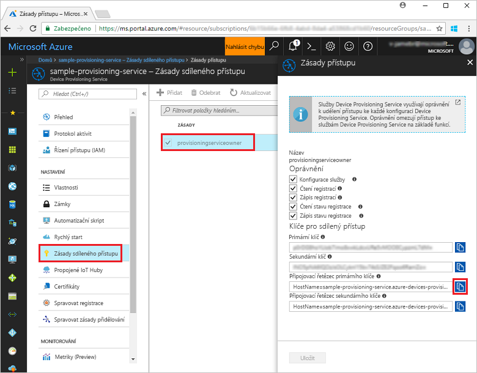
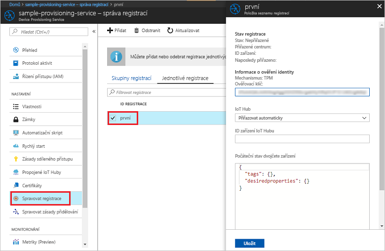

# <a name="quickstart-enroll-tpm-device-to-iot-hub-device-provisioning-service-using-nodejs-service-sdk"></a>Rychlý Start: registrace zařízení TPM k IoT Hub Device Provisioning Service pomocí sady SDK služby pro Node. js

[!INCLUDE [iot-dps-selector-quick-enroll-device-tpm](../../includes/iot-dps-selector-quick-enroll-device-tpm.md)]


Tyto kroky ukazují, jak prostřednictvím kódu programu vytvořit jednotlivou registraci pro simulované zařízení TPM ve službě Azure IoT Hub Device Provisioning pomocí sady [SDK služby pro Node.js](https://github.com/Azure/azure-iot-sdk-node) a ukázkové aplikace v Node.js. Volitelně můžete simulované zařízení TPM zaregistrovat do služby zřizování pomocí této položky jednotlivé registrace. Přestože tento postup bude fungovat na počítačích s Windows i Linuxem, pro účely tohoto článku budeme používat vývojový počítač s Windows.

## <a name="prerequisites"></a>Požadavky

- Než budete pokračovat, nezapomeňte dokončit kroky v tématu [Nastavení služby IoT Hub Device Provisioning pomocí webu Azure Portal](./quick-setup-auto-provision.md). 
-  Ujistěte se, že na svém počítači máte nainstalované [Node.js v4.0 nebo novější](https://nodejs.org).
- Pokud chcete na konci tohoto rychlého startu zaregistrovat simulované zařízení, postupujte podle kroků v části [Vytvoření a zřízení simulovaného zařízení](quick-create-simulated-device.md) až do kroku, kdy získáte ověřovací klíč pro zařízení. Poznamenejte si ověřovací klíč, budete ho používat později v tomto rychlém startu. **Neprovádějte kroky k vytvoření jednotlivé registrace pomocí webu Azure Portal.**
 
## <a name="create-the-individual-enrollment-sample"></a>Vytvoření ukázky jednotlivé registrace 

 
1. Z příkazového okna ve vaší pracovní složce spusťte:
  
    ```cmd\sh
    npm install azure-iot-provisioning-service
    ```  

2. Pomocí textového editoru ve své pracovní složce vytvořte soubor **create_individual_enrollment.js**. Přidejte do souboru následující kód a uložte ho:

    ```
    'use strict';

    var provisioningServiceClient = require('azure-iot-provisioning-service').ProvisioningServiceClient;

    var serviceClient = provisioningServiceClient.fromConnectionString(process.argv[2]);
    var endorsementKey = process.argv[3];

    var enrollment = {
      registrationId: 'first',
      attestation: {
        type: 'tpm',
        tpm: {
          endorsementKey: endorsementKey
        }
      }
    };

    serviceClient.createOrUpdateIndividualEnrollment(enrollment, function(err, enrollmentResponse) {
      if (err) {
        console.log('error creating the individual enrollment: ' + err);
      } else {
        console.log("enrollment record returned: " + JSON.stringify(enrollmentResponse, null, 2));
      }
    });
    ```

## <a name="run-the-individual-enrollment-sample"></a>Spuštění ukázky jednotlivé registrace
  
1. Ke spuštění ukázky potřebujete připojovací řetězec pro vaši službu zřizování. 
    1. Přihlaste se k Azure Portal, v nabídce na levé straně vyberte tlačítko **všechny prostředky** a otevřete svou službu Device Provisioning. 
    2. Vyberte **zásady sdíleného přístupu**a pak vyberte zásadu přístupu, kterou chcete použít k otevření jejích vlastností. V okně **Zásady přístupu** si zkopírujte a poznamenejte primární připojovací řetězec klíče. 

        


2. Potřebujete také ověřovací klíč pro vaše zařízení. Pokud jste vytvořili simulované zařízení TPM pomocí postupu v rychlém startu [Vytvoření a zřízení simulovaného zařízení](quick-create-simulated-device.md), použijte klíč vytvořený pro toto zařízení. Jinak můžete k vytvoření ukázkové jednotlivé registrace použít následující ověřovací klíč, který je součástí sady SDK:

    ```
    AToAAQALAAMAsgAgg3GXZ0SEs/gakMyNRqXXJP1S124GUgtk8qHaGzMUaaoABgCAAEMAEAgAAAAAAAEAxsj2gUScTk1UjuioeTlfGYZrrimExB+bScH75adUMRIi2UOMxG1kw4y+9RW/IVoMl4e620VxZad0ARX2gUqVjYO7KPVt3dyKhZS3dkcvfBisBhP1XH9B33VqHG9SHnbnQXdBUaCgKAfxome8UmBKfe+naTsE5fkvjb/do3/dD6l4sGBwFCnKRdln4XpM03zLpoHFao8zOwt8l/uP3qUIxmCYv9A7m69Ms+5/pCkTu/rK4mRDsfhZ0QLfbzVI6zQFOKF/rwsfBtFeWlWtcuJMKlXdD8TXWElTzgh7JS4qhFzreL0c1mI0GCj+Aws0usZh7dLIVPnlgZcBhgy1SSDQMQ==
    ```

3. Pokud chcete vytvořit jednotlivou registraci pro vaše zařízení TPM, spusťte následující příkaz (včetně uvozovek okolo argumentů příkazu):
 
     ```cmd\sh
     node create_individual_enrollment.js "<the connection string for your provisioning service>" "<endorsement key>"
     ```
 
3. Po úspěšném vytvoření se v příkazovém okně zobrazí vlastnosti nové jednotlivé registrace.

     

4. Ověřte vytvoření jednotlivé registrace. Na webu Azure Portal v okně s přehledem služby Device Provisioning vyberte **Správa registrací**. Vyberte kartu **jednotlivé registrace** a vyberte novou položku registrace (*první*), abyste ověřili ověřovací klíč a další vlastnosti pro položku.

     
 
Právě jste vytvořili jednotlivou registraci pro zařízení TPM. Pokud chcete zaregistrovat simulované zařízení, můžete pokračovat ve zbývajících krocích v tématu [Vytvoření a zřízení simulovaného zařízení](quick-create-simulated-device.md). Nezapomeňte přeskočit kroky k vytvoření jednotlivé registrace pomocí Azure Portal v tomto rychlém startu.

## <a name="clean-up-resources"></a>Vyčištění prostředků
Pokud plánujete prozkoumat ukázky služeb Node. js, neprovádějte čištění prostředků vytvořených v rámci tohoto rychlého startu. Pokud pokračovat nechcete, pomocí následujícího postupu odstraňte všechny prostředky vytvořené tímto rychlým startem.

1. Zavřete na svém počítači okno výstupu ukázky v Node.js.
1. Pokud jste vytvořili simulované zařízení TPM, zavřete okno simulátoru TPM.
2. V Azure Portal přejděte do vaší služby Device Provisioning, vyberte **spravovat registrace**a pak vyberte kartu **jednotlivé registrace** . zaškrtněte políčko vedle *ID registrace* pro položku registrace, kterou jste vytvořili v tomto rychlém startu, a stiskněte tlačítko **Odstranit** v horní části podokna. 
 
## <a name="next-steps"></a>Další kroky
V tomto rychlém startu jste programově vytvořili jednotlivou položku registrace pro zařízení TPM a volitelně jste na svém počítači vytvořili simulované zařízení TPM a pomocí Azure IoT Hub Device Provisioning Service ho zřídili ve službě IoT Hub. Pokud se chcete se zřizováním zařízení seznámit podrobněji, pokračujte ke kurzu nastavení služby Device Provisioning na webu Azure Portal. 
 
> [!div class="nextstepaction"]
> [Kurzy pro službu Azure IoT Hub Device Provisioning](./tutorial-set-up-cloud.md)