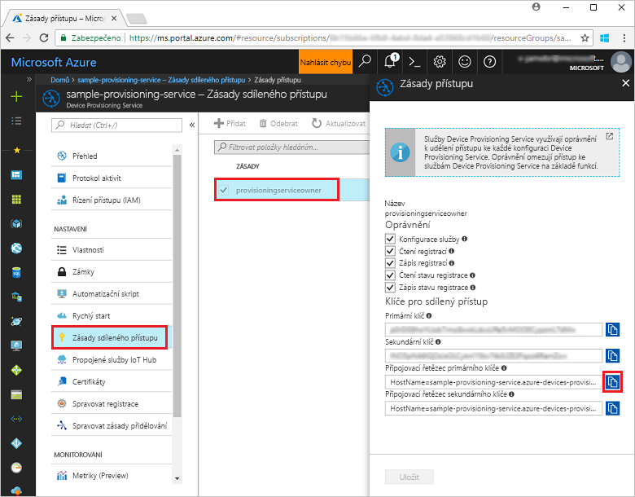
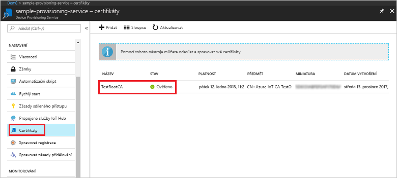
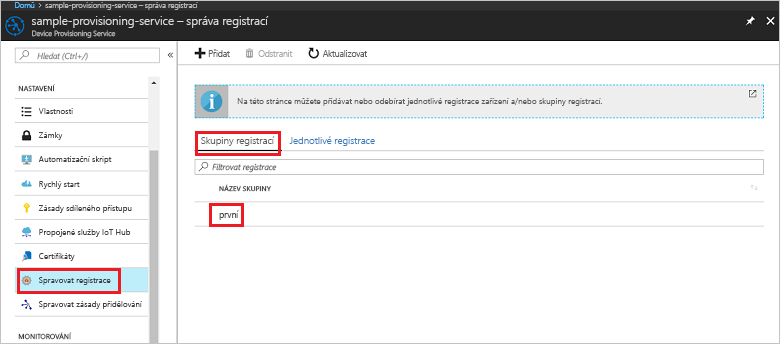

# <a name="quickstart-enroll-x509-devices-to-the-device-provisioning-service-using-nodejs"></a>Rychlý start: Registrace zařízení X.509 do služby Device Provisioning pomocí Node.js

[!INCLUDE [iot-dps-selector-quick-enroll-device-x509](../../includes/iot-dps-selector-quick-enroll-device-x509.md)]

Tento rychlý start ukazuje, jak prostřednictvím kódu programu v Node.js vytvořit [skupinu registrací](concepts-service.md#enrollment-group), která používá zprostředkující nebo kořenové certifikáty X.509 certifikační autority. Skupiny registrací se vytvoří pomocí [sady SDK IoT pro Node.js](https://github.com/Azure/azure-iot-sdk-node) a ukázkové aplikace Node.js. Skupina registrací řídí přístup ke službě zřizování pro zařízení, která ve svém řetězu certifikátů sdílejí společný podpisový certifikát. Další informace najdete v tématu [Řízení přístupu zařízení ke službě zřizování pomocí certifikátů X.509](./concepts-security.md#controlling-device-access-to-the-provisioning-service-with-x509-certificates). Další informace o používání infrastruktury veřejných klíčů (PKI) založené na certifikátech X.509 se službami Azure IoT Hub a Device Provisioning najdete v tématu [Přehled zabezpečení pomocí certifikátu webu X.509](https://docs.microsoft.com/azure/iot-hub/iot-hub-x509ca-overview). 

Tento rychlý start vychází z předpokladu, že už jste vytvořili centrum IoT a instanci služby Device Provisioning Service. Pokud jste tyto prostředky ještě nevytvořili, před tímto článkem si projděte rychlý start [Nastavení služby IoT Hub Device Provisioning pomocí webu Azure Portal](./quick-setup-auto-provision.md).

Přestože postup v tomto článku funguje na počítačích s Windows i Linuxem, tento článek pracuje s vývojovým počítačem s Windows.

[!INCLUDE [quickstarts-free-trial-note](../../includes/quickstarts-free-trial-note.md)]


## <a name="prerequisites"></a>Požadavky

- Nainstalujte [Node.js v4.0 nebo vyšší](https://nodejs.org).
- Nainstalujte [Git](https://git-scm.com/download/).


## <a name="prepare-test-certificates"></a>Příprava testovacích certifikátů

Pro účely tohoto rychlého startu potřebujete soubor .pem nebo .cer, který obsahuje veřejnou část zprostředkujícího nebo kořenového certifikátu X.509 certifikační autority. Certifikát musí být nahraný do vaší služby zřizování a ověřený touto službou. 

Sada [SDK služby Azure IoT pro jazyk C](https://github.com/Azure/azure-iot-sdk-c) obsahuje testovací nástroje, které vám můžou pomoct vytvořit řetěz certifikátů X.509, nahrát kořenový nebo zprostředkující certifikát z tohoto řetězu a ověřit certifikát testováním vlastnictví pomocí této služby. Certifikáty vytvořené pomocí nástrojů sady SDK jsou určené **jenom k testování během vývoje**. Tyto certifikáty **se nesmí používat v produkčním prostředí**. Obsahují pevně zakódovaná hesla („1234“), jejichž platnost vyprší po 30 dnech. Informace o získání certifikátů vhodných pro použití v produkčním prostředí najdete v tématu věnovaném [získání certifikátu webu X.509](https://docs.microsoft.com/azure/iot-hub/iot-hub-x509ca-overview#how-to-get-an-x509-ca-certificate) v dokumentaci ke službě Azure IoT Hub.

Pokud chcete vygenerovat certifikáty pomocí těchto testovacích nástrojů, proveďte následující kroky: 
 
1. Otevřete příkazový řádek nebo prostředí Git Bash a přejděte do pracovní složky na svém počítači. Spusťte následující příkaz pro naklonování úložiště GitHub sady [Azure IoT C SDK](https://github.com/Azure/azure-iot-sdk-c):
    
   ```cmd/sh
   git clone https://github.com/Azure/azure-iot-sdk-c.git --recursive
   ```

   Velikost tohoto úložiště je aktuálně přibližně 220 MB. Buďte připravení na to, že může trvat i několik minut, než se tato operace dokončí.

   Testovací nástroje se nacházejí ve složce *azure-iot-sdk-c/tools/CACertificates* úložiště, které jste naklonovali.    

2. Ukázky a kurzy najdete v článku [Správa testovacích certifikátů certifikační autority](https://github.com/Azure/azure-iot-sdk-c/blob/master/tools/CACertificates/CACertificateOverview.md). 


## <a name="create-the-enrollment-group-sample"></a>Vytvoření ukázky skupiny registrací 

 
1. Z příkazového okna ve vaší pracovní složce spusťte:
  
     ```cmd\sh
     npm install azure-iot-provisioning-service
     ```  

2. Pomocí textového editoru ve své pracovní složce vytvořte soubor **create_enrollment_group.js**. Přidejte do souboru následující kód a uložte ho:

    ```
    'use strict';
    var fs = require('fs');

    var provisioningServiceClient = require('azure-iot-provisioning-service').ProvisioningServiceClient;

    var serviceClient = provisioningServiceClient.fromConnectionString(process.argv[2]);

    var enrollment = {
      enrollmentGroupId: 'first',
      attestation: {
        type: 'x509',
        x509: {
          signingCertificates: {
            primary: {
              certificate: fs.readFileSync(process.argv[3], 'utf-8').toString()
            }
          }
        }
      },
      provisioningStatus: 'disabled'
    };

    serviceClient.createOrUpdateEnrollmentGroup(enrollment, function(err, enrollmentResponse) {
      if (err) {
        console.log('error creating the group enrollment: ' + err);
      } else {
        console.log("enrollment record returned: " + JSON.stringify(enrollmentResponse, null, 2));
        enrollmentResponse.provisioningStatus = 'enabled';
        serviceClient.createOrUpdateEnrollmentGroup(enrollmentResponse, function(err, enrollmentResponse) {
          if (err) {
            console.log('error updating the group enrollment: ' + err);
          } else {
            console.log("updated enrollment record returned: " + JSON.stringify(enrollmentResponse, null, 2));
          }
        });
      }
    });
    ```

## <a name="run-the-enrollment-group-sample"></a>Spuštění ukázky skupiny registrací
 
1. Ke spuštění ukázky potřebujete připojovací řetězec pro vaši službu zřizování. 
    1. Přihlaste se k webu Azure Portal, v nabídce vlevo klikněte na tlačítko **Všechny prostředky** a otevřete svou službu Device Provisioning. 
    2. Klikněte na **Zásady sdíleného přístupu** a pak kliknutím na zásadu přístupu, kterou chcete použít, otevřete její vlastnosti. V okně **Zásady přístupu** si zkopírujte a poznamenejte primární připojovací řetězec klíče. 

        


3. Jak se píše v části [Příprava testovacích certifikátů](quick-enroll-device-x509-node.md#prepare-test-certificates), potřebujete také soubor .pem obsahující zprostředkující nebo kořenový certifikát X.509 certifikační autority, který jste předtím nahráli do své služby zřizování a ověřili. Pokud chcete ověřit uložení a ověření vašeho certifikátu, na stránce s přehledem služby Device Provisioning na webu Azure Portal klikněte na **Certifikáty**. Vyhledejte certifikát, který chcete použít pro skupinovou registraci, a ujistěte se, že jeho stav má hodnotu *ověřeno*.

     

1. Pokud chcete vytvořit skupinu registrací pro váš certifikát, spusťte následující příkaz (včetně uvozovek okolo argumentů příkazu):
 
     ```cmd\sh
     node create_enrollment_group.js "<the connection string for your provisioning service>" "<your certificate's .pem file>"
     ```
 
3. Po úspěšném vytvoření se v příkazovém okně zobrazí vlastnosti nové skupiny registrací.

     

4. Ověřte vytvoření skupiny registrací. Na webu Azure Portal v okně s přehledem služby Device Provisioning vyberte **Správa registrací**. Vyberte kartu **Skupiny registrací** a ověřte, jestli obsahuje novou položku registrace (*první*).

     
 
## <a name="clean-up-resources"></a>Vyčištění prostředků
Pokud chcete prozkoumat ukázky služeb v Node.js, neprovádějte čištění prostředků vytvořených v rámci tohoto rychlého startu. Pokud pokračovat nechcete, pomocí následujícího postupu odstraňte všechny prostředky Azure vytvořené tímto rychlým startem.
 
1. Zavřete na svém počítači okno výstupu ukázky v Node.js.
2. Přejděte k vaší službě Device Provisioning na webu Azure Portal, klikněte na **Správa registrací** a pak vyberte kartu **Skupiny registrací**. Vyberte *ID registrace* pro položku registrace, kterou jste vytvořili v rámci tohoto rychlého startu, a klikněte na tlačítko **Odstranit** v horní části okna.  
3. Ve vaší službě Device Provisioning na webu Azure Portal klikněte na **Certifikáty**, klikněte na certifikát, který jste uložili pro účely tohoto rychlého startu, a pak klikněte na tlačítko **Odstranit** v horní části okna **Podrobnosti o certifikátu**.  
 
## <a name="next-steps"></a>Další postup
V rámci tohoto rychlého startu jste pomocí služby Azure IoT Hub Device Provisioning vytvořili skupinovou registraci pro certifikát X.509 zprostředkující nebo kořenové certifikační autority. Pokud se chcete se zřizováním zařízení seznámit podrobněji, pokračujte ke kurzu nastavení služby Device Provisioning na webu Azure Portal. 
 
> [!div class="nextstepaction"]
> [Kurzy pro službu Azure IoT Hub Device Provisioning](./tutorial-set-up-cloud.md)