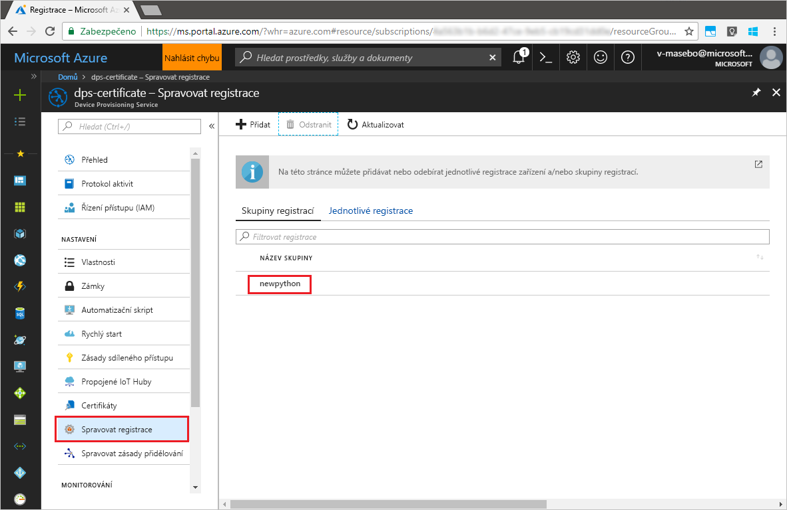

# <a name="quickstart-enroll-x509-devices-to-the-device-provisioning-service-using-python"></a>Rychlý start: Registrace zařízení X.509 do služby Device Provisioning Service pomocí Pythonu

[!INCLUDE [iot-dps-selector-quick-enroll-device-x509](../../includes/iot-dps-selector-quick-enroll-device-x509.md)]

Zařízení se registrují do služby zřizování vytvořením [skupiny registrací](concepts-service.md#enrollment-group) nebo prostřednictvím [jednotlivé registrace](concepts-service.md#individual-enrollment). Tento rychlý start ukazuje, jak prostřednictvím kódu programu v Pythonu vytvořit [skupinu registrací](concepts-service.md#enrollment-group), která používá zprostředkující nebo kořenové certifikáty X.509 certifikační autority. Skupina registrací řídí přístup ke službě zřizování pro zařízení, která ve svém řetězu certifikátů sdílejí společný podpisový certifikát. Skupina registrací se vytvoří pomocí [sady SDK služby zřizování pro Python](https://github.com/Azure/azure-iot-sdk-python/tree/master/provisioning_service_client) a ukázkové aplikace v Pythonu. Na vytváření jednotlivých registrací prostřednictvím *sady SDK služby zřizování pro Python* se ještě pracuje. Další informace najdete v tématu [Řízení přístupu zařízení ke službě zřizování pomocí certifikátů X.509](./concepts-security.md#controlling-device-access-to-the-provisioning-service-with-x509-certificates). Další informace o používání infrastruktury veřejných klíčů (PKI) založené na certifikátech X.509 se službami Azure IoT Hub a Device Provisioning najdete v tématu [Přehled zabezpečení pomocí certifikátu webu X.509](https://docs.microsoft.com/azure/iot-hub/iot-hub-x509ca-overview).

Tento rychlý start vychází z předpokladu, že už jste vytvořili centrum IoT a instanci služby Device Provisioning Service. Pokud jste tyto prostředky ještě nevytvořili, před tímto článkem si projděte rychlý start [Nastavení služby IoT Hub Device Provisioning pomocí webu Azure Portal](./quick-setup-auto-provision.md).

Přestože postup v tomto článku funguje na počítačích s Windows i Linuxem, tento článek pracuje s vývojovým počítačem s Windows.

[!INCLUDE [quickstarts-free-trial-note](../../includes/quickstarts-free-trial-note.md)]


## <a name="prerequisites"></a>Požadavky

- Nainstalujte [Python 2.x nebo 3.x](https://www.python.org/downloads/). Ujistěte se, že používáte 32bitovou, nebo 64bitovou instalaci podle požadavků vašeho nastavení. Po zobrazení výzvy v průběhu instalace nezapomeňte přidat Python do proměnných prostředí pro konkrétní platformu.
- [Nainstalujte nebo upgradujte *pip*, systém správy balíčků Pythonu](https://pip.pypa.io/en/stable/installing/).
- Nainstalujte [Git](https://git-scm.com/download/).


## <a name="prepare-test-certificates"></a>Příprava testovacích certifikátů

Pro účely tohoto rychlého startu potřebujete soubor .pem nebo .cer, který obsahuje veřejnou část zprostředkujícího nebo kořenového certifikátu X.509 certifikační autority. Certifikát musí být nahraný do vaší služby zřizování a ověřený touto službou. 

Sada [SDK služby Azure IoT pro jazyk C](https://github.com/Azure/azure-iot-sdk-c) obsahuje testovací nástroje, které vám můžou pomoct vytvořit řetěz certifikátů X.509, nahrát kořenový nebo zprostředkující certifikát z tohoto řetězu a ověřit certifikát testováním vlastnictví pomocí této služby. Certifikáty vytvořené pomocí nástrojů sady SDK jsou určené **jenom k testování během vývoje**. Tyto certifikáty **se nesmí používat v produkčním prostředí**. Obsahují pevně zakódovaná hesla („1234“), jejichž platnost vyprší po 30 dnech. Informace o získání certifikátů vhodných pro použití v produkčním prostředí najdete v tématu věnovaném [získání certifikátu webu X.509](https://docs.microsoft.com/azure/iot-hub/iot-hub-x509ca-overview#how-to-get-an-x509-ca-certificate) v dokumentaci ke službě Azure IoT Hub.

Pokud chcete vygenerovat certifikáty pomocí těchto testovacích nástrojů, proveďte následující kroky: 
 
1. Otevřete příkazový řádek nebo prostředí Git Bash a přejděte do pracovní složky na svém počítači. Spusťte následující příkaz pro naklonování úložiště GitHub sady [Azure IoT C SDK](https://github.com/Azure/azure-iot-sdk-c):
    
  ```cmd/sh
  git clone https://github.com/Azure/azure-iot-sdk-c.git --recursive
  ```

  Velikost tohoto úložiště je aktuálně přibližně 220 MB. Buďte připravení na to, že může trvat i několik minut, než se tato operace dokončí.

  Testovací nástroje se nacházejí ve složce *azure-iot-sdk-c/tools/CACertificates* úložiště, které jste naklonovali.    

2. Ukázky a kurzy najdete v článku [Správa testovacích certifikátů certifikační autority](https://github.com/Azure/azure-iot-sdk-c/blob/master/tools/CACertificates/CACertificateOverview.md). 


## <a name="modify-the-python-sample-code"></a>Úprava vzorového kódu Pythonu

Tato část ukazuje, jak do vzorového kódu přidat podrobnosti o zřizování vašeho zařízení X.509. 

1. Pomocí textového editoru vytvořte nový soubor **EnrollmentGroup.py**.

1. Na začátek souboru **EnrollmentGroup.py** přidejte následující příkazy `import` a proměnné. Pak nahraďte `dpsConnectionString` vaším připojovacím řetězcem, který najdete v části **Zásady sdíleného přístupu** ve vaší službě **Device Provisioning** na webu **Azure Portal**. Zástupný text certifikátu nahraďte certifikátem, který jste vytvořili v části [Příprava testovacích certifikátů](quick-enroll-device-x509-python.md#prepare-test-certificates). Nakonec vytvořte jedinečné ID registrace `registrationid` a ujistěte se, že se skládá pouze z malých alfanumerických znaků a pomlček.  
   
    ```python
    from provisioningserviceclient import ProvisioningServiceClient
    from provisioningserviceclient.models import EnrollmentGroup, AttestationMechanism

    CONNECTION_STRING = "{dpsConnectionString}"

    SIGNING_CERT = """-----BEGIN CERTIFICATE-----
    XXXXXXXXXXXXXXXXXXXXXXXXXXXXXXXXXXXXXXXXXXXXXXXXXXXXXXXXXXXXXXXX
    XXXXXXXXXXXXXXXXXXXXXXXXXXXXXXXXXXXXXXXXXXXXXXXXXXXXXXXXXXXXXXXX
    XXXXXXXXXXXXXXXXXXXXXXXXXXXXXXXXXXXXXXXXXXXXXXXXXXXXXXXXXXXXXXXX
    XXXXXXXXXXXXXXXXXXXXXXXXXXXXXXXXXXXXXXXXXXXXXXXXXXXXXXXXXXXXXXXX
    XXXXXXXXXXXXXXXXXXXXXXXXXXXXXXXXXXXXXXXXXXXXXXXXXXXXXXXXXXXXXXXX
    XXXXXXXXXXXXXXXXXXXXXXXXXXXXXXXXXXXXXXXXXXXXXXXXXXXXXXXXXXXXXXXX
    XXXXXXXXXXXXXXXXXXXXXXXXXXXXXXXXXXXXXXXXXXXXXXXXXXXXXXXXXXXXXXXX
    XXXXXXXXXXXXXXXXXXXXXXXXXXXXXXXXXXXXXXXXXXXXXXXXXXXXXXXXXXXXXXXX
    XXXXXXXXXXXXXXXXXXXXXXXXXXXXXXXXXXXXXXXXXXXXXXXXXXXXXXXXXXXXXXXX
    XXXXXXXXXXXXXXXXXXXXXXXXXXXXXXXXXXXXXXXXXXXXXXXXXXXXXXXXXXXXXXXX
    XXXXXXXXXXXXXXXXXXXXXXXXXXXXXXXXXXXXXXXXXXXXXXXXXXXXXXXXXXXXXXXX
    XXXXXXXXXXXXXXXXXXXXXXXXXXXXXXXXXXXXXXXXXXXXXXXXXXXXXXXXXXXXXXXX
    XXXXXXXXXXXXXXXXXXXXXXXXXXXXXXXXXXXXXXXXXXXXXXXXXXXXXXXXXXXXXXXX
    XXXXXXXXXXXXXXXXXXXXXXXXXXXXXXXXXXXXXXXXXXXXXXXXXXXXXXXXXXXXXXXX
    XXXXXXXXXXXXXXXXXXXXXXXXXXXXXXXXXXXXXXXXXXXXXXXXXXXXXXXX
    -----END CERTIFICATE-----"""

    GROUP_ID = "{registrationid}"
    ```

1. Přidejte následující funkci a volání funkce implementující vytvoření skupinové registrace:
   
    ```python
    def main():
        print ( "Initiating enrollment group creation..." )

        psc = ProvisioningServiceClient.create_from_connection_string(CONNECTION_STRING)
        att = AttestationMechanism.create_with_x509_signing_certs(SIGNING_CERT)
        eg = EnrollmentGroup.create(GROUP_ID, att)

        eg = psc.create_or_update(eg)
    
        print ( "Enrollment group created." )

    if __name__ == '__main__':
        main()
    ```

1. Uložte a zavřete soubor **EnrollmentGroup.py**.
 

## <a name="run-the-sample-group-enrollment"></a>Spuštění ukázkové skupinové registrace

1. Otevřete příkazový řádek a spuštěním následujícího příkazu nainstalujte klienta [azure-iot-provisioning-device-client](https://pypi.org/project/azure-iot-provisioning-device-client).

    ```cmd/sh
    pip install azure-iothub-provisioningserviceclient    
    ```

2. Na příkazovém řádku spusťte skript.

    ```cmd/sh
    python EnrollmentGroup.py
    ```

3. Sledujte ve výstupu úspěšnou registraci.

4. Přejděte k vaší službě zřizování na webu Azure Portal. Klikněte na **Správa registrací**. Všimněte si, že se na kartě **Skupiny registrací** zobrazí vaše skupina zařízení X.509 s dříve vytvořeným názvem `registrationid`. 

      


## <a name="clean-up-resources"></a>Vyčištění prostředků
Pokud chcete prozkoumat ukázku služby v Javě, neprovádějte čištění prostředků vytvořených v rámci tohoto rychlého startu. Pokud pokračovat nechcete, pomocí následujícího postupu odstraňte všechny prostředky vytvořené tímto rychlým startem.

1. Zavřete na svém počítači okno výstupu ukázky v Javě.
1. Zavřete na svém počítači okno _Generátoru certifikátů X.509_.
1. Přejděte k vaší službě Device Provisioning na webu Azure Portal, klikněte na **Správa registrací** a pak vyberte kartu **Skupiny registrací**. Vyberte *NÁZEV SKUPINY* pro zařízení X.509, která jste zaregistrovali v rámci tohoto rychlého startu, a klikněte na tlačítko **Odstranit** v horní části okna.  


## <a name="next-steps"></a>Další kroky
V tomto rychlém startu jste do své služby Device Provisioning zaregistrovali skupinu simulovaných zařízení X.509. Pokud se chcete se zřizováním zařízení seznámit podrobněji, pokračujte ke kurzu nastavení služby Device Provisioning na webu Azure Portal. 

> [!div class="nextstepaction"]
> [Kurzy pro službu Azure IoT Hub Device Provisioning](./tutorial-set-up-cloud.md)
