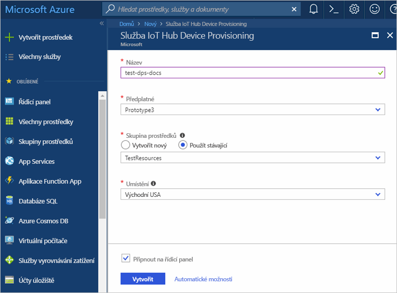
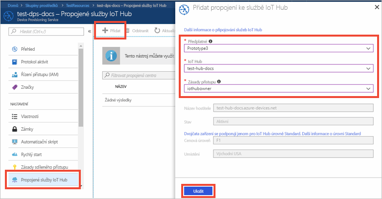

# Nastavení služby Azure IoT Hub Device Provisioning pomocí webu Azure Portal

Tyto kroky ukazují, jak na portálu nastavit cloudové prostředky Azure pro zřizování zařízení. Tento článek obsahuje kroky pro vytvoření služby IoT Hub, vytvoření nové služby IoT Hub Device Provisioning a jejich propojení. 

Pokud ještě nemáte předplatné Azure, vytvořte si [bezplatný účet](https://azure.microsoft.com/free/?WT.mc_id=A261C142F) před tím, než začnete.

## Vytvoření centra IoT

[!INCLUDE [iot-hub-quickstarts-create-hub](../../includes/iot-hub-quickstarts-create-hub.md)]

## Vytvoření nové instance služby IoT Hub Device Provisioning

1. Klikněte na tlačítko **Vytvořit prostředek** v levém horním rohu webu Azure Portal.

2. *V Marketplace vyhledejte***službu Device Provisioning**. Vyberte **Služba IoT Hub Device Provisioning** a klikněte na tlačítko **Vytvořit**. 

3. Zadejte následující informace pro vaši novou instanci služby Device Provisioning a klikněte na **Vytvořit**.

    * **Název:** Zadejte jedinečný název vaší nové instance služby Device Provisioning. Pokud je zadaný název platný, zobrazí se zelený symbol zaškrtnutí.
    * **Předplatné:** Vyberte předplatné, které chcete použít při vytváření této instance služby Device Provisioning.
    * **Skupina prostředků:** Toto pole umožňuje vytvořit novou skupinu prostředků nebo zvolit existující, která má obsahovat novou instanci. Zvolte stejnou skupinu prostředků, kterou jste vytvořili výše a obsahuje IoT Hub, například **TestResources**. Když umístíte všechny související prostředky do jedné skupiny, můžete je spravovat společně. Například odstraněním skupiny prostředků se odstraní všechny prostředky, které tato skupina obsahuje. Další informace najdete v tématu [Použití skupin prostředků ke správě prostředků Azure](../azure-resource-manager/resource-group-portal.md).
    * **Umístění:** Vyberte pro zařízení nejbližší umístění.
    * **Připnout na řídicí panel:** Tuto možnost vyberete, abyste měli instanci připnutou na řídicí panel, což usnadňuje hledání.

      

4. Po úspěšném nasazení služby se automaticky otevře okno s jejím přehledem.

## Propojení centra IoT a služby Device Provisioning

V této části přidáte konfiguraci do instance služby Device Provisioning. Tato konfigurace nastaví službu IoT Hub, pro kterou jsou zařízení zřízená.

1. Klikněte na tlačítko **Všechny prostředky** v nabídce vlevo na webu Azure Portal. Vyberte instanci služby Device Provisioning, kterou jste vytvořili v předchozí části.  

2. V okně s přehledem služby Device Provisioning vyberte **Propojená centra IoT**. Klikněte na tlačítko **+ Přidat** v horní části. 

3. Na stránce **Přidat propojení na centrum IoT Hub** zadejte následující informace, abyste propojili vaši novou instanci služby Device Provisioning se službou IoT Hub. Potom klikněte na **Uložit**. 

    * **Předplatné:** Vyberte předplatné obsahující službu IoT Hub, kterou chcete propojit s vaší novou instancí služby Device Provisioning.
    * **IoT Hub:** Vyberte službu IoT Hub k propojení s vaší novou instancí služby Device Provisioning.
    * **Zásady přístupu:** Vyberte **iothubowner** jako přihlašovací údaje pro vytvoření propojení se službou IoT Hub.  

      

3. Vybrané centrum by se teď mělo zobrazit v okně **Propojená centra IoT**. Možná budete muset kliknout na tlačítko **Aktualizovat**, aby se okno **Propojená centra IoT Hub** zobrazilo.

## Vyčištění prostředků

Další rychlé starty v této kolekci jsou postavené na tomto rychlém startu. Pokud chcete pokračovat v práci s dalšími rychlými starty nebo kurzy, nevyčišťujte prostředky vytvořené v rámci tohoto rychlého startu. Pokud pokračovat nechcete, pomocí následujících kroků odstraňte všechny prostředky vytvořené tímto rychlým startem na webu Azure Portal.

1. V nabídce vlevo na webu Azure Portal klikněte na **Všechny prostředky** a vyberte svou službu Device Provisioning. V horní části okna **Všechny prostředky** klikněte na **Odstranit**.  
2. V nabídce vlevo na webu Azure Portal klikněte na **Všechny prostředky** a vyberte své centrum IoT. V horní části okna **Všechny prostředky** klikněte na **Odstranit**.  

## Další kroky

V tomto rychlém startu jste nasadili centrum IoT a instanci služby Device Provisioning a propojili jste tyto dva prostředky. Pokud chcete zjistit, jak pomocí tohoto nastavení zřídit simulované zařízení, pokračujte k rychlému startu pro vytvoření simulovaného zařízení.

> [!div class="nextstepaction"]
> [Rychlý start k vytvoření simulovaného zařízení](./quick-create-simulated-device.md)
