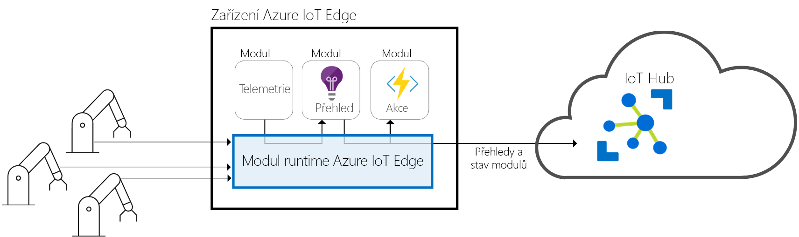
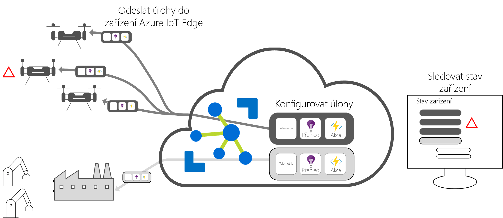

# Co je Azure IoT Edge

Azure IoT Edge přesouvá analýzy a vlastní obchodní logiku z cloudu do zařízení, aby se vaše organizace mohla místo správy dat soustředit na obchodní přehledy. Nakonfigurujte vlastní software IoT, nasaďte ho do zařízení prostřednictvím standardních kontejnerů, to vše monitorujte z cloudu a umožněte tak skutečné škálování vašeho řešení.

>[!NOTE]
>Azure IoT Edge je k dispozici na úrovni Free a Standard služby IoT Hub. Úroveň Free je určená pouze k testování a posouzení. Další informace o úrovních Basic a Standard najdete v [návodu k výběru správné úrovně služby IoT Hub](../iot-hub/iot-hub-scaling.md).

Analýzy zvyšují přidanou hodnotu řešení IoT, ale ne všechny analýzy musí být v cloudu. Pokud chcete, aby zařízení reagovalo na nouzové situace co nejrychleji, můžete provádět detekci anomálií přímo v zařízení. Podobně pokud chcete snížit náklady na šířku pásma a vyhnout se přenosu terabajtů nezpracovaných dat, můžete provádět čištění a agregaci dat místně. Přehledy pak můžete odeslat do cloudu. 

Azure IoT Edge se skládá ze tří komponent:
* Moduly IoT Edge jsou kontejnery, na kterých běží služby Azure, třeba služby třetích stran nebo váš vlastní kód. Moduly jsou nasazené na zařízení IoT Edge a na těchto zařízeních se místně spouštějí. 
* Modul runtime IoT Edge běží na všech hraničních zařízeních IoT a spravuje moduly nasazené do jednotlivých zařízení. 
* Cloudové rozhraní umožňuje vzdáleně monitorovat a spravovat hraniční zařízení IoT.

## Moduly IoT Edge

Moduly IoT Edge jsou jednotky spuštění, aktuálně implementované jako kontejnery kompatibilní s Dockerem, které spouští vaši obchodní logiku na hraničních zařízeních. Můžete nakonfigurovat vzájemnou komunikaci několika modulů a vytvořit tak kanál zpracování dat. Můžete vyvíjet vlastní moduly nebo balit určité služby Azure do modulů, které poskytují přehledy v režimu offline a na hraničních zařízení. 

### Umělá inteligence na hraničních zařízeních

Azure IoT Edge umožňuje nasazovat komplexní zpracování událostí, machine learning, rozpoznávání obrazu a další hodnotnou AI aniž byste museli napsat interně. Služby Azure, jako jsou Azure Functions, Azure Stream Analytics a Azure Machine Learning můžete spouštět v místním prostřednictvím Azure IoT Edge, ale nejste omezeni pouze na služby Azure. Kdokoli může vytvářet moduly AI a zpřístupnit je pro použití komunitě. 

### Používání vlastního kódu

Azure IoT Edge podporuje také případy, kdy do svých zařízení chcete nasadit vlastní kód. Azure IoT Edge se drží stejného programovacího modelu jako ostatní služby Azure IoT. Stejný kód je možné spouštět v zařízení nebo v cloudu. Azure IoT Edge podporuje Linux i Windows, takže můžete psát kód pro platformu podle svého výběru. Takže vaši vývojáři můžou psát kód v jazyce, které už znají a používat existující obchodní logiku podporuje Javu, .NET Core 2.0, Node.js, C a Python.

## Modul runtime IoT Edge

Modul runtime Azure IoT Edge umožňuje používat na hraničních zařízeních IoT vlastní a cloudovou logiku. Nachází se v hraničním zařízení IoT a provádí operace správy a komunikace. Modul runtime provádí několik funkcí:

* Instalace a aktualizace úlohy na zařízení.
* Udržujte standardy zabezpečení Azure IoT Edge na zařízení.
* Ujistěte se, že nepřetržitý provoz modulů IoT Edge.
* Sestava Stav modulů do cloudu pro vzdálené monitorování.
* Spravujte komunikaci mezi podřízenými zařízeními typu list a zařízení IoT Edge, mezi moduly v zařízení IoT Edge a mezi zařízení IoT Edge a cloudem.

Použití zařízení Azure IoT Edge je na vás. Modul runtime se často používá k nasazování AI do bran které agregují a zpracovávají data z několika místních zařízení, ale tento model nasazení je pouze jedna z možností. Zařízení typu list také můžou být hraničními zařízeními Azure IoT bez ohledu na to, jestli jsou připojená k bráně nebo přímo ke cloudu.

Modul runtime Azure IoT Edge běží ve velké sadě zařízení IoT a díky tomu jej můžete používat nejrůznějšími způsoby. Podporuje operační systémy Linux a Windows a abstraktní podrobnosti o hardwaru. Můžete použijte menší zařízení než Raspberry Pi 3 Pokud nezpracováváte množství dat, nebo použijte kapacitu na průmyslový server ke spouštění náročných úloh.

## Cloudové rozhraní IoT Edge

Správa životního cyklu softwaru u podnikových zařízení je složitá. Správa životního cyklu softwaru u milionů různorodých zařízení IoT je ještě složitější. Úlohy se musí vytvářet a konfigurovat pro konkrétní typ zařízení, nasazovat ve velkém měřítku na miliony zařízení ve vašem řešení a monitorovat, aby se případně zachytila zařízení, která se nechovají podle očekávání. Tyto aktivity není možné provádět pro každé zařízení zvlášť a musí se provádět ve velkém měřítku.

Azure IoT Edge se bezproblémově integruje s akcelerátory řešení Azure IoT a poskytuje tak jedinou rovinu řízení pro všechny požadavky vašeho řešení. Cloudové služby vám umožní:

* Vytvořit a nakonfigurovat úlohu, která se má spouštět na konkrétním typu zařízení.
* Odeslat úlohu do sady zařízení.
* Monitorovat úlohy spuštěné na zařízeních v poli.

## Další postup

Vyzkoušejte si tyto koncepty při [nasazení IoT Edge na simulovaném zařízení](quickstart.md).

 
