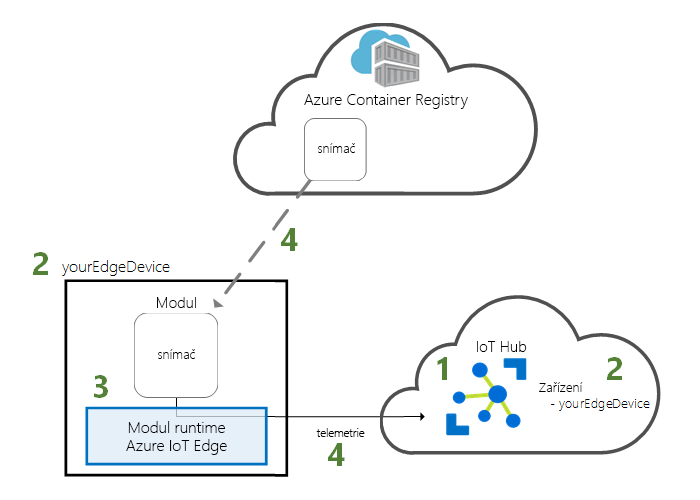
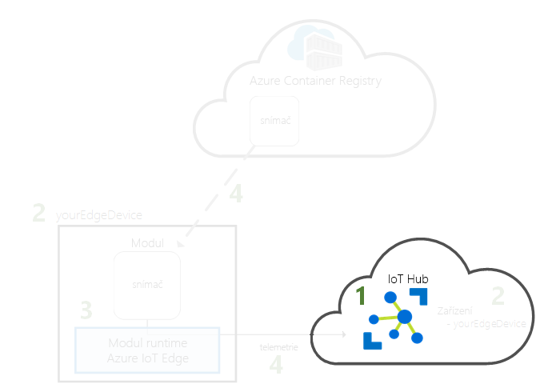
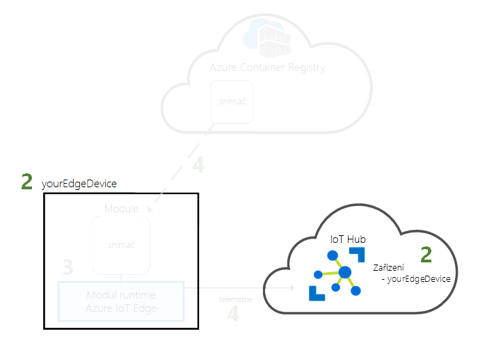
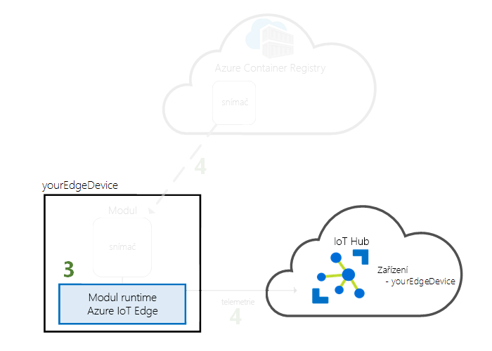
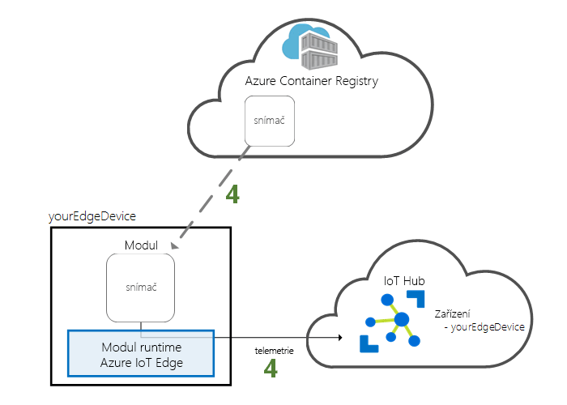

# <a name="quickstart-deploy-your-first-iot-edge-module-to-a-linux-x64-device"></a>Rychlý start: Nasazení prvního modulu IoT Edge k Linuxovému x64 zařízení

Služba Azure IoT Edge posouvá výkon cloudu k zařízením Internetu věcí. V tomto rychlém startu se naučíte používat cloudové rozhraní ke vzdálenému nasazení předem připraveného kódu do zařízení IoT Edge.

V tomto rychlém startu se naučíte:

1. Vytvořit IoT Hub.
2. Zaregistrovat zařízení IoT Edge do centra IoT Hub.
3. Nainstalovat na zařízení modul runtime Azure IoT Edge a spustit ho.
4. Vzdáleně nasadit modul na zařízení IoT Edge.



V tomto rychlém startu změníte svůj linuxový nebo virtuální počítač na zařízení IoT Edge. Potom můžete modul nasadit z webu Azure Portal do svého zařízení. Modul, který v tomto rychlém kurzu nasadíte, je simulovaný snímač, který generuje údaje o teplotě, vlhkosti a atmosferickém tlaku. Další kurzy o Azure IoT Edge vycházejí z tohoto kurzu. V něm nasadíte moduly, které analyzují simulovaná data kvůli získání obchodních informací.

Pokud nemáte aktivní předplatné Azure, vytvořte si [bezplatný účet](https://azure.microsoft.com/free) před tím, než začnete.

[!INCLUDE [cloud-shell-try-it.md](../../includes/cloud-shell-try-it.md)]

K dokončení řady kroků v tomto rychlém startu použijete Azure CLI. Azure IoT má rozšíření, které nabízí další funkce. 

Přidejte rozšíření Azure IoT do instance služby Cloud Shell.

   ```azurecli-interactive
   az extension add --name azure-cli-iot-ext
   ```

## <a name="prerequisites"></a>Požadavky

Cloudové prostředky: 

* Skupina prostředků pro správu všech prostředků, které v tomto rychlém startu použijete. 

   ```azurecli-interactive
   az group create --name IoTEdgeResources --location westus2
   ```

Zařízení IoT Edge:

* Virtuální počítač nebo zařízení s Linuxem, který bude fungovat jako zařízení IoT Edge. Doporučuje se použít dodaný společností Microsoft [Azure IoT Edge na Ubuntu](https://azuremarketplace.microsoft.com/en-us/marketplace/apps/microsoft_iot_edge.iot_edge_vm_ubuntu) virtuální počítač, který bude předinstalovat modul runtime IoT Edge. Vytvoření tohoto virtuálního počítače pomocí následujícího příkazu:

   ```azurecli-interactive
   az vm create --resource-group IoTEdgeResources --name EdgeVM --image microsoft_iot_edge:iot_edge_vm_ubuntu:ubuntu_1604_edgeruntimeonly:latest --admin-username azureuser --generate-ssh-keys --size Standard_DS1_v2
   ```

   Při vytváření nového virtuálního počítače, poznamenejte si, **publicIpAddress**, který je součástí výstupu příkazu create. Tato veřejná IP adresa bude používat pro připojení k virtuálnímu počítači dále v tomto rychlém startu.

* Pokud chcete spustit modul runtime Azure IoT Edge v místním systému postupujte podle pokynů na adrese [nainstalovat modul runtime Azure IoT Edge v Linuxu (x64)](how-to-install-iot-edge-linux.md).

* Pokud chcete použít ARM32 na základě zařízení, jako je Raspberry Pi, postupujte podle pokynů v [modul runtime nainstalovat Azure IoT Edge v Linuxu (ARM32v7/armhf)](how-to-install-iot-edge-linux-arm.md).

## <a name="create-an-iot-hub"></a>Vytvoření centra IoT

V tomto rychlém startu nejprve pomocí Azure CLI vytvoříte centrum IoT.



Pro tento rychlý start můžete použít bezplatnou úroveň IoT Hubu. Pokud jste službu IoT Hub někdy používali a máte vytvořené bezplatné centrum IoT, můžete ho použít. V každém předplatném může být jenom jeden bezplatný IoT Hub. 

Následující kód vytvoří bezplatné centrum **F1** ve skupině prostředků **IoTEdgeResources**. Nahraďte *{hub_name}* jedinečným názvem vašeho centra IoT.

   ```azurecli-interactive
   az iot hub create --resource-group IoTEdgeResources --name {hub_name} --sku F1 
   ```

   Pokud dojde k chybě kvůli tomu, že vaše předplatné již jedno bezplatné centrum obsahuje, změňte skladovou položku na **S1**. Pokud dojde k chybě, že název služby IoT Hub není k dispozici, znamená to, že má někdo jiný již centra s tímto názvem. Zkuste použít nový název. 

## <a name="register-an-iot-edge-device"></a>Registrace zařízení IoT Edge

Zaregistrujte zařízení IoT Edge do nově vytvořeného centra IoT.


Vytvořte identitu simulovaného zařízení, aby mohla komunikovat s centrem IoT. Identita zařízení se uchovává v cloudu a k přidružení fyzického zařízení k identitě zařízení se používá jedinečný připojovací řetězec zařízení. 

Protože zařízení IoT Edge se chovají a lze je spravovat jinak než typické zařízení IoT, deklarujte tuto identitu pro zařízení IoT Edge se `--edge-enabled` příznak. 

1. Ve službě Azure Cloud Shell zadejte následující příkaz, kterým v centru vytvoříte zařízení **myEdgeDevice**.

   ```azurecli-interactive
   az iot hub device-identity create --hub-name {hub_name} --device-id myEdgeDevice --edge-enabled
   ```

   Pokud se zobrazí chyba týkající se iothubowner klíče zásad, ujistěte se, že vaší služby cloud shell běží nejnovější verze rozšíření azure-cli-iot-ext, přípona. 

2. Načtěte připojovací řetězec svého zařízení, který propojí vaše fyzické zařízení s jeho identitou ve službě IoT Hub. 

   ```azurecli-interactive
   az iot hub device-identity show-connection-string --device-id myEdgeDevice --hub-name {hub_name}
   ```

3. Zkopírujte připojovací řetězec a uložte si ho. Tuto hodnotu použijete ke konfiguraci modulu runtime IoT Edge v další části. 

## <a name="connect-the-iot-edge-device-to-iot-hub"></a>Připojit zařízení IoT Edge do služby IoT Hub

Nainstalujte na zařízení IoT Edge modul runtime Azure IoT Edge a spusťte ho. 


Modul runtime IoT Edge se nasadí na všechna zařízení IoT Edge. Skládá se ze tří částí. **Proces démon zabezpečení IoT Edge**, který se spustí při každém restartování a spuštění zařízení Edge tím, že se spustí agent IoT Edge. **Agent IoT Edge** umožňuje nasadit a monitorovat moduly na zařízení IoT Edge, včetně centra služby IoT Edge. Druhým je **IoT Edge Hub**, který na zařízení IoT Edge řídí komunikaci mezi moduly a také mezi zařízením a IoT Hubem. 

Během konfigurace modulu runtime zadáte připojovací řetězec zařízení. Použijte řetězec, který jste získali z Azure CLI. Tento řetězec přidruží vaše fyzické zařízení k identitě zařízení IoT Edge v Azure. 

### <a name="set-the-connection-string-on-the-iot-edge-device"></a>Nastavit připojovací řetězec na zařízení IoT Edge

* Pokud používáte Azure IoT Edge na virtuální počítač s Ubuntu, použijte připojovací řetězec zařízení jste si zkopírovali dříve pro vzdálenou konfiguraci zařízení IoT Edge:

   ```azurecli-interactive
   az vm run-command invoke -g IoTEdgeResources -n EdgeVM --command-id RunShellScript --script '/etc/iotedge/configedge.sh "{device_connection_string}"'
   ```

   Ve zbývajících krocích načtěte veřejnou IP adresu, který byl výstupem příkazu pro vytvoření. Můžete také najít veřejnou IP adresu na stránce Přehled virtuálního počítače na webu Azure Portal. Použijte následující příkaz pro připojení k virtuálnímu počítači. Nahraďte **{publicIpAddress}** adresou vašeho počítače. 

   ```azurecli-interactive
   ssh azureuser@{publicIpAddress}
   ```

* Pokud používáte na místním počítači nebo ARM32 zařízení IoT Edge, otevřete konfigurační soubor umístěný ve /etc/iotedge/config.yaml a aktualizace **device_connection_string** proměnné s hodnotou jste si zkopírovali dříve, restartujte Démon zabezpečení IoT Edge změny:

   ```bash
   sudo systemctl restart iotedge
   ```

>[!TIP]
>Ke spouštění příkazů `iotedge` potřebujete zvýšená oprávnění. Vaše oprávnění se automaticky aktualizují, jakmile se po instalaci modulu runtime IoT Edge odhlásíte z počítače a poprvé se k němu opět přihlásíte. Do té doby před příkazy používejte **sudo**. 

### <a name="view-the-iot-edge-runtime-status"></a>Zobrazení stavu modulu runtime IoT Edge

Ověřte, že se modul runtime úspěšně nainstaloval a nakonfiguroval.

1. Ověřte, že Edge Security Daemon běží jako systémová služba.

   ```bash
   sudo systemctl status iotedge
   ```

   

2. Pokud potřebujete řešit potíže se službou, načtěte protokoly služby. 

   ```bash
   journalctl -u iotedge
   ```

3. Zobrazte moduly spuštěné na vašem zařízení. 

   ```bash
   sudo iotedge list
   ```

   

Vaše zařízení IoT Edge je teď nakonfigurované. Je připravené na spouštění modulů nasazených v cloudu. 

## <a name="deploy-a-module"></a>Nasazení modulu

Pokud budete zařízení Azure IoT Edge spravovat v cloudu, můžete nasadit modul, který bude odesílat telemetrická data do služby IoT Hub.


[!INCLUDE [iot-edge-deploy-module](../../includes/iot-edge-deploy-module.md)]

## <a name="view-generated-data"></a>Zobrazení vygenerovaných dat

V tomto rychlém startu jste vytvořili nové zařízení IoT Edge a nainstalovali jste na něj modul runtime IoT Edge. Pak jste použili Azure Portal k doručení modulu IoT Edge a jeho spuštění na zařízení, aniž byste museli měnit samotné zařízení. V tomto případě doručený modul vytvoří data o prostředí, která použijete pro tyto kurzy.

Znovu otevřete příkazový řádek na vašem zařízení IoT Edge, ani používat připojení SSH z příkazového řádku Azure. Zkontrolujte, že modul, který jste nasadili z cloudu, běží na zařízení IoT Edge:

   ```bash
   sudo iotedge list
   ```

   

Prohlédněte si zprávy, které posílá modul tempSensor:

   ```bash
   sudo iotedge logs tempSensor -f
   ```


Pokud je poslední řádek protokolu `Using transport Mqtt_Tcp_Only`, může modul senzoru teploty čekat na připojení k Edge Hubu. Zkuste modul ukončit a nechat agenta Edge, aby ho restartoval. K ukončení použijte příkaz `sudo docker stop tempSensor`.

Můžete rovněž sledovat zprávy dorazí ve službě IoT hub pomocí [rozšíření Azure IoT Hub Toolkit pro Visual Studio Code](https://marketplace.visualstudio.com/items?itemName=vsciot-vscode.azure-iot-toolkit) (dříve rozšíření Azure IoT Toolkit). 

## <a name="clean-up-resources"></a>Vyčištění prostředků

Pokud chcete pokračovat dalšími kurzy o IoT Edge, použijte zařízení, které jste zaregistrovali a nastavili v tomto rychlém startu. Jinak můžete odstranit prostředky Azure, které jste vytvořili, a odebrat modul runtime IoT Edge ze zařízení.

### <a name="delete-azure-resources"></a>Odstranění prostředků Azure

Pokud jste virtuální počítač a centrum IoT vytvořili v nové skupině prostředků, můžete odstranit tuto skupinu a všechny související prostředky. Dvojitá kontrola obsah skupiny prostředků pro Ujistěte se, že existuje vaší nic, které chcete zachovat. Pokud nechcete odstranit celou skupinu, můžete místo toho odstranit jednotlivé prostředky.

Odeberte skupinu **IoTEdgeResources**.

   ```azurecli-interactive
   az group delete --name IoTEdgeResources 
   ```

### <a name="remove-the-iot-edge-runtime"></a>Odebrání modulu runtime IoT Edge

Pokud chcete instalace ze zařízení odebrat, použijte následující příkazy.  

Odeberte modul runtime IoT Edge.

   ```bash
   sudo apt-get remove --purge iotedge
   ```

Při odebrání modulu runtime IoT Edge se zastaví kontejnery, které vytvořil, ale na zařízení se zachovají. Zobrazte všechny kontejnery.

   ```bash
   sudo docker ps -a
   ```

Odstraňte kontejnery, které na vašem zařízení vytvořil modul runtime IoT Edge. Změňte název kontejneru tempSensor, pokud jste ho pojmenovali nějak jinak. 

   ```bash
   sudo docker rm -f tempSensor
   sudo docker rm -f edgeHub
   sudo docker rm -f edgeAgent
   ```

Odeberte kontejnerový modul runtime.

   ```bash
   sudo apt-get remove --purge moby-cli
   sudo apt-get remove --purge moby-engine
   ```

## <a name="next-steps"></a>Další postup

Tento rychlý start je předpokladem všech dalších kurzů o IoT Edge. Pokračujte některým z dalších kurzů, ve kterých poznáte další způsoby, jak vám může Azure IoT Edge pomoci přeměnit data na obchodní informace o hraničním zařízení.

> [!div class="nextstepaction"]
> [Filtrování dat snímače pomocí funkce Azure](tutorial-deploy-function.md)
