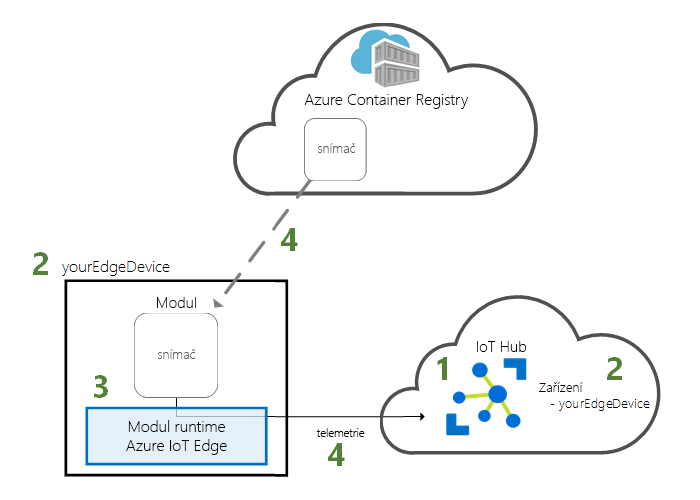
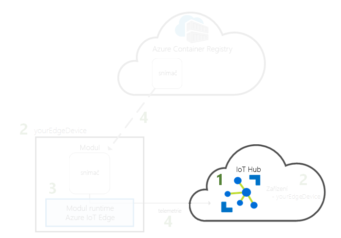
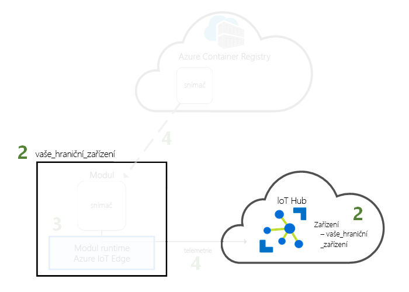
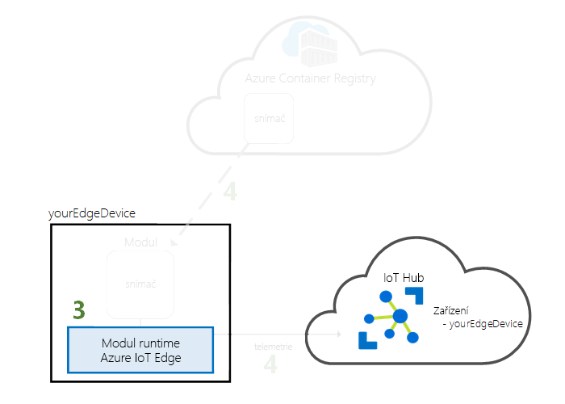
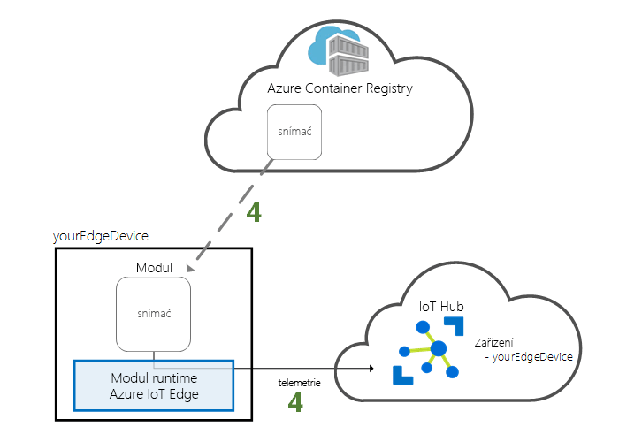

# <a name="quickstart-deploy-your-first-iot-edge-module-to-a-virtual-windows-device"></a>Rychlý Start: nasazení prvního IoT Edge modulu do virtuálního zařízení s Windows

Vyzkoušejte si Azure IoT Edge v tomto rychlém startu tak, že nasadíte kontejnerový kód na virtuální zařízení s Windows IoT Edge. IoT Edge vám umožní vzdáleně spravovat kód na svých zařízeních, abyste mohli do hraničních zařízení odesílat další úlohy. Pro tento rychlý Start doporučujeme pro zařízení IoT Edge použít virtuální počítač Azure. Použití virtuálního počítače vám umožní rychle vytvořit testovací počítač, nainstalovat požadované součásti a po dokončení ho odstranit.

V tomto rychlém startu se naučíte:

* Vytvořte centrum IoT.
* Zaregistrovat zařízení IoT Edge do centra IoT Hub.
* Nainstalujte a spusťte modul runtime IoT Edge na virtuálním zařízení.
* Vzdáleně nasadit modul na zařízení IoT Edge a odeslat telemetrická data do služby IoT Hub.



Tento rychlý Start vás provede vytvořením virtuálního počítače s Windows a jeho nakonfigurováním tak, aby bylo zařízení IoT Edge. Pak modul nasadíte z Azure Portal do svého zařízení. Modul použitý v tomto rychlém startu je simulovaný senzor, který generuje data o teplotě, vlhkosti a tlaku. Ostatní kurzy Azure IoT Edge sestavují na práci, kterou tady provedete, nasazením dalších modulů, které analyzují Simulovaná data pro Business Insights.

Pokud nemáte aktivní předplatné Azure, vytvořte si [bezplatný účet](https://azure.microsoft.com/free) před tím, než začnete.

## <a name="prerequisites"></a>Předpoklady

Připravte prostředí pro rozhraní příkazového řádku Azure CLI.

- Použijte [Azure Cloud Shell](/azure/cloud-shell/quickstart-powershell) pomocí prostředí PowerShell.

   [](https://shell.azure.com)   
- Pokud tomu dáváte přednost, můžete [nainstalovat](/cli/azure/install-azure-cli) Azure CLI a spouštět referenční příkazy CLI.
   - Pokud používáte místní instalaci, přihlaste se s Azure CLI pomocí příkazu [az login](/cli/azure/reference-index#az-login).  Pokud chcete dokončit proces ověřování, postupujte podle kroků zobrazených na terminálu.  Další možnosti přihlášení jsou popsané v tématu [Přihlášení pomocí Azure CLI](/cli/azure/authenticate-azure-cli).
  - Po zobrazení výzvy nainstalujte rozšíření Azure CLI při prvním použití.  Další informace o rozšířeních najdete v tématu [Využití rozšíření v Azure CLI](/cli/azure/azure-cli-extensions-overview).
  - Spuštěním příkazu [az version](/cli/azure/reference-index?#az_version) zjistěte verzi a závislé knihovny, které jsou nainstalované. Pokud chcete upgradovat na nejnovější verzi, spusťte [az upgrade](/cli/azure/reference-index?#az_upgrade).

Cloudové prostředky:

- Skupina prostředků pro správu všech prostředků, které v tomto rychlém startu použijete.

   ```azurecli-interactive
   az group create --name IoTEdgeResources --location westus2
   ```

Zařízení IoT Edge:

- Virtuální počítač s Windows, který bude fungovat jako zařízení IoT Edge. Tento virtuální počítač můžete vytvořit pomocí následujícího příkazu, ve kterém nahradíte `{password}` zabezpečené heslo:

  ```azurecli-interactive
  az vm create --resource-group IoTEdgeResources --name EdgeVM --image MicrosoftWindowsDesktop:Windows-10:rs5-pro:latest --admin-username azureuser --admin-password {password} --size Standard_DS1_v2
  ```

  Vytvoření a spuštění nového virtuálního počítače může trvat několik minut.

  Po spuštění virtuálního počítače si můžete stáhnout soubor RDP pro použití při připojování k virtuálnímu počítači:

  1. V Azure Portal přejděte na nový virtuální počítač s Windows.
  1. Vyberte **Connect** (Připojit).
  1. Na kartě **RDP** vyberte **Stáhnout soubor RDP**.

  Otevřete tento soubor s Připojení ke vzdálené ploše pro připojení k virtuálnímu počítači s Windows pomocí jména správce a hesla, které jste zadali pomocí `az vm create` příkazu.

> [!NOTE]
> Virtuální počítač s Windows začíná na Windows verze 1809 (Build 17763), což je nejnovější [dlouhodobé sestavení podpory Windows](/windows/release-information/). Systém Windows ve výchozím nastavení automaticky vyhledává aktualizace každých 22 hodin. Po kontrole virtuálního počítače Windows nabídne aktualizaci verze, která není kompatibilní s IoT Edge pro Windows, což zabrání dalšímu použití IoT Edge funkcí pro Windows. Doporučujeme omezit použití virtuálního počítače na do 22 hodin nebo [dočasně pozastavit aktualizace Windows](https://support.microsoft.com/help/4028233/windows-10-manage-updates).
>
> V tomto rychlém startu se k jednoduchosti používá virtuální počítač s Windows Desktop. Informace o tom, které operační systémy Windows jsou všeobecně dostupné pro produkční scénáře, najdete v tématu [Azure IoT Edge podporovaných systémech](support.md).
>
> Pokud chcete pro IoT Edge nakonfigurovat vlastní zařízení s Windows, včetně zařízení se systémem IoT Core, postupujte podle kroků v části [Instalace modulu runtime Azure IoT Edge](how-to-install-iot-edge.md).

## <a name="create-an-iot-hub"></a>Vytvoření centra IoT

Začněte s rychlým startem vytvořením služby IoT Hub pomocí Azure CLI.



Pro tento rychlý start můžete použít bezplatnou úroveň IoT Hubu. Pokud jste v minulosti používali IoT Hub a už máte vytvořeného centra, můžete použít toto centrum IoT.

Následující kód vytvoří ve skupině prostředků bezplatný rozbočovač **F1** `IoTEdgeResources` . Nahraďte `{hub_name}` jedinečným názvem vašeho centra IoT. Vytvoření IoT Hub může trvat několik minut.

   ```azurecli-interactive
   az iot hub create --resource-group IoTEdgeResources --name {hub_name} --sku F1 --partition-count 2
   ```

   Pokud dojde k chybě kvůli tomu, že vaše předplatné již jedno bezplatné centrum obsahuje, změňte skladovou položku na **S1**. Pokud se zobrazí chyba, že název IoT Hub není k dispozici, znamená to, že někdo jiný již má centrum s tímto názvem. Zkuste nový název.

## <a name="register-an-iot-edge-device"></a>Zaregistrovat zařízení IoT Edge

Zaregistrujte zařízení IoT Edge do nově vytvořeného centra IoT.


Vytvořte identitu simulovaného zařízení, aby mohla komunikovat s centrem IoT. Identita zařízení se uchovává v cloudu a k přidružení fyzického zařízení k identitě zařízení se používá jedinečný připojovací řetězec zařízení.

Vzhledem k tomu, že se zařízení IoT Edge chovají a dají se spravovat jinak než typická zařízení IoT, deklarujte tuto identitu pro IoT Edge zařízení s `--edge-enabled` příznakem.

1. V Azure Cloud Shell zadejte následující příkaz, který ve svém rozbočovači vytvoří zařízení s názvem **myEdgeDevice** .

   ```azurecli-interactive
   az iot hub device-identity create --device-id myEdgeDevice --edge-enabled --hub-name {hub_name}
   ```

   Pokud se zobrazí chyba týkající se klíčů zásad iothubowner, ujistěte se, že na Cloud Shell běží nejnovější verze rozšíření Azure-IoT.

2. Zobrazení připojovacího řetězce pro vaše zařízení, který propojuje fyzické zařízení s jeho identitou v IoT Hub. Obsahuje název vašeho centra IoT, název vašeho zařízení a pak sdílený klíč, který ověřuje připojení mezi nimi.

   ```azurecli-interactive
   az iot hub device-identity connection-string show --device-id myEdgeDevice --hub-name {hub_name}
   ```

3. Zkopírujte hodnotu klíče `connectionString` z výstupu JSON a uložte ji. Tato hodnota je připojovací řetězec zařízení. Tento připojovací řetězec použijete ke konfiguraci modulu runtime IoT Edge v další části.

   

## <a name="install-and-start-the-iot-edge-runtime"></a>Instalace a spuštění modulu runtime IoT Edge

Nainstalujte na své zařízení IoT Edge modul runtime Azure IoT Edge a nakonfigurujte v něm připojovací řetězec zařízení.


Modul runtime IoT Edge se nasadí na všechna zařízení IoT Edge. Skládá se ze tří částí. *IoT Edge démon zabezpečení* se spustí pokaždé, když se spustí IoT Edge zařízení, a spustí agenta IoT Edge. *Agent IoT Edge* spravuje nasazení a monitorování modulů na zařízení IoT Edge, včetně centra IoT Edge. *Centrum IoT Edge* zpracovává komunikaci mezi moduly v zařízení IoT Edge a mezi zařízením a IoT Hub.

Instalační skript obsahuje také modul kontejneru s názvem Moby, který spravuje image kontejneru na zařízení IoT Edge.

Během instalace modulu runtime se zobrazí výzva k zadání připojovacího řetězce zařízení. Použijte řetězec, který jste získali z Azure CLI. Tento řetězec přidruží vaše fyzické zařízení k identitě zařízení IoT Edge v Azure.

### <a name="connect-to-your-iot-edge-device"></a>Připojení k zařízení IoT Edge

Kroky v této části se doplní na vaše zařízení IoT Edge, takže se k tomuto virtuálnímu počítači chcete připojit hned přes vzdálenou plochu.

### <a name="install-and-configure-the-iot-edge-service"></a>Instalace a konfigurace služby IoT Edge

Pomocí PowerShellu stáhněte a nainstalujte modul runtime IoT Edge. Ke konfiguraci svého zařízení použijte připojovací řetězec zařízení, který jste získali ze služby IoT Hub.

1. Na virtuálním počítači spusťte PowerShell jako správce.

   >[!NOTE]
   >K instalaci IoT Edge, nikoli PowerShell (x86) použijte relaci AMD64 prostředí PowerShell. Pokud si nejste jistí, který typ relace používáte, spusťte následující příkaz:
   >
   >```powershell
   >(Get-Process -Id $PID).StartInfo.EnvironmentVariables["PROCESSOR_ARCHITECTURE"]
   >```

2. Příkaz **Deploy-IoTEdge** zkontroluje, jestli má počítač s Windows podporovanou verzi, zapne funkci Containers, stáhne modul runtime Moby a pak stáhne modul runtime IoT Edge.

   ```powershell
   . {Invoke-WebRequest -useb aka.ms/iotedge-win} | Invoke-Expression; `
   Deploy-IoTEdge -ContainerOs Windows
   ```

3. Počítač se může automaticky restartovat. Pokud se zobrazí výzva Deploy-IoTEdgem příkazem k restartování, udělejte to teď.

4. Spusťte PowerShell jako správce znovu.

5. Příkaz **Initialize-IoTEdge** nakonfiguruje IoT Edge modul runtime na vašem počítači. Příkaz je standardně nastaven na ruční zřizování pomocí kontejnerů Windows.

   ```powershell
   . {Invoke-WebRequest -useb aka.ms/iotedge-win} | Invoke-Expression; `
   Initialize-IoTEdge -ContainerOs Windows
   ```

6. Po zobrazení výzvy k zadání **připojovacího řetězce** zadejte řetězec, který jste si zkopírovali v předchozí části. Připojovací řetězec zadejte bez uvozovek.

### <a name="view-the-iot-edge-runtime-status"></a>Zobrazení stavu modulu runtime IoT Edge

Ověřte, že se modul runtime úspěšně nainstaloval a nakonfiguroval. Dokončení instalace může trvat několik minut a spustí se modul IoT Edge agenta.

1. Zkontrolujte stav služby IoT Edge.

   ```powershell
   Get-Service iotedge
   ```

2. Pokud potřebujete řešit potíže se službou, načtěte protokoly služby.

   ```powershell
   . {Invoke-WebRequest -useb aka.ms/iotedge-win} | Invoke-Expression; Get-IoTEdgeLog
   ```

3. Zobrazte všechny moduly spuštěné na vašem zařízení IoT Edge. Vzhledem k tomu, že jde o první spuštění služby, měl by se zobrazit pouze spuštěný modul **edgeAgent**. Ve výchozím nastavení se spustí modul edgeAgent a pomůže vám nainstalovat a spustit všechny další moduly, které nasadíte do svého zařízení.

    ```powershell
    iotedge list
    ```

   

Teď je zařízení IoT Edge nakonfigurované. Je připravené na spouštění modulů nasazených v cloudu.

## <a name="deploy-a-module"></a>Nasazení modulu

Spravujte zařízení Azure IoT Edge z cloudu a nasaďte modul, který do IoT Hub odešle data telemetrie.



[!INCLUDE [iot-edge-deploy-module](../../includes/iot-edge-deploy-module.md)]

## <a name="view-generated-data"></a>Zobrazit vygenerovaná data

V tomto rychlém startu jste vytvořili nové zařízení IoT Edge a nainstalovali jste na něj modul runtime IoT Edge. Pak jste použili Azure Portal k nasazení IoT Edge modulu pro spuštění na zařízení, aniž byste museli provádět změny samotného zařízení.

V tomto případě modul, který jste odeslali, generuje ukázková data prostředí, která můžete použít pro testování později. Simulovaný senzor sleduje počítač i prostředí v okolí počítače. Tento senzor může být například v serverové místnosti, v továrně nebo na větrné turbíně. Zpráva obsahuje okolní teplotu a vlhkost, teplotu a tlak počítače a časové razítko. Kurzy IoT Edge používají data vytvořená tímto modulem jako testovací data pro analýzy.

Zkontrolujte, že na zařízení IoT Edge běží modul, který jste nasadili z cloudu.

```powershell
iotedge list
```

   

Umožňuje zobrazit zprávy odesílané z modulu snímače teploty do cloudu.

```powershell
iotedge logs SimulatedTemperatureSensor -f
```

   >[!TIP]
   >V IoT Edgech příkazech se rozlišují velká a malá písmena při odkazování na názvy modulů.

   

Zprávy doručené do služby IoT Hub můžete také sledovat pomocí [rozšíření Azure IoT Hub pro Visual Studio Code](https://marketplace.visualstudio.com/items?itemName=vsciot-vscode.azure-iot-toolkit).

## <a name="clean-up-resources"></a>Vyčištění prostředků

Pokud chcete pokračovat dalšími kurzy o IoT Edge, použijte zařízení, které jste zaregistrovali a nastavili v tomto rychlém startu. Jinak můžete odstranit prostředky Azure, které jste vytvořili, abyste se vyhnuli poplatkům.

Pokud jste virtuální počítač a centrum IoT vytvořili v nové skupině prostředků, můžete odstranit tuto skupinu a všechny související prostředky. Zkontrolujte obsah skupiny prostředků, abyste se ujistili, že nemáte nic, co chcete zachovat. Pokud nechcete odstranit celou skupinu, můžete místo toho odstranit jednotlivé prostředky.

> [!IMPORTANT]
> Odstranění skupiny prostředků je nevratné.

Odeberte skupinu **IoTEdgeResources**. Odstranění skupiny prostředků může trvat několik minut.

```azurecli-interactive
az group delete --name IoTEdgeResources
```

Skupinu prostředků můžete potvrdit tak, že si zobrazíte seznam skupin prostředků.

```azurecli-interactive
az group list
```

## <a name="next-steps"></a>Další kroky

V tomto rychlém startu jste vytvořili zařízení IoT Edge a pomocí Azure IoT Edge cloudového rozhraní nasadíte kód do zařízení. Teď máte testovací zařízení, které generuje nezpracovaná data o prostředí.

Dalším krokem je nastavení místního vývojového prostředí, abyste mohli začít vytvářet IoT Edge moduly, které spouští vaši obchodní logiku.

> [!div class="nextstepaction"]
> [Zahájení vývoje IoT Edge modulů pro zařízení s Windows](tutorial-develop-for-windows.md)
