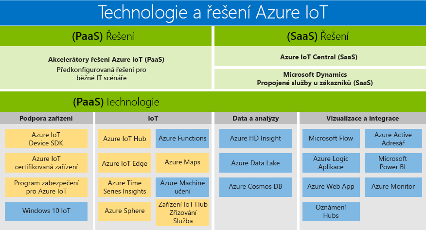

# Technologie a řešení Azure IoT: PaaS a SaaS

Microsoft sestavil portfolio, které vyhovuje potřebám všech zákazníků a umožňuje jim přístup k výhodám digitální transformace. Produktové portfolio Azure IoT je přehledem dostupných technologií a řešení PaaS či SaaS. Představuje dvě cesty, kterými se můžete při sestavování vlastního řešení vydat:

- Platforma jako služba (PaaS): sestavte si vlastní aplikaci pomocí [akcelerátorů řešení Azure IoT](https://www.azureiotsolutions.com/), což je kolekce předkonfigurovaných řešení na podnikové úrovni, která vám umožňuje urychlit vývoj vlastních řešení IoT.

- Software jako služba (SaaS): začněte rychleji díky [Azure IoT Central](https://azure.microsoft.com/services/iot-central/), což je nové řešení SaaS pro vývoj aplikací IoT, aniž byste se museli vystavit složitosti řešení IoT. Pokud vaše organizace nemá dostatek prostředků na vytvoření vlastního řešení IoT, využijte Azure IoT Central, což je řešení IoT bez kódu, které dokáže vytvořit modely zařízení, řídicí panely a pravidla v řádech minut.

## Řešení

Nabídky SaaS a akcelerátory řešení vám umožní rychle se pustit do práce. Vyberte si z předkonfigurovaných řešení, které umožňují využívat běžné scénáře IoT, jako je vzdálené monitorování, prediktivní údržba a propojená továrna, a vytvořte plně přizpůsobitelné řešení. Nebo použijte plně spravované řešení Azure IoT Central, které umožňuje využívat výkonné scénáře IoT a nevyžaduje přitom zkušenosti s cloudovými řešeními.

### Akcelerátory řešení Azure IoT (PaaS)

Akcelerátory řešení Azure IoT Suite jsou přizpůsobitelná řešení PaaS na podnikové úrovni, která zajišťují vysokou úroveň kontroly nad vaším řešením IoT. Pokud vaše firma implementuje IoT kvůli propojeným operacím nebo má konkrétní požadavky na přizpůsobení propojených produktů, akcelerátory řešení Azure IoT vám požadovanou kontrolu zajistí. 

Příkladem společností, kterým by mohly akcelerátory řešení Azure IoT prospět, jsou organizace s velkým počtem zařízení nebo modelů zařízení a výrobci, kteří hledají řešení propojené továrny. Akcelerátory řešení IoT vytváří vysoce přizpůsobitelná řešení upravená na míru komplexním potřebám a nabízejí: 

- Předem sestavená řešení
    - Vzdálené monitorování
    - Propojená továrna
    - Prediktivní údržba
    - Simulace zařízení
- Možnost nasazení v řádu minut
- Zrychlená doba realizace
- Řešení s absolutní kontrolou 
 
### Azure IoT Central (SaaS)

Azure IoT Central je plně spravované řešení SaaS, které vám umožňuje rychle začít i s minimem zkušeností s IoT. Modely SaaS by pro vaše potřeby implementace IoT mohly být ideálním řešením, pokud vám tolik nezáleží na přizpůsobení a jde vám hlavně o rychlost. 

Výhod IoT prostřednictvím přístupu SaaS mohou nyní využívat organizace s menším počtem modelů zařízení, větším množstvím předvídatelných scénářů a omezenými funkcemi IoT nebo IT. Podniky, které v minulosti neměly dostatek času, peněz nebo zkušeností na vývoj propojených produktů, nyní mohou díky Azure IoT Central rychle začít. Microsoft je špičkou svého odvětví v oblasti poskytování vyspělých řešení SaaS, která řeší běžné implementační požadavky IoT. 

- Plně spravované IoT SaaS
- Nevyžadují se znalosti vývoje cloudových řešení
- Konfigurovatelnost podle vašich potřeb
- Vhodné pro jednoduché potřeby IoT

### Porovnání akcelerátorů řešení Azure IoT a Azure IoT Central

Pokud chcete implementovat typickou [architekturu řešení IoT](/azure/iot-fundamentals/iot-introduction#iot-solution-architecture), nabízí vám Azure IoT několik možností – [akcelerátory řešení Azure IoT](/azure/iot-suite) a [Azure IoT Central](https://www.microsoft.com/internet-of-things/iot-central-saas-solutions) –, které jsou vhodné pro různé sady zákaznických požadavků.

Služba [Azure IoT Hub](https://azure.microsoft.com/services/iot-hub/) představuje základní Azure PaaS a využívají ji Azure IoT Central i akcelerátory řešení Azure IoT. IoT Hub umožňuje spolehlivou a zabezpečenou obousměrnou komunikaci mezi miliony zařízení IoT a cloudovým řešením. IoT Hub pomáhá plnit náročné úkoly implementace problémy, jako jsou:

* Správa a připojení zařízení velkého rozsahu
* Ingestování telemetrie velkého rozsahu
* Příkazy a ovládání zařízení
* Vynucení zabezpečení zařízení

Volba produktu Azure IoT je důležitou součástí plánování řešení IoT. IoT Hub je individuální služba Azure, která sama o sobě neposkytuje kompletní řešení IoT. Službu IoT Hub můžete použít jako výchozí bod pro jakékoli řešení IoT a k jejímu využití nepotřebujete akcelerátory řešení Azure IoT ani Azure IoT Central. Akcelerátory řešení Azure IoT i Azure IoT Central využívají službu IoT Hub společně s dalšími službami Azure. Následující tabulka shrnuje hlavní rozdíly mezi akcelerátory řešení Azure IoT a Azure IoT Central a pomůže vám při výběru vhodné varianty pro vaše požadavky:

|                        | Akcelerátory řešení Azure IoT | Azure IoT Central |
| ---------------------- | --------- | ----------- |
| Primární využití | Ke zrychlení vývoje vlastního řešení IoT, které vyžaduje maximální flexibilitu | Ke zkrácení doby uvedení na trh pro jednoduchá řešení IoT, která nevyžadují rozsáhlá přizpůsobení služeb |
| Přístup k podkladovým službám PaaS          | Máte přístup k podkladovým službám Azure a můžete je spravovat nebo podle potřeby vyměnit. | SaaS. Plně spravovaná řešení, podkladové služby nejsou zveřejněné. |
| Flexibilita            | Vysoká. Kód pro mikroslužby je typu open source a můžete ho upravit libovolným způsobem podle svých potřeb. Kromě toho můžete přizpůsobit infrastrukturu nasazení.| Střední. Můžete využít předdefinované uživatelské prostředí založené na prohlížeči a přizpůsobit model řešení a aspekty uživatelského rozhraní. Infrastrukturu nejde přizpůsobit, protože jednotlivé komponenty se nezveřejňují.|
| Úroveň dovedností                 | Středně vysoká. K přizpůsobení back-endu řešení potřebujete znalosti Javy nebo .NET. K přizpůsobení vizualizace potřebujete znalosti JavaScriptu. | Nízká. K přizpůsobení řešení potřebujete znalosti modelování. Znalosti kódování nejsou potřeba. |
| Úvodní prostředí | Akcelerátory řešení implementují běžné scénáře IoT. Je možné je nasadit v řádu minut. | Šablony aplikací a šablony zařízení poskytují předdefinované modely. Je možné je nasadit v řádu minut. |
| Ceny                | Služby můžete doladit tak, abyste měli náklady pod kontrolou. | Jednoduchá a předvídatelná struktura cena. |

Rozhodnutí, který produkt využít k sestavení vašeho řešení IoT, určují hlavně:

* Vaše obchodní požadavky
* Typ řešení, které chcete sestavit
* Dovednosti vaší organizace v oblasti sestavování a dlouhodobé správy řešení

## Technologie (PaaS)

Díky nejucelenějšímu portfoliu IoT se službami platformy, vám technologie typu platforma jako služba (PaaS), které se rozpínající napříč platformou Azure, umožňují snadno vytvářet, přizpůsobovat, a ovládat všechny aspekty řešení IoT. Navažte obousměrnou komunikaci s miliardami zařízení IoT a spravujte svá zařízení IoT ve velkém měřítku. Poté integrujte data zařízení IoT s ostatními službami platformy, jako je Azure Cosmos DB a Azure Time Series Insights, a vylepšete přehledy v celém řešení. 

### Podpora zařízení

S důvěrou začněte svůj projekt IoT použitím [úvodních sad Azure IoT](https://catalog.azureiotsuite.com/kits) nebo výběrem ze stovek zařízení Certified for IoT v [katalogu zařízení](http://catalog.azureiotsuite.com/). Všechna zařízení jsou nezávislá na konkrétní platformě a prošla testy bezproblémového připojení k Centru IoT.
Připojte všechna svoje zařízení k Azure IoT pomocí [sad SDK pro zařízení](/azure/iot-hub/iot-hub-devguide-sdks) typu open source. Sady SDK podporují více operačních systémů, například Linux, Windows a operační systémy pracující v reálném čase, a také více programovacích jazyků, například [C](https://github.com/Azure/azure-iot-sdk-c), [Node.js](https://github.com/Azure/azure-iot-sdk-node), [Java](https://github.com/Azure/azure-iot-sdk-java), [.NET](https://github.com/Azure/azure-iot-sdk-csharp) a [Python](https://github.com/Azure/azure-iot-sdk-python).

### IoT 
[Azure IoT Hub](https://azure.microsoft.com/services/iot-hub/) je plně spravovaná služba, která umožňuje spolehlivou a zabezpečenou obousměrnou komunikaci mezi miliony zařízení IoT a back-endem řešení. Služba Azure IoT Hub Device Provisioning je pomocná služba pro IoT Hub. Umožňuje plně automatizované zřizování za běhu ve správném IoT Hubu, které nevyžaduje zásah člověka. Zákazníci tak mohou bezpečným a škálovatelným způsobem zřizovat miliony zařízení.

### Edge
[Azure IoT Edge](https://azure.microsoft.com/services/iot-edge/) je služba Internetu věcí (IoT). Tato služba je určená pro zákazníky, kteří chtějí analyzovat data na zařízeních, jinými slovy „na hraničních zařízeních“. Když přesunete část úloh na hraniční zařízení, snížíte tím latenci a získáte možnost offlinových scénářů.

### Data a analýza
Využijte ve svém řešení IoT řady nabídek PaaS pro produkty Azure pro data a analýzu. Máte na výběr řešení od přesunutí inteligentních cloudových funkcí do hraničních zařízení pomocí služby Azure Machine Learning, přes uložení dat zařízení IoT nákladově výhodným způsobem pomocí služby Azure Data Lake, až po vizualizaci obrovského množství dat ze zařízení IoT pomocí služby [Azure Time Series Insights](https://azure.microsoft.com/services/time-series-insights/).

### Vizualizace a integrace
Microsoft Azure nabízí úplné cloudové řešení, které kombinuje neustále rostoucí kolekci integrovaných cloudových služeb se závazkem ohledně špičkové ochrany a soukromí vašich dat. Další informace o [Microsoft Azure](https://azure.microsoft.com/).

## Další kroky

Pokud chcete rychle a snadno prozkoumat funkce IoT, podívejte se do [části Začínáme v dokumentaci služby IoT Hub](/azure/iot-hub/iot-hub-get-started). Pokud stojíte o podrobnější praktické zkušenosti, vyzkoušejte jeden z [kurzů o službě IoT Edge](/azure/iot-edge/tutorial-simulate-device-windows).
