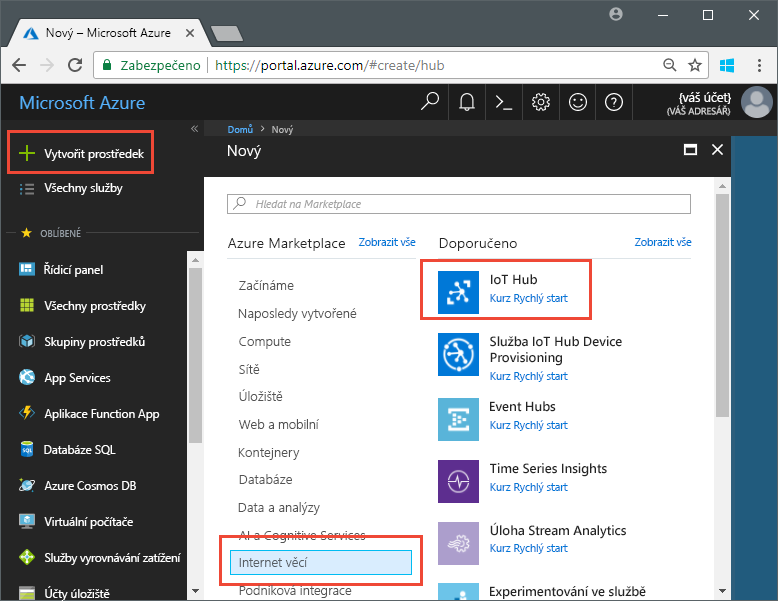
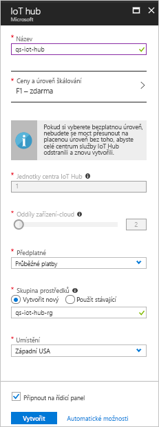

# <a name="send-telemetry-from-a-device-to-an-iot-hub-swift"></a>Odesílání telemetrických dat ze zařízení do centra IoT (Swift)

IoT Hub je služba Azure, která umožňuje ingestovat velké objemy telemetrických dat ze zařízení IoT do cloudu pro účely uložení nebo zpracování. V tomto článku budete do služby IoT Hub odesílat telemetrická data z aplikace simulovaného zařízení. Pak můžete data zobrazit v back-endové aplikaci. 

V tomto článku se k odesílání telemetrických dat používá předem napsaná aplikace Swift a ke čtení telemetrických dat ze služby IoT Hub se používá nástroj příkazového řádku. 

[!INCLUDE [cloud-shell-try-it.md](../../includes/cloud-shell-try-it.md)]

Pokud ještě nemáte předplatné Azure, vytvořte si [bezplatný účet](https://azure.microsoft.com/free/?WT.mc_id=A261C142F) před tím, než začnete.

## <a name="prerequisites"></a>Požadavky

- Stažení vzorového kódu z [ukázek Azure](https://github.com/Azure-Samples/azure-iot-samples-ios/archive/master.zip). 
- Nejnovější verze [XCode](https://developer.apple.com/xcode/) používající nejnovější verzi sady SDK pro iOS. Tento rychlý start byl testován s XCode 9.3 a iOS 11.3.
- Nejnovější verze [CocoaPods](https://guides.cocoapods.org/using/getting-started.html).
- Nástroj příkazového řádku iothub-explorer, který čte telemetrická data ze služby IoT Hub. Pokud ho chcete nainstalovat, nainstalujte nejprve [Node.js](https://nodejs.org) verze 4.x.x nebo novější a pak spusťte následující příkaz: 

   ```sh
   sudo npm install -g iothub-explorer
   ```

## <a name="create-an-iot-hub"></a>Vytvoření centra IoT

Prvním krokem je vytvoření centra IoT ve vašem předplatném pomocí webu Azure Portal. Centrum IoT umožňuje ingestovat velké objemy telemetrických dat z řady zařízení do cloudu. Centrum pak umožní jedné nebo více back-endovým službám v cloudu tato telemetrická data číst a zpracovat.

1. Přihlaste se k [portálu Azure](http://portal.azure.com).

1. Vyberte **Vytvořit prostředek** > **Internet věcí** > **IoT Hub**. 

   

1. K vytvoření vlastního centra IoT použijte hodnoty v následující tabulce:

    | Nastavení | Hodnota |
    | ------- | ----- |
    | Název | Jedinečný název vašeho centra |
    | Cenová úroveň a úroveň škálování | F1 Free |
    | Jednotky služby IoT Hub | 1 |
    | Oddíly zařízení-cloud | 2 oddíly |
    | Předplatné | Vaše předplatné Azure. |
    | Skupina prostředků | Vytvořte novou. Zadejte název skupiny prostředků. |
    | Umístění | Zvolte umístění, které je k vám nejblíže. |
    | Připnutí na řídicí panel | Ano |

1. Klikněte na možnost **Vytvořit**.  

   

1. Poznamenejte si názvy vašeho centra IoT a skupiny prostředků. Tyto hodnoty použijete později v tomto rychlém startu.

## <a name="register-a-device"></a>Registrování zařízení

Zařízení musí být zaregistrované ve vašem centru IoT, aby se mohlo připojit. V tomto rychlém startu pomocí Azure CLI zaregistrujete simulované zařízení.

1. Přidejte rozšíření rozhraní příkazového řádku IoT Hub a vytvořte identitu zařízení. Nahraďte `{YourIoTHubName}` názvem vašeho centra IoT:

   ```azurecli-interactive
   az extension add --name azure-cli-iot-ext
   az iot hub device-identity create --hub-name {YourIoTHubName} --device-id myiOSdevice
   ```

1. Spuštěním následujícího příkazu získejte _připojovací řetězec zařízení_ pro zařízení, které jste právě zaregistrovali:

   ```azurecli-interactive
   az iot hub device-identity show-connection-string --hub-name {YourIoTHubName} --device-id myiOSdevice --output table
   ```

   Poznamenejte si připojovací řetězec zařízení, který vypadá nějak takto: `Hostname=...=`. Tuto hodnotu použijete později v tomto článku.

1. Potřebujete také _připojovací řetězec služby_, který back-endovým aplikacím umožní připojení k vašemu centru IoT a načtení zpráv ve směru zařízení-cloud. Následující příkaz načte připojovací řetězec služby pro vaše centrum IoT:

   ```azurecli-interactive
   az iot hub show-connection-string --hub-name {YourIoTHubName} --output table
   ```

   Poznamenejte si připojovací řetězec služby, který vypadá nějak takto: `Hostname=...=`. Tuto hodnotu použijete později v tomto článku.

## <a name="send-simulated-telemetry"></a>Odesílání simulovaných telemetrických dat

Ukázková aplikace se spouští na zařízení iOS, které se připojuje ke koncovému bodu vašeho centra IoT pro konkrétní zařízení a odesílá simulovaná telemetrická data o teplotě a vlhkosti vzduchu. 

### <a name="install-cocoapods"></a>Instalace CocoaPods

CocoaPods spravují závislosti pro projekty iOS využívající knihovny třetích stran.

V okně terminálu přejděte do složky Azure-IoT-Samples-iOS, kterou jste stáhli v rámci požadavků. Pak přejděte do ukázkového projektu:

```sh
cd quickstart/sample-device
```

Ujistěte se, že je XCode zavřené, a pak spuštěním následujícího příkazu nainstalujte CocoaPods deklarované v souboru **podfile**:

```sh
pod install
```

Kromě instalace požadovaných podů pro váš projekt příkaz k instalaci vytvořil také soubor pracovního prostoru XCode, který je předem nakonfigurovaný tak, aby používal pody pro závislosti. 

### <a name="run-the-sample-application"></a>Spuštění ukázkové aplikace 

1. Otevřete ukázkový pracovní prostor v XCode.

   ```sh
   open "MQTT Client Sample.xcworkspace"
   ```

2. Rozbalte projekt **MQTT Client Sample** a pak rozbalte složku se stejným názvem.  
3. Otevřete soubor **ViewController.swift** pro úpravy v XCode. 
4. Vyhledejte proměnnou **connectionString** a aktualizujte její hodnotu s použitím připojovacího řetězce zařízení, který jste si poznamenali dříve.
5. Uložte provedené změny. 
6. Spusťte projekt v emulátoru zařízení pomocí tlačítka **Build and run** (Sestavit a spustit) nebo kombinace kláves **command + r**. 

   

7. Jakmile se otevře emulátor, vyberte v ukázkové aplikaci **Start** (Spustit).

Následující snímek obrazovky ukazuje příklad výstupu, zatímco aplikace odesílá simulovaná telemetrická dat do vašeho centra IoT:

   

## <a name="read-the-telemetry-from-your-hub"></a>Čtení telemetrických dat z centra

Ukázková aplikace, kterou jste spustili v emulátoru XCode, ukazuje data o zprávách odeslaných ze zařízení. Můžete zobrazit také přijatá data procházející přes vaše centrum IoT. Nástroj příkazového řádku `iothub-explorer` se připojí ke koncovému bodu **Events** (Události) na straně služby ve vaší službě IoT Hub. 

Otevřete nové okno terminálu. Spusťte následující příkaz, ve kterém nahraďte {your hub service connection string} připojovacím řetězcem služby, který jste získali na začátku tohoto článku:

```sh
iothub-explorer monitor-events myiOSdevice --login "{your hub service connection string}"
```

Následující snímek obrazovky ukazuje typ telemetrických dat, která se zobrazí v okně terminálu:


Pokud při spuštění příkazu iothub-explorer dojde k chybě, pečlivě zkontrolujte, že používáte *připojovací řetězec služby* pro vaše centrum IoT, a ne *připojovací řetězec zařízení* pro vaše zařízení IoT. Oba připojovací řetězce začínají na **Hostname={iothubname}**, ale připojovací řetězec služby obsahuje vlastnost **SharedAccessKeyName**, zatímco připojovací řetězec zařízení obsahuje **DeviceID**. 

## <a name="clean-up-resources"></a>Vyčištění prostředků

Pokud chcete pokračovat v testování služby IoT Hub v dalších článcích, ponechte si skupinu prostředků a centrum IoT pro pozdější použití.

Pokud už centrum IoT nepotřebujete, odstraňte ho společně se skupinou prostředků na portálu. Provedete to výběrem skupiny prostředků, která obsahuje vaše centrum IoT, a kliknutím na **Odstranit**.

## <a name="next-steps"></a>Další kroky

V tomto článku jste nastavili centrum IoT, zaregistrovali zařízení, odeslali do centra simulovaná telemetrická data ze zařízení iOS a četli telemetrická data z centra. 

Další informace o tom, jak můžou zařízení iOS pracovat se službou IoT Hub, najdete v tématu [Posílání zpráv ve směru cloud-zařízení pomocí iOS (Swift)](iot-hub-ios-swift-c2d.md).

<!-- Links -->
[lnk-process-d2c-tutorial]: iot-hub-csharp-csharp-process-d2c.md
[lnk-device-management]: iot-hub-node-node-device-management-get-started.md
[lnk-iot-edge]: ../iot-edge/tutorial-simulate-device-linux.md
[lnk-connect-device]: https://azure.microsoft.com/develop/iot/
