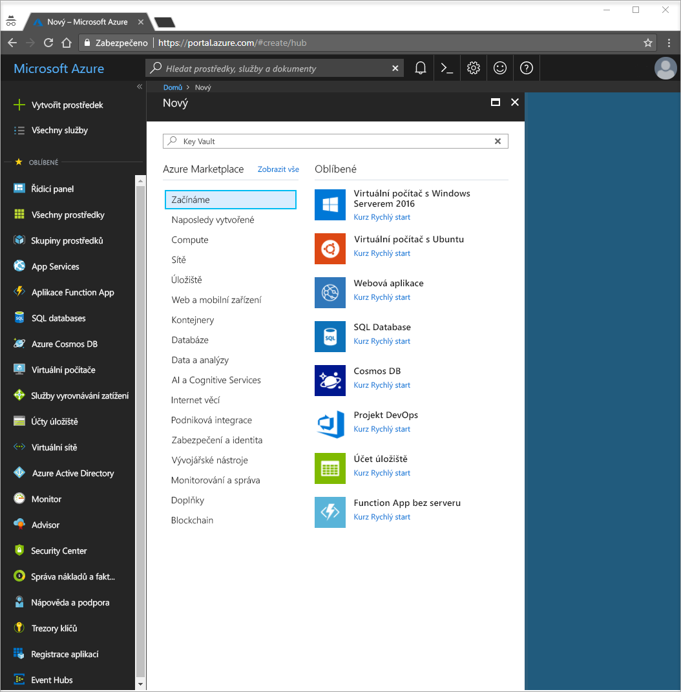
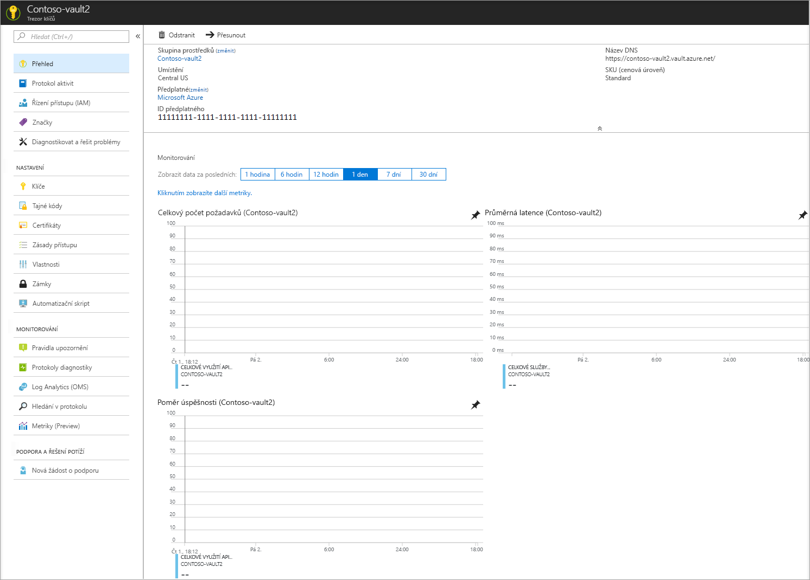
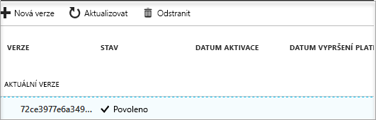

# Rychlý start: Vytvoření služby Key Vault pomocí webu Azure Portal

Azure Key Vault je cloudová služba, která funguje jako zabezpečené úložiště tajných klíčů. Můžete bezpečně ukládat klíče, hesla, certifikáty a další tajné klíče. Další informace o službě Key Vault najdete v tématu [Přehled](key-vault-overview.md). Trezory klíčů Azure můžete vytvářet a spravovat přes web Azure Portal. V tomto rychlém startu vytvoříte trezor klíčů. Po jeho vytvoření uložíte tajný klíč.

Pokud ještě nemáte předplatné Azure, vytvořte si [bezplatný účet](https://azure.microsoft.com/free/?WT.mc_id=A261C142F) před tím, než začnete.

## Přihlášení k Azure

Přihlaste se k webu Azure Portal na adrese http://portal.azure.com.

## Vytvoření trezoru

1. Vyberte možnost **Vytvořit prostředek** v levém horním rohu webu Azure Portal.

    
2. Do vyhledávacího pole zadejte **Key Vault**.
3. V seznamu výsledků zvolte **Key Vault**.
4. V části Key Vault zvolte **Vytvořit**.
5. V části **Vytvořit trezor klíčů** zadejte následující informace:
    - **Název:** V tomto rychlém startu používáme **Contoso-vault2**. Pro své testování musíte zadat jedinečný název.
    - **Předplatné:** Zvolte předplatné, které budete používat pro tento rychlý start.
    - V části **Skupina prostředků** zvolte **Vytvořit novou** a zadejte název skupiny prostředků.
    - V rozevírací nabídce **Umístění** zvolte umístění.
    - Zaškrtněte políčko **Připnout na řídicí panel**.
    - U ostatních možností ponechte jejich výchozí hodnoty.
6. Po zadání výše uvedených informací vyberte **Vytvořit**.

Poznamenejte si hodnoty dvou vlastností uvedených níže:

* **Název trezoru:** V tomto příkladu je to **Contoso-Vault2**. Tento název budete používat pro další kroky.
* **Identifikátor URI trezoru:** V tomto příkladu je to https://contoso-vault2.vault.azure.net/. Aplikace, které používají váš trezor prostřednictvím REST API musí používat tento identifikátor URI.

V tuto chvíli je váš účet Azure jediným účtem s oprávněním provádět jakékoli operace s tímto novým trezorem.

## Přidání tajného klíče do služby Key Vault

Pokud chcete do trezoru přidat tajný klíč, stačí provést několik dalších kroků. V tomto případě přidáme heslo, které může používat aplikace. Heslo se nazývá **ExamplePassword** a uchovává hodnotu **Pa$$w0rd**.

1. Na stránce vlastností služby Key Vault vyberte **Tajné klíče**.
2. Klikněte na **Vygenerovat/importovat**.
3. Na obrazovce **Vytvořit tajný klíč** zvolte následující:
    - **Možnosti nahrání:** Ruční
    - **Název:** ExamplePassword
    - **Hodnota:** Pa$$w0rd
    - U ostatních hodnot ponechte jejich výchozí nastavení. Klikněte na možnost **Vytvořit**.

Jakmile se zobrazí zpráva o úspěšném vytvoření tajného klíče, můžete na tajný klíč kliknout v seznamu. Zobrazí se několik jeho vlastností. Pokud kliknete na aktuální verzi, zobrazí se hodnota, kterou jste zadali v předchozím kroku.

## Vyčištění prostředků

Další rychlé starty a kurzy týkající se služby Key Vault vycházejí z tohoto rychlého startu. Pokud chcete pokračovat v práci s dalšími rychlými starty a kurzy, možná budete chtít tyto prostředky zachovat.
Pokud už je nepotřebujete, odstraňte službu Key Vault a související prostředky odstraněním skupiny prostředků. Odstranění skupiny prostředků přes portál:

1. Do pole Hledat v horní části portálu zadejte název vaší skupiny prostředků. Až se ve výsledcích hledání zobrazí skupina prostředků použitá v tomto rychlém startu, vyberte ji.
2. Vyberte **Odstranit skupinu prostředků**.
3. Do pole **ZADEJTE NÁZEV SKUPINY PROSTŘEDKŮ:** zadejte název vaší skupiny prostředků a vyberte **Odstranit**.

## Další kroky

V tomto rychlém startu jste vytvořili službu Key Vault a uložili tajný klíč. Další informace o službě Key Vault a jejím použití s vašimi aplikacemi najdete v kurzu pro webové aplikace pracující se službou Key Vault.

> [!div class="nextstepaction"]
> Informace o načtení tajného kódu ze služby Key Vault z webové aplikace s využitím identit spravované služby najdete v následujícím kurzu [Konfigurace webové aplikace Azure pro čtení tajného kódu ze služby Key Vault](tutorial-web-application-keyvault.md).
