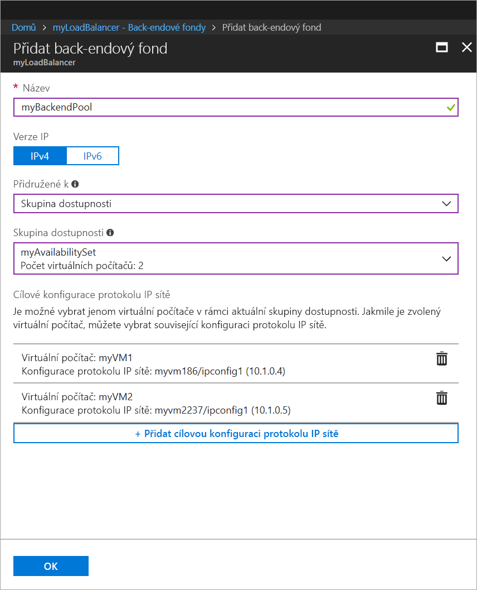
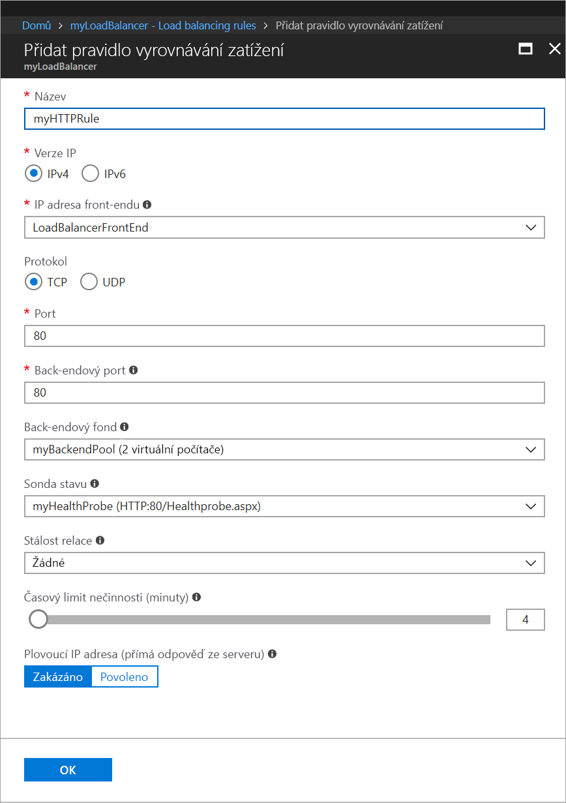
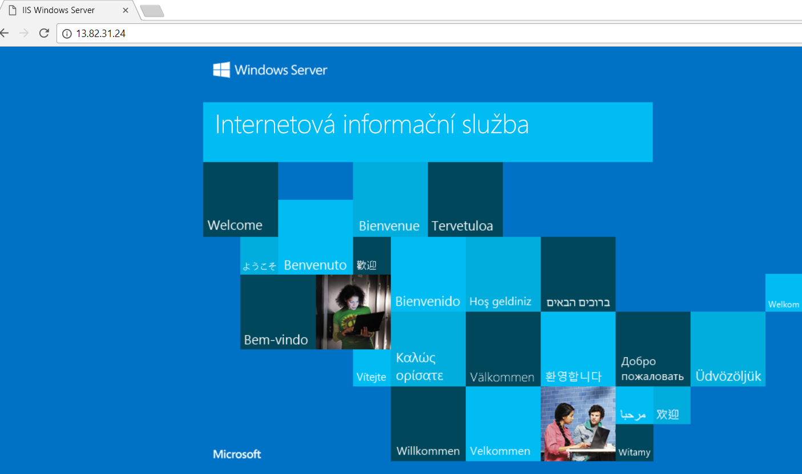

# Rychlý start: Vytvoření Load Balanceru úrovně Standard pro vyrovnávání zatížení virtuálních počítačů pomocí portálu Azure Portal

Vyrovnávání zatížení zajišťuje vyšší úroveň dostupnosti a škálování tím, že rozprostírá příchozí požadavky na více virtuálních počítačů. K vytvoření nástroje pro vyrovnávání zatížení virtuálních počítačů můžete použít web Azure Portal. V tomto rychlém startu se dozvíte, jak vyrovnávat zatížení virtuálních počítačů pomocí Load Balanceru úrovně Standard.

Pokud ještě nemáte předplatné Azure, vytvořte si [bezplatný účet](https://azure.microsoft.com/free/?WT.mc_id=A261C142F) před tím, než začnete. 

## Přihlášení k Azure

Přihlaste se k webu Azure Portal na adrese [http://portal.azure.com](http://portal.azure.com).

## Vytvoření veřejného nástroje pro vyrovnávání zatížení

V této části vytvoříte veřejný nástroj pro vyrovnávání zatížení, který pomáhá vyrovnávat zatížení virtuálních počítačů. Load Balancer úrovně Standard podporuje pouze standardní veřejnou IP adresu. Při vytváření Load Balanceru úrovně Standard musíte vytvořit také novou standardní veřejnou IP adresu nakonfigurovanou jako jeho front-end (ve výchozím nastavení má název *LoadBalancerFrontend*). 

1. V levém horním rohu obrazovky klikněte na **Vytvořit prostředek** > **Sítě** > **Load Balancer**.
2. Na stránce **Vytvoření nástroje pro vyrovnávání zatížení** zadejte pro nástroj pro vyrovnávání zatížení tyto hodnoty:
    - *myLoadBalancer* – název nástroje pro vyrovnávání zatížení.
    - **Public** – typ nástroje pro vyrovnávání zatížení.
     - *myPublicIP* – **Nová** veřejná IP adresa, kterou vytvoříte.
    - *myResourceGroupSLB* – název **nové** skupiny prostředků, kterou chcete vytvořit.
    - **westeurope** – umístění.
3. Kliknutím na **Vytvořit** vytvořte nástroj pro vyrovnávání zatížení.
   
    

## Vytvoření serverů back-end

V této části vytvoříte virtuální síť a dva virtuální počítače pro back-endový fond vašeho nástroje pro vyrovnávání zatížení a pak na tyto virtuální počítače nainstalujete službu IIS, která vám pomůže nástroj pro vyrovnávání zatížení otestovat.

### Vytvoření virtuální sítě
1. V levém horním rohu obrazovky klikněte na **Nový** > **Sítě** > **Virtuální síť** a zadejte pro svou virtuální síť tyto hodnoty:
    - *myVnet* – název virtuální sítě.
    - *myResourceGroupSLB* – název existující skupiny prostředků.
    - *myBackendSubnet* – název podsítě.
2. Kliknutím na **Vytvořit** vytvořte virtuální síť.

    

### Vytvoření virtuálních počítačů

1. V levém horním rohu obrazovky klikněte na **Nový** > **Compute** > **Windows Server 2016 Datacenter** a zadejte pro virtuální počítač tyto hodnoty:
    - *myVM1* – název virtuálního počítače.        
    - *azureuser* – uživatelské jméno správce.    
    - *myResourceGroupSLB* – v části **Skupina prostředků** vyberte **Použít existující** a pak vyberte *myResourceGroupSLB*.
2. Klikněte na **OK**.
3. Vyberte velikost virtuálního počítače **DS1_V2** a klikněte na **Vybrat**.
4. Zadejte následující hodnoty nastavení virtuálního počítače:
    - *myAvailabilitySet* – název nové skupiny dostupnosti, kterou vytvoříte.
    -  *myVNet* – ujistěte se, že je vybraná tato virtuální síť.
    - *myBackendSubnet* – ujistěte se, že je vybraná tato podsíť.
    - *myNetworkSecurityGroup* – název nové skupiny zabezpečení sítě (brána firewall), kterou je potřeba vytvořit.
5. Kliknutím na **Zakázáno** zakažte diagnostiku spouštění.
6. Klikněte na **OK**, na stránce souhrnu zkontrolujte nastavení a pak klikněte na **Vytvořit**.
7. Podle kroků 1 až 6 vytvořte druhý virtuální počítač s názvem *VM2*, skupinou dostupnosti *myavailabilityset*, virtuální sítí *myVnet*, podsítí *myBackendSubnet* a skupinou zabezpečení sítě **myNetworkSecurityGroup*. 

### Vytvoření pravidel skupiny zabezpečení sítě

V této části vytvoříte pravidla skupiny zabezpečení sítě, která povolí příchozí připojení pomocí protokolů HTTP a RDP.

1. V levé nabídce klikněte na **Všechny prostředky** a pak v seznamu prostředků klikněte na **myNetworkSecurityGroup** ve skupině prostředků **myResourceGroupSLB**.
2. V části **Nastavení** klikněte na **Příchozí pravidla zabezpečení** a pak klikněte na **Přidat**.
3. Zadáním následujících hodnot pro příchozí pravidlo zabezpečení *myHTTPRule* povolte příchozí připojení HTTP na portu 80:
    - Jako **Zdroj** zadejte *Značka služby*.
    - Jako **Značka zdrojové služby** zadejte *Internet*.
    - Jako **Rozsahy cílových portů** zadejte *80*.
    - Jako **Protokol** zadejte *TCP*.
    - Jako **Akce** zadejte *Povolit*.
    - Jako **Priorita** zadejte *100*.
    - Jako název zadejte *myHTTPRule*.
    - Jako popis zadejte *Povolení protokolu HTTP*.
4. Klikněte na **OK**.
 
 
5. Zopakováním kroků 2 až 4 vytvořte další pravidlo *myRDPRule*, které povolí příchozí připojení RDP na portu 3389, s použitím následujících hodnot:
    - Jako **Zdroj** zadejte *Značka služby*.
    - Jako **Značka zdrojové služby** zadejte *Internet*.
    - Jako **Rozsahy cílových portů** zadejte *3389*.
    - Jako **Protokol** zadejte *TCP*.
    - Jako **Akce** zadejte *Povolit*.
    - Jako **Priorita** zadejte *200*.
    - Jako název zadejte *myRDPRule*.
    - Jako popis zadejte *Povolení protokolu RDP*.

### Instalace služby IIS

1. V levé nabídce klikněte na **Všechny prostředky** a pak v seznamu prostředků klikněte na **myVM1** ve skupině prostředků *myResourceGroupLB*.
2. Na stránce **Přehled** klikněte na **Připojit** a připojte se přes RDP k virtuálnímu počítači.
3. Přihlaste se k virtuálnímu počítači s použitím uživatelského jména *azureuser*.
4. Na ploše serveru přejděte do části **Nástroje pro správu Windows**>**Správce serveru**.
5. Ve Správci serveru klikněte na **Přidat role a funkce**.
6. V **Průvodci přidáním rolí a funkcí** použijte následující hodnoty:
    - Na stránce **Výběr typu instalace** klikněte na **Instalace na základě role nebo funkce**.
    - Na stránce **Výběr cílového serveru** klikněte na **myVM1**.
    - Na stránce **Výběr role serveru** klikněte na **Webový server (služba IIS)**.
    - Postupujte podle pokynů a dokončete zbytek průvodce. 
7. Zopakujte kroky 1 až 6 pro virtuální počítač *myVM2*.

## Vytvoření prostředků nástroje pro vyrovnávání zatížení

V této části nakonfigurujete nastavení nástroje pro vyrovnávání zatížení pro fond back-endových adres a sondu stavu a zadáte pravidla nástroje pro vyrovnávání zatížení a překladu adres.

### Vytvoření fondu back-endových adres

Za účelem distribuce provozu do virtuálních počítačů obsahuje fond back-endových adres IP adresy virtuálních síťových karet připojených k nástroji pro vyrovnávání zatížení. Vytvořte fond back-endových adres *myBackendPool*, který zahrnuje virtuální počítače *VM1* a *VM2*.

1. V levé nabídce klikněte na **Všechny prostředky** a pak v seznamu prostředků klikněte na **myLoadBalancer**.
2. V části **Nastavení** klikněte na **Back-endové fondy** a pak klikněte na **Přidat**.
3. Na stránce **Přidat back-endový fond** postupujte následovně:
    - Jako název back-endového fondu zadejte *myBackEndPool.
    - V části **Přidruženo k** klikněte v rozevírací nabídce na **Skupina dostupnosti**.
    - V části **Skupina dostupnosti** klikněte na **myAvailabilitySet**.
    - Kliknutím na **Přidat konfiguraci IP adresy cílové sítě** přidejte do back-endového fondu jednotlivé virtuální počítače (*myVM1* & *myVM2*), které jste vytvořili.
    - Klikněte na **OK**.

    

3. Zkontrolujte, že se v nastavení back-endového fondu vašeho nástroje pro vyrovnávání zatížení zobrazuje virtuální počítač **VM1** i **VM2**.

### Vytvoření sondy stavu

Pokud chcete nástroji pro vyrovnávání zatížení povolit monitorování stavu vaší aplikace, použijte sondu stavu. Sonda stavu dynamicky přidává virtuální počítače do oběhu nástroje pro vyrovnávání zatížení nebo je z něj odebírá na základě jejich reakce na kontroly stavu. Vytvořte sondu stavu *myHealthProbe* pro monitorování stavu virtuálních počítačů.

1. V levé nabídce klikněte na **Všechny prostředky** a pak v seznamu prostředků klikněte na **myLoadBalancer**.
2. V části **Nastavení** klikněte na **Sondy stavu** a pak klikněte na **Přidat**.
3. K vytvoření sondy stavu použijte tyto hodnoty:
    - *myHealthProbe* – název sondy stavu.
    - **HTTP** – typ protokolu.
    - *80* – číslo portu.
    - *15* – **Interval** mezi pokusy o testování v sekundách.
    - *2* – **Prahová hodnota špatného stavu** neboli počet po sobě jdoucích selhání sondy, ke kterým musí dojít, aby se virtuální počítač považoval za poškozený.
4. Klikněte na **OK**.

   

### Vytvoření pravidla nástroje pro vyrovnávání zatížení

Pravidlo nástroje pro vyrovnávání zatížení slouží k definování způsobu distribuce provozu do virtuálních počítačů. Nadefinujte konfiguraci front-endových IP adres pro příchozí provoz, back-endový fond IP adres pro příjem provozu a také požadovaný zdrojový a cílový port. Vytvořte pravidlo nástroje pro vyrovnávání zatížení *myLoadBalancerRuleWeb* pro naslouchání na portu 80 ve front-endu *FrontendLoadBalancer* a odesílání síťového provozu s vyrovnáváním zatížení do back-endového fondu adres *myBackEndPool* rovněž na portu 80. 

1. V levé nabídce klikněte na **Všechny prostředky** a pak v seznamu prostředků klikněte na **myLoadBalancer**.
2. V části **Nastavení** klikněte na **Pravidla vyrovnávání zatížení** a pak klikněte na **Přidat**.
3. Ke konfiguraci pravidla vyrovnávání zatížení použijte tyto hodnoty:
    - *myHTTPRule* – název pravidla vyrovnávání zatížení.
    - **TCP** – typ protokolu.
    - *80* – číslo portu.
    - *80* – back-endový port.
    - *myBackendPool* – název backendového fondu.
    - *myHealthProbe* – název sondy stavu.
4. Klikněte na **OK**.
    
    

## Test nástroje pro vyrovnávání zatížení
1. Na obrazovce **Přehled** vyhledejte veřejnou IP adresu Load Balanceru. Klikněte na **Všechny prostředky** a pak klikněte na **myPublicIP**.

2. Zkopírujte veřejnou IP adresu a pak ji vložte do adresního řádku svého prohlížeče. V prohlížeči se zobrazí výchozí stránka webového serveru služby IIS.

      

## Vyčištění prostředků

Pokud už je nepotřebujete, odstraňte skupinu prostředků, nástroj pro vyrovnávání zatížení a všechny související prostředky. Provedete to výběrem skupiny prostředků, která obsahuje nástroj pro vyrovnávání zatížení, a kliknutím na **Odstranit**.

## Další kroky

Další informace o [Load Balanceru úrovně Standard](load-balancer-standard-overview.md).
