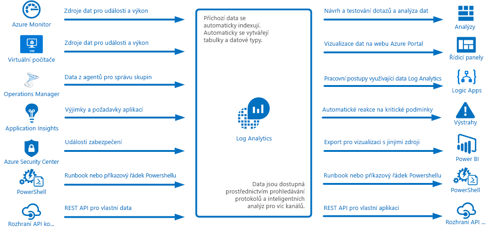
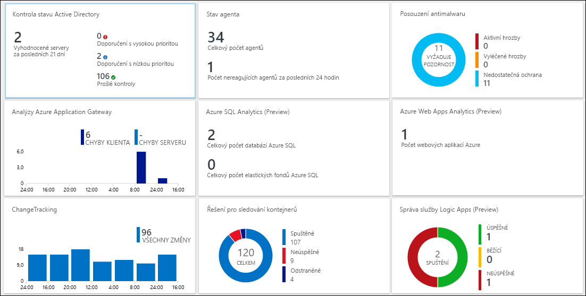
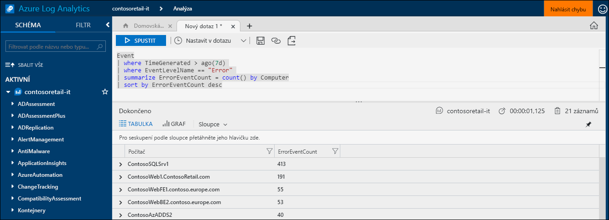
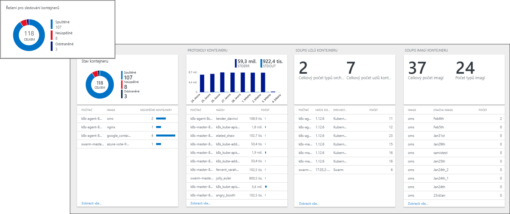
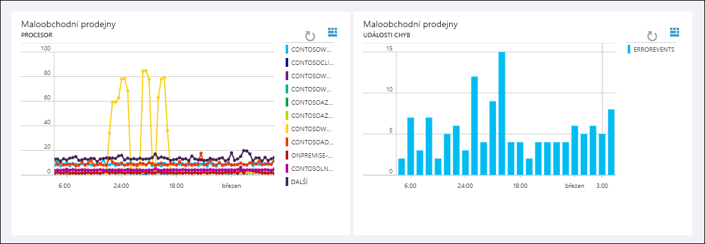
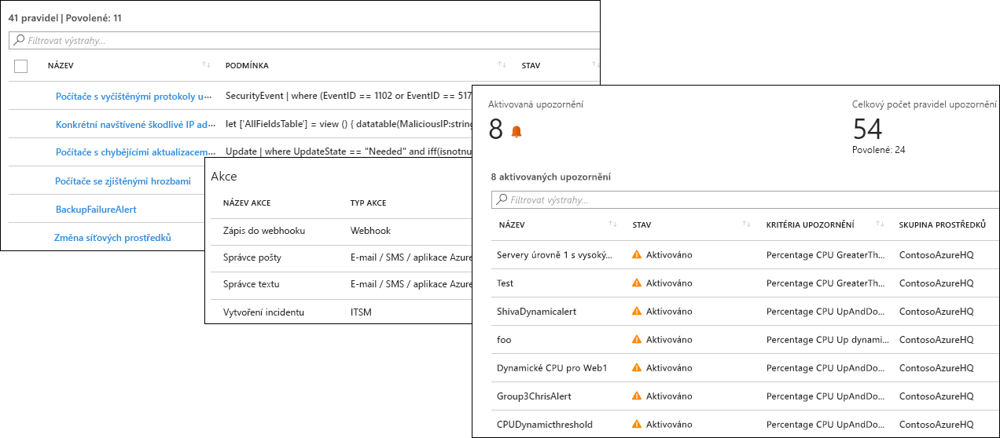
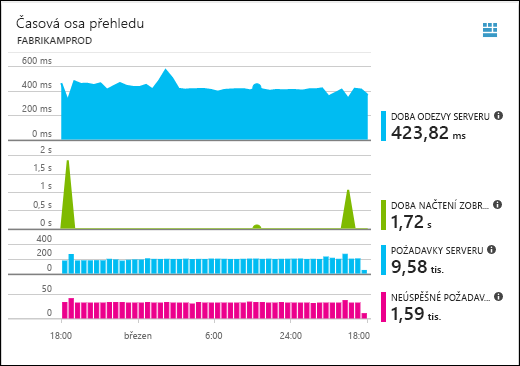
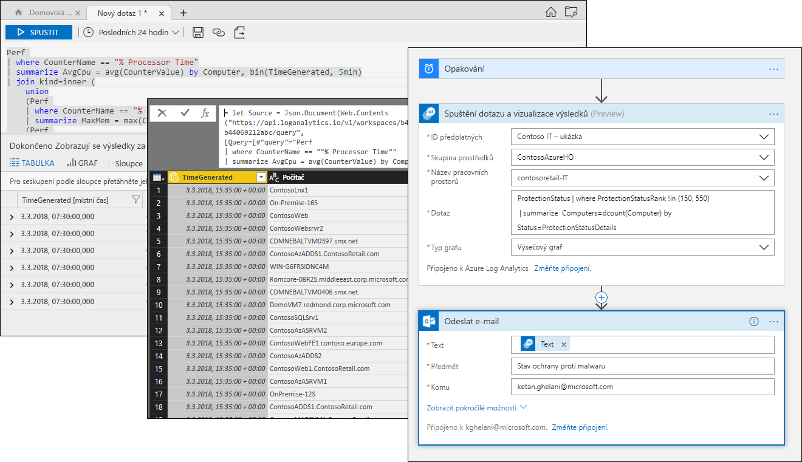

# Co je Azure Log Analytics?
Log Analytics hraje hlavní roli ve správě Azure díky tomu, že shromažďuje telemetrii a další data z široké škály zdrojů a poskytuje dotazovací jazyk a analytický modul, který zajišťuje přehled o provozu aplikací a prostředků.  S daty Log Analytics můžete pracovat buď přímo prostřednictvím prohledávání protokolů a zobrazení, nebo můžete použít analytické nástroje v dalších službách Azure, které ukládají data v Log Analytics, jako jsou například Application Insights nebo Azure Security Center.  

Služba Log Analytics vyžaduje minimální konfiguraci a je již integrovaná s dalšími službami Azure.  K povolení shromažďování stačí jenom vytvořit pracovní prostor.  Pak můžete na virtuální počítače nainstalovat agenty a tím je zahrnout do pracovního prostoru a povolit řešení pro správu, která obsahují logiku pro poskytování dalších přehledů o různých aplikacích.  Na pozadí jsou datové typy buď předdefinované, nebo se automaticky vytváří s tím, jak se data shromažďují.

## Role v monitorování

Různé služby monitorování v Azure jsou popsané v tématu [Monitorování aplikací a prostředků Azure](../monitoring-and-diagnostics/monitoring-overview.md).  Log Analytics hraje hlavní roli díky tomu, že konsoliduje data monitorování z různých zdrojů a poskytuje výkonný dotazovací jazyk pro konsolidaci a analýzu.  

Log Analytics se však neomezuje pouze na monitorování prostředků Azure.  Dokáže shromažďovat data z prostředků v místním prostředí nebo v jiných cloudech a vytváří tak prostředí hybridního monitorování a může se přímo připojit k nástroji System Center Operations Manager a shromažďovat telemetrii ze stávajících agentů.  Analytické nástroje v Log Analytics, jako je prohledávání protokolů, zobrazení a řešení pro správu, využívají všechna shromážděná data a poskytují možnost centralizované analýzy celého prostředí.

## Shromažďování dat
Log Analytics shromažďuje data z široké škály zdrojů.  Po shromáždění se data organizují do samostatných tabulek pro jednotlivé datové typy, což umožňuje společnou analýzu všech dat bez ohledu na jejich původní zdroj.

Mezi metody shromažďování dat do Log Analytics patří následující:

- Konfigurace služby Azure Monitor pro kopírování metrik a protokolů, které shromáždí z prostředků Azure.
- Agenti na virtuálních počítačích s [Windows](log-analytics-windows-agent.md) a [Linuxem](log-analytics-linux-agents.md), kteří odesílají telemetrii z hostovaného operačního systému a aplikací do Log Analytics podle [zdrojů dat](log-analytics-data-sources.md), které nakonfigurujete.  
- Připojení [skupiny pro správu nástroje System Center Operations Manager](log-analytics-om-agents.md) k Log Analytics pro shromažďování dat z agentů, které obsahuje.
- Služby Azure, jako jsou [Application Insights](https://docs.microsoft.com/azure/application-insights/) a [Azure Security Center](https://docs.microsoft.com/azure/security-center/), které ukládají data přímo do Log Analytics bez jakékoli konfigurace.
- Zápis dat z příkazového řádku PowerShellu nebo [runbooku Azure Automation](../automation/automation-runbook-types.md) pomocí rutin Log Analytics.
- Pokud máte vlastní požadavky, můžete použít [rozhraní API kolekce dat HTTP](log-analytics-data-collector-api.md) a zapisovat do Log Analytics data z jakéhokoli klienta REST API.

## Přidání funkcí s využitím řešení pro správu
[Řešení pro správu](log-analytics-add-solutions.md) poskytují předpřipravenou logiku pro konkrétní produkt nebo scénář.  Můžou do Log Analytics shromažďovat další data nebo zpracovávat již shromážděná data.  Obvykle zahrnují zobrazení, které vám pomůže tato další data analyzovat.  Řešení jsou k dispozici pro celou řadu funkcí a průběžně se přidávají další řešení.  Dostupná řešení můžete snadno procházet a [přidávat je do pracovního prostoru](log-analytics-add-solutions.md) z Azure Marketplace.  

## Dotazovací jazyk

Log Analytics zahrnuje [bohatý dotazovací jazyk](http://docs.loganalytics.io) pro rychlé načítání, slučování a analýzy shromážděných dat.  Dotazy můžete vytvářet a testovat pomocí [portálu pro prohledávání protokolů nebo portálu pro pokročilé analýzy](log-analytics-log-search-portals.md) a pak data přímo analyzovat s použitím těchto nástrojů nebo ukládat dotazy pro použití s vizualizacemi, výstrahami nebo exporty do dalších nástrojů, jako jsou Power BI nebo Excel.

Dotazovací jazyk Log Analytics je vhodný pro jednoduchá prohledávání protokolů, ale zahrnuje také pokročilé funkce, jako jsou agregace, spojení a inteligentní analýzy. Tento dotazovací jazyk se můžete rychle naučit s využitím [několika dostupných kurzů](https://docs.loganalytics.io/docs/Learn/Tutorials).  Pro uživatele, kteří již znají [SQL](https://docs.loganalytics.io/docs/Learn/References/SQL-to-Azure-Log-Analytics) a [Splunk](https://docs.loganalytics.io/docs/Learn/References/Splunk-to-Azure-Log-Analytics), jsou k dispozici konkrétní pokyny.

## Vizualizace dat Log Analytics

[Zobrazení v Log Analytics](log-analytics-view-designer.md) vizuálně reprezentují data z prohledávání protokolů.  Každé zobrazení obsahuje kombinaci vizualizací, jako jsou pruhové a spojnicové grafy, společně se seznamy se souhrnem důležitých data.  [Řešení pro správu](#add-functionality-with-management-solutions) zahrnují zobrazení se souhrnem dat pro konkrétní aplikaci a umožňují vytvářet vlastní zobrazení pro reprezentaci dat z jakéhokoli prohledávání protokolu Log Analytics.

Výsledky dotazu Log Analytics můžete také připnout na [řídicí panel Azure](../azure-portal/azure-portal-dashboards.md), na kterém můžete kombinovat dlaždice z různých služeb Azure.  Na řídicí panel můžete připnout dokonce i zobrazení Log Analytics.

## Vytváření výstrah z dat Log Analytics

Pomocí [výstrah Azure](../monitoring-and-diagnostics/monitoring-overview-unified-alerts.md) můžete zajistit aktivní upozorňování na podmínky v datech Log Analytics, které jsou pro vás důležité.  Dotaz se automaticky spouští v naplánovaných intervalech, a pokud jeho výsledky odpovídají určitým kritériím, vytvoří se výstraha.  To umožňuje kombinovat upozorňování z Log Analytics s dalšími zdroji, jako jsou výstrahy služby [Azure Monitor](../monitoring-and-diagnostics/monitoring-near-real-time-metric-alerts.md) téměř v reálném čase a výjimky aplikací v [Application Insights](../application-insights/app-insights-alerts.md), které sdílí [skupiny akcí](../monitoring-and-diagnostics/monitoring-action-groups.md) pro reakci na podmínky upozornění.

## Použití dat Log Analytics v dalších službách
Služby, jako jsou Application Insights a Azure Security Center, ukládají data do Log Analytics.  Obvykle budete pracovat s bohatými analytickými nástroji poskytovanými těmito službami, ale k přístupu k datům těchto služeb a jejich případné kombinaci s daty z jiných služeb můžete použít také dotazy Log Analytics.  

Například následující zobrazení je z Application Insights.  Pokud kliknete na ikonu v pravém horním rohu, spustí se konzola pro analýzy Log Analytics s dotazy použitými v grafu.

## Export dat Log Analytics

Log Analytics zpřístupňuje data také mimo Azure.  Můžete nakonfigurovat [Power BI](log-analytics-powerbi.md) pro import výsledků dotazu v naplánovaných intervalech, což vám umožní využít jeho funkce, jako je kombinace dat z různých zdrojů a sdílení sestav na webu a mobilních zařízeních.  Můžete také využít [rozhraní API hledání v protokolu](log-analytics-log-search-api.md) k vytvoření vlastních řešení, která využívají data služby Log Analytics nebo se integrují s ostatními systémy.

Pomocí [Logic Apps](../logic-apps/logic-apps-overview.md) v Azure můžete vytvářet vlastní pracovní postupy založené na datech Log Analytics.  Pro složitější logiku založenou na PowerShellu můžete použít [runbooky ve službě Azure Automation](../automation/automation-runbook-types.md).

## Další kroky
- Začněte [shromažďováním dat z virtuálních počítačů Azure](log-analytics-quick-collect-azurevm.md).
- Projděte si [kurz analýzy dat Log Analytics s použitím jednoduchého dotazu](log-analytics-tutorial-viewdata.md).
* [Projděte si dostupná řešení](log-analytics-add-solutions.md), pomocí kterých můžete přidávat funkce do Log Analytics.

