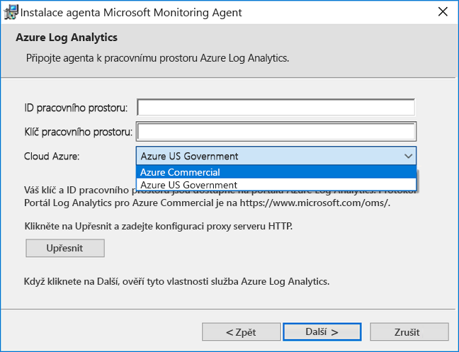
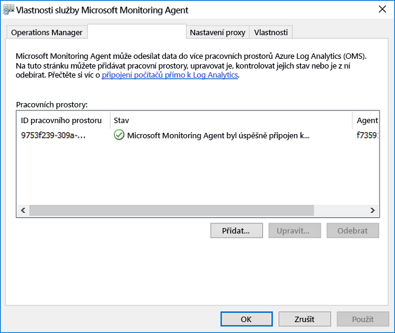
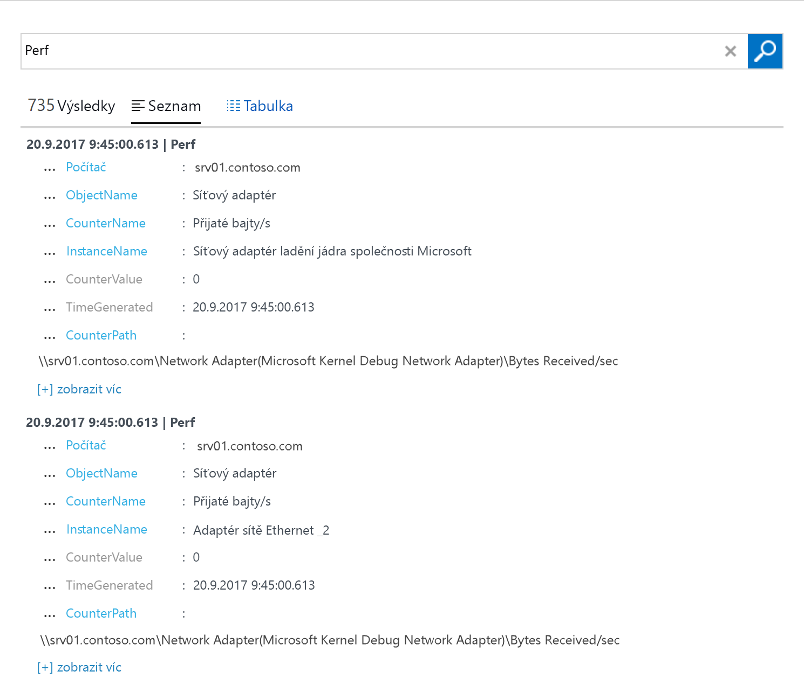

# Konfigurace agenta Log Analytics pro počítače s Windows v hybridním prostředí
[Azure Log Analytics](log-analytics-agent-windows.md) může shromažďovat data přímo z fyzického nebo virtuálního počítače s Windows ve vašem datacentru nebo jiném cloudovém prostředí do jednoho úložiště pro účely podrobných analýz a korelací.  Tento rychlý start ukazuje, jak v několik snadných krocích nakonfigurovat počítač s Windows a shromažďovat z něj data.  Informace týkající se virtuálních počítačů Azure s Windows najdete v tématu [Shromažďování dat o virtuálních počítačích Azure](log-analytics-quick-collect-azurevm.md).  

Abyste lépe porozuměli podporované konfiguraci, přečtěte si o [podporovaných operačních systémech Windows](log-analytics-agent-overview.md#supported-windows-operating-systems) a [konfiguraci síťové brány firewall](log-analytics-agent-overview.md#network-firewall-requirements).
 
Pokud ještě nemáte předplatné Azure, vytvořte si [bezplatný účet](https://azure.microsoft.com/free/?WT.mc_id=A261C142F) před tím, než začnete.

## Přihlášení k webu Azure Portal
Přihlaste se k webu Azure Portal na adrese [https://portal.azure.com](https://portal.azure.com). 

## Vytvoření pracovního prostoru
1. Na webu Azure Portal klikněte na **Všechny služby**. V seznamu prostředků zadejte **Log Analytics**. Seznam se průběžně filtruje podle zadávaného textu. Vyberte **Log Analytics**.       
2. Klikněte na **Vytvořit** a podle potřeby změňte hodnoty následujících položek:

  * Zadejte název nového **pracovního prostoru Log Analytics**, například *DefaultLAWorkspace*. 
  * Vyberte **předplatné**, které má být cílem propojení, výběrem z rozevíracího seznamu, pokud výchozí vybrané předplatné není vhodné.
  * Jako **skupinu prostředků** vyberte existující skupinu prostředků, která obsahuje jeden nebo několik virtuálních počítačů Azure.  
  * Vyberte **Umístění**, do kterého jsou vaše virtuální počítače nasazené.  Další informace najdete na stránce uvádějící [oblasti, ve kterých je dostupná služba Log Analytics](https://azure.microsoft.com/regions/services/).  
  * Pokud vytváříte pracovní prostor v novém předplatném vytvořeném po 2. dubnu 2018, automaticky se použije cenový plán *podle počtu GB* a možnost vybrat cenovou úroveň nebude dostupná.  Pokud vytváříte pracovní prostor pro existující předplatné vytvořené před 2. dubnem nebo pro předplatné, které se vázalo na existující registraci smlouvy Enterprise, vyberte si cenovou úroveň, které dáváte přednost.  Další informace o jednotlivých úrovních najdete v [podrobnostech o cenách Log Analytics](https://azure.microsoft.com/pricing/details/log-analytics/).

           

3. Po zadání požadovaných informací v podokně **Pracovní prostor Log Analytics** klikněte na **OK**.  

Během ověřování informací a vytváření pracovního prostoru můžete průběh zpracování sledovat prostřednictvím položky nabídky **Oznámení**. 

## Získání ID a klíče pracovního prostoru
Před instalací agenta Microsoft Monitoring Agent pro Windows potřebujete ID a klíč vašeho pracovního prostoru Log Analytics.  Tyto informace vyžaduje průvodce instalací ke správné konfiguraci agenta a zajištění, aby agent mohl úspěšně komunikovat s Log Analytics.  

1. Na webu Azure Portal klikněte v levém horním rohu na **Všechny služby**. V seznamu prostředků zadejte **Log Analytics**. Seznam se průběžně filtruje podle zadávaného textu. Vyberte **Log Analytics**.
2. V seznamu pracovních prostorů Log Analytics vyberte *DefaultLAWorkspace* vytvořený dříve.
3. Vyberte **Upřesňující nastavení**.       
4. Vyberte **Připojené zdroje** a pak **Servery Windows**.   
5. Napravo se zobrazí hodnoty **ID pracovního prostoru** a **Primární klíč**. Obě hodnoty zkopírujte a vložte do oblíbeného editoru.   

## Instalace agenta pro Windows
Následujícím postupem se nainstaluje a nakonfiguruje agent pro Log Analytics v Azure a cloudu Azure Government s použitím nastavení agenta Microsoft Monitoring Agent na vašem počítači.  

1. Na stránce **Servery Windows** vyberte odpovídající verzi **agenta pro Windows ke stažení** v závislosti na architektuře procesorů operačního systému Windows.
2. Spusťte instalační program a nainstalujte agenta na svém počítači.
2. Na **úvodní** stránce klikněte na **Další**.
3. Na stránce **Licenční podmínky** si přečtěte licenční podmínky a pak klikněte na **Souhlasím**.
4. Na stránce **Cílová složka** změňte nebo ponechte výchozí instalační složku a pak klikněte na **Další**.
5. Na stránce **Možnosti instalace agenta** zvolte připojení agenta k Azure Log Analytics a pak klikněte na **Další**.   
6. Na stránce **Azure Log Analytics** postupujte následovně:
   1. Vložte **ID pracovního prostoru** a **Klíč pracovního prostoru (primární klíč)**, které jste si zkopírovali dříve.  Pokud se má počítač hlásit do pracovního prostoru Log Analytics v cloudu Azure Government, vyberte z rozevíracího seznamu **Cloud Azure** možnost **Azure US Government**.  
   2. Pokud počítač potřebuje komunikovat se službou Log Analytics přes proxy server, klikněte na **Upřesnit** a zadejte adresu URL a číslo portu proxy serveru.  Pokud váš proxy server vyžaduje ověření, zadejte uživatelské jméno a heslo pro ověření proxy serveru a pak klikněte na **Další**.  
7. Jakmile dokončíte zadávání nezbytných nastavení konfigurace, klikněte na **Další**.     
8. Na stránce **Připraveno k instalaci** zkontrolujte zvolené volby a pak klikněte na **Nainstalovat**.
9. Na stránce **Konfigurace byla úspěšně dokončena** klikněte na **Dokončit**.

Po dokončení se **Microsoft Monitoring Agent** zobrazí v **Ovládacích panelech**. Můžete zkontrolovat svou konfiguraci a ověřit připojení agenta k Log Analytics. Pokud je agent připojený, na kartě **Azure Log Analytics** zobrazí zprávu: **The Microsoft Monitoring Agent has successfully connected to the Microsoft Log Analytics service** (Microsoft Monitoring Agent se úspěšně připojil ke službě Microsoft Log Analytics).   

## Shromažďování dat o událostech a výkonu
Log Analytics může shromažďovat události z protokolu událostí Windows a z čítačů výkonu, které určíte pro dlouhodobější analýzu a generování sestav, a provést akci při zjištění konkrétní podmínky.  Postupujte podle těchto kroků a pro začátek nakonfigurujte shromažďování událostí z protokolu událostí Windows a několika běžných čítačů výkonu.  

1. Na webu Azure Portal klikněte v levém dolním rohu na **Další služby**. V seznamu prostředků zadejte **Log Analytics**. Seznam se průběžně filtruje podle zadávaného textu. Vyberte **Log Analytics**.
2. Vyberte **Upřesňující nastavení**.      
3. Vyberte **Data** a pak vyberte **Protokoly událostí systému Windows**.  
4. Protokol událostí přidáte zadáním názvu protokolu.  Zadejte **Systém** a klikněte na symbol plus **+**.  
5. V tabulce zaškrtněte závažnosti **Chyby** a **Upozornění**.   
6. Uložte konfiguraci kliknutím na **Uložit** v horní části stránky.
7. Výběrem **Data o výkonu systému Windows** povolte shromažďování čítačů výkonu na počítači s Windows. 
8. Při první konfiguraci čítačů výkonu Windows pro nový pracovní prostor Log Analytics máte možnost rychle vytvořit několik běžných čítačů. Jsou zobrazené v seznamu a vedle každého je zaškrtávací políčko.    Klikněte na **Přidat vybrané čítače výkonu**.  Čítače se přidají a přednastaví s použitím ukázkového desetisekundového intervalu shromažďování.  
9. Uložte konfiguraci kliknutím na **Uložit** v horní části stránky.

## Zobrazení shromážděných dat
Teď, když jste povolili shromažďování dat, můžete spustit příklad jednoduchého prohledávání protokolu a zobrazit nějaká data z cílového počítače.  

1. Na webu Azure Portal ve vybraném pracovním prostoru klikněte na dlaždici **Prohledávání protokolu**.  
2. V podokně Prohledávání protokolu zadejte do pole dotazu `Perf` a stiskněte Enter nebo klikněte na tlačítko Vyhledat napravo od pole dotazu.      Například dotaz na následujícím obrázku vrátil 735 záznamů o výkonu.   

## Vyčištění prostředků
Pokud je už nepotřebujete, můžete z počítače s Windows odebrat agenta a odstranit pracovní prostor Log Analytics.  

Pokud chcete odebrat agenta, proveďte následující kroky.

1. Otevřete **Ovládací panely**.
2. Otevřete **Programy a funkce**.
3. V části **Programy a funkce** vyberte **Microsoft Monitoring Agent** a klikněte na **Odinstalovat**.

Pokud chcete odstranit pracovní prostor, vyberte pracovní prostor Log Analytics, který jste vytvořili dříve, a na stránce prostředku klikněte na **Odstranit**.   

## Další postup
Teď, když shromažďujete data o provozu a výkonu z místního počítače s Linuxem, můžete jednoduše a *zdarma* začít zkoumat a analyzovat shromážděná data a provádět na jejich základě akce.  

Pokud chcete zjistit, jak zobrazit a analyzovat data, pokračujte k následujícímu kurzu.   

> [!div class="nextstepaction"]
> [Zobrazení nebo analýza dat v Log Analytics](log-analytics-tutorial-viewdata.md)
